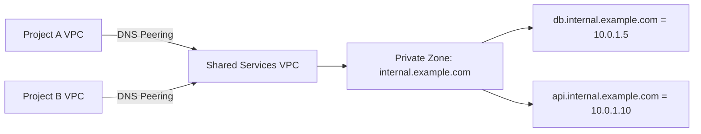

# How to Set Up Cloud DNS Peering Zones to Share DNS Records Across VPC Networks in GCP

Author: [nawazdhandala](https://www.github.com/nawazdhandala)

Tags: GCP, Cloud DNS, DNS Peering, VPC Networking, Google Cloud

Description: Learn how to configure Cloud DNS peering zones to share DNS resolution across VPC networks in Google Cloud Platform for multi-project architectures.

---

In large GCP environments, you often have multiple VPC networks across different projects. Each VPC might have its own private DNS zones, but sometimes you need VMs in one network to resolve DNS names managed by another network. That is where DNS peering comes in.

DNS peering zones in Cloud DNS let one VPC network forward DNS queries to another VPC network for resolution. Unlike VPC network peering (which deals with IP connectivity), DNS peering specifically handles name resolution. This post walks through setting it up and covers the common architectural patterns.

## Understanding DNS Peering vs. VPC Peering

It is important to distinguish between these two types of peering because they solve different problems:

**VPC Network Peering** creates a network-level connection between two VPCs, allowing IP-level communication between VMs. It does not affect DNS resolution.

**DNS Peering** creates a DNS-level relationship where queries in one VPC can be forwarded to another VPC's DNS configuration for resolution. It does not require VPC network peering, though you often use both together.

This means you could have DNS peering without VPC peering (the names resolve but the IPs are unreachable), or VPC peering without DNS peering (the IPs are reachable but the names do not resolve). In most real-world setups, you want both.

## The Architecture

Here is a typical scenario. You have a shared services project with a private DNS zone for `internal.example.com`. Other project VPCs need to resolve names like `db.internal.example.com` and `api.internal.example.com` that are defined in the shared services zone.



The shared services VPC is the "target" network, and the consumer VPCs create DNS peering zones that point to it.

## Prerequisites

- Two or more VPC networks (can be in the same or different projects)
- The Cloud DNS API enabled in all relevant projects
- The `dns.admin` role in the project creating the peering zone
- The `dns.peer` role in the project that owns the target network
- If cross-project, the VPC network's self-link URL

## Step 1: Set Up the Target Zone

First, make sure the shared services VPC has a private DNS zone with the records you want to share.

```bash
# Create a private zone in the shared services project
gcloud dns managed-zones create internal-zone \
    --dns-name=internal.example.com. \
    --description="Internal DNS for shared services" \
    --visibility=private \
    --networks=shared-services-vpc \
    --project=shared-services-project

# Add some records to the zone
gcloud dns record-sets create db.internal.example.com. \
    --zone=internal-zone \
    --type=A \
    --ttl=300 \
    --rrdatas="10.0.1.5" \
    --project=shared-services-project

gcloud dns record-sets create api.internal.example.com. \
    --zone=internal-zone \
    --type=A \
    --ttl=300 \
    --rrdatas="10.0.1.10" \
    --project=shared-services-project
```

## Step 2: Create the DNS Peering Zone

In the consumer project, create a peering zone that targets the shared services VPC network. The peering zone tells Cloud DNS: "For queries matching this DNS name, forward them to the target network for resolution."

```bash
# Create a DNS peering zone in Project A that peers with the shared services VPC
gcloud dns managed-zones create internal-peering-zone \
    --dns-name=internal.example.com. \
    --description="DNS peering to shared services" \
    --visibility=private \
    --networks=project-a-vpc \
    --target-project=shared-services-project \
    --target-network=shared-services-vpc \
    --project=project-a
```

The key parameters here are `--target-project` and `--target-network`. These tell Cloud DNS which VPC network to forward queries to. The target network's DNS configuration (including its private zones, forwarding zones, and response policies) will be used to resolve the queries.

Repeat for any other consumer projects.

```bash
# Create a DNS peering zone in Project B
gcloud dns managed-zones create internal-peering-zone \
    --dns-name=internal.example.com. \
    --description="DNS peering to shared services" \
    --visibility=private \
    --networks=project-b-vpc \
    --target-project=shared-services-project \
    --target-network=shared-services-vpc \
    --project=project-b
```

## Step 3: Set Up IAM Permissions

For cross-project DNS peering, the consumer project's service account needs the `dns.peer` role on the target project. This grants permission to peer with the target network's DNS configuration.

```bash
# Grant the DNS Peer role to the consumer project's Cloud DNS service account
gcloud projects add-iam-policy-binding shared-services-project \
    --member="serviceAccount:service-CONSUMER_PROJECT_NUMBER@gcp-sa-dns.iam.gserviceaccount.com" \
    --role="roles/dns.peer"
```

Replace `CONSUMER_PROJECT_NUMBER` with the numeric project number (not the project ID) of the consumer project.

```bash
# Find the project number if you do not know it
gcloud projects describe project-a --format="value(projectNumber)"
```

## Step 4: Verify DNS Resolution

SSH into a VM in the consumer VPC and test DNS resolution.

```bash
# From a VM in Project A's VPC, resolve an internal name
dig db.internal.example.com @169.254.169.254

# Expected output should show 10.0.1.5
dig api.internal.example.com @169.254.169.254

# Expected output should show 10.0.1.10
```

If the resolution works, you should see the records from the shared services private zone even though those records are not directly visible in Project A's DNS configuration.

## Terraform Configuration

Here is the complete Terraform setup for DNS peering across projects.

```hcl
# Shared services project - the target zone
resource "google_dns_managed_zone" "internal_zone" {
  project     = "shared-services-project"
  name        = "internal-zone"
  dns_name    = "internal.example.com."
  description = "Internal DNS for shared services"
  visibility  = "private"

  private_visibility_config {
    networks {
      network_url = google_compute_network.shared_services_vpc.id
    }
  }
}

# Consumer project - the peering zone
resource "google_dns_managed_zone" "internal_peering" {
  project     = "project-a"
  name        = "internal-peering-zone"
  dns_name    = "internal.example.com."
  description = "DNS peering to shared services"
  visibility  = "private"

  private_visibility_config {
    networks {
      network_url = google_compute_network.project_a_vpc.id
    }
  }

  peering_config {
    target_network {
      network_url = google_compute_network.shared_services_vpc.id
    }
  }
}

# IAM binding for cross-project access
resource "google_project_iam_member" "dns_peer" {
  project = "shared-services-project"
  role    = "roles/dns.peer"
  member  = "serviceAccount:service-${data.google_project.project_a.number}@gcp-sa-dns.iam.gserviceaccount.com"
}
```

## Important Limitations

There are a few things to be aware of with DNS peering:

**No transitive peering.** If VPC A peers to VPC B, and VPC B peers to VPC C, VPC A cannot resolve names through VPC C. Each peering relationship is direct.

**One direction at a time.** DNS peering is unidirectional. If you need VMs in both VPCs to resolve each other's private zones, you need peering zones in both directions.

**Zone priority.** If a consumer VPC has its own private zone for the same DNS name, the local zone takes priority over the peering zone. This can be useful for overrides but can also cause confusion.

**No peering to peering.** You cannot chain DNS peering. The target network must directly host the zone or forwarding configuration - it cannot itself be peering to another network for that DNS name.

## Common Patterns

### Hub-and-Spoke DNS

The most common pattern. A central "hub" VPC holds all private DNS zones, and spoke VPCs peer to it. This centralizes DNS management while giving each project its own VPC.

### Shared Services DNS

Similar to hub-and-spoke, but the central VPC is specifically a shared services VPC that provides common infrastructure like databases, APIs, and monitoring endpoints.

### Environment Isolation with DNS

Use DNS peering to give staging and production environments access to shared DNS zones while keeping their VPC networks separate. This avoids duplicating DNS records across environments.

## Troubleshooting

**Queries return NXDOMAIN**: Check that the peering zone DNS name matches the target private zone's DNS name. Verify IAM permissions for cross-project peering.

**Permission denied**: Make sure the `dns.peer` role is granted to the correct service account. The format is `service-PROJECT_NUMBER@gcp-sa-dns.iam.gserviceaccount.com`.

**Records not updating**: DNS peering does not cache records at the peering side. If records are stale, the issue is likely on the target side. Check the target zone's records directly.

## Wrapping Up

DNS peering zones provide a clean way to share DNS resolution across VPC boundaries without duplicating records or managing complex forwarding setups. Combined with VPC network peering for IP connectivity, you get a complete networking solution for multi-project GCP environments. The key is understanding that DNS peering is separate from network peering and has its own set of permissions and limitations. Plan your DNS architecture early, centralize where it makes sense, and use peering to extend it to the VPCs that need it.
