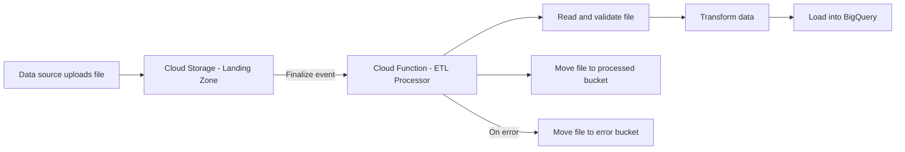

# How to Set Up Cloud Functions to Process Cloud Storage Finalize Events for ETL Pipelines

Author: [nawazdhandala](https://www.github.com/nawazdhandala)

Tags: GCP, Cloud Functions, Cloud Storage, ETL, Data Pipeline

Description: Build an ETL pipeline using Cloud Functions triggered by Cloud Storage finalize events to automatically process, transform, and load data files as they arrive.

---

Event-driven ETL pipelines are one of the best uses of Cloud Functions. Instead of running scheduled batch jobs that process files at fixed intervals, you process each file the moment it lands in Cloud Storage. The data is available faster, the processing scales automatically, and you pay nothing when no files are arriving.

I have built this pattern for everything from processing CSV exports from third-party systems to ingesting JSON event logs into BigQuery. Here is how to set it up end to end.

## The Architecture



The flow is straightforward: files land in a storage bucket, a Cloud Function triggers on the finalize event, processes the data, loads it into BigQuery (or wherever), and moves the file to a processed or error bucket.

## Setting Up the Storage Buckets

Create separate buckets for each stage of the pipeline:

```bash
# Landing zone - where raw files arrive
gcloud storage buckets create gs://my-project-data-landing \
  --location=us-central1

# Processed files - successfully processed files go here
gcloud storage buckets create gs://my-project-data-processed \
  --location=us-central1

# Error files - files that failed processing
gcloud storage buckets create gs://my-project-data-errors \
  --location=us-central1

# Set lifecycle rules to auto-delete processed files after 30 days
gcloud storage buckets update gs://my-project-data-processed \
  --lifecycle-file=lifecycle-30d.json
```

## The ETL Function

Here is a complete function that processes CSV files and loads them into BigQuery:

```javascript
// index.js - ETL Cloud Function for processing CSV files from Cloud Storage
const functions = require('@google-cloud/functions-framework');
const { Storage } = require('@google-cloud/storage');
const { BigQuery } = require('@google-cloud/bigquery');
const csv = require('csv-parse/sync');

const storage = new Storage();
const bigquery = new BigQuery();

const PROCESSED_BUCKET = process.env.PROCESSED_BUCKET || 'my-project-data-processed';
const ERROR_BUCKET = process.env.ERROR_BUCKET || 'my-project-data-errors';
const DATASET = process.env.BQ_DATASET || 'raw_data';
const TABLE = process.env.BQ_TABLE || 'events';

functions.cloudEvent('processDataFile', async (cloudEvent) => {
  const file = cloudEvent.data;
  const bucketName = file.bucket;
  const filePath = file.name;
  const contentType = file.contentType;

  console.log(`Processing file: gs://${bucketName}/${filePath}`);
  console.log(`Content type: ${contentType}, Size: ${file.size} bytes`);

  // Only process CSV files
  if (!filePath.endsWith('.csv')) {
    console.log(`Skipping non-CSV file: ${filePath}`);
    return;
  }

  // Skip files in subdirectories we use for organization
  if (filePath.startsWith('_') || filePath.includes('/.')) {
    console.log(`Skipping system file: ${filePath}`);
    return;
  }

  const sourceBucket = storage.bucket(bucketName);
  const sourceFile = sourceBucket.file(filePath);

  try {
    // Step 1: Download the file
    const [fileContent] = await sourceFile.download();
    const rawData = fileContent.toString('utf-8');
    console.log(`Downloaded ${filePath}: ${rawData.length} characters`);

    // Step 2: Parse the CSV
    const records = csv.parse(rawData, {
      columns: true,        // Use first row as column headers
      skip_empty_lines: true,
      trim: true,
      cast: true            // Auto-cast numbers and booleans
    });
    console.log(`Parsed ${records.length} records from ${filePath}`);

    if (records.length === 0) {
      console.log('File is empty, moving to processed');
      await moveFile(sourceBucket, filePath, PROCESSED_BUCKET);
      return;
    }

    // Step 3: Transform the data
    const transformedRecords = records.map((record, index) => {
      return transformRecord(record, filePath, index);
    });

    // Step 4: Filter out invalid records
    const validRecords = transformedRecords.filter(r => r !== null);
    const invalidCount = transformedRecords.length - validRecords.length;

    if (invalidCount > 0) {
      console.warn(`Filtered out ${invalidCount} invalid records`);
    }

    // Step 5: Load into BigQuery
    if (validRecords.length > 0) {
      await loadIntoBigQuery(validRecords);
      console.log(`Loaded ${validRecords.length} records into BigQuery`);
    }

    // Step 6: Move file to processed bucket
    await moveFile(sourceBucket, filePath, PROCESSED_BUCKET);
    console.log(`Moved ${filePath} to processed bucket`);

  } catch (error) {
    console.error(`Error processing ${filePath}:`, error);

    // Move the file to the error bucket with error metadata
    try {
      await moveFile(sourceBucket, filePath, ERROR_BUCKET, {
        errorMessage: error.message,
        errorTime: new Date().toISOString()
      });
      console.log(`Moved ${filePath} to error bucket`);
    } catch (moveError) {
      console.error(`Failed to move file to error bucket:`, moveError);
    }

    // Throw to trigger retry for transient errors
    if (isTransientError(error)) {
      throw error;
    }
    // For permanent errors (bad data), we already moved the file - do not retry
  }
});

function transformRecord(record, sourceFile, rowIndex) {
  // Validate required fields
  if (!record.event_type || !record.timestamp) {
    console.warn(`Row ${rowIndex}: Missing required fields, skipping`);
    return null;
  }

  // Transform and normalize the record
  return {
    event_type: String(record.event_type).toLowerCase().trim(),
    timestamp: new Date(record.timestamp).toISOString(),
    user_id: record.user_id ? String(record.user_id) : null,
    value: record.value ? parseFloat(record.value) : 0,
    metadata: record.metadata ? String(record.metadata) : null,
    source_file: sourceFile,
    ingested_at: new Date().toISOString()
  };
}

async function loadIntoBigQuery(records) {
  const dataset = bigquery.dataset(DATASET);
  const table = dataset.table(TABLE);

  // Insert rows in batches of 1000
  const batchSize = 1000;
  for (let i = 0; i < records.length; i += batchSize) {
    const batch = records.slice(i, i + batchSize);
    await table.insert(batch);
    console.log(`Inserted batch ${Math.floor(i / batchSize) + 1}: ${batch.length} rows`);
  }
}

async function moveFile(sourceBucket, filePath, destBucketName, metadata = {}) {
  const destBucket = storage.bucket(destBucketName);

  // Add a timestamp prefix to avoid collisions
  const timestamp = new Date().toISOString().replace(/[:.]/g, '-');
  const destPath = `${timestamp}/${filePath}`;

  // Copy to destination with metadata
  await sourceBucket.file(filePath).copy(destBucket.file(destPath), {
    metadata: { metadata }
  });

  // Delete from source
  await sourceBucket.file(filePath).delete();
}

function isTransientError(error) {
  // Network errors, rate limits, and server errors are transient
  const transientCodes = [429, 500, 502, 503, 504];
  if (error.code && transientCodes.includes(error.code)) return true;
  if (error.message && error.message.includes('ECONNRESET')) return true;
  if (error.message && error.message.includes('ETIMEDOUT')) return true;
  return false;
}
```

The package.json:

```json
{
  "name": "etl-processor",
  "version": "1.0.0",
  "dependencies": {
    "@google-cloud/functions-framework": "^3.0.0",
    "@google-cloud/storage": "^7.0.0",
    "@google-cloud/bigquery": "^7.0.0",
    "csv-parse": "^5.5.0"
  }
}
```

## Deploying the Function

```bash
# Deploy the ETL function
gcloud functions deploy process-data-file \
  --gen2 \
  --runtime=nodejs20 \
  --region=us-central1 \
  --source=. \
  --entry-point=processDataFile \
  --trigger-event-filters="type=google.cloud.storage.object.v1.finalized" \
  --trigger-event-filters="bucket=my-project-data-landing" \
  --memory=1Gi \
  --timeout=300s \
  --set-env-vars="PROCESSED_BUCKET=my-project-data-processed,ERROR_BUCKET=my-project-data-errors,BQ_DATASET=raw_data,BQ_TABLE=events" \
  --max-instances=10
```

## Processing JSON Files

If your data arrives as JSON instead of CSV:

```javascript
// JSON file processing variant
async function processJsonFile(fileContent, filePath) {
  let records;

  // Handle both single objects and arrays
  const parsed = JSON.parse(fileContent);
  if (Array.isArray(parsed)) {
    records = parsed;
  } else {
    records = [parsed];
  }

  console.log(`Parsed ${records.length} records from JSON file ${filePath}`);
  return records.map((record, i) => transformRecord(record, filePath, i)).filter(Boolean);
}
```

## Processing Newline-Delimited JSON (NDJSON)

For large datasets, NDJSON (one JSON object per line) is more efficient because you can process it line by line without loading the entire file into memory:

```javascript
// NDJSON (newline-delimited JSON) processing
async function processNdjsonFile(fileContent, filePath) {
  const lines = fileContent.split('\n').filter(line => line.trim());
  const records = [];

  for (let i = 0; i < lines.length; i++) {
    try {
      const record = JSON.parse(lines[i]);
      const transformed = transformRecord(record, filePath, i);
      if (transformed) records.push(transformed);
    } catch (parseError) {
      console.warn(`Line ${i + 1} in ${filePath}: Invalid JSON, skipping`);
    }
  }

  return records;
}
```

## Handling Large Files with Streaming

For very large files (hundreds of MB), do not load the entire file into memory. Stream it instead:

```javascript
// Stream-based processing for large CSV files
const { parse } = require('csv-parse');
const { pipeline } = require('stream/promises');
const { Transform } = require('stream');

async function processLargeFile(bucket, filePath) {
  const readStream = storage.bucket(bucket).file(filePath).createReadStream();
  const parser = parse({ columns: true, trim: true, cast: true });

  let batch = [];
  const batchSize = 1000;

  // Transform stream that batches records and sends them to BigQuery
  const batcher = new Transform({
    objectMode: true,
    async transform(record, encoding, callback) {
      const transformed = transformRecord(record, filePath, 0);
      if (transformed) {
        batch.push(transformed);
      }

      // Flush batch when it reaches the target size
      if (batch.length >= batchSize) {
        await loadIntoBigQuery(batch);
        batch = [];
      }
      callback();
    },
    async flush(callback) {
      // Flush remaining records
      if (batch.length > 0) {
        await loadIntoBigQuery(batch);
      }
      callback();
    }
  });

  await pipeline(readStream, parser, batcher);
}
```

## File Organization Patterns

Structure your landing zone to make it easy to identify file types and sources:

```
gs://my-project-data-landing/
  sales/
    2024-01-15-sales-report.csv
    2024-01-16-sales-report.csv
  users/
    user-export-20240115.json
  events/
    app-events-20240115.ndjson
```

Your function can route processing based on the file path:

```javascript
// Route processing based on the file path prefix
function getProcessor(filePath) {
  if (filePath.startsWith('sales/') && filePath.endsWith('.csv')) {
    return processSalesCsv;
  } else if (filePath.startsWith('users/') && filePath.endsWith('.json')) {
    return processUsersJson;
  } else if (filePath.startsWith('events/') && filePath.endsWith('.ndjson')) {
    return processEventsNdjson;
  }
  return null;
}
```

## Error Handling and Dead Letter Files

When a file fails processing, move it to the error bucket with metadata about what went wrong:

```javascript
// Store error details with the failed file
async function handleProcessingError(sourceBucket, filePath, error) {
  const errorDetails = {
    originalBucket: sourceBucket.name,
    originalPath: filePath,
    errorMessage: error.message,
    errorStack: error.stack,
    failedAt: new Date().toISOString(),
    retryable: isTransientError(error)
  };

  // Write error details as a sidecar JSON file
  const errorFile = storage.bucket(ERROR_BUCKET).file(`${filePath}.error.json`);
  await errorFile.save(JSON.stringify(errorDetails, null, 2), {
    contentType: 'application/json'
  });
}
```

## Monitoring the Pipeline

Monitor your ETL pipeline with OneUptime to track files processed per hour, processing duration, error rate, and BigQuery insert latency. Set up alerts for when the error bucket starts receiving files, since that means your pipeline is not processing data correctly. Also track the time between file upload and BigQuery availability to measure your end-to-end pipeline latency.

This pattern handles the vast majority of file-based ETL workloads on GCP. It scales from a few files per day to thousands per hour without any infrastructure changes, and the pay-per-invocation pricing means you are not wasting money during quiet periods.
