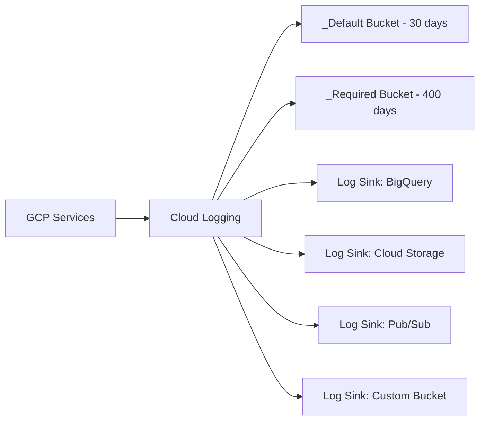

# How to Set Up Cloud Logging and Log Sinks for a New GCP Project

Author: [nawazdhandala](https://www.github.com/nawazdhandala)

Tags: GCP, Cloud Logging, Log Sinks, Monitoring, Operations, Log Management

Description: Configure Cloud Logging with proper log sinks, retention policies, exclusion filters, and log-based metrics for a new GCP project to enable effective troubleshooting and compliance.

---

Logs are your first line of defense when something goes wrong. But without proper configuration, you end up either drowning in log data you cannot search through or missing critical events because they were not retained. Setting up Cloud Logging correctly in a new GCP project means configuring where logs go, how long they are kept, what gets exported for long-term analysis, and what alerts should fire based on log patterns.

Here is a practical walkthrough of setting up logging infrastructure for a new project.

## How Cloud Logging Works

Every GCP service generates logs automatically. These flow into Cloud Logging where they are stored in log buckets. By default, all logs go to the `_Default` log bucket with a 30-day retention period, and admin activity audit logs go to the `_Required` log bucket with a 400-day retention.

You can route logs to different destinations using log sinks:



## Step 1: Configure Log Buckets

Start by setting up log buckets with appropriate retention:

```bash
# Update the default bucket retention to 60 days (from 30)
gcloud logging buckets update _Default \
  --location=global \
  --retention-days=60 \
  --project=my-project

# Create a custom bucket for application logs with longer retention
gcloud logging buckets create app-logs \
  --location=us-central1 \
  --retention-days=90 \
  --description="Application logs with 90-day retention" \
  --project=my-project

# Create a custom bucket for security logs with extended retention
gcloud logging buckets create security-logs \
  --location=us-central1 \
  --retention-days=365 \
  --description="Security and audit logs with 1-year retention" \
  --project=my-project
```

## Step 2: Set Up Log Sinks

Log sinks route matching logs to destinations. Create sinks for different use cases.

### Sink to BigQuery for Analytics

Export logs to BigQuery when you need to run SQL queries against log data for analysis and reporting:

```bash
# Create a BigQuery dataset for logs
bq mk --dataset \
  --description="Exported GCP logs for analysis" \
  --location=US \
  my-project:gcp_logs

# Create a sink that exports all Cloud Run logs to BigQuery
gcloud logging sinks create cloudrun-logs-to-bq \
  bigquery.googleapis.com/projects/my-project/datasets/gcp_logs \
  --log-filter='resource.type="cloud_run_revision"' \
  --project=my-project \
  --description="Export Cloud Run logs to BigQuery for analysis"

# Create a sink that exports all error logs to BigQuery
gcloud logging sinks create errors-to-bq \
  bigquery.googleapis.com/projects/my-project/datasets/gcp_logs \
  --log-filter='severity>=ERROR' \
  --project=my-project \
  --description="Export all error logs to BigQuery"
```

After creating a sink, you need to grant the sink's service account access to the destination:

```bash
# Get the sink's service account
SINK_SA=$(gcloud logging sinks describe cloudrun-logs-to-bq \
  --format='value(writerIdentity)' \
  --project=my-project)

# Grant write access to the BigQuery dataset
bq add-iam-policy-binding \
  --member="$SINK_SA" \
  --role="roles/bigquery.dataEditor" \
  my-project:gcp_logs
```

### Sink to Cloud Storage for Archival

For long-term storage and compliance, export logs to Cloud Storage:

```bash
# Create a storage bucket for log archives
gsutil mb -l us-central1 gs://my-project-log-archive

# Set a lifecycle policy to move logs to cheaper storage after 30 days
gsutil lifecycle set /dev/stdin gs://my-project-log-archive << 'EOF'
{
  "rule": [
    {
      "action": {"type": "SetStorageClass", "storageClass": "NEARLINE"},
      "condition": {"age": 30}
    },
    {
      "action": {"type": "SetStorageClass", "storageClass": "COLDLINE"},
      "condition": {"age": 90}
    },
    {
      "action": {"type": "SetStorageClass", "storageClass": "ARCHIVE"},
      "condition": {"age": 365}
    }
  ]
}
EOF

# Create a sink for all audit logs to Cloud Storage
gcloud logging sinks create audit-logs-to-gcs \
  storage.googleapis.com/my-project-log-archive \
  --log-filter='logName:"cloudaudit.googleapis.com"' \
  --project=my-project \
  --description="Archive all audit logs to Cloud Storage"
```

### Sink to Pub/Sub for Real-Time Processing

Route logs to Pub/Sub when you need real-time processing or alerting beyond what Cloud Monitoring provides:

```bash
# Create a Pub/Sub topic for security events
gcloud pubsub topics create security-log-events

# Create a sink for security-related logs
gcloud logging sinks create security-events-to-pubsub \
  pubsub.googleapis.com/projects/my-project/topics/security-log-events \
  --log-filter='protoPayload.methodName=~"SetIamPolicy|CreateServiceAccountKey|DeleteFirewallRule"' \
  --project=my-project \
  --description="Stream security-sensitive events to Pub/Sub"
```

You can then have a Cloud Function process these events:

```python
# security_monitor.py - Process security events from Pub/Sub
import base64
import json
import logging
from google.cloud import firestore

db = firestore.Client()

def process_security_event(event, context):
    """Process security-related log events in real-time."""
    log_data = json.loads(base64.b64decode(event['data']).decode('utf-8'))

    method = log_data.get('protoPayload', {}).get('methodName', '')
    actor = log_data.get('protoPayload', {}).get('authenticationInfo', {}).get('principalEmail', '')
    timestamp = log_data.get('timestamp', '')

    # Record the security event
    db.collection('security_events').add({
        'method': method,
        'actor': actor,
        'timestamp': timestamp,
        'raw_data': log_data,
        'processed': True,
    })

    # Alert on high-risk actions
    high_risk_methods = [
        'google.iam.admin.v1.CreateServiceAccountKey',
        'compute.firewalls.delete',
        'SetIamPolicy',
    ]

    if any(m in method for m in high_risk_methods):
        logging.warning(f'High-risk action detected: {method} by {actor}')
        send_security_alert(method, actor, timestamp)
```

## Step 3: Configure Exclusion Filters

Not all logs are worth keeping. Exclusion filters reduce log volume and cost by dropping logs before they are stored:

```bash
# Exclude health check logs (these are very noisy and rarely useful)
gcloud logging sinks update _Default \
  --add-exclusion='name=exclude-health-checks,filter=httpRequest.requestUrl="/healthz" OR httpRequest.requestUrl="/readyz"' \
  --project=my-project

# Exclude debug-level logs from production
gcloud logging sinks update _Default \
  --add-exclusion='name=exclude-debug,filter=severity="DEBUG"' \
  --project=my-project

# Exclude specific noisy service logs
gcloud logging sinks update _Default \
  --add-exclusion='name=exclude-gke-events,filter=resource.type="k8s_cluster" AND jsonPayload.message=~"no change detected"' \
  --project=my-project
```

Be careful with exclusions - excluded logs cannot be recovered. Start by checking log volume to identify the biggest contributors:

```bash
# Check log volume by resource type to find noisy sources
gcloud logging read "timestamp>=\"2026-02-10T00:00:00Z\"" \
  --project=my-project \
  --format="value(resource.type)" | sort | uniq -c | sort -rn | head -20
```

## Step 4: Create Log-Based Metrics

Log-based metrics let you create Cloud Monitoring metrics from log patterns:

```bash
# Count of application errors by service
gcloud logging metrics create app-error-count \
  --description="Count of application errors" \
  --log-filter='resource.type="cloud_run_revision" AND severity>=ERROR' \
  --project=my-project

# Count of authentication failures
gcloud logging metrics create auth-failures \
  --description="Count of authentication failures" \
  --log-filter='jsonPayload.message=~"authentication failed|login failed|unauthorized"' \
  --project=my-project

# Distribution metric for request latency
gcloud logging metrics create request-latency \
  --description="Request latency distribution from logs" \
  --log-filter='httpRequest.latency!=""' \
  --bucket-boundaries="0.1,0.5,1.0,2.0,5.0,10.0" \
  --value-extractor='EXTRACT(httpRequest.latency)' \
  --project=my-project
```

## Step 5: Set Up Alerts on Log Patterns

Create alerting policies based on your log-based metrics:

```bash
# Alert when error rate exceeds threshold
gcloud monitoring policies create \
  --display-name="High Application Error Rate" \
  --condition-display-name="Error count > 50 in 5 minutes" \
  --condition-filter='metric.type="logging.googleapis.com/user/app-error-count" resource.type="cloud_run_revision"' \
  --condition-threshold-value=50 \
  --condition-comparison=COMPARISON_GT \
  --aggregation-alignment-period=300s \
  --aggregation-per-series-aligner=ALIGN_RATE \
  --notification-channels=CHANNEL_ID \
  --project=my-project

# Alert on authentication failure spike
gcloud monitoring policies create \
  --display-name="Authentication Failure Spike" \
  --condition-display-name="Auth failures > 20 in 10 minutes" \
  --condition-filter='metric.type="logging.googleapis.com/user/auth-failures"' \
  --condition-threshold-value=20 \
  --condition-comparison=COMPARISON_GT \
  --aggregation-alignment-period=600s \
  --aggregation-per-series-aligner=ALIGN_SUM \
  --notification-channels=CHANNEL_ID \
  --project=my-project
```

## Step 6: Structured Logging Best Practices

Configure your applications to emit structured logs for better searchability:

```python
# structured_logging.py - Application logging setup
import google.cloud.logging
import logging
import json

# Set up Cloud Logging integration
client = google.cloud.logging.Client()
client.setup_logging()

logger = logging.getLogger('my-app')

def log_request(request_id, user_id, method, path, status, duration_ms):
    """Log a structured request entry."""
    logger.info(json.dumps({
        'message': 'Request processed',
        'request_id': request_id,
        'user_id': user_id,
        'http_method': method,
        'path': path,
        'status_code': status,
        'duration_ms': duration_ms,
        # These fields enable correlation in Cloud Trace
        'logging.googleapis.com/trace': f'projects/my-project/traces/{request_id}',
    }))

def log_error(request_id, error_type, error_message, stack_trace=None):
    """Log a structured error entry."""
    logger.error(json.dumps({
        'message': f'Error: {error_type}',
        'request_id': request_id,
        'error_type': error_type,
        'error_message': error_message,
        'stack_trace': stack_trace,
    }))
```

## Step 7: Query and Explore Logs

Learn the Logging query language to troubleshoot effectively:

```bash
# Find all errors in the last hour
gcloud logging read 'severity>=ERROR AND timestamp>="2026-02-17T10:00:00Z"' \
  --project=my-project \
  --limit=50 \
  --format=json

# Find logs for a specific request
gcloud logging read 'jsonPayload.request_id="req-abc-123"' \
  --project=my-project

# Find all IAM policy changes
gcloud logging read 'protoPayload.methodName="SetIamPolicy"' \
  --project=my-project \
  --format="table(timestamp, protoPayload.authenticationInfo.principalEmail, resource.labels)"
```

## Logging Setup Checklist

For every new project:

- [ ] Log bucket retention configured (default and custom buckets)
- [ ] BigQuery sink for analytics queries
- [ ] Cloud Storage sink for long-term archival
- [ ] Pub/Sub sink for real-time security event processing
- [ ] Exclusion filters for noisy, low-value logs
- [ ] Log-based metrics for error rates and key business events
- [ ] Alert policies on log-based metrics
- [ ] Applications configured for structured logging
- [ ] Audit logging enabled for data access
- [ ] Sink service accounts granted proper destination permissions

## Wrapping Up

Cloud Logging is most effective when you set it up intentionally rather than relying on defaults. Configure log sinks to route data to the right destinations - BigQuery for analysis, Cloud Storage for archival, Pub/Sub for real-time processing. Use exclusion filters to control costs by dropping low-value logs. Create log-based metrics and alerts to catch problems proactively. And configure your applications to emit structured logs so you can search and correlate events efficiently. The time invested in logging infrastructure pays for itself the first time you need to troubleshoot a production incident.
