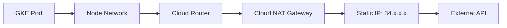

# How to Set Up Cloud NAT for GKE Pods to Access External APIs Through a Static IP

Author: [nawazdhandala](https://www.github.com/nawazdhandala)

Tags: GCP, GKE, Cloud NAT, Networking, Kubernetes, Static IP

Description: Step-by-step guide to configuring Cloud NAT with static IP addresses for GKE pods so external APIs see consistent source IPs for allowlisting.

---

Many external APIs require you to allowlist the IP addresses that will be calling them. When your application runs on GKE, the outbound IP can come from any of your nodes, and if you are using a private cluster, your pods might not have internet access at all. Cloud NAT solves both problems by providing a managed NAT gateway with static IP addresses for your GKE pods.

With Cloud NAT configured, all outbound traffic from your pods goes through the NAT gateway, appearing to external services as coming from a predictable set of static IPs. You can hand those IPs to your API partners and never worry about them changing when nodes scale up or get replaced.

## The Architecture

Here is how traffic flows with Cloud NAT in front of a GKE cluster:



Pods send traffic through the node's network interface. The Cloud Router directs outbound traffic to the Cloud NAT gateway, which performs the address translation using your static IPs.

## Step 1: Reserve Static IP Addresses

First, reserve the static IP addresses that Cloud NAT will use:

```bash
# Reserve a static external IP address for NAT
gcloud compute addresses create nat-ip-1 \
  --region us-central1

# Reserve a second IP for redundancy
gcloud compute addresses create nat-ip-2 \
  --region us-central1
```

Check the assigned IP addresses:

```bash
# View the reserved IP addresses
gcloud compute addresses list --filter="region:us-central1 AND name:nat-ip"
```

These are the IPs you will give to external API providers for allowlisting.

## Step 2: Create a Cloud Router

Cloud NAT requires a Cloud Router in the same region as your GKE cluster:

```bash
# Create a Cloud Router for the NAT gateway
gcloud compute routers create my-router \
  --network my-vpc \
  --region us-central1
```

## Step 3: Create the Cloud NAT Gateway

Now create the NAT gateway and attach your static IPs:

```bash
# Create Cloud NAT with static IP addresses
gcloud compute routers nats create my-nat \
  --router=my-router \
  --region=us-central1 \
  --nat-external-ip-pool=nat-ip-1,nat-ip-2 \
  --nat-all-subnet-ip-ranges
```

The `--nat-all-subnet-ip-ranges` flag means NAT applies to all subnets in the VPC, including the secondary ranges used by GKE pods. This is the simplest configuration.

## Configuring NAT for Specific Subnets Only

If you only want NAT for your GKE subnet (not the entire VPC), specify the subnet explicitly:

```bash
# Create Cloud NAT for a specific subnet and its secondary ranges
gcloud compute routers nats create my-nat \
  --router=my-router \
  --region=us-central1 \
  --nat-external-ip-pool=nat-ip-1,nat-ip-2 \
  --nat-custom-subnet-ip-ranges=my-gke-subnet:ALL
```

The `:ALL` suffix includes both the primary and secondary IP ranges of the subnet, which is important because GKE pods use secondary ranges.

## Step 4: Verify NAT Is Working

Deploy a test pod and check its outbound IP:

```bash
# Run a test pod to verify the outbound IP
kubectl run nat-test --image=curlimages/curl --restart=Never \
  -- curl -s https://api.ipify.org
```

Check the output:

```bash
# Get the test result - should show one of your static NAT IPs
kubectl logs nat-test
```

The response should be one of the static IPs you reserved. Clean up the test pod:

```bash
kubectl delete pod nat-test
```

## Tuning NAT for High-Traffic Workloads

The default Cloud NAT settings work well for moderate traffic, but high-traffic workloads can exhaust NAT port mappings. Each NAT IP supports about 64,000 concurrent connections, and each VM (GKE node) gets a portion of those ports.

Check the current port allocation:

```bash
# View NAT configuration including port allocation
gcloud compute routers nats describe my-nat \
  --router=my-router \
  --region=us-central1
```

Increase the minimum ports per VM if you have pods making many concurrent outbound connections:

```bash
# Increase the minimum NAT ports per VM for high-connection workloads
gcloud compute routers nats update my-nat \
  --router=my-router \
  --region=us-central1 \
  --min-ports-per-vm=4096 \
  --max-ports-per-vm=65536 \
  --enable-dynamic-port-allocation
```

Dynamic port allocation lets Cloud NAT adjust the number of ports per VM based on actual usage, which is more efficient than a fixed allocation.

## Handling NAT Port Exhaustion

If your pods are experiencing connection timeouts or failures to external services, you might be hitting NAT port exhaustion. The symptoms include:

- Intermittent connection failures to external services
- Timeout errors when making outbound HTTP requests
- High `dropped_sent_packets_count` in Cloud NAT monitoring

To diagnose, check NAT metrics in Cloud Monitoring:

```bash
# View NAT logs to check for port exhaustion
gcloud logging read "resource.type=nat_gateway AND resource.labels.router_id=my-router" \
  --limit=20 \
  --format="table(timestamp, jsonPayload.allocation_status)"
```

Solutions include:

- Add more NAT IPs (each adds 64,000 ports)
- Enable dynamic port allocation
- Increase min-ports-per-vm
- Reduce the NAT timeout for idle connections

```bash
# Add a third NAT IP to increase total port capacity
gcloud compute addresses create nat-ip-3 --region us-central1

gcloud compute routers nats update my-nat \
  --router=my-router \
  --region=us-central1 \
  --nat-external-ip-pool=nat-ip-1,nat-ip-2,nat-ip-3

# Reduce TCP idle timeout to free up ports faster
gcloud compute routers nats update my-nat \
  --router=my-router \
  --region=us-central1 \
  --tcp-established-idle-timeout=300 \
  --tcp-transitory-idle-timeout=30
```

## Using Terraform

Here is the complete setup in Terraform:

```hcl
# Reserve static IPs for NAT
resource "google_compute_address" "nat_ip" {
  count  = 2
  name   = "nat-ip-${count.index + 1}"
  region = "us-central1"
}

# Create the Cloud Router
resource "google_compute_router" "router" {
  name    = "my-router"
  network = google_compute_network.vpc.id
  region  = "us-central1"
}

# Create Cloud NAT with the static IPs
resource "google_compute_router_nat" "nat" {
  name                               = "my-nat"
  router                             = google_compute_router.router.name
  region                             = "us-central1"
  nat_ip_allocate_option             = "MANUAL_ONLY"
  nat_ips                            = google_compute_address.nat_ip[*].self_link
  source_subnetwork_ip_ranges_to_nat = "ALL_SUBNETWORKS_ALL_IP_RANGES"

  # Enable dynamic port allocation for better efficiency
  enable_dynamic_port_allocation = true
  min_ports_per_vm               = 2048
  max_ports_per_vm               = 65536

  log_config {
    enable = true
    filter = "ERRORS_ONLY"
  }
}
```

## Private Clusters and Cloud NAT

If your GKE cluster is private (nodes have no external IPs), Cloud NAT is essential for any outbound internet access. Without it, your pods cannot reach external container registries, APIs, or package repositories.

For private clusters, make sure the NAT configuration includes the pod IP ranges:

```bash
# Verify your NAT covers the GKE pod secondary range
gcloud compute routers nats describe my-nat \
  --router=my-router \
  --region=us-central1 \
  --format="yaml(subnetworks)"
```

## Monitoring Cloud NAT

Set up alerting for NAT health to catch issues before they affect your applications:

```bash
# Create an alert for NAT port allocation failures
gcloud alpha monitoring policies create \
  --display-name="Cloud NAT Port Exhaustion" \
  --condition-filter='resource.type="nat_gateway" AND metric.type="router.googleapis.com/nat/port_usage"' \
  --condition-threshold-value=0.8 \
  --condition-threshold-comparison=COMPARISON_GT
```

Also monitor the `nat/nat_allocation_failed` metric, which fires when NAT cannot allocate ports for a VM.

Cloud NAT is one of those networking components that works silently in the background, but when it is not configured correctly, everything breaks. Take the time to set it up properly with static IPs, appropriate port allocation, and monitoring - it will save you from scrambling when an API partner asks "what IP should we allowlist?" or when connections start timing out at peak traffic.
