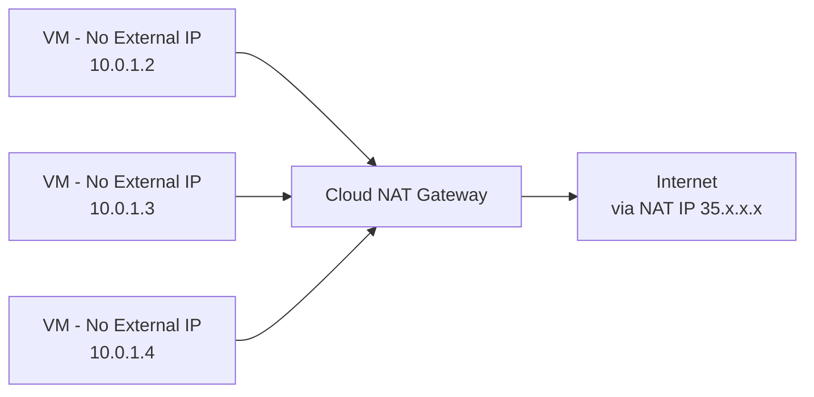

# How to Set Up Cloud NAT for VMs Without External IP Addresses in GCP

Author: [nawazdhandala](https://www.github.com/nawazdhandala)

Tags: GCP, Cloud NAT, Networking, Virtual Machines, Security

Description: Configure Cloud NAT to provide internet access for GCP virtual machines that do not have external IP addresses, improving security while maintaining outbound connectivity.

---

Running VMs without external IP addresses is a security best practice. It reduces your attack surface by making instances unreachable from the internet. But those VMs still need to reach the internet for things like downloading packages, pulling container images, calling external APIs, and sending telemetry. Cloud NAT bridges this gap by providing outbound internet access without requiring external IPs on your VMs.

This guide walks through setting up Cloud NAT from scratch, including the networking prerequisites and common configuration decisions.

## How Cloud NAT Works

Cloud NAT is a regional, software-defined NAT service. It sits at the VPC network level and translates outbound traffic from VMs with internal-only IPs to a set of external NAT IP addresses. The key thing to understand is that Cloud NAT is not a proxy or a gateway VM - it operates at the network fabric level, so there is no single point of failure or bandwidth bottleneck.



Cloud NAT handles:
- TCP and UDP outbound connections
- ICMP (for ping and traceroute)
- DNS queries to external servers

It does not handle inbound connections. If you need inbound access, use a load balancer or IAP (Identity-Aware Proxy).

## Prerequisites

You will need:
- A VPC network with at least one subnet
- A Cloud Router in the same region as your VMs
- VMs with only internal IP addresses
- The Compute Engine API enabled

## Step 1: Create a VPC and Subnet (If Needed)

If you already have a VPC with internal-only VMs, skip to Step 2. Otherwise:

```bash
# Create a custom VPC network
gcloud compute networks create my-private-network \
  --subnet-mode=custom \
  --project=your-project-id

# Create a subnet in the region where your VMs will run
gcloud compute networks subnets create my-private-subnet \
  --network=my-private-network \
  --region=us-central1 \
  --range=10.0.1.0/24 \
  --project=your-project-id
```

## Step 2: Create a VM Without an External IP

Create a test VM with only an internal IP address:

```bash
# Create a VM with no external IP
gcloud compute instances create private-vm \
  --zone=us-central1-a \
  --machine-type=e2-medium \
  --network=my-private-network \
  --subnet=my-private-subnet \
  --no-address \
  --image-family=debian-12 \
  --image-project=debian-cloud \
  --project=your-project-id
```

The `--no-address` flag is what prevents the VM from getting an external IP. At this point, the VM has no outbound internet access.

## Step 3: Create a Cloud Router

Cloud NAT requires a Cloud Router in the same region:

```bash
# Create a Cloud Router
gcloud compute routers create my-nat-router \
  --network=my-private-network \
  --region=us-central1 \
  --project=your-project-id
```

## Step 4: Create the Cloud NAT Gateway

Now create the Cloud NAT gateway and associate it with the Cloud Router:

```bash
# Create a Cloud NAT gateway with automatic IP allocation
gcloud compute routers nats create my-nat-gateway \
  --router=my-nat-router \
  --region=us-central1 \
  --auto-allocate-nat-external-ips \
  --nat-all-subnet-ip-ranges \
  --project=your-project-id
```

Let me break down the flags:
- `--auto-allocate-nat-external-ips`: GCP automatically provisions and manages the external NAT IP addresses
- `--nat-all-subnet-ip-ranges`: NAT is available for all subnets in the VPC in this region

## Step 5: Verify the Setup

Test that your VM can now reach the internet:

```bash
# SSH into the private VM using IAP tunnel (since there is no external IP)
gcloud compute ssh private-vm \
  --zone=us-central1-a \
  --tunnel-through-iap \
  --project=your-project-id

# Once connected, test outbound connectivity
curl -s ifconfig.me    # Should return the NAT external IP
apt-get update         # Should work now
ping -c 3 google.com  # Should get responses
```

## Configuring NAT for Specific Subnets Only

Instead of enabling NAT for all subnets, you can target specific ones:

```bash
# Create NAT only for specific subnets
gcloud compute routers nats create selective-nat \
  --router=my-nat-router \
  --region=us-central1 \
  --auto-allocate-nat-external-ips \
  --nat-custom-subnet-ip-ranges=my-private-subnet \
  --project=your-project-id
```

This is useful when you have multiple subnets but only some need internet access. For example, your application tier might need to call external APIs, while your database tier should be completely isolated.

## Using Static IP Addresses

If you need predictable NAT IP addresses (for example, to allowlist with third-party APIs), use static IPs instead of auto-allocated ones:

```bash
# Reserve static external IP addresses
gcloud compute addresses create nat-ip-1 \
  --region=us-central1 \
  --project=your-project-id

gcloud compute addresses create nat-ip-2 \
  --region=us-central1 \
  --project=your-project-id

# Create NAT with static IPs
gcloud compute routers nats create static-nat \
  --router=my-nat-router \
  --region=us-central1 \
  --nat-external-ip-pool=nat-ip-1,nat-ip-2 \
  --nat-all-subnet-ip-ranges \
  --project=your-project-id
```

## Enabling Logging

Cloud NAT logging helps you troubleshoot connectivity issues and understand your NAT usage:

```bash
# Enable NAT logging for errors and translations
gcloud compute routers nats update my-nat-gateway \
  --router=my-nat-router \
  --region=us-central1 \
  --enable-logging \
  --log-filter=ALL \
  --project=your-project-id
```

Log filter options:
- `ALL`: Log all NAT events (translations and errors)
- `ERRORS_ONLY`: Log only error events
- `TRANSLATIONS_ONLY`: Log only successful translations

View the logs:

```bash
# View Cloud NAT logs
gcloud logging read \
  'resource.type="nat_gateway" AND resource.labels.gateway_name="my-nat-gateway"' \
  --project=your-project-id \
  --limit=20 \
  --format=json
```

## Firewall Rules

Cloud NAT works with your existing firewall rules. Make sure you have egress firewall rules that allow the outbound traffic your VMs need:

```bash
# Allow outbound HTTP/HTTPS traffic (usually allowed by default)
gcloud compute firewall-rules create allow-egress-web \
  --network=my-private-network \
  --direction=EGRESS \
  --action=ALLOW \
  --rules=tcp:80,tcp:443 \
  --destination-ranges=0.0.0.0/0 \
  --priority=1000 \
  --project=your-project-id
```

GCP VPCs have an implied allow-all egress rule, but if you have custom egress deny rules, make sure they do not block the traffic you want to NAT.

## Monitoring NAT Usage

Keep an eye on your NAT gateway's resource usage:

```bash
# Check NAT gateway status and IP allocation
gcloud compute routers nats describe my-nat-gateway \
  --router=my-nat-router \
  --region=us-central1 \
  --project=your-project-id
```

Key metrics to monitor in Cloud Monitoring:
- `nat_allocation_failed` - indicates port exhaustion
- `dropped_sent_packets_count` - packets dropped due to NAT issues
- `nat_connections` - active NAT connections

## Common Issues and Fixes

**VM still cannot reach the internet:**
- Verify the VM is in a subnet covered by the NAT configuration
- Check that egress firewall rules allow the traffic
- Make sure the VM does not have an external IP (Cloud NAT only applies to VMs without external IPs)

**DNS resolution fails:**
- GCP internal DNS (169.254.169.254) should work without NAT
- If using external DNS servers, ensure the NAT covers UDP port 53

**Slow connections:**
- Check for port exhaustion in the NAT logs
- Consider increasing the minimum ports per VM setting

## Wrapping Up

Cloud NAT is the standard way to give internet access to GCP VMs that do not have external IP addresses. The setup is straightforward - create a Cloud Router, create a NAT gateway, and your VMs can reach the internet. The key decisions are whether to use automatic or static IPs and which subnets to enable NAT for. For production environments, always enable logging and set up monitoring to catch port exhaustion issues early. Cloud NAT removes the need for a NAT gateway VM, which means one fewer thing to manage and no single point of failure.
