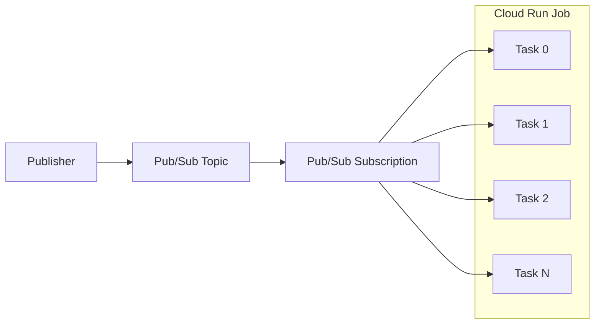

# How to Set Up Cloud Run Jobs to Process Items from a Pub/Sub Queue in Parallel

Author: [nawazdhandala](https://www.github.com/nawazdhandala)

Tags: GCP, Cloud Run Jobs, Pub/Sub, Parallel Processing, Google Cloud

Description: Learn how to use Cloud Run Jobs with parallel tasks to efficiently process messages from a Google Cloud Pub/Sub queue at scale.

---

Cloud Run Jobs are designed for batch work - tasks that run to completion rather than serving HTTP requests indefinitely. When you combine them with Pub/Sub and parallel task execution, you get a powerful pattern for processing large queues of work items quickly.

This guide shows you how to set up Cloud Run Jobs that spin up multiple parallel tasks, each pulling and processing messages from a Pub/Sub subscription independently.

## Cloud Run Jobs vs Cloud Run Services

Before we get into the setup, it helps to understand why Jobs are the right choice here instead of services.

Cloud Run services are long-running HTTP servers. They are great when you need to respond to incoming requests. Cloud Run Jobs are short-lived processes that run to completion and exit. They are better for batch processing, data migrations, scheduled tasks, and queue draining.

Key differences for queue processing:

- Jobs can run multiple parallel tasks (up to 10,000)
- Each task gets its own container instance
- Tasks run independently and can process different subsets of work
- The job completes when all tasks finish
- You are billed only for the time the tasks are running

## Architecture Overview

Here is how the pieces fit together:



Each task is an independent container that pulls messages from the same Pub/Sub subscription. Pub/Sub handles message distribution automatically - once a message is delivered to one task and acknowledged, no other task will receive it. This gives you natural work distribution without any coordination logic.

## Step 1: Set Up the Pub/Sub Topic and Subscription

Create the topic and subscription if they do not already exist:

```bash
# Create the Pub/Sub topic
gcloud pubsub topics create work-items

# Create a subscription with a reasonable ack deadline
gcloud pubsub subscriptions create work-items-sub \
  --topic=work-items \
  --ack-deadline=120 \
  --message-retention-duration=7d
```

The `ack-deadline` of 120 seconds gives each message two minutes to be processed before Pub/Sub considers it unacknowledged and redelivers it. Adjust this based on how long your processing takes.

## Step 2: Write the Job Processing Code

Each task in the Cloud Run Job will pull messages from the subscription, process them, and acknowledge them. The task should run until the subscription is empty (or nearly empty) and then exit:

```python
# worker.py - Cloud Run Job task that processes Pub/Sub messages
import os
import time
import json
from google.cloud import pubsub_v1
from google.api_core import retry

# Environment variables set by Cloud Run Jobs
TASK_INDEX = int(os.environ.get("CLOUD_RUN_TASK_INDEX", 0))
TASK_COUNT = int(os.environ.get("CLOUD_RUN_TASK_COUNT", 1))

PROJECT_ID = os.environ["PROJECT_ID"]
SUBSCRIPTION_ID = os.environ["SUBSCRIPTION_ID"]

# How many messages to pull at once
BATCH_SIZE = 10
# How long to wait for messages before assuming the queue is empty
EMPTY_QUEUE_TIMEOUT = 30

def process_message(message_data):
    """
    Process a single message. Replace this with your actual business logic.
    Returns True on success, False on failure.
    """
    try:
        payload = json.loads(message_data)
        print(f"Task {TASK_INDEX}: Processing item {payload.get('id', 'unknown')}")

        # Simulate work - replace with actual processing
        time.sleep(0.5)

        return True
    except Exception as e:
        print(f"Task {TASK_INDEX}: Error processing message: {e}")
        return False

def run():
    """Main loop: pull messages, process them, acknowledge or nack."""
    subscriber = pubsub_v1.SubscriberClient()
    subscription_path = subscriber.subscription_path(PROJECT_ID, SUBSCRIPTION_ID)

    messages_processed = 0
    consecutive_empty_pulls = 0

    print(f"Task {TASK_INDEX} of {TASK_COUNT} starting")

    while True:
        # Pull a batch of messages
        response = subscriber.pull(
            request={
                "subscription": subscription_path,
                "max_messages": BATCH_SIZE,
            },
            timeout=EMPTY_QUEUE_TIMEOUT,
        )

        received_messages = response.received_messages

        if not received_messages:
            consecutive_empty_pulls += 1
            print(f"Task {TASK_INDEX}: No messages received "
                  f"(empty pull #{consecutive_empty_pulls})")

            # After 3 consecutive empty pulls, assume queue is drained
            if consecutive_empty_pulls >= 3:
                print(f"Task {TASK_INDEX}: Queue appears empty, exiting")
                break
            continue

        # Reset empty counter when we get messages
        consecutive_empty_pulls = 0

        # Process each message
        ack_ids = []
        nack_ids = []

        for msg in received_messages:
            success = process_message(msg.message.data.decode("utf-8"))
            if success:
                ack_ids.append(msg.ack_id)
                messages_processed += 1
            else:
                nack_ids.append(msg.ack_id)

        # Acknowledge successful messages
        if ack_ids:
            subscriber.acknowledge(
                request={
                    "subscription": subscription_path,
                    "ack_ids": ack_ids,
                }
            )

        # Nack failed messages so they get redelivered
        if nack_ids:
            subscriber.modify_ack_deadline(
                request={
                    "subscription": subscription_path,
                    "ack_ids": nack_ids,
                    "ack_deadline_seconds": 0,
                }
            )

    print(f"Task {TASK_INDEX}: Finished. Processed {messages_processed} messages.")

if __name__ == "__main__":
    run()
```

Create the Dockerfile:

```dockerfile
# Dockerfile for the Pub/Sub worker job
FROM python:3.11-slim

WORKDIR /app

COPY requirements.txt .
RUN pip install --no-cache-dir -r requirements.txt

COPY worker.py .

CMD ["python", "worker.py"]
```

And requirements:

```text
google-cloud-pubsub==2.19.0
```

## Step 3: Build and Push the Image

```bash
# Build and push using Cloud Build
gcloud builds submit \
  --tag us-central1-docker.pkg.dev/$(gcloud config get-value project)/cloud-run-images/pubsub-worker:latest
```

## Step 4: Create the Cloud Run Job

Now create the job with parallel task execution:

```bash
# Create a Cloud Run Job with 10 parallel tasks
gcloud run jobs create process-queue \
  --image=us-central1-docker.pkg.dev/$(gcloud config get-value project)/cloud-run-images/pubsub-worker:latest \
  --region=us-central1 \
  --tasks=10 \
  --parallelism=10 \
  --task-timeout=30m \
  --set-env-vars="PROJECT_ID=$(gcloud config get-value project),SUBSCRIPTION_ID=work-items-sub" \
  --cpu=1 \
  --memory=512Mi \
  --max-retries=3
```

Key parameters here:

- `--tasks=10`: Total number of tasks to run
- `--parallelism=10`: All 10 tasks run at the same time
- `--task-timeout=30m`: Each task has 30 minutes to complete
- `--max-retries=3`: If a task fails, retry it up to 3 times

## Step 5: Populate the Queue and Run the Job

First, publish some test messages:

```bash
# Publish 100 test messages to the queue
for i in $(seq 1 100); do
  gcloud pubsub topics publish work-items \
    --message="{\"id\": \"item-$i\", \"data\": \"test payload $i\"}"
done
```

Then execute the job:

```bash
# Execute the job
gcloud run jobs execute process-queue --region=us-central1

# Watch the execution progress
gcloud run jobs executions list --job=process-queue --region=us-central1
```

## Step 6: Monitor Execution

Check the status of your job execution:

```bash
# Get details of the latest execution
gcloud run jobs executions describe \
  $(gcloud run jobs executions list --job=process-queue --region=us-central1 --limit=1 --format='value(name)') \
  --region=us-central1

# View logs from all tasks
gcloud logging read "resource.type=cloud_run_job \
  AND resource.labels.job_name=process-queue" \
  --limit=50 \
  --format="table(timestamp, labels.run_googleapis_com/task_index, textPayload)"
```

## Scheduling the Job

To run the job on a schedule (for periodic queue draining), use Cloud Scheduler:

```bash
# Create a service account for the scheduler
gcloud iam service-accounts create job-scheduler-sa \
  --display-name="Cloud Run Job Scheduler"

# Grant it permission to run the job
gcloud run jobs add-iam-policy-binding process-queue \
  --region=us-central1 \
  --member="serviceAccount:job-scheduler-sa@$(gcloud config get-value project).iam.gserviceaccount.com" \
  --role="roles/run.invoker"

# Create a schedule to run every hour
gcloud scheduler jobs create http process-queue-schedule \
  --location=us-central1 \
  --schedule="0 * * * *" \
  --uri="https://us-central1-run.googleapis.com/apis/run.googleapis.com/v1/namespaces/$(gcloud config get-value project)/jobs/process-queue:run" \
  --http-method=POST \
  --oauth-service-account-email="job-scheduler-sa@$(gcloud config get-value project).iam.gserviceaccount.com"
```

## Scaling Considerations

The number of parallel tasks you choose depends on your workload:

- **Message volume**: If you have 10,000 messages, 10 tasks with each processing 1,000 is reasonable
- **Processing time per message**: If each message takes 10 seconds, 10 parallel tasks can process 1 message/second each
- **Pub/Sub throughput**: A single subscription can deliver around 100 MB/s, so you are unlikely to hit this limit
- **Downstream dependencies**: If each task writes to a database, make sure the database can handle the concurrent load

You can dynamically adjust task count when executing:

```bash
# Override task count at execution time
gcloud run jobs execute process-queue \
  --region=us-central1 \
  --tasks=50 \
  --parallelism=50
```

## Error Handling Best Practices

A few patterns that help in production:

1. Use the dead letter topic for messages that fail repeatedly
2. Log enough context to debug failed messages later
3. Set appropriate ack deadlines so in-flight messages are not redelivered prematurely
4. Use the max-retries setting on the job to handle transient task failures

```bash
# Set up a dead letter topic for poison messages
gcloud pubsub topics create work-items-dlq

gcloud pubsub subscriptions update work-items-sub \
  --dead-letter-topic=work-items-dlq \
  --max-delivery-attempts=5
```

## Summary

Cloud Run Jobs with parallel tasks and Pub/Sub give you a clean, scalable queue processing pipeline. Each task independently pulls and processes messages, Pub/Sub handles work distribution, and Cloud Run handles the compute. The pattern works well for batch processing scenarios where you want to drain a queue as quickly as possible, and you only pay for the time the tasks are actually running.
