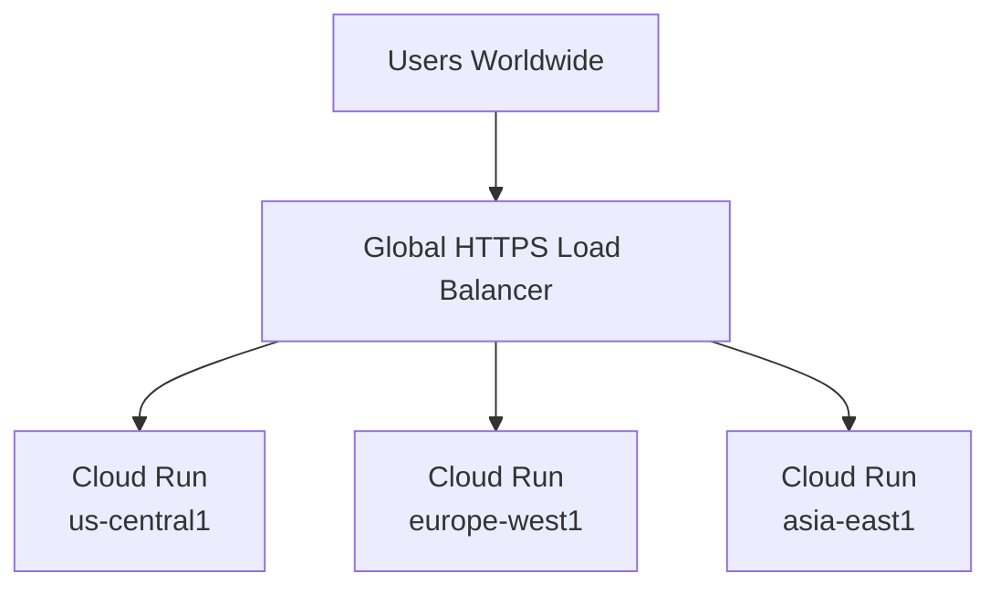
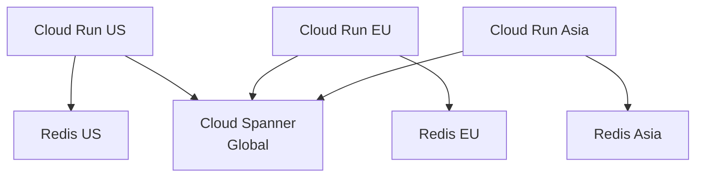

# How to Set Up Cloud Run Multi-Region Deployment with Global Load Balancing

Author: [nawazdhandala](https://www.github.com/nawazdhandala)

Tags: GCP, Cloud Run, Multi-Region, Global Load Balancing, High Availability, Google Cloud

Description: Learn how to deploy Cloud Run services across multiple regions with a global load balancer for low latency and high availability worldwide.

---

Running your Cloud Run service in a single region works fine until your users are spread across the globe. A service in us-central1 means 200ms+ latency for users in Asia and Europe. And if that region goes down, your entire service is offline.

Multi-region deployment with global load balancing solves both problems. Deploy your service to multiple regions, put a global load balancer in front, and users automatically get routed to the closest healthy region. This guide walks through the complete setup.

## Architecture

Here is what we are building:



The global load balancer uses anycast routing. Users' requests go to the nearest Google edge location, and the load balancer routes them to the closest healthy Cloud Run region. If one region is down, traffic automatically fails over to the next closest region.

## Prerequisites

- A GCP project with billing enabled
- Cloud Run services deployed in at least two regions
- A domain name for the load balancer
- The following APIs enabled:

```bash
# Enable required APIs
gcloud services enable \
  run.googleapis.com \
  compute.googleapis.com
```

## Step 1: Deploy Cloud Run to Multiple Regions

Deploy the same service to each target region:

```bash
# Deploy to US Central
gcloud run deploy my-service \
  --image=us-central1-docker.pkg.dev/MY_PROJECT/my-repo/my-app:latest \
  --region=us-central1 \
  --allow-unauthenticated \
  --cpu=1 \
  --memory=512Mi \
  --min-instances=1

# Deploy to Europe West
gcloud run deploy my-service \
  --image=us-central1-docker.pkg.dev/MY_PROJECT/my-repo/my-app:latest \
  --region=europe-west1 \
  --allow-unauthenticated \
  --cpu=1 \
  --memory=512Mi \
  --min-instances=1

# Deploy to Asia East
gcloud run deploy my-service \
  --image=us-central1-docker.pkg.dev/MY_PROJECT/my-repo/my-app:latest \
  --region=asia-east1 \
  --allow-unauthenticated \
  --cpu=1 \
  --memory=512Mi \
  --min-instances=1
```

I set `min-instances=1` in each region to avoid cold starts for the first request. In production, you might want this for the primary region and allow scale-to-zero for secondary regions if cost is a concern.

## Step 2: Reserve a Global IP Address

```bash
# Reserve a global static IP address
gcloud compute addresses create my-service-global-ip \
  --global \
  --ip-version=IPV4

# Note the IP address for DNS configuration
gcloud compute addresses describe my-service-global-ip \
  --global \
  --format="get(address)"
```

## Step 3: Create Serverless NEGs for Each Region

A serverless Network Endpoint Group (NEG) connects the load balancer to a Cloud Run service:

```bash
# Create NEG for US Central
gcloud compute network-endpoint-groups create my-service-neg-us \
  --region=us-central1 \
  --network-endpoint-type=serverless \
  --cloud-run-service=my-service

# Create NEG for Europe West
gcloud compute network-endpoint-groups create my-service-neg-eu \
  --region=europe-west1 \
  --network-endpoint-type=serverless \
  --cloud-run-service=my-service

# Create NEG for Asia East
gcloud compute network-endpoint-groups create my-service-neg-asia \
  --region=asia-east1 \
  --network-endpoint-type=serverless \
  --cloud-run-service=my-service
```

## Step 4: Create the Backend Service

The backend service aggregates all the NEGs:

```bash
# Create the backend service
gcloud compute backend-services create my-service-backend \
  --global \
  --load-balancing-scheme=EXTERNAL_MANAGED

# Add each regional NEG to the backend
gcloud compute backend-services add-backend my-service-backend \
  --global \
  --network-endpoint-group=my-service-neg-us \
  --network-endpoint-group-region=us-central1

gcloud compute backend-services add-backend my-service-backend \
  --global \
  --network-endpoint-group=my-service-neg-eu \
  --network-endpoint-group-region=europe-west1

gcloud compute backend-services add-backend my-service-backend \
  --global \
  --network-endpoint-group=my-service-neg-asia \
  --network-endpoint-group-region=asia-east1
```

## Step 5: Create the URL Map

```bash
# Create a URL map that routes all traffic to the backend
gcloud compute url-maps create my-service-url-map \
  --default-service=my-service-backend
```

## Step 6: Create the SSL Certificate and HTTPS Proxy

```bash
# Create a managed SSL certificate
gcloud compute ssl-certificates create my-service-cert \
  --domains=api.yourdomain.com \
  --global

# Create the HTTPS target proxy
gcloud compute target-https-proxies create my-service-https-proxy \
  --url-map=my-service-url-map \
  --ssl-certificates=my-service-cert

# Create the forwarding rule
gcloud compute forwarding-rules create my-service-https-rule \
  --global \
  --target-https-proxy=my-service-https-proxy \
  --address=my-service-global-ip \
  --ports=443
```

## Step 7: Set Up HTTP-to-HTTPS Redirect

```bash
# Create a URL map for HTTP redirect
gcloud compute url-maps import my-service-http-redirect \
  --source=/dev/stdin <<EOF
name: my-service-http-redirect
defaultUrlRedirect:
  httpsRedirect: true
  redirectResponseCode: MOVED_PERMANENTLY_DEFAULT
EOF

# Create HTTP proxy and forwarding rule
gcloud compute target-http-proxies create my-service-http-proxy \
  --url-map=my-service-http-redirect

gcloud compute forwarding-rules create my-service-http-rule \
  --global \
  --target-http-proxy=my-service-http-proxy \
  --address=my-service-global-ip \
  --ports=80
```

## Step 8: Configure DNS

Add an A record pointing your domain to the global IP address:

```
api.yourdomain.com.  A  <YOUR_GLOBAL_IP>
```

Wait for the SSL certificate to provision (this can take 15-60 minutes after DNS propagation):

```bash
# Check certificate status
gcloud compute ssl-certificates describe my-service-cert \
  --global \
  --format="get(managed.status, managed.domainStatus)"
```

## Step 9: Add Health Checks

By default, serverless NEGs do not use health checks because Cloud Run handles health internally. However, you can add Cloud Armor or enable logging to monitor regional health:

```bash
# Enable logging on the backend service to track regional routing
gcloud compute backend-services update my-service-backend \
  --global \
  --enable-logging \
  --logging-sample-rate=1.0
```

## Deployment Strategy

When deploying updates, you need to update all regions. Here is a script that deploys to all regions:

```bash
#!/bin/bash
# deploy-all-regions.sh - Deploy to all regions
IMAGE="us-central1-docker.pkg.dev/MY_PROJECT/my-repo/my-app:${1:-latest}"
REGIONS=("us-central1" "europe-west1" "asia-east1")

echo "Deploying image: $IMAGE"

for REGION in "${REGIONS[@]}"; do
    echo "Deploying to $REGION..."
    gcloud run deploy my-service \
        --image=$IMAGE \
        --region=$REGION \
        --allow-unauthenticated \
        --quiet &
done

# Wait for all deployments to complete
wait
echo "All regions deployed"
```

For a safer rollout, deploy one region at a time and verify:

```bash
# Rolling deployment - one region at a time
# 1. Deploy to a non-primary region first
gcloud run deploy my-service \
  --image=us-central1-docker.pkg.dev/MY_PROJECT/my-repo/my-app:v2 \
  --region=asia-east1

# 2. Test the Asia deployment
curl -H "Host: api.yourdomain.com" https://my-service-xxxxx-de.a.run.app/health

# 3. Deploy to Europe
gcloud run deploy my-service \
  --image=us-central1-docker.pkg.dev/MY_PROJECT/my-repo/my-app:v2 \
  --region=europe-west1

# 4. Finally, deploy to the primary US region
gcloud run deploy my-service \
  --image=us-central1-docker.pkg.dev/MY_PROJECT/my-repo/my-app:v2 \
  --region=us-central1
```

## Handling Stateful Data

Multi-region deployment works seamlessly for stateless services. If your service has state (database, cache), you need a data strategy:

**Global database**: Use Spanner for globally consistent data or Firestore for eventually consistent data. Both replicate across regions automatically.

**Regional databases with read replicas**: Use Cloud SQL with cross-region read replicas. Writes go to the primary region, reads go to the nearest replica.

**Cache per region**: Each region gets its own Memorystore Redis instance. Cache misses fall through to the database.



## Adding Cloud CDN

Enable CDN caching on the backend service for static content:

```bash
# Enable CDN on the backend service
gcloud compute backend-services update my-service-backend \
  --global \
  --enable-cdn \
  --cdn-policy-cache-mode=USE_ORIGIN_HEADERS
```

## Adding Cloud Armor

Protect your global endpoint with Cloud Armor WAF rules:

```bash
# Create a Cloud Armor security policy
gcloud compute security-policies create my-service-security \
  --description="Security policy for my-service"

# Add a rate limiting rule
gcloud compute security-policies rules create 1000 \
  --security-policy=my-service-security \
  --action=throttle \
  --rate-limit-threshold-count=100 \
  --rate-limit-threshold-interval-sec=60 \
  --conform-action=allow \
  --exceed-action=deny-429

# Apply to the backend service
gcloud compute backend-services update my-service-backend \
  --global \
  --security-policy=my-service-security
```

## Monitoring Multi-Region Health

Monitor latency and availability per region:

```bash
# Check load balancer latency metrics
gcloud monitoring metrics list \
  --filter='metric.type="loadbalancing.googleapis.com/https/backend_latencies"'

# Check which regions are receiving traffic
gcloud logging read '
  resource.type="http_load_balancer"
  AND httpRequest.requestUrl:"api.yourdomain.com"
' --limit=20 --format="table(timestamp, resource.labels.backend_service_name, httpRequest.latency)"
```

Set up uptime checks for each region's Cloud Run URL and the global load balancer URL to detect regional failures quickly.

## Cost Considerations

Multi-region deployment multiplies some costs:

- Cloud Run: You pay for instances in each region
- Minimum instances: If set to 1 in three regions, that is three always-on instances
- Load balancer: Fixed hourly charge plus per-GB data processing
- SSL certificate: Free with managed certificates

To optimize costs:
- Use `min-instances=0` for secondary regions (accept cold starts for failover traffic)
- Right-size CPU and memory for each region based on traffic patterns
- Use CDN to reduce backend hits

## Summary

Multi-region Cloud Run with global load balancing gives you low latency and high availability for global users. Deploy your service to multiple regions, create serverless NEGs, wire them into a global load balancer, and users automatically get routed to the closest region. The load balancer handles failover if a region goes down. For stateful services, pair this with a global database like Spanner or Firestore. The setup takes more work than a single-region deployment, but for production services with a global user base, the reliability and performance improvements are well worth it.
