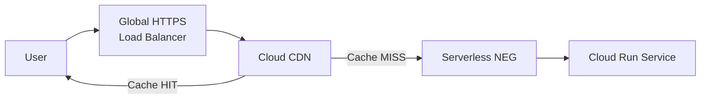

# How to Set Up Cloud Run with Cloud CDN for Caching Static Assets at the Edge

Author: [nawazdhandala](https://www.github.com/nawazdhandala)

Tags: GCP, Cloud Run, Cloud CDN, Caching, Performance, Google Cloud

Description: Learn how to put Cloud CDN in front of your Cloud Run service to cache static assets at the edge and reduce latency for global users.

---

Cloud Run is fast, but it runs in one region. If your users are spread across the globe, every request for a CSS file, JavaScript bundle, or image has to travel to your Cloud Run region and back. That adds latency, and for static assets that rarely change, it is completely unnecessary.

Cloud CDN solves this by caching your static assets at Google's edge locations worldwide. A user in Tokyo gets the cached response from a nearby edge location instead of waiting for a round trip to us-central1. This guide walks through setting up Cloud CDN in front of Cloud Run with a global HTTPS load balancer.

## Architecture

The setup requires a few pieces working together:



The global load balancer receives all traffic. Cloud CDN sits between the load balancer and your Cloud Run backend. On a cache miss, the request goes through to Cloud Run. On a cache hit, the response is served directly from the edge - Cloud Run is never contacted.

## Prerequisites

- A Cloud Run service already deployed
- A domain name (optional but recommended for production)
- The following APIs enabled:

```bash
# Enable required APIs
gcloud services enable compute.googleapis.com \
  run.googleapis.com
```

## Step 1: Reserve a Static IP Address

The load balancer needs a static IP address:

```bash
# Reserve a global static IP address
gcloud compute addresses create cloud-run-cdn-ip \
  --global \
  --ip-version=IPV4

# Get the IP address value
gcloud compute addresses describe cloud-run-cdn-ip \
  --global \
  --format="get(address)"
```

Note this IP address. You will point your DNS records to it later.

## Step 2: Create a Serverless Network Endpoint Group

A serverless NEG connects the load balancer to your Cloud Run service:

```bash
# Create a serverless NEG pointing to your Cloud Run service
gcloud compute network-endpoint-groups create cloud-run-neg \
  --region=us-central1 \
  --network-endpoint-type=serverless \
  --cloud-run-service=my-service
```

## Step 3: Create a Backend Service with CDN Enabled

The backend service wraps the NEG and is where you enable Cloud CDN:

```bash
# Create the backend service with Cloud CDN enabled
gcloud compute backend-services create cloud-run-backend \
  --global \
  --load-balancing-scheme=EXTERNAL_MANAGED \
  --enable-cdn \
  --cdn-policy-cache-mode=USE_ORIGIN_HEADERS \
  --cdn-policy-default-ttl=3600 \
  --cdn-policy-max-ttl=86400

# Add the serverless NEG to the backend service
gcloud compute backend-services add-backend cloud-run-backend \
  --global \
  --network-endpoint-group=cloud-run-neg \
  --network-endpoint-group-region=us-central1
```

Key CDN settings:

- `--enable-cdn`: Turns on Cloud CDN caching
- `--cdn-policy-cache-mode=USE_ORIGIN_HEADERS`: Respect Cache-Control headers from your app
- `--cdn-policy-default-ttl=3600`: Default cache time of 1 hour if no Cache-Control header is present
- `--cdn-policy-max-ttl=86400`: Maximum cache time of 24 hours

## Step 4: Create a URL Map

The URL map routes requests to the backend:

```bash
# Create a URL map
gcloud compute url-maps create cloud-run-url-map \
  --default-service=cloud-run-backend
```

## Step 5: Create an SSL Certificate and HTTPS Proxy

For HTTPS (which you should always use in production):

```bash
# Create a managed SSL certificate for your domain
gcloud compute ssl-certificates create cloud-run-cert \
  --domains=app.yourdomain.com \
  --global

# Create the HTTPS target proxy
gcloud compute target-https-proxies create cloud-run-https-proxy \
  --url-map=cloud-run-url-map \
  --ssl-certificates=cloud-run-cert

# Create the forwarding rule (connects the IP to the proxy)
gcloud compute forwarding-rules create cloud-run-https-rule \
  --global \
  --target-https-proxy=cloud-run-https-proxy \
  --address=cloud-run-cdn-ip \
  --ports=443
```

If you also want HTTP that redirects to HTTPS:

```bash
# Create an HTTP-to-HTTPS redirect URL map
gcloud compute url-maps import http-redirect \
  --source=/dev/stdin <<EOF
name: http-redirect
defaultUrlRedirect:
  httpsRedirect: true
  redirectResponseCode: MOVED_PERMANENTLY_DEFAULT
EOF

# Create HTTP target proxy and forwarding rule
gcloud compute target-http-proxies create cloud-run-http-proxy \
  --url-map=http-redirect

gcloud compute forwarding-rules create cloud-run-http-rule \
  --global \
  --target-http-proxy=cloud-run-http-proxy \
  --address=cloud-run-cdn-ip \
  --ports=80
```

## Step 6: Configure DNS

Point your domain to the static IP address. Add an A record:

```
app.yourdomain.com.  A  <YOUR_STATIC_IP>
```

The managed SSL certificate will not provision until DNS is pointing to the load balancer. This can take up to 24 hours but usually completes within 15-30 minutes.

Check the certificate status:

```bash
# Check SSL certificate provisioning status
gcloud compute ssl-certificates describe cloud-run-cert \
  --global \
  --format="get(managed.status)"
```

## Step 7: Set Cache-Control Headers in Your Application

Cloud CDN respects the Cache-Control headers your application returns. Set appropriate headers for different content types:

```python
# app.py - Flask app with proper cache headers for CDN
from flask import Flask, send_from_directory, make_response
import os

app = Flask(__name__)

@app.route("/")
def index():
    """HTML pages - short cache, revalidate often."""
    response = make_response(render_template("index.html"))
    # Cache for 5 minutes, allow CDN to serve stale while revalidating
    response.headers["Cache-Control"] = "public, max-age=300, s-maxage=300, stale-while-revalidate=60"
    return response

@app.route("/static/<path:filename>")
def static_files(filename):
    """Static assets - long cache with versioned URLs."""
    response = make_response(send_from_directory("static", filename))
    # Cache for 1 year (assets are versioned via filename hash)
    response.headers["Cache-Control"] = "public, max-age=31536000, immutable"
    return response

@app.route("/api/data")
def api_data():
    """API responses - no caching or short cache."""
    response = make_response(jsonify({"data": "dynamic content"}))
    # Do not cache API responses
    response.headers["Cache-Control"] = "no-store"
    return response

@app.route("/api/catalog")
def catalog():
    """Semi-static API - cache briefly."""
    response = make_response(jsonify(get_catalog()))
    # Cache for 1 minute at the CDN
    response.headers["Cache-Control"] = "public, s-maxage=60"
    return response
```

Important header details:

- `s-maxage`: Controls CDN cache duration specifically (overrides max-age for shared caches)
- `max-age`: Controls browser cache duration
- `immutable`: Tells CDN and browser the content will never change at this URL
- `stale-while-revalidate`: CDN can serve stale content while fetching a fresh copy
- `no-store`: Prevents any caching

## Step 8: Verify CDN Caching

Test that caching is working:

```bash
# Make a request and check the response headers
curl -I https://app.yourdomain.com/static/style.css
```

Look for these headers in the response:

- `Age: 45` - The content has been cached for 45 seconds
- `Via: 1.1 google` - The response came through Google's CDN
- `X-Cache-Status` or checking if Age > 0 indicates a cache hit

## Invalidating the Cache

When you deploy new content and need to clear the CDN cache:

```bash
# Invalidate all cached content
gcloud compute url-maps invalidate-cdn-cache cloud-run-url-map \
  --path="/*"

# Invalidate a specific path
gcloud compute url-maps invalidate-cdn-cache cloud-run-url-map \
  --path="/static/style.css"

# Invalidate with a path prefix
gcloud compute url-maps invalidate-cdn-cache cloud-run-url-map \
  --path="/static/*"
```

Cache invalidation is not instant - it propagates across all edge locations and can take a few minutes.

## Cache Key Configuration

By default, Cloud CDN uses the full request URL as the cache key. You can customize this:

```bash
# Include query strings in cache key (default)
gcloud compute backend-services update cloud-run-backend \
  --global \
  --cdn-policy-include-query-string

# Exclude query strings from cache key
gcloud compute backend-services update cloud-run-backend \
  --global \
  --no-cdn-policy-include-query-string
```

Excluding query strings means `style.css?v=1` and `style.css?v=2` serve the same cached response. Include them if you use query parameters for versioning.

## Monitoring CDN Performance

Check CDN hit rates and latency:

```bash
# View CDN metrics in Cloud Monitoring
gcloud monitoring dashboards create \
  --config-from-file=cdn-dashboard.json
```

Key metrics to watch:

- `loadbalancing.googleapis.com/https/backend_latencies` - Time to reach Cloud Run on cache miss
- `loadbalancing.googleapis.com/https/total_latencies` - Total request time including CDN
- Cache hit ratio - Available in the Cloud Console under Load Balancing > CDN tab

A healthy setup will show a high cache hit ratio for static assets and low total latencies.

## Summary

Cloud CDN in front of Cloud Run dramatically improves performance for static content. The setup involves a global load balancer, a serverless NEG, and a CDN-enabled backend service. The most important part is setting proper Cache-Control headers in your application - that is what tells CDN what to cache and for how long. Use long cache times with versioned URLs for static assets, short or no caching for dynamic content, and invalidate the cache when you deploy changes.
