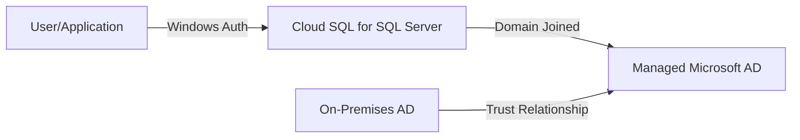

# How to Set Up Cloud SQL for SQL Server with Active Directory Authentication

Author: [nawazdhandala](https://www.github.com/nawazdhandala)

Tags: GCP, Cloud SQL, SQL Server, Active Directory, Windows Authentication

Description: A step-by-step guide to configuring Cloud SQL for SQL Server with Active Directory authentication using Managed Microsoft AD and domain joining.

---

Cloud SQL for SQL Server supports Windows Authentication through integration with Managed Microsoft AD. This lets your users authenticate to SQL Server using their Active Directory credentials instead of SQL Server logins. If you are migrating SQL Server workloads from on-premises where Windows Authentication is the standard, this is how you replicate that setup in Google Cloud.

## Architecture Overview

The integration works through Google's Managed Microsoft AD service, which provides a fully managed Active Directory domain. Cloud SQL for SQL Server joins this domain, enabling Windows Authentication.



You can also set up a trust relationship between Managed AD and your on-premises Active Directory, allowing on-premises users to authenticate to Cloud SQL.

## Prerequisites

Before starting, you need:

- A Google Cloud project with billing enabled
- The Cloud SQL Admin API enabled
- The Managed Microsoft AD API enabled
- A VPC network for the AD domain
- Appropriate IAM permissions (Cloud SQL Admin, Managed AD Admin)

```bash
# Enable required APIs
gcloud services enable sqladmin.googleapis.com
gcloud services enable managedidentities.googleapis.com
```

## Step 1: Create a Managed Microsoft AD Domain

If you do not already have a Managed AD domain, create one:

```bash
# Create a Managed Microsoft AD domain
gcloud active-directory domains create my-domain.example.com \
    --reserved-ip-range=10.0.0.0/24 \
    --region=us-central1 \
    --authorized-networks=projects/my-project/global/networks/my-vpc
```

This creates a fully managed AD domain with domain controllers in the specified region. The creation takes 30-60 minutes.

Check the domain status:

```bash
# Wait for the domain to be ready
gcloud active-directory domains describe my-domain.example.com \
    --format="json(state, fqdn, admin)"
```

The domain is ready when the state is `READY`. Note the admin account - it is usually `setupadmin@my-domain.example.com`.

## Step 2: Configure the VPC for AD

The VPC network needs DNS configured to resolve the AD domain:

```bash
# Create a DNS peering zone to resolve the AD domain
gcloud dns managed-zones create ad-dns-forwarding \
    --dns-name=my-domain.example.com. \
    --visibility=private \
    --networks=my-vpc \
    --description="Forward DNS for Managed AD" \
    --forwarding-targets=$(gcloud active-directory domains describe my-domain.example.com --format="value(name)" | xargs gcloud active-directory domains get-ldaps-settings --domain=my-domain.example.com --format="value(dnsIpAddresses[0])")
```

Alternatively, Cloud DNS automatically handles this if the VPC is an authorized network for the Managed AD domain.

## Step 3: Create the Cloud SQL for SQL Server Instance

Create the SQL Server instance with the AD domain configuration:

```bash
# Create a Cloud SQL for SQL Server instance joined to the AD domain
gcloud sql instances create my-sqlserver \
    --database-version=SQLSERVER_2019_STANDARD \
    --tier=db-custom-4-16384 \
    --region=us-central1 \
    --root-password=YourStrongPassword123 \
    --network=projects/my-project/global/networks/my-vpc \
    --no-assign-ip \
    --storage-type=SSD \
    --storage-size=100GB \
    --availability-type=REGIONAL \
    --active-directory-domain=projects/my-project/locations/global/domains/my-domain.example.com
```

The key flag is `--active-directory-domain`, which tells Cloud SQL to join the instance to the specified Managed AD domain.

## Step 4: Create AD Users

Connect to the Managed AD domain to create users. You can use a Windows VM joined to the domain or use PowerShell remotely.

First, create a Windows VM and join it to the domain:

```bash
# Create a Windows VM in the same VPC
gcloud compute instances create ad-admin-vm \
    --zone=us-central1-a \
    --machine-type=n1-standard-2 \
    --image-project=windows-cloud \
    --image-family=windows-2022 \
    --network=my-vpc \
    --subnet=my-subnet \
    --metadata=enable-wsfc=true
```

RDP into the VM and join it to the domain:

```powershell
# PowerShell - Join the VM to the domain
Add-Computer -DomainName "my-domain.example.com" -Credential (Get-Credential) -Restart
```

After restarting, log in with the domain admin account and create users:

```powershell
# PowerShell - Create AD users for database access
Import-Module ActiveDirectory

# Create a user for application access
New-ADUser -Name "app-dbuser" `
    -SamAccountName "app-dbuser" `
    -UserPrincipalName "app-dbuser@my-domain.example.com" `
    -AccountPassword (ConvertTo-SecureString "SecurePass123!" -AsPlainText -Force) `
    -Enabled $true `
    -PasswordNeverExpires $true

# Create a group for database administrators
New-ADGroup -Name "SQL-Admins" `
    -GroupScope Global `
    -GroupCategory Security

# Add users to the group
Add-ADGroupMember -Identity "SQL-Admins" -Members "app-dbuser"
```

## Step 5: Configure SQL Server Logins

Connect to the Cloud SQL for SQL Server instance and create Windows logins:

```bash
# Connect using sqlcmd with the SA account
sqlcmd -S PRIVATE_IP -U sqlserver -P YourStrongPassword123
```

Create Windows logins and map them to database users:

```sql
-- Create a Windows login for the AD user
CREATE LOGIN [MY-DOMAIN\app-dbuser] FROM WINDOWS;

-- Create a Windows login for the AD group
CREATE LOGIN [MY-DOMAIN\SQL-Admins] FROM WINDOWS;

-- Create a database and map the login to a database user
CREATE DATABASE myapp;
GO

USE myapp;
GO

-- Create a database user mapped to the Windows login
CREATE USER [MY-DOMAIN\app-dbuser] FOR LOGIN [MY-DOMAIN\app-dbuser];

-- Grant appropriate permissions
GRANT SELECT, INSERT, UPDATE, DELETE ON SCHEMA::dbo TO [MY-DOMAIN\app-dbuser];

-- Create a user for the group and grant db_owner
CREATE USER [MY-DOMAIN\SQL-Admins] FOR LOGIN [MY-DOMAIN\SQL-Admins];
ALTER ROLE db_owner ADD MEMBER [MY-DOMAIN\SQL-Admins];
GO
```

## Step 6: Connect with Windows Authentication

From a domain-joined machine, connect using Windows Authentication:

```bash
# Connect using sqlcmd with Windows Authentication
sqlcmd -S PRIVATE_IP -E -d myapp
```

The `-E` flag uses the current Windows credentials for authentication.

From a .NET application:

```csharp
// C# connection string using Windows Authentication
string connectionString = @"
    Server=PRIVATE_IP;
    Database=myapp;
    Integrated Security=true;
    TrustServerCertificate=true;
";

using (var connection = new SqlConnection(connectionString))
{
    connection.Open();
    // Connection uses the application's Windows identity
}
```

## Setting Up an AD Trust (Optional)

If you have an on-premises Active Directory and want users to authenticate with their existing credentials, set up a trust:

```bash
# Create a trust between Managed AD and on-premises AD
gcloud active-directory domains trusts create my-domain.example.com \
    --target-domain-name=onprem.company.com \
    --target-dns-ip-addresses=192.168.1.10,192.168.1.11 \
    --direction=BIDIRECTIONAL \
    --type=FOREST \
    --handshake-secret=SharedTrustSecret123!
```

You also need to create the trust on the on-premises AD side using Active Directory Domains and Trusts.

After the trust is established, on-premises users can authenticate:

```sql
-- Create a login for an on-premises AD user
CREATE LOGIN [ONPREM\john.smith] FROM WINDOWS;

USE myapp;
CREATE USER [ONPREM\john.smith] FOR LOGIN [ONPREM\john.smith];
GRANT SELECT ON SCHEMA::dbo TO [ONPREM\john.smith];
```

## Troubleshooting

### Instance Fails to Join Domain

Check that:

- The VPC network is authorized for the Managed AD domain
- DNS resolution works for the domain (test from a VM in the same VPC)
- The IP range allocated for Managed AD does not conflict with other allocations

```bash
# Check the instance's AD integration status
gcloud sql instances describe my-sqlserver \
    --format="json(settings.activeDirectoryConfig)"
```

### Authentication Failures

If Windows Authentication fails:

1. Verify the login exists in SQL Server: `SELECT * FROM sys.server_principals WHERE type_desc = 'WINDOWS_LOGIN';`
2. Check that the user's domain account is not locked or expired
3. Verify DNS resolution from the client machine
4. Check that Kerberos tickets are valid: `klist` on Windows

### Clock Skew Issues

Kerberos is sensitive to clock skew (more than 5 minutes difference causes failures). Managed AD domain controllers maintain accurate time, but client machines need to be in sync:

```powershell
# Check time synchronization status
w32tm /query /status

# Force time sync
w32tm /resync
```

## Security Considerations

1. **Use AD groups for authorization** instead of individual logins. This follows the principle of least privilege and makes management easier.

2. **Audit login events** by enabling SQL Server auditing:

```sql
-- Enable login auditing
EXEC sp_configure 'login auditing', 2;  -- Log both successful and failed logins
RECONFIGURE;
```

3. **Disable SA account** after setting up AD authentication:

```sql
-- Disable the SA account for security
ALTER LOGIN [sqlserver] DISABLE;
```

4. **Use private IP** to keep all authentication traffic on your VPC.

## Managed AD Costs

Managed Microsoft AD pricing:

- Standard edition: Per domain per hour (includes two domain controllers)
- Additional domain controllers: Per DC per hour
- AD trust: No additional cost

The cost is in addition to your Cloud SQL instance cost. For a small deployment with one domain, expect approximately $200-300/month for Managed AD.

## Summary

Cloud SQL for SQL Server with Active Directory authentication brings familiar Windows Authentication to Google Cloud. The setup involves creating a Managed AD domain, joining the Cloud SQL instance to it, and creating Windows logins in SQL Server. For organizations migrating from on-premises, the AD trust feature lets existing users authenticate with their current credentials. The biggest consideration is the additional cost of Managed AD and the network configuration required to make everything work together.
