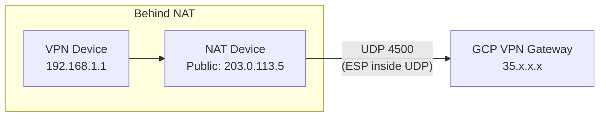

# How to Set Up Cloud VPN Behind a NAT Device Using UDP Encapsulation in GCP

Author: [nawazdhandala](https://www.github.com/nawazdhandala)

Tags: GCP, Cloud VPN, NAT, UDP Encapsulation, IPsec, Networking

Description: A step-by-step guide to configuring GCP Cloud VPN when your on-premises VPN device sits behind a NAT gateway using UDP encapsulation and NAT-T.

---

Not every on-premises VPN device has a public IP address directly assigned to it. In many real-world setups, the VPN appliance sits behind a NAT device - a firewall, a router doing port address translation, or even a carrier-grade NAT. This creates a problem because standard IPsec uses the ESP protocol (IP protocol 50), which does not have port numbers and therefore cannot be NATed properly.

The solution is NAT Traversal (NAT-T), which wraps ESP packets inside UDP port 4500. GCP Cloud VPN supports this out of the box, but there are some configuration details you need to get right. Let me walk through the setup.

## How NAT-T Works

In a standard IPsec tunnel, the traffic flow looks like this:

1. IKE negotiation happens on UDP port 500
2. Once the tunnel is established, encrypted data flows using the ESP protocol

The problem with ESP is that it sits directly on top of IP (protocol number 50) without any port numbers. NAT devices need port numbers to track connections and route return traffic to the right internal host. Without ports, NAT breaks ESP.

NAT-T solves this by detecting that one or both peers are behind NAT, and then encapsulating ESP packets inside UDP on port 4500:



The detection happens automatically during IKE negotiation. Both peers include NAT detection payloads in the IKE_SA_INIT exchange. If either peer detects that its packets have been modified (i.e., NATed), both sides switch to UDP encapsulation.

## Prerequisites

Before you start, make sure:

- Your NAT device can forward UDP ports 500 and 4500 to the internal VPN appliance
- Your VPN appliance supports IKEv2 with NAT-T (most modern devices do)
- You know the public IP address of your NAT device
- The NAT device does not rewrite IKE packets (some aggressive firewalls do this)

## Step 1: Configure the NAT Device

On your NAT device, you need to set up port forwarding for two UDP ports:

```text
# Example: NAT port forwarding rules
# Forward UDP 500 to internal VPN device
UDP 500  -> 192.168.1.1:500

# Forward UDP 4500 to internal VPN device
UDP 4500 -> 192.168.1.1:4500
```

On a Linux-based router, this would look like:

```bash
# Forward IKE and NAT-T traffic to the internal VPN device
iptables -t nat -A PREROUTING -p udp --dport 500 \
    -j DNAT --to-destination 192.168.1.1:500

iptables -t nat -A PREROUTING -p udp --dport 4500 \
    -j DNAT --to-destination 192.168.1.1:4500

# Make sure the forwarded traffic is allowed
iptables -A FORWARD -p udp -d 192.168.1.1 --dport 500 -j ACCEPT
iptables -A FORWARD -p udp -d 192.168.1.1 --dport 4500 -j ACCEPT
```

Important: Do NOT forward ESP (protocol 50). With NAT-T, all traffic flows over UDP 4500, so ESP forwarding is not needed and would actually cause problems.

## Step 2: Create the GCP VPN Gateway

For this scenario, I recommend using HA VPN if possible. HA VPN handles NAT-T better than Classic VPN because it always uses IKEv2.

```bash
# Create an HA VPN gateway
gcloud compute vpn-gateways create ha-vpn-gw \
    --network=my-vpc \
    --region=us-central1
```

If you need to use Classic VPN for some reason, create it the standard way:

```bash
# Reserve a static IP
gcloud compute addresses create vpn-ip \
    --region=us-central1

# Create Classic VPN gateway
gcloud compute target-vpn-gateways create classic-vpn-gw \
    --network=my-vpc \
    --region=us-central1

# Create the required forwarding rules
VPN_IP=$(gcloud compute addresses describe vpn-ip \
    --region=us-central1 --format="value(address)")

gcloud compute forwarding-rules create fr-esp \
    --ip-protocol=ESP \
    --address=$VPN_IP \
    --target-vpn-gateway=classic-vpn-gw \
    --region=us-central1

gcloud compute forwarding-rules create fr-udp500 \
    --ip-protocol=UDP \
    --ports=500 \
    --address=$VPN_IP \
    --target-vpn-gateway=classic-vpn-gw \
    --region=us-central1

gcloud compute forwarding-rules create fr-udp4500 \
    --ip-protocol=UDP \
    --ports=4500 \
    --address=$VPN_IP \
    --target-vpn-gateway=classic-vpn-gw \
    --region=us-central1
```

## Step 3: Create an External VPN Gateway (HA VPN)

For HA VPN, you need to define the peer. Use the public IP of the NAT device, not the internal VPN device:

```bash
# Create an external VPN gateway with the NAT device's public IP
gcloud compute external-vpn-gateways create onprem-vpn-gw \
    --interfaces=0=203.0.113.5
```

## Step 4: Create Cloud Router and VPN Tunnels

```bash
# Create a Cloud Router for BGP
gcloud compute routers create vpn-router \
    --network=my-vpc \
    --region=us-central1 \
    --asn=65001

# Create the VPN tunnel pointing to the NAT device's public IP
gcloud compute vpn-tunnels create tunnel-to-onprem \
    --peer-external-gateway=onprem-vpn-gw \
    --peer-external-gateway-interface=0 \
    --region=us-central1 \
    --ike-version=2 \
    --shared-secret=my-strong-shared-secret \
    --router=vpn-router \
    --vpn-gateway=ha-vpn-gw \
    --interface=0
```

## Step 5: Configure BGP

```bash
# Add a router interface for the tunnel
gcloud compute routers add-interface vpn-router \
    --interface-name=if-tunnel-to-onprem \
    --ip-address=169.254.0.1 \
    --mask-length=30 \
    --vpn-tunnel=tunnel-to-onprem \
    --region=us-central1

# Add a BGP peer
gcloud compute routers add-bgp-peer vpn-router \
    --peer-name=onprem-bgp-peer \
    --interface=if-tunnel-to-onprem \
    --peer-ip-address=169.254.0.2 \
    --peer-asn=65002 \
    --region=us-central1
```

## Step 6: Configure the On-Premises VPN Device

On your VPN appliance behind the NAT, the configuration needs to account for NAT-T. Here is an example using strongSwan on Linux:

```bash
# /etc/ipsec.conf - strongSwan configuration behind NAT
conn gcp-tunnel
    # Use the internal IP as the local address
    left=192.168.1.1
    # The NAT device's public IP (for IKE identity)
    leftid=203.0.113.5
    leftsubnet=10.0.0.0/24
    # GCP VPN gateway IP
    right=35.242.100.50
    rightsubnet=10.1.0.0/24
    # IKEv2 with NAT-T support
    keyexchange=ikev2
    authby=psk
    auto=start
    # Force UDP encapsulation even if NAT is not detected
    forceencaps=yes
    # DPD settings
    dpdaction=restart
    dpddelay=10s
    dpdtimeout=30s
```

The `forceencaps=yes` option is key here. It tells strongSwan to always use UDP encapsulation, even if the NAT detection does not work properly. This is a safe setting to use whenever the device is behind NAT.

## Common Issues and Fixes

### IKE Negotiation Succeeds but No Traffic Flows

This usually means ESP packets are being blocked. Verify that:

1. You are NOT trying to forward ESP protocol through the NAT - all traffic should flow over UDP 4500
2. The NAT device is not timing out the UDP 4500 session - set NAT timeouts to at least 5 minutes
3. Your on-premises device is actually using UDP encapsulation (check with packet capture)

### Tunnel Keeps Dropping

NAT devices track UDP sessions by source/destination IP and port. If the NAT session times out, the mapping is lost and return traffic cannot reach the VPN device.

Solutions:
- Lower the DPD interval to keep the NAT session alive (10 seconds works well)
- Configure NAT session timeouts to be longer than the IKE/IPsec rekey interval
- Some VPN devices support sending keepalive packets - enable this feature

### Source IP Changes After NAT

GCP Cloud VPN sees the public IP of the NAT device, not the internal VPN device. Make sure:

- The `--peer-address` in GCP points to the NAT device's public IP
- The IKE identity on the on-premises device matches what GCP expects

### Multiple VPN Devices Behind the Same NAT

This is tricky. If you have more than one VPN device behind the same NAT public IP, standard port forwarding only works for one of them. Options include:

- Assign different public IPs for each VPN device
- Use different source ports (some devices support this)
- Consolidate to a single VPN device that handles all tunnels

## Verifying NAT-T is Active

Once the tunnel is up, you can confirm NAT-T is being used:

```bash
# Check tunnel details including NAT-T status
gcloud compute vpn-tunnels describe tunnel-to-onprem \
    --region=us-central1 \
    --format="yaml(status, detailedStatus, peerIp)"
```

On the on-premises side with strongSwan:

```bash
# Check active IPsec SAs and NAT-T status
ipsec statusall | grep -i nat
```

You should see `NAT-T: enabled` or similar in the output.

## Wrapping Up

Running Cloud VPN behind a NAT device is fully supported thanks to NAT-T and UDP encapsulation. The main things to remember are: forward UDP 500 and 4500 (not ESP), use the NAT device's public IP as the peer address in GCP, force UDP encapsulation on the on-premises device, and keep NAT sessions alive with short DPD intervals. Once you have these pieces in place, the tunnel works just like any other Cloud VPN connection.
