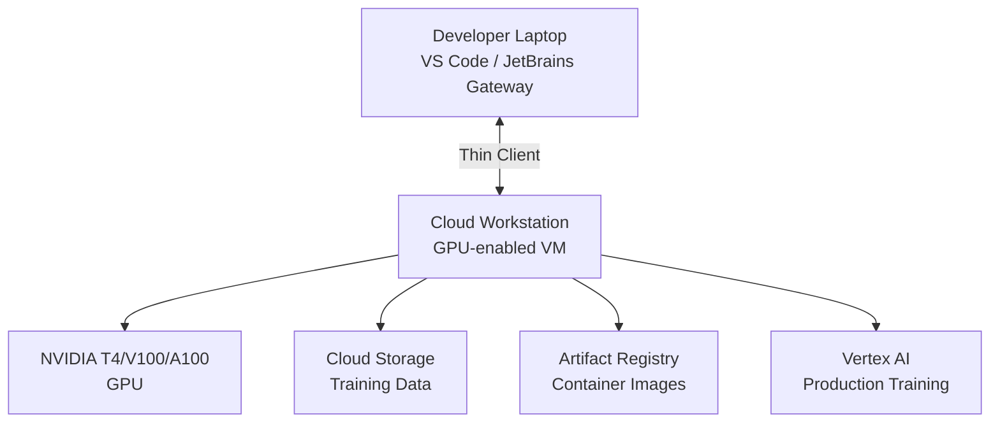

# How to Set Up Cloud Workstation GPU-Enabled Configurations for ML Development

Author: [nawazdhandala](https://www.github.com/nawazdhandala)

Tags: GCP, Cloud Workstations, GPU, Machine Learning, CUDA, Development Environment

Description: A step-by-step guide to configuring Google Cloud Workstations with GPU support for machine learning development, including CUDA setup and Jupyter integration.

---

Machine learning development has a unique infrastructure requirement: you need GPUs for training and experimentation, but you do not need them running 24/7. Cloud Workstations with GPU-enabled configurations give you a nice middle ground. You get a full development environment with GPU access that starts when you need it and stops when you do not, so you are not burning money on idle hardware.

This guide covers how to set up a GPU-enabled Cloud Workstation from scratch, configure it for ML workflows, and optimize the experience so you can focus on building models instead of managing infrastructure.

## Architecture

Here is what the setup looks like:



You develop and prototype on the workstation. When the model is ready for full-scale training, you kick it off on Vertex AI. The workstation serves as your interactive development environment.

## Prerequisites

- A GCP project with billing enabled
- Cloud Workstations API enabled
- A workstation cluster already created (or permissions to create one)
- GPU quota in your region (check Quotas page in the console)

## Step 1: Check GPU Availability

Not all regions and zones support GPUs for Cloud Workstations. Check availability first.

```bash
# List available GPU types in your region
gcloud compute accelerator-types list --filter="zone:us-central1-a"
```

NVIDIA T4 GPUs are the most widely available and a good choice for development. For heavier work, look for V100 or A100 options.

## Step 2: Create a GPU-Enabled Workstation Configuration

The key parameter is `--accelerator-type` in the workstation configuration.

```bash
# Create a workstation config with an NVIDIA T4 GPU
gcloud workstations configs create ml-gpu-config \
  --cluster=dev-cluster \
  --region=us-central1 \
  --machine-type=n1-standard-8 \
  --boot-disk-size=100 \
  --pd-disk-size=500 \
  --pd-disk-type=pd-ssd \
  --accelerator-type=nvidia-tesla-t4 \
  --accelerator-count=1 \
  --idle-timeout=1800s \
  --running-timeout=43200s
```

A few things to note:

- GPU-enabled configs require N1 or N2 machine types (not E2)
- The `--pd-disk-size=500` gives you room for datasets and model checkpoints
- SSD persistent disk is important for data loading performance
- The idle timeout of 1800 seconds (30 minutes) auto-stops the workstation after inactivity

## Step 3: Build a Custom Container Image with CUDA

The default Cloud Workstation image does not include GPU drivers or CUDA. You need a custom image.

```dockerfile
# ML development workstation image with CUDA support
FROM us-central1-docker.pkg.dev/cloud-workstations-images/predefined/base:latest

# Install NVIDIA drivers and CUDA toolkit
RUN apt-get update && apt-get install -y --no-install-recommends \
    gnupg2 \
    ca-certificates \
    && curl -fsSL https://developer.download.nvidia.com/compute/cuda/repos/debian12/x86_64/3bf863cc.pub | apt-key add - \
    && echo "deb https://developer.download.nvidia.com/compute/cuda/repos/debian12/x86_64 /" > /etc/apt/sources.list.d/cuda.list \
    && apt-get update \
    && apt-get install -y --no-install-recommends \
    cuda-toolkit-12-3 \
    libcudnn8 \
    libcudnn8-dev \
    && rm -rf /var/lib/apt/lists/*

# Set CUDA environment variables
ENV CUDA_HOME=/usr/local/cuda
ENV PATH=$CUDA_HOME/bin:$PATH
ENV LD_LIBRARY_PATH=$CUDA_HOME/lib64:$LD_LIBRARY_PATH

# Install Python ML stack
RUN pip3 install --no-cache-dir \
    torch \
    torchvision \
    torchaudio \
    tensorflow \
    jax[cuda12_pip] \
    jupyter \
    jupyterlab \
    numpy \
    pandas \
    scikit-learn \
    matplotlib \
    tensorboard \
    wandb

# Install the Google Cloud AI Platform SDK
RUN pip3 install --no-cache-dir \
    google-cloud-aiplatform \
    google-cloud-storage \
    google-cloud-bigquery

# Configure Jupyter to run on startup
RUN mkdir -p /home/user/.jupyter
COPY jupyter_config.py /home/user/.jupyter/jupyter_notebook_config.py
```

Create the Jupyter configuration file:

```python
# jupyter_config.py - Jupyter configuration for Cloud Workstations
c.ServerApp.ip = '0.0.0.0'
c.ServerApp.port = 8888
c.ServerApp.open_browser = False
c.ServerApp.token = ''
c.ServerApp.allow_origin = '*'
```

Build and push the image:

```bash
# Build the ML workstation image
gcloud builds submit \
  --tag us-central1-docker.pkg.dev/MY_PROJECT/workstations/ml-dev:latest \
  --timeout=1800s .
```

The build takes a while because of the CUDA toolkit size.

## Step 4: Update the Configuration with the Custom Image

```bash
# Apply the custom image to the workstation config
gcloud workstations configs update ml-gpu-config \
  --cluster=dev-cluster \
  --region=us-central1 \
  --container-custom-image=us-central1-docker.pkg.dev/MY_PROJECT/workstations/ml-dev:latest
```

## Step 5: Create and Start the Workstation

```bash
# Create the GPU workstation
gcloud workstations create ml-workstation \
  --cluster=dev-cluster \
  --config=ml-gpu-config \
  --region=us-central1

# Start it
gcloud workstations start ml-workstation \
  --cluster=dev-cluster \
  --config=ml-gpu-config \
  --region=us-central1
```

## Step 6: Verify GPU Access

Connect to your workstation through the browser IDE or JetBrains Gateway, then open a terminal.

```bash
# Verify the GPU is visible
nvidia-smi

# Expected output shows the T4 GPU with driver and CUDA versions
# Check PyTorch can see the GPU
python3 -c "import torch; print(f'CUDA available: {torch.cuda.is_available()}'); print(f'Device: {torch.cuda.get_device_name(0)}')"

# Check TensorFlow can see the GPU
python3 -c "import tensorflow as tf; print(f'GPUs: {tf.config.list_physical_devices(\"GPU\")}')"
```

## Step 7: Set Up a Development Workflow

Here is a practical workflow for ML development on the GPU workstation.

### Use JupyterLab for Experimentation

Start JupyterLab and access it through the workstation's port forwarding:

```bash
# Start JupyterLab on the workstation
jupyter lab --port=8888 --no-browser &
```

Cloud Workstations automatically forwards ports, so you can access JupyterLab through the workstation proxy URL.

### Use VS Code with Notebooks

If you prefer VS Code, the Cloud Workstations browser IDE supports Jupyter notebooks natively. Just create a `.ipynb` file and start coding.

### Stage Data from Cloud Storage

Pull training data into the local SSD for fastest access:

```bash
# Copy training data from GCS to local SSD
gsutil -m cp -r gs://my-ml-bucket/datasets/cifar10/ /home/user/data/

# For larger datasets, use parallel composite downloads
gsutil -o GSUtil:parallel_composite_upload_threshold=150M \
  -m cp -r gs://my-ml-bucket/datasets/imagenet/ /home/user/data/
```

### Train a Model

Here is a quick example of training a model on the T4 GPU:

```python
import torch
import torch.nn as nn
import torch.optim as optim
from torchvision import datasets, transforms

# Set the device to GPU
device = torch.device("cuda" if torch.cuda.is_available() else "cpu")
print(f"Training on: {device}")

# Define a simple CNN
model = nn.Sequential(
    nn.Conv2d(3, 32, 3, padding=1),
    nn.ReLU(),
    nn.MaxPool2d(2),
    nn.Conv2d(32, 64, 3, padding=1),
    nn.ReLU(),
    nn.MaxPool2d(2),
    nn.Flatten(),
    nn.Linear(64 * 8 * 8, 256),
    nn.ReLU(),
    nn.Linear(256, 10),
).to(device)

# Training loop
optimizer = optim.Adam(model.parameters(), lr=0.001)
criterion = nn.CrossEntropyLoss()

transform = transforms.Compose([
    transforms.ToTensor(),
    transforms.Normalize((0.5, 0.5, 0.5), (0.5, 0.5, 0.5)),
])

# Load CIFAR-10 dataset
train_dataset = datasets.CIFAR10(
    root="/home/user/data", train=True, transform=transform, download=True
)
train_loader = torch.utils.data.DataLoader(
    train_dataset, batch_size=128, shuffle=True, num_workers=4
)

# Train for a few epochs
for epoch in range(5):
    running_loss = 0.0
    for batch_idx, (data, target) in enumerate(train_loader):
        data, target = data.to(device), target.to(device)
        optimizer.zero_grad()
        output = model(data)
        loss = criterion(output, target)
        loss.backward()
        optimizer.step()
        running_loss += loss.item()
    print(f"Epoch {epoch+1}, Loss: {running_loss/len(train_loader):.4f}")
```

## Cost Optimization Tips

GPU workstations can get expensive. Here is how to keep costs manageable:

- **Set aggressive idle timeouts.** 30 minutes is reasonable. The workstation stops automatically if you walk away.
- **Use running timeouts.** Set a maximum session length to prevent overnight runs from draining your budget.
- **Choose the right GPU.** A T4 is sufficient for most development and prototyping. Only upgrade to V100 or A100 if you genuinely need the extra compute for your interactive workflow.
- **Push large training jobs to Vertex AI.** The workstation is for prototyping. Once your training script works, submit it to Vertex AI for production runs and shut down the workstation.

## Wrapping Up

GPU-enabled Cloud Workstations hit a sweet spot for ML developers. You get on-demand GPU access without the overhead of managing your own VMs, and the automatic idle shutdown means you are not paying for GPUs that nobody is using. The custom container image approach lets you standardize the ML toolchain across your team, so everyone starts with the same CUDA version, the same framework versions, and the same development tools. It takes some upfront effort to build the image and configure the workstation, but once it is set up, the day-to-day experience is smooth.
