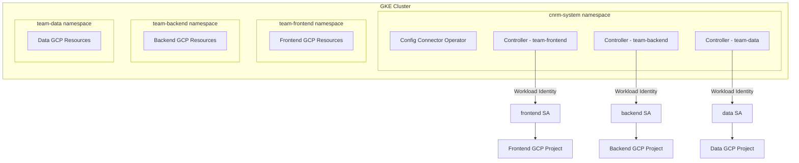

# How to Set Up Config Connector Namespaced Mode for Multi-Tenant GKE Clusters

Author: [nawazdhandala](https://www.github.com/nawazdhandala)

Tags: GCP, Config Connector, GKE, Multi-Tenancy, Kubernetes, IAM

Description: Learn how to configure Config Connector in namespaced mode to provide isolated GCP resource management for multiple teams sharing a single GKE cluster.

---

When multiple teams share a GKE cluster, you need isolation. Each team should only be able to manage GCP resources in their own project, and they should not be able to accidentally create resources in someone else's project. Config Connector's namespaced mode solves this by assigning a separate GCP service account to each Kubernetes namespace.

This post walks through setting up namespaced mode step by step, including the IAM bindings, namespace configuration, and validation.

## Cluster Mode vs Namespaced Mode

By default, Config Connector runs in cluster mode. That means a single GCP service account handles all resource creation across all namespaces. This works fine for single-team clusters, but it breaks down when you have multiple teams because:

- Every team shares the same permissions
- Any namespace can create resources in any GCP project
- There is no way to limit blast radius

Namespaced mode changes this. Each namespace gets its own Config Connector controller pod running with its own GCP service account. Team A's namespace can only manage resources in Team A's project.

## Prerequisites

You need:

- A GKE cluster with Config Connector add-on enabled
- Workload Identity enabled on the cluster
- Cluster admin access
- IAM admin access on each team's GCP project

## Step 1: Configure Config Connector for Namespaced Mode

First, you need to tell the Config Connector operator to run in namespaced mode. Create a ConfigConnector resource.

```yaml
# config-connector.yaml
# Sets Config Connector to run in namespaced mode
apiVersion: core.cnrm.cloud.google.com/v1beta1
kind: ConfigConnector
metadata:
  name: configconnector.core.cnrm.cloud.google.com
spec:
  mode: namespaced
```

Apply it to the cluster.

```bash
# Switch Config Connector to namespaced mode
kubectl apply -f config-connector.yaml
```

When you switch to namespaced mode, the cluster-mode controller pods will stop. No namespaces will have Config Connector running until you explicitly configure each one.

## Step 2: Set Up a Namespace for Each Team

Create namespaces for your teams.

```yaml
# team-namespaces.yaml
# Create isolated namespaces for each team
apiVersion: v1
kind: Namespace
metadata:
  name: team-frontend
  labels:
    team: frontend
---
apiVersion: v1
kind: Namespace
metadata:
  name: team-backend
  labels:
    team: backend
---
apiVersion: v1
kind: Namespace
metadata:
  name: team-data
  labels:
    team: data
```

```bash
# Create the team namespaces
kubectl apply -f team-namespaces.yaml
```

## Step 3: Create GCP Service Accounts for Each Team

Each team needs its own GCP service account with permissions scoped to their project.

```bash
# Create service accounts for each team
gcloud iam service-accounts create cnrm-team-frontend \
  --display-name="Config Connector - Frontend Team" \
  --project=frontend-project-id

gcloud iam service-accounts create cnrm-team-backend \
  --display-name="Config Connector - Backend Team" \
  --project=backend-project-id

gcloud iam service-accounts create cnrm-team-data \
  --display-name="Config Connector - Data Team" \
  --project=data-project-id
```

## Step 4: Grant IAM Roles

Grant each service account the roles it needs, but only on its own project.

```bash
# Frontend team - needs to manage App Engine, Cloud Run, Storage
gcloud projects add-iam-policy-binding frontend-project-id \
  --member="serviceAccount:cnrm-team-frontend@frontend-project-id.iam.gserviceaccount.com" \
  --role="roles/editor"

# Backend team - needs Cloud SQL, Memorystore, Pub/Sub
gcloud projects add-iam-policy-binding backend-project-id \
  --member="serviceAccount:cnrm-team-backend@backend-project-id.iam.gserviceaccount.com" \
  --role="roles/editor"

# Data team - needs BigQuery, Dataflow, Storage
gcloud projects add-iam-policy-binding data-project-id \
  --member="serviceAccount:cnrm-team-data@data-project-id.iam.gserviceaccount.com" \
  --role="roles/editor"
```

In production, replace `roles/editor` with the specific roles each team actually needs. The principle of least privilege matters here.

## Step 5: Set Up Workload Identity Bindings

In namespaced mode, Config Connector creates a per-namespace controller with the naming pattern `cnrm-controller-manager-NAMESPACE`. Bind each one to its GCP service account.

```bash
# Workload Identity binding for frontend team
gcloud iam service-accounts add-iam-policy-binding \
  cnrm-team-frontend@frontend-project-id.iam.gserviceaccount.com \
  --member="serviceAccount:cluster-project-id.svc.id.goog[cnrm-system/cnrm-controller-manager-team-frontend]" \
  --role="roles/iam.workloadIdentityUser" \
  --project=frontend-project-id

# Workload Identity binding for backend team
gcloud iam service-accounts add-iam-policy-binding \
  cnrm-team-backend@backend-project-id.iam.gserviceaccount.com \
  --member="serviceAccount:cluster-project-id.svc.id.goog[cnrm-system/cnrm-controller-manager-team-backend]" \
  --role="roles/iam.workloadIdentityUser" \
  --project=backend-project-id

# Workload Identity binding for data team
gcloud iam service-accounts add-iam-policy-binding \
  cnrm-team-data@data-project-id.iam.gserviceaccount.com \
  --member="serviceAccount:cluster-project-id.svc.id.goog[cnrm-system/cnrm-controller-manager-team-data]" \
  --role="roles/iam.workloadIdentityUser" \
  --project=data-project-id
```

Notice that the `cluster-project-id` is the project where the GKE cluster lives, not the team's project. The member format always uses the cluster's workload identity pool.

## Step 6: Create ConfigConnectorContext per Namespace

Now activate Config Connector in each namespace by creating a ConfigConnectorContext.

```yaml
# frontend-context.yaml
# Activates Config Connector in the frontend namespace
apiVersion: core.cnrm.cloud.google.com/v1beta1
kind: ConfigConnectorContext
metadata:
  name: configconnectorcontext.core.cnrm.cloud.google.com
  namespace: team-frontend
spec:
  googleServiceAccount: "cnrm-team-frontend@frontend-project-id.iam.gserviceaccount.com"
---
# backend-context.yaml
apiVersion: core.cnrm.cloud.google.com/v1beta1
kind: ConfigConnectorContext
metadata:
  name: configconnectorcontext.core.cnrm.cloud.google.com
  namespace: team-backend
spec:
  googleServiceAccount: "cnrm-team-backend@backend-project-id.iam.gserviceaccount.com"
---
# data-context.yaml
apiVersion: core.cnrm.cloud.google.com/v1beta1
kind: ConfigConnectorContext
metadata:
  name: configconnectorcontext.core.cnrm.cloud.google.com
  namespace: team-data
spec:
  googleServiceAccount: "cnrm-team-data@data-project-id.iam.gserviceaccount.com"
```

```bash
# Apply the contexts for all teams
kubectl apply -f frontend-context.yaml
```

After applying each context, Config Connector will spin up a dedicated controller pod in the cnrm-system namespace for that namespace.

## Step 7: Verify the Setup

Check that controller pods are running for each configured namespace.

```bash
# List all Config Connector controller pods
kubectl get pods -n cnrm-system

# You should see pods like:
# cnrm-controller-manager-team-frontend-0
# cnrm-controller-manager-team-backend-0
# cnrm-controller-manager-team-data-0
```

Test resource creation in each namespace.

```bash
# Test creating a bucket in the frontend namespace
cat <<EOF | kubectl apply -f -
apiVersion: storage.cnrm.cloud.google.com/v1beta1
kind: StorageBucket
metadata:
  name: frontend-test-bucket-123
  namespace: team-frontend
  annotations:
    cnrm.cloud.google.com/project-id: "frontend-project-id"
spec:
  location: US
EOF

# Check if it was created successfully
kubectl get storagebucket frontend-test-bucket-123 -n team-frontend
```

## Adding RBAC for Namespace Isolation

Config Connector respects Kubernetes RBAC. You should create roles that limit each team to their own namespace.

```yaml
# team-rbac.yaml
# Allows the frontend team to manage Config Connector resources in their namespace
apiVersion: rbac.authorization.k8s.io/v1
kind: RoleBinding
metadata:
  name: frontend-cnrm-access
  namespace: team-frontend
subjects:
  - kind: Group
    name: frontend-team@example.com
    apiGroup: rbac.authorization.k8s.io
roleRef:
  kind: ClusterRole
  # This built-in role allows management of all Config Connector resources
  name: cnrm-manager
  apiGroup: rbac.authorization.k8s.io
```

## Resource Quotas per Namespace

You can also set resource quotas to limit how many Config Connector resources each team can create.

```yaml
# resource-quota.yaml
# Limits the number of Config Connector resources per namespace
apiVersion: v1
kind: ResourceQuota
metadata:
  name: cnrm-quota
  namespace: team-frontend
spec:
  hard:
    # Limit total Config Connector custom resources
    count/storagebuckets.storage.cnrm.cloud.google.com: "10"
    count/sqlinstances.sql.cnrm.cloud.google.com: "5"
    count/pubsubtopics.pubsub.cnrm.cloud.google.com: "20"
```

## Architecture Overview

Here is how the components fit together in namespaced mode.



## Summary

Namespaced mode in Config Connector provides the isolation you need for multi-tenant GKE clusters. Each team gets their own controller, their own GCP service account, and their own set of permissions. Combined with Kubernetes RBAC and resource quotas, you get a solid multi-tenancy setup where teams can self-serve their GCP infrastructure without stepping on each other. The initial setup takes a bit more work than cluster mode, but it pays off as soon as you have more than one team on the cluster.
