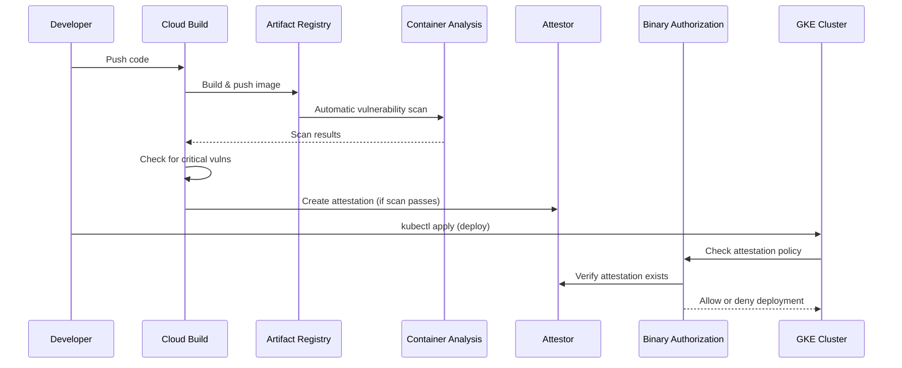

# How to Set Up Container Vulnerability Scanning in Artifact Registry with Binary Authorization for GKE Deployments

Author: [nawazdhandala](https://www.github.com/nawazdhandala)

Tags: GCP, Artifact Registry, Binary Authorization, GKE, Container Security, Google Cloud Platform

Description: Set up container vulnerability scanning in Artifact Registry combined with Binary Authorization to ensure only scanned and approved container images can be deployed to GKE clusters.

---

Pushing a container image to a registry and deploying it to Kubernetes should not be a free-for-all. Without guardrails, anyone with push access can deploy an image packed with known vulnerabilities, or worse, a compromised image that was never scanned at all.

Binary Authorization solves this by enforcing a policy: only images that have been scanned and signed by trusted authorities can be deployed to your GKE cluster. Combined with Artifact Registry's vulnerability scanning, you get a supply chain where every container is checked before it reaches production.

Here is how to set it all up.

## How It Works



## Step 1: Enable Required APIs

```bash
# Enable all required APIs
gcloud services enable \
  artifactregistry.googleapis.com \
  containeranalysis.googleapis.com \
  containerscanning.googleapis.com \
  binaryauthorization.googleapis.com \
  container.googleapis.com \
  cloudkms.googleapis.com \
  --project=my-project
```

Or with Terraform:

```hcl
# apis.tf - Enable required APIs

locals {
  required_apis = [
    "artifactregistry.googleapis.com",
    "containeranalysis.googleapis.com",
    "containerscanning.googleapis.com",
    "binaryauthorization.googleapis.com",
    "container.googleapis.com",
    "cloudkms.googleapis.com",
  ]
}

resource "google_project_service" "apis" {
  for_each = toset(local.required_apis)
  project  = var.project_id
  service  = each.value

  disable_dependent_services = false
  disable_on_destroy         = false
}
```

## Step 2: Create the Artifact Registry Repository

```hcl
# registry.tf - Docker repository with scanning enabled

resource "google_artifact_registry_repository" "apps" {
  project       = var.project_id
  location      = var.region
  repository_id = "apps"
  format        = "DOCKER"
  description   = "Application container images with vulnerability scanning"

  docker_config {
    immutable_tags = true
  }
}
```

Vulnerability scanning is enabled automatically when you enable the Container Scanning API. Every image pushed to any Artifact Registry repository in the project is scanned.

## Step 3: Create a KMS Key for Attestation Signing

Binary Authorization uses cryptographic attestations. An attestor signs images that pass your criteria, and the GKE admission controller verifies those signatures:

```hcl
# kms.tf - KMS key for signing attestations

resource "google_kms_key_ring" "attestor" {
  project  = var.project_id
  name     = "attestor-key-ring"
  location = var.region
}

resource "google_kms_crypto_key" "attestor" {
  name     = "attestor-key"
  key_ring = google_kms_key_ring.attestor.id
  purpose  = "ASYMMETRIC_SIGN"

  version_template {
    algorithm = "EC_SIGN_P256_SHA256"
  }
}

# Get the key version for use in the attestor
data "google_kms_crypto_key_version" "attestor" {
  crypto_key = google_kms_crypto_key.attestor.id
}
```

## Step 4: Create the Container Analysis Note and Attestor

A note is a Container Analysis resource that the attestor references. The attestor is the entity that signs images:

```hcl
# attestor.tf - Container Analysis note and Binary Authorization attestor

# The note is a Container Analysis resource that represents the attestor
resource "google_container_analysis_note" "vuln_scan" {
  project = var.project_id
  name    = "vulnerability-scan-attestor"

  attestation_authority {
    hint {
      human_readable_name = "Vulnerability Scan Passed"
    }
  }
}

# The attestor references the note and the signing key
resource "google_binary_authorization_attestor" "vuln_scan" {
  project = var.project_id
  name    = "vulnerability-scan-attestor"

  attestation_authority_note {
    note_reference = google_container_analysis_note.vuln_scan.name

    public_keys {
      id = data.google_kms_crypto_key_version.attestor.id

      pkix_public_key {
        public_key_pem      = data.google_kms_crypto_key_version.attestor.public_key[0].pem
        signature_algorithm = data.google_kms_crypto_key_version.attestor.public_key[0].algorithm
      }
    }
  }
}
```

## Step 5: Configure the Binary Authorization Policy

The policy defines what attestations are required for deployment:

```hcl
# policy.tf - Binary Authorization policy for GKE

resource "google_binary_authorization_policy" "policy" {
  project = var.project_id

  # Default rule - require attestation for all images
  default_admission_rule {
    evaluation_mode  = "REQUIRE_ATTESTATION"
    enforcement_mode = "ENFORCED_BLOCK_AND_AUDIT_LOG"

    require_attestations_by = [
      google_binary_authorization_attestor.vuln_scan.name
    ]
  }

  # Allow GKE system images without attestation
  # These are Google-managed and already trusted
  admission_whitelist_patterns {
    name_pattern = "gcr.io/google-containers/*"
  }

  admission_whitelist_patterns {
    name_pattern = "gke.gcr.io/*"
  }

  admission_whitelist_patterns {
    name_pattern = "gcr.io/gke-release/*"
  }

  admission_whitelist_patterns {
    name_pattern = "registry.k8s.io/*"
  }

  # Allow Artifact Registry images from your project
  # (they still need attestation - this just prevents 404 errors on the registry)
  admission_whitelist_patterns {
    name_pattern = "${var.region}-docker.pkg.dev/${var.project_id}/*"
  }

  # Cluster-specific overrides (optional)
  # For example, allow any image in the dev cluster
  cluster_admission_rules {
    cluster                 = "${var.region}.dev-cluster"
    evaluation_mode         = "ALWAYS_ALLOW"
    enforcement_mode        = "DRYRUN_AUDIT_LOG_ONLY"
  }
}
```

## Step 6: Enable Binary Authorization on GKE

```hcl
# gke.tf - GKE cluster with Binary Authorization enabled

resource "google_container_cluster" "production" {
  project  = var.project_id
  name     = "production"
  location = var.region

  # Enable Binary Authorization
  binary_authorization {
    evaluation_mode = "PROJECT_SINGLETON_POLICY_ENFORCE"
  }

  # ... other cluster configuration ...
}
```

## Step 7: Build Pipeline with Scanning and Attestation

The Cloud Build pipeline that ties everything together:

```yaml
# cloudbuild.yaml - Build, scan, attest, and deploy

steps:
  # Build the container image
  - name: 'gcr.io/cloud-builders/docker'
    id: 'build'
    args:
      - 'build'
      - '-t'
      - '${_REGION}-docker.pkg.dev/$PROJECT_ID/${_REPO}/${_IMAGE}:$SHORT_SHA'
      - '.'

  # Push the image to Artifact Registry
  - name: 'gcr.io/cloud-builders/docker'
    id: 'push'
    args:
      - 'push'
      - '${_REGION}-docker.pkg.dev/$PROJECT_ID/${_REPO}/${_IMAGE}:$SHORT_SHA'

  # Wait for vulnerability scanning to complete and check results
  - name: 'gcr.io/cloud-builders/gcloud'
    id: 'scan-check'
    entrypoint: bash
    args:
      - '-c'
      - |
        set -e
        IMAGE_URL="${_REGION}-docker.pkg.dev/$PROJECT_ID/${_REPO}/${_IMAGE}:$SHORT_SHA"

        # Get the image digest
        DIGEST=$(gcloud artifacts docker images describe $IMAGE_URL \
          --format="value(image_summary.digest)")

        IMAGE_WITH_DIGEST="${_REGION}-docker.pkg.dev/$PROJECT_ID/${_REPO}/${_IMAGE}@$DIGEST"

        echo "Waiting for vulnerability scan to complete..."
        for i in $(seq 1 30); do
          SCAN_STATUS=$(gcloud artifacts docker images describe $IMAGE_URL \
            --show-package-vulnerability \
            --format="value(package_vulnerability_summary.discovery_summary.discovery[0].analysisStatus)" 2>/dev/null || echo "NOT_READY")

          if [ "$SCAN_STATUS" = "FINISHED_SUCCESS" ]; then
            echo "Scan completed"
            break
          fi
          echo "Scan status: $SCAN_STATUS. Waiting 10s..."
          sleep 10
        done

        # Check for critical vulnerabilities
        CRITICAL_COUNT=$(gcloud artifacts docker images list-vulnerabilities $IMAGE_WITH_DIGEST \
          --format="value(vulnerability.effectiveSeverity)" 2>/dev/null | \
          grep -c "CRITICAL" || true)

        HIGH_COUNT=$(gcloud artifacts docker images list-vulnerabilities $IMAGE_WITH_DIGEST \
          --format="value(vulnerability.effectiveSeverity)" 2>/dev/null | \
          grep -c "HIGH" || true)

        echo "Critical vulnerabilities: $CRITICAL_COUNT"
        echo "High vulnerabilities: $HIGH_COUNT"

        if [ "$CRITICAL_COUNT" -gt "0" ]; then
          echo "FAILED: Critical vulnerabilities found. Blocking deployment."
          exit 1
        fi

        if [ "$HIGH_COUNT" -gt "${_MAX_HIGH_VULNS}" ]; then
          echo "FAILED: Too many high severity vulnerabilities ($HIGH_COUNT > ${_MAX_HIGH_VULNS})"
          exit 1
        fi

        echo "Vulnerability scan passed"
        echo $IMAGE_WITH_DIGEST > /workspace/image_digest.txt

  # Create attestation for images that pass the scan
  - name: 'gcr.io/cloud-builders/gcloud'
    id: 'attest'
    entrypoint: bash
    args:
      - '-c'
      - |
        IMAGE_WITH_DIGEST=$(cat /workspace/image_digest.txt)

        gcloud beta container binauthz attestations sign-and-create \
          --artifact-url="$IMAGE_WITH_DIGEST" \
          --attestor="vulnerability-scan-attestor" \
          --attestor-project="$PROJECT_ID" \
          --keyversion="${_KEY_VERSION}"

        echo "Attestation created for $IMAGE_WITH_DIGEST"

  # Deploy to GKE (only runs if scan passed and attestation succeeded)
  - name: 'gcr.io/cloud-builders/kubectl'
    id: 'deploy'
    args:
      - 'set'
      - 'image'
      - 'deployment/${_IMAGE}'
      - '${_IMAGE}=${_REGION}-docker.pkg.dev/$PROJECT_ID/${_REPO}/${_IMAGE}:$SHORT_SHA'
    env:
      - 'CLOUDSDK_COMPUTE_REGION=${_REGION}'
      - 'CLOUDSDK_CONTAINER_CLUSTER=production'

substitutions:
  _REGION: us-central1
  _REPO: apps
  _IMAGE: my-app
  _MAX_HIGH_VULNS: '5'
  _KEY_VERSION: 'projects/my-project/locations/us-central1/keyRings/attestor-key-ring/cryptoKeys/attestor-key/cryptoKeyVersions/1'
```

## Step 8: Testing the Policy

Verify that Binary Authorization blocks unsigned images:

```bash
# Try to deploy an image without attestation - should be blocked
kubectl run test-blocked \
  --image=us-central1-docker.pkg.dev/my-project/apps/unsigned-image:latest

# Expected error:
# Error: admission webhook "imagepolicywebhook.image-policy.k8s.io" denied the request:
# Image us-central1-docker.pkg.dev/my-project/apps/unsigned-image:latest
# denied by attestor projects/my-project/attestors/vulnerability-scan-attestor

# Deploy an attested image - should succeed
kubectl run test-allowed \
  --image=us-central1-docker.pkg.dev/my-project/apps/my-app@sha256:abc123
```

## IAM Configuration

```hcl
# iam.tf - Service account for Cloud Build attestation

resource "google_service_account" "cloud_build" {
  project      = var.project_id
  account_id   = "cloud-build-attestor"
  display_name = "Cloud Build Attestor"
}

# Permission to create attestations
resource "google_binary_authorization_attestor_iam_member" "build_attestor" {
  project  = var.project_id
  attestor = google_binary_authorization_attestor.vuln_scan.name
  role     = "roles/binaryauthorization.attestorsVerifier"
  member   = "serviceAccount:${google_service_account.cloud_build.email}"
}

# Permission to add Container Analysis occurrences (attestations)
resource "google_container_analysis_note_iam_member" "build_note" {
  project = var.project_id
  note    = google_container_analysis_note.vuln_scan.name
  role    = "roles/containeranalysis.notes.attacher"
  member  = "serviceAccount:${google_service_account.cloud_build.email}"
}

# Permission to use the KMS signing key
resource "google_kms_crypto_key_iam_member" "build_signer" {
  crypto_key_id = google_kms_crypto_key.attestor.id
  role          = "roles/cloudkms.signerVerifier"
  member        = "serviceAccount:${google_service_account.cloud_build.email}"
}
```

## Monitoring

Track policy enforcement in Cloud Logging:

```bash
# View Binary Authorization enforcement events
gcloud logging read \
  "resource.type=k8s_cluster AND protoPayload.methodName=io.k8s.core.v1.pods.create AND protoPayload.response.status.conditions.type=BinaryAuthorization" \
  --project=my-project \
  --limit=20
```

## Summary

This setup creates a container supply chain where images are automatically scanned for vulnerabilities when pushed to Artifact Registry, only images that pass the scan receive a cryptographic attestation, and GKE enforces that only attested images can be deployed. The result is that a container with critical vulnerabilities cannot reach your production cluster - the build pipeline blocks it, and even if someone tries to bypass the pipeline, the GKE admission controller rejects the unsigned image. It is defense in depth for your container supply chain.
