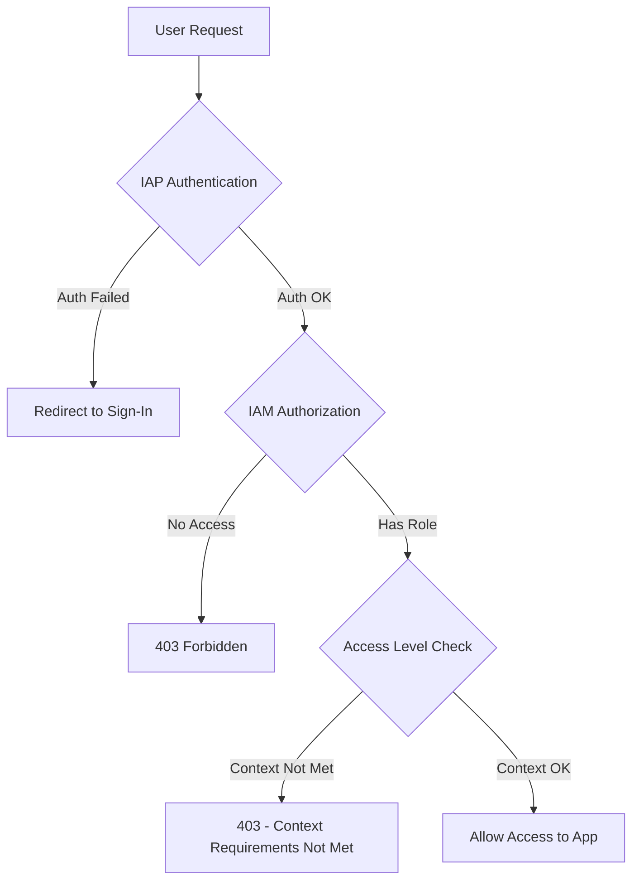

# How to Set Up Context-Aware Access Policies with IAP for Zero-Trust Security in GCP

Author: [nawazdhandala](https://www.github.com/nawazdhandala)

Tags: GCP, IAP, Zero Trust, Context-Aware Access, BeyondCorp, Security

Description: Learn how to implement zero-trust security using Identity-Aware Proxy with context-aware access policies in GCP, including IP-based, device-based, and custom access levels.

---

Traditional security assumes that once you are inside the corporate network, you can be trusted. Zero-trust security assumes the opposite - no request is trusted by default, regardless of where it comes from. Google Cloud's Identity-Aware Proxy combined with Access Context Manager lets you build exactly this model.

Instead of just checking "is this user authorized?", you can also check "is this user on a managed device?", "are they on a corporate network?", "is their OS up to date?" These contextual signals, combined with identity, give you fine-grained access control that goes well beyond simple user authentication.

## How Context-Aware Access Works with IAP

When a user accesses an IAP-protected application, IAP evaluates two things:

1. **Identity**: Is the user who they claim to be, and do they have the right IAM role?
2. **Context**: Does the request meet the access level requirements (IP range, device posture, etc.)?

Both must pass for the request to be allowed.



## Prerequisites

- An IAP-protected application (web app behind a load balancer)
- Access Context Manager API enabled
- An organization-level access policy (or permissions to create one)

```bash
# Enable the Access Context Manager API
gcloud services enable accesscontextmanager.googleapis.com \
    --project=my-project-id
```

## Step 1: Create an Access Policy

Access policies are organization-level resources. You need the Access Context Manager Admin role at the org level.

```bash
# Check if an access policy already exists for your organization
gcloud access-context-manager policies list \
    --organization=ORG_ID
```

If no policy exists, create one.

```bash
# Create an organization-level access policy
gcloud access-context-manager policies create \
    --organization=ORG_ID \
    --title="My Organization Access Policy"
```

Note the policy ID returned - you will use it for creating access levels.

## Step 2: Create Access Levels

Access levels define the contextual conditions that must be met. Here are several common patterns.

### IP-Based Access Level (Corporate Network Only)

Restrict access to requests coming from your corporate network IP ranges.

```bash
# Create an access level that requires corporate IP addresses
gcloud access-context-manager levels create corporate-network \
    --policy=POLICY_ID \
    --title="Corporate Network" \
    --basic-level-spec=corp-network-spec.yaml
```

Create the spec file first.

```yaml
# corp-network-spec.yaml
# Requires the request to originate from one of these IP ranges
conditions:
  - ipSubnetworks:
      - "203.0.113.0/24"
      - "198.51.100.0/24"
```

### Device Policy Access Level

Require that users access the application from a managed device with specific security properties.

```yaml
# managed-device-spec.yaml
# Requires a managed device with disk encryption and screen lock
conditions:
  - devicePolicy:
      requireScreenlock: true
      requireAdminApproval: true
      allowedEncryptionStatuses:
        - ENCRYPTED
      allowedDeviceManagementLevels:
        - BASIC
        - COMPLETE
      osConstraints:
        - osType: DESKTOP_CHROME_OS
        - osType: DESKTOP_MAC
          minimumVersion: "12.0.0"
        - osType: DESKTOP_WINDOWS
          minimumVersion: "10.0.0"
```

```bash
# Create the device-based access level
gcloud access-context-manager levels create managed-devices \
    --policy=POLICY_ID \
    --title="Managed Devices Only" \
    --basic-level-spec=managed-device-spec.yaml
```

### Combining Conditions (AND Logic)

When you put multiple conditions in a single access level, they use OR logic (any condition can be met). To require ALL conditions, list them in a single condition block.

```yaml
# strict-access-spec.yaml
# Requires BOTH corporate network AND managed device
conditions:
  - ipSubnetworks:
      - "203.0.113.0/24"
    devicePolicy:
      requireScreenlock: true
      allowedEncryptionStatuses:
        - ENCRYPTED
```

```bash
# Create a strict access level that combines requirements
gcloud access-context-manager levels create strict-access \
    --policy=POLICY_ID \
    --title="Strict Access - Corp Network and Managed Device" \
    --basic-level-spec=strict-access-spec.yaml
```

### Access Level with Dependent Levels

You can reference other access levels as dependencies. This lets you build composable policies.

```yaml
# high-security-spec.yaml
# Requires the managed-devices access level AND the corporate network
conditions:
  - requiredAccessLevels:
      - accessPolicies/POLICY_ID/accessLevels/managed-devices
      - accessPolicies/POLICY_ID/accessLevels/corporate-network
```

## Step 3: Bind Access Levels to IAP Resources

Now connect your access levels to IAP-protected backend services using IAM conditions.

```bash
# Bind an IAM role with an access level condition
gcloud iap web add-iam-policy-binding \
    --resource-type=backend-services \
    --service=my-backend-service \
    --member="group:engineering@company.com" \
    --role="roles/iap.httpsResourceAccessor" \
    --condition="expression=accessPolicies/POLICY_ID/accessLevels/corporate-network in request.auth.access_levels,title=require-corp-network,description=Requires corporate network" \
    --project=my-project-id
```

The key is the IAM condition expression. It checks if the user's request context satisfies the specified access level.

For multiple access levels (all must be satisfied):

```bash
# Require both corporate network AND managed device
gcloud iap web add-iam-policy-binding \
    --resource-type=backend-services \
    --service=my-secure-app \
    --member="group:engineering@company.com" \
    --role="roles/iap.httpsResourceAccessor" \
    --condition="expression=accessPolicies/POLICY_ID/accessLevels/corporate-network in request.auth.access_levels && accessPolicies/POLICY_ID/accessLevels/managed-devices in request.auth.access_levels,title=require-corp-and-device,description=Requires corp network and managed device" \
    --project=my-project-id
```

## Step 4: Test the Configuration

Test with different contexts to make sure the policies work correctly.

From a corporate network IP:

```bash
# This should succeed if your IP is in the allowed range
curl -H "Authorization: Bearer $(gcloud auth print-identity-token)" \
    https://my-app.company.com/
```

From a non-corporate IP (like a home network), the request should fail with a 403 even if the user is authorized.

## Terraform Configuration

Here is the complete Terraform setup for context-aware access with IAP.

```hcl
# Create an access level for corporate networks
resource "google_access_context_manager_access_level" "corp_network" {
  parent = "accessPolicies/${var.access_policy_id}"
  name   = "accessPolicies/${var.access_policy_id}/accessLevels/corporate_network"
  title  = "Corporate Network"

  basic {
    conditions {
      ip_subnetworks = [
        "203.0.113.0/24",
        "198.51.100.0/24",
      ]
    }
  }
}

# Create an access level for managed devices
resource "google_access_context_manager_access_level" "managed_devices" {
  parent = "accessPolicies/${var.access_policy_id}"
  name   = "accessPolicies/${var.access_policy_id}/accessLevels/managed_devices"
  title  = "Managed Devices"

  basic {
    conditions {
      device_policy {
        require_screen_lock    = true
        require_admin_approval = true
        allowed_encryption_statuses = ["ENCRYPTED"]
      }
    }
  }
}

# Bind IAP access with context-aware conditions
resource "google_iap_web_backend_service_iam_member" "context_aware_access" {
  project             = var.project_id
  web_backend_service = google_compute_backend_service.app.name
  role                = "roles/iap.httpsResourceAccessor"
  member              = "group:engineering@company.com"

  condition {
    title       = "require-corp-network"
    description = "Access only from corporate network"
    expression  = "\"accessPolicies/${var.access_policy_id}/accessLevels/corporate_network\" in request.auth.access_levels"
  }
}
```

## Endpoint Verification for Device Posture

For device policy access levels to work, users need the Endpoint Verification Chrome extension installed on their devices. This extension collects device attributes and reports them to Google.

1. Deploy the Endpoint Verification extension through your MDM or Chrome Enterprise
2. Ensure the extension is active and signed in with the user's corporate Google account
3. Device attributes are updated every few hours

Without Endpoint Verification, device policy conditions will not evaluate properly, and users may be denied access even on compliant devices.

## Common Issues

**Access denied even from corporate IP**: Check that the IP ranges in your access level spec are correct. Also check if the user is behind a proxy that changes their source IP.

**Device policy not evaluating**: Endpoint Verification needs to be installed and active. Verify it is running by checking the admin console under Devices.

**"Access level not found" error**: The access level name in the IAM condition must match exactly, including the full path `accessPolicies/POLICY_ID/accessLevels/LEVEL_NAME`.

**Policy changes not taking effect**: Access level evaluations are cached briefly. Wait a few minutes after making changes.

## Monitoring Context-Aware Access

Use Cloud Audit Logs to see which access levels were evaluated and whether they passed or failed.

```bash
# Check IAP access decisions in the audit log
gcloud logging read \
    'resource.type="iap_web" AND protoPayload.methodName="AuthorizeUser"' \
    --limit=20 \
    --project=my-project-id
```

## Summary

Context-aware access with IAP brings zero-trust principles to your GCP applications. Instead of relying only on user identity, you layer in contextual signals like network location and device posture. Create access levels in Access Context Manager, bind them to IAP resources through IAM conditions, and enforce policies without changing your application code. The combination of identity, device trust, and network context gives you a security model that is far stronger than any single factor alone.
