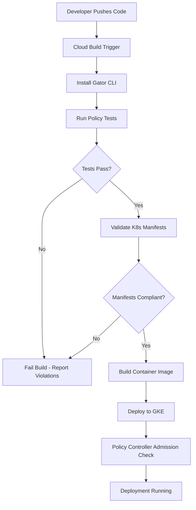

# How to Set Up Continuous Compliance Validation in GCP CI/CD Pipelines Using Policy Controller

Author: [nawazdhandala](https://www.github.com/nawazdhandala)

Tags: GCP, Policy Controller, CI/CD, Compliance, GKE, DevSecOps, Cloud Build

Description: A practical guide to integrating Policy Controller into your GCP CI/CD pipelines for continuous compliance validation of Kubernetes resources before they reach production.

---

Shipping fast is great until an audit reveals that half your Kubernetes deployments are running as root or exposing sensitive ports. Policy Controller, built on Open Policy Agent (OPA) Gatekeeper, lets you enforce compliance policies as part of your CI/CD pipeline so these issues get caught before they ever reach a cluster. In this post, I will show you how to integrate Policy Controller into Cloud Build pipelines for continuous compliance validation.

## What Policy Controller Actually Does

Policy Controller is the managed version of OPA Gatekeeper that comes with GKE Enterprise (formerly Anthos). It evaluates Kubernetes resources against a set of constraint templates and constraints, rejecting anything that violates your policies. But instead of only enforcing at admission time (when resources are applied to the cluster), you can shift this left and validate manifests during the build phase.

This means developers get feedback on policy violations in their pull requests, not after deployment.

## Setting Up Policy Controller on Your GKE Cluster

First, enable Policy Controller on your GKE cluster if you have not already:

```bash
# Enable Policy Controller on an existing GKE cluster
gcloud container fleet policycontroller enable \
  --memberships=my-gke-cluster \
  --project=my-project-id

# Verify it is running
kubectl get pods -n gatekeeper-system
```

Policy Controller ships with a library of pre-built constraint templates. You can install the full template library:

```bash
# Install the constraint template library
gcloud container fleet policycontroller content templates apply \
  --memberships=my-gke-cluster
```

## Defining Compliance Constraints

Constraints are where you specify the actual rules. Here are a few common ones that most organizations need.

This constraint prevents containers from running as root:

```yaml
# no-root-containers.yaml
# Prevents any container from running with root privileges
apiVersion: constraints.gatekeeper.sh/v1beta1
kind: K8sPSPAllowedUsers
metadata:
  name: no-root-containers
spec:
  enforcementAction: deny
  match:
    kinds:
      - apiGroups: [""]
        kinds: ["Pod"]
      - apiGroups: ["apps"]
        kinds: ["Deployment", "StatefulSet", "DaemonSet"]
  parameters:
    runAsUser:
      rule: MustRunAsNonRoot
```

This constraint requires resource limits on all containers:

```yaml
# require-resource-limits.yaml
# Ensures every container specifies CPU and memory limits
apiVersion: constraints.gatekeeper.sh/v1beta1
kind: K8sContainerLimits
metadata:
  name: require-resource-limits
spec:
  enforcementAction: deny
  match:
    kinds:
      - apiGroups: [""]
        kinds: ["Pod"]
      - apiGroups: ["apps"]
        kinds: ["Deployment", "StatefulSet"]
  parameters:
    cpu: "2"
    memory: "4Gi"
```

This one restricts which container registries are allowed:

```yaml
# allowed-registries.yaml
# Only allows images from approved container registries
apiVersion: constraints.gatekeeper.sh/v1beta1
kind: K8sAllowedRepos
metadata:
  name: allowed-registries
spec:
  enforcementAction: deny
  match:
    kinds:
      - apiGroups: [""]
        kinds: ["Pod"]
      - apiGroups: ["apps"]
        kinds: ["Deployment", "StatefulSet", "DaemonSet"]
  parameters:
    repos:
      - "gcr.io/my-project-id/"
      - "us-docker.pkg.dev/my-project-id/"
```

## Shift-Left Validation with Gator CLI

The real power comes from running these checks in your CI/CD pipeline before anything touches the cluster. The `gator` CLI tool lets you evaluate manifests against constraints locally.

Here is a Cloud Build step that uses gator to validate Kubernetes manifests:

```yaml
# cloudbuild.yaml - CI/CD pipeline with policy validation
steps:
  # Step 1: Download and install the gator CLI
  - name: 'gcr.io/cloud-builders/gcloud'
    entrypoint: 'bash'
    args:
      - '-c'
      - |
        # Download gator binary for constraint validation
        curl -L https://github.com/open-policy-agent/gatekeeper/releases/download/v3.14.0/gator-v3.14.0-linux-amd64.tar.gz \
          | tar xz -C /workspace/bin/
        chmod +x /workspace/bin/gator
    id: 'install-gator'

  # Step 2: Validate all Kubernetes manifests against policy constraints
  - name: 'gcr.io/cloud-builders/gcloud'
    entrypoint: 'bash'
    args:
      - '-c'
      - |
        # Run gator test against all manifests in the k8s directory
        /workspace/bin/gator verify \
          --filename=policies/ \
          --filename=k8s/

        # Also run gator test for individual constraint evaluation
        /workspace/bin/gator test \
          --filename=policies/constraints/ \
          --filename=policies/templates/ \
          --filename=k8s/
    waitFor: ['install-gator']
    id: 'validate-policies'

  # Step 3: Only proceed with deployment if validation passes
  - name: 'gcr.io/cloud-builders/gke-deploy'
    args:
      - 'run'
      - '--filename=k8s/'
      - '--cluster=my-gke-cluster'
      - '--location=us-central1'
    waitFor: ['validate-policies']
    id: 'deploy'
```

## Organizing Your Policy Repository

A clean directory structure makes policies easier to manage and review:

```
project-root/
  policies/
    templates/          # Constraint templates (the schema)
      container-limits.yaml
      allowed-repos.yaml
      psp-allowed-users.yaml
    constraints/        # Constraint instances (the rules)
      require-resource-limits.yaml
      allowed-registries.yaml
      no-root-containers.yaml
    tests/              # Test cases for policy validation
      allowed-deployment.yaml
      violation-deployment.yaml
  k8s/
    deployment.yaml
    service.yaml
    ingress.yaml
```

## Writing Policy Tests

Gator supports a test framework that lets you verify your constraints work correctly. Define test cases that should pass and fail:

```yaml
# policies/tests/suite.yaml
# Test suite definition for policy validation
apiVersion: test.gatekeeper.sh/v1alpha1
kind: Suite
metadata:
  name: policy-tests
tests:
  - name: "containers must not run as root"
    template: templates/psp-allowed-users.yaml
    constraint: constraints/no-root-containers.yaml
    cases:
      - name: "non-root container should pass"
        object: tests/valid-nonroot-pod.yaml
        assertions:
          - violations: "no"
      - name: "root container should fail"
        object: tests/invalid-root-pod.yaml
        assertions:
          - violations: "yes"
```

A valid test case:

```yaml
# policies/tests/valid-nonroot-pod.yaml
# This pod should pass validation - runs as non-root user
apiVersion: v1
kind: Pod
metadata:
  name: valid-pod
spec:
  containers:
    - name: app
      image: gcr.io/my-project-id/myapp:latest
      securityContext:
        runAsNonRoot: true
        runAsUser: 1000
      resources:
        limits:
          cpu: "500m"
          memory: "512Mi"
```

## Integrating with Pull Request Checks

You can configure Cloud Build to run policy validation on every pull request and post the results as a GitHub check:

```yaml
# cloudbuild-pr.yaml - Triggered on pull requests
steps:
  - name: 'gcr.io/cloud-builders/gcloud'
    entrypoint: 'bash'
    args:
      - '-c'
      - |
        # Install gator
        curl -L https://github.com/open-policy-agent/gatekeeper/releases/download/v3.14.0/gator-v3.14.0-linux-amd64.tar.gz \
          | tar xz -C /workspace/bin/

        # Run validation and capture output
        /workspace/bin/gator test \
          --filename=policies/constraints/ \
          --filename=policies/templates/ \
          --filename=k8s/ 2>&1 | tee /workspace/policy-results.txt

        # Exit with the gator exit code
        exit ${PIPESTATUS[0]}
    id: 'policy-check'
```

## Custom Constraint Templates

Sometimes the built-in templates are not enough. Here is how to create a custom constraint template that requires specific labels on all deployments:

```yaml
# policies/templates/required-labels.yaml
# Custom template that checks for mandatory labels
apiVersion: templates.gatekeeper.sh/v1
kind: ConstraintTemplate
metadata:
  name: k8srequiredlabels
spec:
  crd:
    spec:
      names:
        kind: K8sRequiredLabels
      validation:
        openAPIV3Schema:
          type: object
          properties:
            labels:
              type: array
              items:
                type: string
  targets:
    - target: admission.k8s.gatekeeper.sh
      rego: |
        package k8srequiredlabels

        # Check that all required labels are present
        violation[{"msg": msg}] {
          provided := {label | input.review.object.metadata.labels[label]}
          required := {label | label := input.parameters.labels[_]}
          missing := required - provided
          count(missing) > 0
          msg := sprintf("Missing required labels: %v", [missing])
        }
```

And the corresponding constraint:

```yaml
# policies/constraints/require-team-labels.yaml
# Requires team and environment labels on all Deployments
apiVersion: constraints.gatekeeper.sh/v1beta1
kind: K8sRequiredLabels
metadata:
  name: require-team-labels
spec:
  enforcementAction: deny
  match:
    kinds:
      - apiGroups: ["apps"]
        kinds: ["Deployment"]
  parameters:
    labels:
      - "team"
      - "environment"
      - "cost-center"
```

## The Validation Pipeline Flow

Here is how the complete compliance validation pipeline works:



## Audit Mode vs Enforcement

When first rolling out policies, start with audit mode to see what would be blocked without actually blocking it:

```yaml
# Start in audit mode to see violations without blocking
spec:
  enforcementAction: dryrun  # Change to 'deny' when ready to enforce
```

Check audit results with:

```bash
# View all policy violations across the cluster
kubectl get constraints -o json | \
  jq '.items[].status.violations'
```

This gives you a clear picture of your current compliance posture before flipping the switch to enforcement.

## Practical Tips

From running this in production, here are things I wish I knew earlier:

1. Version your constraint templates alongside your application code. Policies are code and should go through the same review process.

2. Start with a small set of critical policies and expand gradually. Dropping 50 constraints on a team at once will create frustration and pressure to disable enforcement.

3. Use the `dryrun` enforcement action in production initially to catch any edge cases your testing missed.

4. Create exception mechanisms using namespace selectors. Some system workloads legitimately need root access or other elevated permissions.

5. Run gator tests in parallel with your unit tests so developers get fast feedback.

Continuous compliance validation turns security from a gate at the end of the process into a guardrail that guides development. Teams can move fast because they know their deployments will meet organizational standards before they even reach the cluster.
