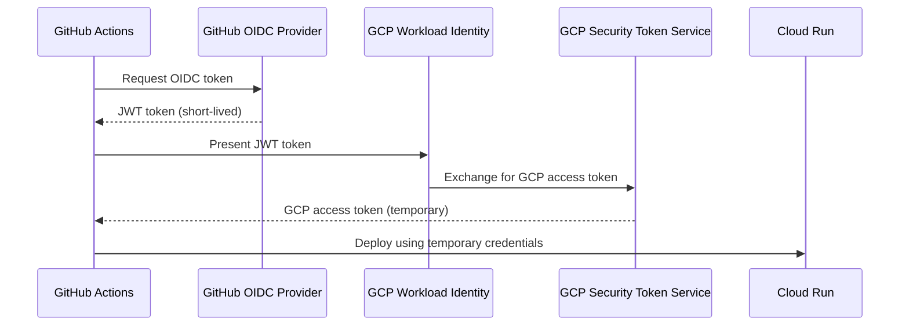

# How to Set Up Continuous Deployment to Cloud Run Using GitHub Actions and Workload Identity Federation

Author: [nawazdhandala](https://www.github.com/nawazdhandala)

Tags: GCP, Cloud Run, GitHub Actions, Workload Identity Federation, CI/CD, Google Cloud

Description: Learn how to set up continuous deployment from GitHub Actions to Cloud Run using Workload Identity Federation instead of service account keys.

---

Most guides for deploying to GCP from GitHub Actions tell you to create a service account key, store it as a GitHub secret, and use it to authenticate. That works, but service account keys are long-lived credentials that can be leaked, are hard to rotate, and create security risks.

Workload Identity Federation is the better approach. It lets GitHub Actions authenticate to GCP without any stored credentials. GitHub's OIDC provider issues a short-lived token, GCP verifies it, and your workflow gets temporary access. No keys to manage, no secrets to rotate.

This guide sets up the full pipeline: Workload Identity Federation for authentication, a GitHub Actions workflow that builds and deploys, and the IAM permissions to make it all work.

## How Workload Identity Federation Works

The flow looks like this:



GitHub Actions requests an OIDC token from GitHub's identity provider. It presents that token to GCP's Workload Identity Federation, which verifies the token is from your repository and exchanges it for a temporary GCP access token. That access token has the same permissions as a service account but expires quickly.

## Prerequisites

You need:

- A GCP project with billing enabled
- A GitHub repository with your application code
- Owner or Editor role on the GCP project
- gcloud CLI installed

Enable the required APIs:

```bash
# Enable all required APIs
gcloud services enable \
  iam.googleapis.com \
  iamcredentials.googleapis.com \
  cloudresourcemanager.googleapis.com \
  run.googleapis.com \
  artifactregistry.googleapis.com \
  cloudbuild.googleapis.com
```

## Step 1: Create a Service Account for Deployments

This service account is what GitHub Actions will impersonate. It needs permissions to build images and deploy to Cloud Run:

```bash
# Create the deployment service account
gcloud iam service-accounts create github-deployer \
  --display-name="GitHub Actions Deployer" \
  --description="Used by GitHub Actions to deploy to Cloud Run"

# Store the full email for later use
SA_EMAIL="github-deployer@$(gcloud config get-value project).iam.gserviceaccount.com"

# Grant Cloud Run Admin role
gcloud projects add-iam-policy-binding $(gcloud config get-value project) \
  --member="serviceAccount:${SA_EMAIL}" \
  --role="roles/run.admin"

# Grant Artifact Registry Writer role
gcloud projects add-iam-policy-binding $(gcloud config get-value project) \
  --member="serviceAccount:${SA_EMAIL}" \
  --role="roles/artifactregistry.writer"

# Grant Service Account User role (needed to deploy Cloud Run services)
gcloud projects add-iam-policy-binding $(gcloud config get-value project) \
  --member="serviceAccount:${SA_EMAIL}" \
  --role="roles/iam.serviceAccountUser"

# Grant Cloud Build Editor role (if using Cloud Build)
gcloud projects add-iam-policy-binding $(gcloud config get-value project) \
  --member="serviceAccount:${SA_EMAIL}" \
  --role="roles/cloudbuild.builds.editor"
```

## Step 2: Create a Workload Identity Pool

The Workload Identity Pool is a container for external identity providers:

```bash
# Create the Workload Identity Pool
gcloud iam workload-identity-pools create github-pool \
  --location="global" \
  --display-name="GitHub Actions Pool" \
  --description="Pool for GitHub Actions OIDC authentication"
```

## Step 3: Create a Workload Identity Provider

The provider configures how GCP verifies tokens from GitHub:

```bash
# Create the OIDC provider for GitHub
gcloud iam workload-identity-pools providers create-oidc github-provider \
  --location="global" \
  --workload-identity-pool="github-pool" \
  --display-name="GitHub OIDC Provider" \
  --issuer-uri="https://token.actions.githubusercontent.com" \
  --attribute-mapping="google.subject=assertion.sub,attribute.repository=assertion.repository,attribute.actor=assertion.actor" \
  --attribute-condition="assertion.repository=='YOUR_GITHUB_USERNAME/YOUR_REPO_NAME'"
```

The `--attribute-condition` is critical for security. It restricts which GitHub repositories can authenticate. Replace `YOUR_GITHUB_USERNAME/YOUR_REPO_NAME` with your actual repository. Without this, any GitHub repository could authenticate to your GCP project.

## Step 4: Allow the Service Account to Be Impersonated

Connect the Workload Identity Pool to the service account:

```bash
# Get the Workload Identity Pool ID
POOL_ID=$(gcloud iam workload-identity-pools describe github-pool \
  --location="global" \
  --format="value(name)")

# Allow the GitHub provider to impersonate the service account
gcloud iam service-accounts add-iam-policy-binding ${SA_EMAIL} \
  --role="roles/iam.workloadIdentityUser" \
  --member="principalSet://iam.googleapis.com/${POOL_ID}/attribute.repository/YOUR_GITHUB_USERNAME/YOUR_REPO_NAME"
```

## Step 5: Get the Provider Resource Name

You need the full provider resource name for the GitHub Actions workflow:

```bash
# Get the full provider resource name
gcloud iam workload-identity-pools providers describe github-provider \
  --location="global" \
  --workload-identity-pool="github-pool" \
  --format="value(name)"
```

This outputs something like:
```
projects/123456789/locations/global/workloadIdentityPools/github-pool/providers/github-provider
```

Save this value for the next step.

## Step 6: Create the GitHub Actions Workflow

Create `.github/workflows/deploy.yml` in your repository:

```yaml
# .github/workflows/deploy.yml - Deploy to Cloud Run on push to main
name: Deploy to Cloud Run

on:
  push:
    branches:
      - main

# Required for Workload Identity Federation
permissions:
  contents: read
  id-token: write

env:
  PROJECT_ID: your-gcp-project-id
  REGION: us-central1
  SERVICE_NAME: my-app
  REGISTRY: us-central1-docker.pkg.dev
  REPOSITORY: cloud-run-images

jobs:
  deploy:
    runs-on: ubuntu-latest
    steps:
      # Check out the repository code
      - name: Checkout
        uses: actions/checkout@v4

      # Authenticate to GCP using Workload Identity Federation
      - name: Authenticate to Google Cloud
        id: auth
        uses: google-github-actions/auth@v2
        with:
          workload_identity_provider: "projects/123456789/locations/global/workloadIdentityPools/github-pool/providers/github-provider"
          service_account: "github-deployer@your-gcp-project-id.iam.gserviceaccount.com"

      # Set up gcloud CLI
      - name: Set up Cloud SDK
        uses: google-github-actions/setup-gcloud@v2

      # Configure Docker to use gcloud for authentication
      - name: Configure Docker
        run: gcloud auth configure-docker ${{ env.REGISTRY }} --quiet

      # Build the Docker image
      - name: Build
        run: |
          docker build \
            -t ${{ env.REGISTRY }}/${{ env.PROJECT_ID }}/${{ env.REPOSITORY }}/${{ env.SERVICE_NAME }}:${{ github.sha }} \
            -t ${{ env.REGISTRY }}/${{ env.PROJECT_ID }}/${{ env.REPOSITORY }}/${{ env.SERVICE_NAME }}:latest \
            .

      # Push to Artifact Registry
      - name: Push
        run: |
          docker push ${{ env.REGISTRY }}/${{ env.PROJECT_ID }}/${{ env.REPOSITORY }}/${{ env.SERVICE_NAME }}:${{ github.sha }}
          docker push ${{ env.REGISTRY }}/${{ env.PROJECT_ID }}/${{ env.REPOSITORY }}/${{ env.SERVICE_NAME }}:latest

      # Deploy to Cloud Run
      - name: Deploy
        run: |
          gcloud run deploy ${{ env.SERVICE_NAME }} \
            --image=${{ env.REGISTRY }}/${{ env.PROJECT_ID }}/${{ env.REPOSITORY }}/${{ env.SERVICE_NAME }}:${{ github.sha }} \
            --region=${{ env.REGION }} \
            --platform=managed \
            --allow-unauthenticated

      # Output the service URL
      - name: Show URL
        run: |
          echo "Service URL:"
          gcloud run services describe ${{ env.SERVICE_NAME }} \
            --region=${{ env.REGION }} \
            --format="value(status.url)"
```

The key parts here:

- `permissions.id-token: write` allows the workflow to request an OIDC token
- `google-github-actions/auth@v2` handles the Workload Identity Federation exchange
- No service account keys or JSON credentials anywhere

## Step 7: Create the Artifact Registry Repository

If it does not exist yet:

```bash
# Create the Artifact Registry repository
gcloud artifacts repositories create cloud-run-images \
  --repository-format=docker \
  --location=us-central1
```

## Step 8: Test the Pipeline

Push a change to your main branch:

```bash
git add .
git commit -m "Add GitHub Actions deployment workflow"
git push origin main
```

Go to the Actions tab in your GitHub repository to watch the workflow run. You should see it authenticate, build, push, and deploy without any stored credentials.

## Adding Branch Protection and Staging

For a more robust setup, add a staging deployment on pull requests:

```yaml
# .github/workflows/deploy-staging.yml - Deploy to staging on PR
name: Deploy to Staging

on:
  pull_request:
    branches:
      - main

permissions:
  contents: read
  id-token: write
  pull-requests: write

jobs:
  deploy-staging:
    runs-on: ubuntu-latest
    steps:
      - name: Checkout
        uses: actions/checkout@v4

      - name: Authenticate to Google Cloud
        uses: google-github-actions/auth@v2
        with:
          workload_identity_provider: "projects/123456789/locations/global/workloadIdentityPools/github-pool/providers/github-provider"
          service_account: "github-deployer@your-gcp-project-id.iam.gserviceaccount.com"

      - name: Set up Cloud SDK
        uses: google-github-actions/setup-gcloud@v2

      - name: Configure Docker
        run: gcloud auth configure-docker us-central1-docker.pkg.dev --quiet

      - name: Build and Push
        run: |
          docker build -t us-central1-docker.pkg.dev/${{ env.PROJECT_ID }}/cloud-run-images/my-app:pr-${{ github.event.number }} .
          docker push us-central1-docker.pkg.dev/${{ env.PROJECT_ID }}/cloud-run-images/my-app:pr-${{ github.event.number }}

      # Deploy with a revision tag for testing
      - name: Deploy to staging
        run: |
          gcloud run deploy my-app \
            --image=us-central1-docker.pkg.dev/${{ env.PROJECT_ID }}/cloud-run-images/my-app:pr-${{ github.event.number }} \
            --region=us-central1 \
            --tag=pr-${{ github.event.number }} \
            --no-traffic

      - name: Comment PR with preview URL
        uses: actions/github-script@v7
        with:
          script: |
            const url = `https://pr-${{ github.event.number }}---my-app-xxxxx-uc.a.run.app`;
            github.rest.issues.createComment({
              issue_number: context.issue.number,
              owner: context.repo.owner,
              repo: context.repo.repo,
              body: `Preview deployed to: ${url}`
            });

    env:
      PROJECT_ID: your-gcp-project-id
```

## Troubleshooting

**"Unable to retrieve OIDC token"**: Make sure the `permissions.id-token: write` is set in your workflow.

**"Permission denied on service account"**: Verify the attribute condition and member binding. The repository name must match exactly.

**"Artifact Registry permission denied"**: The deployment service account needs `roles/artifactregistry.writer` on the repository.

## Summary

Workload Identity Federation eliminates the need for service account keys in your GitHub Actions workflows. The setup is more involved than just pasting a JSON key, but the security benefits are substantial: no long-lived credentials to leak, no secrets to rotate, and fine-grained control over which repositories can deploy. Once configured, the workflow is straightforward - authenticate, build, push, deploy - and you get a fully automated, keyless deployment pipeline from GitHub to Cloud Run.
