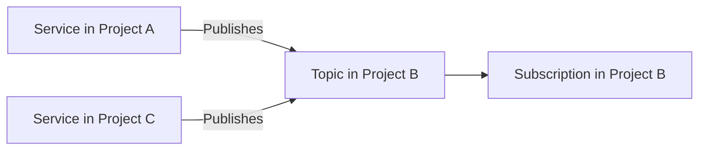
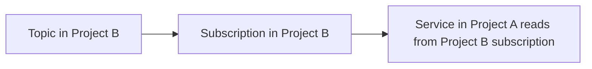

# How to Set Up Cross-Project Pub/Sub Messaging with IAM Permissions

Author: [nawazdhandala](https://www.github.com/nawazdhandala)

Tags: GCP, Pub/Sub, IAM, Cross-Project, Security

Description: Learn how to configure Google Cloud Pub/Sub for cross-project messaging, including IAM permissions for publishers and subscribers in different GCP projects.

---

In most organizations, GCP resources are spread across multiple projects. The data platform team has their project, the application team has theirs, and the analytics team has another. When these teams need to exchange messages through Pub/Sub, they need cross-project access. A publisher in Project A needs to send messages to a topic in Project B, or a subscriber in Project C needs to read from a subscription in Project B.

Pub/Sub supports this natively through IAM permissions. No special configuration is needed on the Pub/Sub side - you just grant the right IAM roles to the right service accounts across projects. Let me walk through the common patterns and how to set them up.

## The Cross-Project Patterns

There are three main patterns for cross-project Pub/Sub:

1. **Cross-project publishing**: A service in Project A publishes to a topic in Project B
2. **Cross-project subscribing**: A service in Project A subscribes to a subscription in Project B
3. **Topic in one project, subscription in another**: The topic and subscription live in different projects

Let us cover each one.

## Pattern 1: Cross-Project Publishing

This is the most common pattern. A microservice running in one project needs to publish events to a central event bus topic in another project.



### Setting Up IAM

The service account running in Project A needs the `roles/pubsub.publisher` role on the topic in Project B:

```bash
# Grant Project A's service account permission to publish to Project B's topic
gcloud pubsub topics add-iam-policy-binding my-topic \
  --project=project-b \
  --member="serviceAccount:my-service@project-a.iam.gserviceaccount.com" \
  --role="roles/pubsub.publisher"
```

In Terraform:

```hcl
# Topic in Project B
resource "google_pubsub_topic" "central_events" {
  project = "project-b"
  name    = "central-events"
}

# Grant publish access to Project A's service account
resource "google_pubsub_topic_iam_member" "project_a_publisher" {
  project = "project-b"
  topic   = google_pubsub_topic.central_events.name
  role    = "roles/pubsub.publisher"
  member  = "serviceAccount:my-service@project-a.iam.gserviceaccount.com"
}

# Grant publish access to Project C's service account
resource "google_pubsub_topic_iam_member" "project_c_publisher" {
  project = "project-b"
  topic   = google_pubsub_topic.central_events.name
  role    = "roles/pubsub.publisher"
  member  = "serviceAccount:app-service@project-c.iam.gserviceaccount.com"
}
```

### Publisher Code

The publisher references the topic using the full path including the project ID:

```python
# Publisher in Project A sending to a topic in Project B
from google.cloud import pubsub_v1
import json

publisher = pubsub_v1.PublisherClient()

# Use Project B's project ID for the topic path
topic_path = publisher.topic_path("project-b", "central-events")

def publish_event(event_data):
    """Publish an event to the central topic in another project."""
    future = publisher.publish(
        topic_path,
        data=json.dumps(event_data).encode("utf-8"),
        source_project="project-a",  # Helpful attribute for tracking origin
    )
    message_id = future.result()
    print(f"Published to project-b topic: {message_id}")
    return message_id
```

## Pattern 2: Cross-Project Subscribing

A service in Project A needs to consume messages from a subscription in Project B:



### Setting Up IAM

The service account in Project A needs `roles/pubsub.subscriber` on the subscription in Project B:

```bash
# Grant Project A's service account permission to subscribe in Project B
gcloud pubsub subscriptions add-iam-policy-binding my-subscription \
  --project=project-b \
  --member="serviceAccount:consumer-service@project-a.iam.gserviceaccount.com" \
  --role="roles/pubsub.subscriber"
```

In Terraform:

```hcl
# Subscription in Project B
resource "google_pubsub_subscription" "shared_sub" {
  project = "project-b"
  name    = "project-a-consumer-sub"
  topic   = google_pubsub_topic.central_events.id

  ack_deadline_seconds = 60
  expiration_policy { ttl = "" }
}

# Grant subscribe access to Project A's service account
resource "google_pubsub_subscription_iam_member" "project_a_subscriber" {
  project      = "project-b"
  subscription = google_pubsub_subscription.shared_sub.name
  role         = "roles/pubsub.subscriber"
  member       = "serviceAccount:consumer-service@project-a.iam.gserviceaccount.com"
}
```

### Subscriber Code

```python
# Subscriber in Project A consuming from a subscription in Project B
from google.cloud import pubsub_v1
import json

subscriber = pubsub_v1.SubscriberClient()

# Reference the subscription in Project B
subscription_path = subscriber.subscription_path("project-b", "project-a-consumer-sub")

def process_message(message):
    """Process a message from the cross-project subscription."""
    data = json.loads(message.data.decode('utf-8'))
    source = message.attributes.get('source_project', 'unknown')
    print(f"Received from {source}: {data}")
    message.ack()

streaming_pull = subscriber.subscribe(
    subscription_path, callback=process_message
)

print(f"Listening on {subscription_path}")
streaming_pull.result()
```

## Pattern 3: Topic and Subscription in Different Projects

You can create a subscription in Project A that attaches to a topic in Project B. This is useful when each team manages their own subscriptions:

```bash
# Create a subscription in Project A that reads from a topic in Project B
gcloud pubsub subscriptions create my-local-sub \
  --project=project-a \
  --topic=central-events \
  --topic-project=project-b \
  --ack-deadline=60
```

For this to work, the Pub/Sub service account in Project A needs permission to attach to the topic in Project B:

```bash
# Get Project A's Pub/Sub service account
PROJECT_A_NUMBER=$(gcloud projects describe project-a --format="value(projectNumber)")

# Grant Project A's Pub/Sub service agent permission to create subscriptions on Project B's topic
gcloud pubsub topics add-iam-policy-binding central-events \
  --project=project-b \
  --member="serviceAccount:service-${PROJECT_A_NUMBER}@gcp-sa-pubsub.iam.gserviceaccount.com" \
  --role="roles/pubsub.subscriber"
```

In Terraform:

```hcl
# Subscription in Project A attached to a topic in Project B
resource "google_pubsub_subscription" "local_sub" {
  project = "project-a"
  name    = "local-events-sub"
  topic   = "projects/project-b/topics/central-events"

  ack_deadline_seconds = 60
  expiration_policy { ttl = "" }
}

# The Pub/Sub service agent in Project A needs subscriber access on the topic
resource "google_pubsub_topic_iam_member" "cross_project_sub_access" {
  project = "project-b"
  topic   = "central-events"
  role    = "roles/pubsub.subscriber"
  member  = "serviceAccount:service-${data.google_project.project_a.number}@gcp-sa-pubsub.iam.gserviceaccount.com"
}

data "google_project" "project_a" {
  project_id = "project-a"
}
```

## Using Least-Privilege Permissions

Instead of using the broad `roles/pubsub.publisher` or `roles/pubsub.subscriber` roles, you can use fine-grained permissions:

```hcl
# Custom role with only the permissions needed for publishing
resource "google_project_iam_custom_role" "pubsub_publisher_minimal" {
  project     = "project-b"
  role_id     = "customPubsubPublisher"
  title       = "Minimal Pub/Sub Publisher"
  permissions = ["pubsub.topics.publish"]
}

# Custom role with only the permissions needed for subscribing
resource "google_project_iam_custom_role" "pubsub_subscriber_minimal" {
  project     = "project-b"
  role_id     = "customPubsubSubscriber"
  title       = "Minimal Pub/Sub Subscriber"
  permissions = [
    "pubsub.subscriptions.consume",
    "pubsub.subscriptions.get",
  ]
}

# Use the custom roles for cross-project access
resource "google_pubsub_topic_iam_member" "minimal_publisher" {
  project = "project-b"
  topic   = google_pubsub_topic.central_events.name
  role    = google_project_iam_custom_role.pubsub_publisher_minimal.id
  member  = "serviceAccount:my-service@project-a.iam.gserviceaccount.com"
}
```

## Organizing Cross-Project Messaging

For organizations with many projects, establish a convention:

```hcl
# Centralized event hub in a shared services project
locals {
  shared_project = "shared-services-prod"

  # Map of which projects can publish to which topics
  publisher_grants = {
    "order-events" = [
      "serviceAccount:order-svc@commerce-prod.iam.gserviceaccount.com",
      "serviceAccount:checkout-svc@commerce-prod.iam.gserviceaccount.com",
    ]
    "user-events" = [
      "serviceAccount:auth-svc@identity-prod.iam.gserviceaccount.com",
      "serviceAccount:profile-svc@identity-prod.iam.gserviceaccount.com",
    ]
  }
}

# Create topics in the shared project
resource "google_pubsub_topic" "event_topics" {
  for_each = local.publisher_grants

  project = local.shared_project
  name    = each.key
  message_retention_duration = "604800s"
}

# Grant publish access based on the mapping
resource "google_pubsub_topic_iam_member" "publishers" {
  for_each = {
    for pair in flatten([
      for topic, members in local.publisher_grants : [
        for member in members : {
          topic  = topic
          member = member
        }
      ]
    ]) : "${pair.topic}-${pair.member}" => pair
  }

  project = local.shared_project
  topic   = each.value.topic
  role    = "roles/pubsub.publisher"
  member  = each.value.member
}
```

## Troubleshooting Cross-Project Access

Common issues and how to fix them:

### Permission Denied on Publish

```
google.api_core.exceptions.PermissionDenied: 403 User not authorized to perform this action
```

Check that the correct service account has `roles/pubsub.publisher` on the specific topic:

```bash
# Check IAM policy on the topic
gcloud pubsub topics get-iam-policy my-topic --project=project-b

# Verify which service account your application is using
gcloud auth list
```

### Subscription Creation Fails

If creating a cross-project subscription fails, the Pub/Sub service agent needs subscriber access:

```bash
# Check if the service agent has the right permissions
PROJECT_NUMBER=$(gcloud projects describe project-a --format="value(projectNumber)")
echo "Service agent: service-${PROJECT_NUMBER}@gcp-sa-pubsub.iam.gserviceaccount.com"

# Verify topic IAM
gcloud pubsub topics get-iam-policy central-events --project=project-b
```

### IAM Propagation Delay

IAM changes can take a few minutes to propagate. If you just granted a role and the publish fails, wait 2-3 minutes and try again.

## Wrapping Up

Cross-project Pub/Sub messaging is a fundamental pattern for organizations running multiple GCP projects. The setup comes down to IAM permissions - grant the right roles to the right service accounts on the right resources. Use Terraform to manage these grants as code, follow least-privilege principles with custom roles when possible, and establish conventions for how topics and subscriptions are organized across projects. The Pub/Sub infrastructure itself does not need any special configuration for cross-project use. It is all about IAM.
