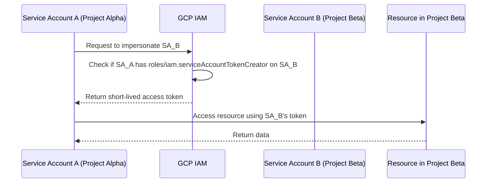

# How to Set Up Cross-Project Service Account Impersonation in GCP

Author: [nawazdhandala](https://www.github.com/nawazdhandala)

Tags: GCP, IAM, Service Account, Impersonation, Security

Description: Step-by-step instructions for configuring service account impersonation across GCP projects, allowing workloads in one project to act as a service account in another without sharing keys.

---

When you have workloads spread across multiple GCP projects, you often need one project's service account to access resources in another project. The traditional approach involves exporting service account keys and distributing them, which creates a key management nightmare and a significant security risk. Service account impersonation is the better alternative - it lets one identity temporarily assume the permissions of a service account in a different project without ever touching a key file.

Think of it like a controlled delegation. Service account A in Project Alpha says "I need to act as Service Account B in Project Beta for a little while." If the right permissions are in place, GCP generates a short-lived token and the cross-project access works seamlessly.

## How Impersonation Works Under the Hood

Service account impersonation uses the IAM Service Account Credentials API. When a principal needs to act as another service account, it calls `generateAccessToken` or `generateIdToken` on the target service account. GCP checks whether the caller has the `iam.serviceAccounts.getAccessToken` permission on the target, and if so, returns a short-lived OAuth 2.0 access token.

The token is valid for a maximum of one hour by default. There is no long-lived credential involved, no key file to store, and the activity is fully logged in Cloud Audit Logs.



## Prerequisites

Before setting this up, you need:

- Two GCP projects (the calling project and the target project)
- A service account in the target project that has the roles you need for resource access
- The `roles/iam.serviceAccountAdmin` role on the target project, or at least permission to modify IAM on the target service account
- The IAM Service Account Credentials API enabled on the target project

Enable the API first:

```bash
# Enable the IAM Credentials API on the target project
gcloud services enable iamcredentials.googleapis.com --project=target-project-id
```

## Step 1 - Create the Target Service Account

If you do not already have a service account in the target project, create one with the specific roles it needs:

```bash
# Create a service account in the target project
gcloud iam service-accounts create cross-project-reader \
  --display-name="Cross Project Reader" \
  --project=target-project-id

# Grant it the roles it needs on the target project
gcloud projects add-iam-policy-binding target-project-id \
  --member="serviceAccount:cross-project-reader@target-project-id.iam.gserviceaccount.com" \
  --role="roles/bigquery.dataViewer"
```

## Step 2 - Grant the Token Creator Role

Now you need to allow the calling service account (in Project Alpha) to impersonate the target service account (in Project Beta). You do this by granting the `roles/iam.serviceAccountTokenCreator` role on the target service account:

```bash
# Allow the calling service account to impersonate the target service account
gcloud iam service-accounts add-iam-policy-binding \
  cross-project-reader@target-project-id.iam.gserviceaccount.com \
  --member="serviceAccount:my-workload@calling-project-id.iam.gserviceaccount.com" \
  --role="roles/iam.serviceAccountTokenCreator"
```

This is a resource-level IAM binding on the service account itself, not on the project. This matters because it means the calling service account can only impersonate this specific target service account, not all service accounts in the target project.

## Step 3 - Use Impersonation with gcloud

The simplest way to test impersonation is with the gcloud CLI. Use the `--impersonate-service-account` flag:

```bash
# Run a BigQuery query while impersonating the target service account
gcloud auth print-access-token \
  --impersonate-service-account=cross-project-reader@target-project-id.iam.gserviceaccount.com
```

You can also set it for an entire gcloud session:

```bash
# Set impersonation for all subsequent gcloud commands
gcloud config set auth/impersonate_service_account \
  cross-project-reader@target-project-id.iam.gserviceaccount.com

# Now all commands run as the target service account
gcloud storage ls gs://target-project-bucket/

# Clear impersonation when done
gcloud config unset auth/impersonate_service_account
```

## Step 4 - Use Impersonation in Application Code

In Python, you can use the `google-auth` library to create impersonated credentials programmatically. This is how you would do it in a Cloud Function or a GKE workload:

```python
# Python code to impersonate a service account from another project
from google.auth import impersonated_credentials
from google.auth import default
from google.cloud import bigquery

# Get the default credentials of the calling service account
source_credentials, project = default()

# Create impersonated credentials for the target service account
target_credentials = impersonated_credentials.Credentials(
    source_credentials=source_credentials,
    target_principal="cross-project-reader@target-project-id.iam.gserviceaccount.com",
    target_scopes=["https://www.googleapis.com/auth/bigquery.readonly"],
    lifetime=3600,  # Token valid for 1 hour
)

# Use the impersonated credentials to access BigQuery in the target project
client = bigquery.Client(
    credentials=target_credentials,
    project="target-project-id"
)

# Run a query using the impersonated identity
query = "SELECT * FROM `target-project-id.dataset.table` LIMIT 10"
results = client.query(query)
for row in results:
    print(row)
```

## Step 5 - Use Impersonation with Terraform

Terraform supports impersonation natively through the Google provider. This is particularly useful when your CI/CD pipeline runs in one project but needs to manage infrastructure in another:

```hcl
# Configure the Google provider to use impersonation
provider "google" {
  project = "target-project-id"
  region  = "us-central1"

  # Impersonate the target service account for all operations
  impersonate_service_account = "cross-project-reader@target-project-id.iam.gserviceaccount.com"
}

# Resources created with this provider will use the impersonated identity
resource "google_storage_bucket" "example" {
  name     = "my-cross-project-bucket"
  location = "US"
}
```

## Chained Impersonation

In some architectures, you may need to chain impersonation - Service Account A impersonates Service Account B, which then impersonates Service Account C. GCP supports delegation chains of up to four service accounts.

```python
# Chained impersonation through a delegate
target_credentials = impersonated_credentials.Credentials(
    source_credentials=source_credentials,
    target_principal="final-sa@project-c.iam.gserviceaccount.com",
    target_scopes=["https://www.googleapis.com/auth/cloud-platform"],
    # The intermediate service account in the chain
    delegates=[
        "intermediate-sa@project-b.iam.gserviceaccount.com"
    ],
)
```

Each service account in the chain needs the Token Creator role on the next one.

## Auditing Impersonation Events

Every impersonation event is logged in Cloud Audit Logs. You can find them by searching for `GenerateAccessToken` or `GenerateIdToken` activities:

```bash
# Search audit logs for impersonation events in the target project
gcloud logging read 'protoPayload.methodName="GenerateAccessToken"' \
  --project=target-project-id \
  --limit=20 \
  --format="table(timestamp, protoPayload.authenticationInfo.principalEmail, protoPayload.request.name)"
```

This shows you who impersonated which service account and when.

## Security Considerations

Be deliberate about who can impersonate what. The Token Creator role is powerful - if someone can impersonate a service account, they effectively have all of that service account's permissions.

Use IAM Conditions to restrict impersonation to specific times, IP ranges, or resource attributes. For example, you can limit impersonation to only work during business hours or from specific VPC networks.

Never grant Token Creator at the project level. Always grant it on individual service accounts. Project-level grants would allow impersonation of every service account in that project.

Monitor impersonation activity regularly. Set up alerting on unexpected impersonation patterns, like impersonation from unfamiliar source accounts or outside normal hours.

Cross-project service account impersonation is the recommended way to handle multi-project access in GCP. It eliminates key management overhead, provides automatic credential rotation through short-lived tokens, and creates a clear audit trail. Once you set it up, you will wonder why you ever bothered with key files.
