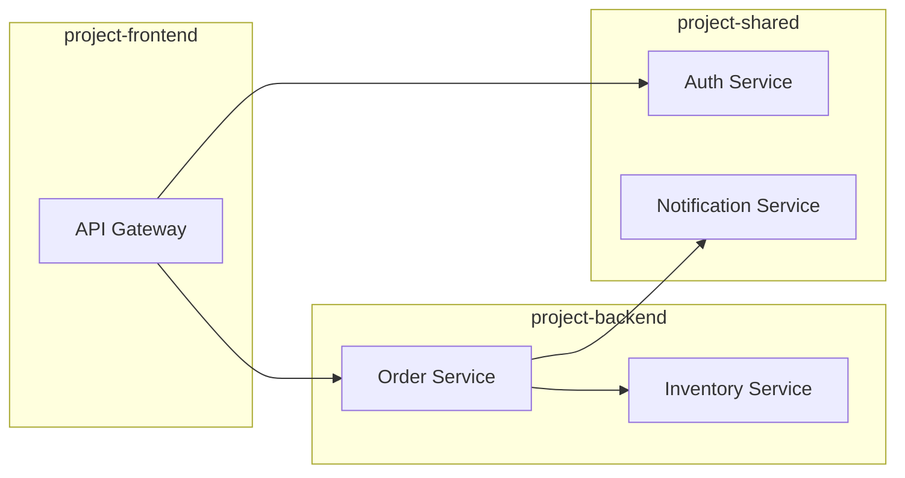

# How to Set Up Cross-Project Trace Aggregation on Google Cloud

Author: [nawazdhandala](https://www.github.com/nawazdhandala)

Tags: GCP, Cloud Trace, Distributed Tracing, Multi-Project, Observability

Description: Learn how to aggregate and correlate distributed traces across multiple Google Cloud projects for end-to-end visibility in multi-project architectures.

---

In the real world, most organizations do not run everything in a single GCP project. You might have separate projects for each team, for different environments (dev, staging, prod), for shared services, or for regulatory isolation. When a request flows from Service A in Project Alpha to Service B in Project Beta, the trace gets split across two Cloud Trace instances.

Without cross-project trace aggregation, you are looking at half the picture in each project and manually stitching them together. This post covers how to set up proper cross-project tracing so you get a single, unified view of every request, no matter how many projects it touches.

## The Problem

Consider this architecture:



Without cross-project tracing:
- Project Frontend sees: API Gateway span only
- Project Backend sees: Order Service and Inventory Service spans only
- Project Shared sees: Auth Service and Notification Service spans only

Nobody sees the complete trace. You have to manually search each project by trace ID to reconstruct the full picture.

## Approach 1: Centralized Trace Collection

The most straightforward solution is to send all traces from all projects to a single project. This gives you one place to search and analyze traces.

Configure each service to export traces to the central project using OpenTelemetry:

```python
# Service in project-backend sending traces to project-central
from opentelemetry import trace
from opentelemetry.sdk.trace import TracerProvider
from opentelemetry.sdk.trace.export import BatchSpanProcessor
from opentelemetry.exporter.cloud_trace import CloudTraceSpanExporter
from opentelemetry.sdk.resources import Resource, SERVICE_NAME

# Resource identifies this service
resource = Resource.create({
    SERVICE_NAME: 'order-service',
    'cloud.provider': 'gcp',
    'cloud.project': 'project-backend',  # Track the source project
})

provider = TracerProvider(resource=resource)

# Export to the central monitoring project, not the local project
exporter = CloudTraceSpanExporter(
    project_id='project-central'  # All traces go here
)

provider.add_span_processor(BatchSpanProcessor(exporter))
trace.set_tracer_provider(provider)
```

### IAM Configuration

Each service's service account needs permission to write traces to the central project:

```bash
# Grant trace writing permission to each project's service account
# For project-backend's default service account
gcloud projects add-iam-policy-binding project-central \
  --member="serviceAccount:project-backend@appspot.gserviceaccount.com" \
  --role="roles/cloudtrace.agent"

# For project-frontend's service account
gcloud projects add-iam-policy-binding project-central \
  --member="serviceAccount:project-frontend@appspot.gserviceaccount.com" \
  --role="roles/cloudtrace.agent"

# For project-shared's service account
gcloud projects add-iam-policy-binding project-central \
  --member="serviceAccount:project-shared@appspot.gserviceaccount.com" \
  --role="roles/cloudtrace.agent"
```

With Terraform:

```hcl
# Grant trace agent role to each project's service account
resource "google_project_iam_member" "trace_backend" {
  project = "project-central"
  role    = "roles/cloudtrace.agent"
  member  = "serviceAccount:${var.backend_sa_email}"
}

resource "google_project_iam_member" "trace_frontend" {
  project = "project-central"
  role    = "roles/cloudtrace.agent"
  member  = "serviceAccount:${var.frontend_sa_email}"
}

resource "google_project_iam_member" "trace_shared" {
  project = "project-central"
  role    = "roles/cloudtrace.agent"
  member  = "serviceAccount:${var.shared_sa_email}"
}
```

## Approach 2: OpenTelemetry Collector as Gateway

Instead of configuring each service individually, deploy an OpenTelemetry Collector that acts as a gateway. All services send traces to the collector, and the collector forwards them to the central project:

```yaml
# otel-collector-config.yaml
receivers:
  otlp:
    protocols:
      grpc:
        endpoint: 0.0.0.0:4317
      http:
        endpoint: 0.0.0.0:4318

processors:
  # Add the source project as an attribute
  attributes:
    actions:
      - key: gcp.source_project
        value: "${SOURCE_PROJECT_ID}"
        action: upsert

  # Batch for efficiency
  batch:
    timeout: 5s
    send_batch_size: 256

exporters:
  # Send all traces to the central project
  googlecloud:
    project: project-central
    trace:
      batch:
        max_batch_items: 200

service:
  pipelines:
    traces:
      receivers: [otlp]
      processors: [attributes, batch]
      exporters: [googlecloud]
```

Deploy one collector per project:

```yaml
# Kubernetes deployment for the collector gateway
apiVersion: apps/v1
kind: Deployment
metadata:
  name: otel-gateway
  namespace: observability
spec:
  replicas: 2
  selector:
    matchLabels:
      app: otel-gateway
  template:
    metadata:
      labels:
        app: otel-gateway
    spec:
      serviceAccountName: otel-gateway-sa
      containers:
        - name: collector
          image: otel/opentelemetry-collector-contrib:latest
          args: ["--config=/conf/config.yaml"]
          env:
            - name: SOURCE_PROJECT_ID
              value: "project-backend"
          ports:
            - containerPort: 4317
            - containerPort: 4318
          resources:
            requests:
              memory: "512Mi"
              cpu: "250m"
          volumeMounts:
            - name: config
              mountPath: /conf
      volumes:
        - name: config
          configMap:
            name: otel-collector-config
```

## Approach 3: Trace Sinks (GCP Native)

Google Cloud supports trace sinks that can forward traces from one project to another. This is a GCP-native approach that does not require changes to your application code:

```bash
# Create a trace sink that forwards all traces to the central project
gcloud alpha trace sinks create cross-project-sink \
  --destination=projects/project-central/traces \
  --project=project-backend

# Create sinks for each source project
gcloud alpha trace sinks create cross-project-sink \
  --destination=projects/project-central/traces \
  --project=project-frontend

gcloud alpha trace sinks create cross-project-sink \
  --destination=projects/project-central/traces \
  --project=project-shared
```

The advantage of trace sinks is that traces still appear in the source project's Cloud Trace (for team-level debugging), and they also get copied to the central project (for cross-project analysis).

## Ensuring Context Propagation Across Projects

For traces to be properly connected across projects, context propagation must work at every service boundary. Use W3C Trace Context headers:

```python
# Shared tracing configuration used by all services across all projects
from opentelemetry.propagate import set_global_textmap
from opentelemetry.propagators.composite import CompositePropagator
from opentelemetry.trace.propagation.tracecontext import TraceContextTextMapPropagator
from opentelemetry.baggage.propagation import W3CBaggagePropagator

# Use W3C Trace Context propagation - this is essential for cross-project traces
propagator = CompositePropagator([
    TraceContextTextMapPropagator(),
    W3CBaggagePropagator(),
])
set_global_textmap(propagator)
```

When Service A in Project Alpha calls Service B in Project Beta:

1. Service A injects the trace context (trace ID, span ID) into HTTP headers
2. The request travels across projects (through internal load balancers or VPC peering)
3. Service B extracts the trace context and creates child spans with the same trace ID
4. Both services export their spans to the central project
5. Cloud Trace assembles them into a single unified trace

## Adding Source Project Context

To identify which project each span came from, add the source project as a span attribute:

```python
# Add project context to all spans from this service
from opentelemetry.sdk.resources import Resource, SERVICE_NAME

resource = Resource.create({
    SERVICE_NAME: 'order-service',
    'gcp.project_id': 'project-backend',
    'deployment.environment': 'production',
    'team.name': 'backend-team',
})
```

This metadata shows up in Cloud Trace and lets you filter spans by source project.

## Querying Cross-Project Traces

Once traces are aggregated in the central project, you can query them normally:

```python
# Search for traces spanning multiple projects
from google.cloud import trace_v2

client = trace_v2.TraceServiceClient()

# List traces in the central project
# These include spans from all source projects
request = trace_v2.ListTracesRequest(
    project_id='project-central',
    filter='rootSpan.name:"checkout" spanName:"auth-service"',
)

for trace in client.list_traces(request=request):
    print(f"Trace: {trace.trace_id}")
    for span in trace.spans:
        project = span.attributes.get('gcp.project_id', 'unknown')
        print(f"  [{project}] {span.display_name} - {span.duration_ms}ms")
```

## Monitoring Cross-Project Trace Health

Build a check that verifies traces are properly connected across projects:

```python
# Health check: verify cross-project traces are complete
def check_trace_completeness(project_id, time_range_hours=1):
    """Check if recent traces have spans from multiple projects."""
    client = trace_v2.TraceServiceClient()

    # Sample recent traces
    traces_checked = 0
    complete_traces = 0

    for trace_data in client.list_traces(
        request={
            'project_id': project_id,
            'filter': 'rootSpan.name:"api-gateway"',
        }
    ):
        traces_checked += 1
        projects_seen = set()

        for span in trace_data.spans:
            project = span.attributes.get('gcp.project_id', '')
            if project:
                projects_seen.add(project)

        # A complete cross-project trace should touch at least 2 projects
        if len(projects_seen) >= 2:
            complete_traces += 1

        if traces_checked >= 100:
            break

    completeness = complete_traces / max(traces_checked, 1) * 100
    print(f"Trace completeness: {completeness:.1f}% "
          f"({complete_traces}/{traces_checked} traces span multiple projects)")

    if completeness < 80:
        print("WARNING: Many traces are incomplete - check context propagation")

    return completeness
```

## Cost Considerations

When sending all traces to a central project, be aware of the cost implications:

- You pay for trace ingestion in the central project
- If you also keep traces in the source projects (via trace sinks), you pay twice
- Consider sampling to reduce costs while maintaining visibility

A common pattern is:
- 100% of traces go to the source project's Cloud Trace (for team-level debugging)
- 10-20% of traces are forwarded to the central project (for cross-project analysis)
- 100% of error traces are forwarded to both

## Best Practices

1. **Pick one approach and stick with it.** Mixing centralized export and trace sinks creates confusion about where to look.

2. **Always include source project in span attributes.** When all traces are in one bucket, you need to know where each span came from.

3. **Test propagation between every pair of communicating projects.** A break in propagation at one service boundary splits the trace.

4. **Set up a trace completeness monitor.** Alert if the percentage of multi-project traces drops, which could indicate a propagation issue.

Cross-project trace aggregation is essential for any GCP architecture that spans multiple projects. With proper setup, you get the organizational benefits of separate projects (access control, billing separation) without sacrificing observability. Combine this with monitoring from OneUptime to get alerted when traces break across project boundaries.
