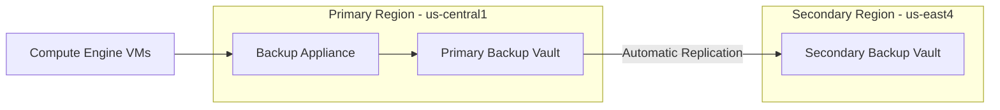

# How to Set Up Cross-Region Backup Replication with Google Cloud Backup and DR Backup Vaults

Author: [nawazdhandala](https://www.github.com/nawazdhandala)

Tags: GCP, Google Cloud, Backup and DR, Cross-Region Replication, Disaster Recovery, Backup Vaults

Description: Learn how to configure cross-region backup replication using Google Cloud Backup and DR backup vaults to protect against regional outages and disasters.

---

Keeping backups in a single region is fine until that region has a problem. If your backups are in the same region as your production workloads and that region goes down, you have lost both your data and your ability to recover it. Cross-region backup replication solves this by automatically copying your backups to a vault in a different geographic region, giving you a recovery path even in a worst-case regional failure scenario.

Google Cloud Backup and DR Service supports cross-region replication through backup vaults. You create vaults in multiple regions and configure replication between them. The replication happens automatically after each backup completes, so your remote copies are always current.

## Understanding Cross-Region Replication

The replication architecture is straightforward:



When a backup job completes, the backup data is written to the primary vault. The replication process then copies that data to one or more secondary vaults in different regions. Each vault is independent - if the primary region goes down, the secondary vault still has complete, usable backup copies.

## Step 1: Create the Primary Backup Vault

If you do not already have a primary vault, create one in your main production region:

```bash
# Create the primary backup vault in the same region as your workloads
gcloud backup-dr backup-vaults create vault-primary \
    --project=my-project \
    --location=us-central1 \
    --backup-minimum-enforce-retention-duration="2592000s" \
    --description="Primary backup vault for production workloads" \
    --effective-time="2026-02-17T00:00:00Z"
```

The `backup-minimum-enforce-retention-duration` is set to 30 days (2,592,000 seconds). This creates a minimum retention lock - nobody can delete backups within this period, even with admin access. This is important for compliance and ransomware protection.

## Step 2: Create the Secondary Backup Vault

Create a vault in a different region that will receive the replicated backups. Choose a region that is geographically distant from your primary region for maximum disaster resilience:

```bash
# Create the secondary backup vault in a different region
# Choose a region geographically distant from the primary
gcloud backup-dr backup-vaults create vault-secondary \
    --project=my-project \
    --location=us-east4 \
    --backup-minimum-enforce-retention-duration="2592000s" \
    --description="Secondary backup vault for cross-region DR" \
    --effective-time="2026-02-17T00:00:00Z"
```

For some organizations, compliance requirements dictate specific region pairs. For example, if you need to keep data within the US, us-central1 and us-east4 is a good pair. For EU data residency, europe-west1 and europe-west4 works well.

## Step 3: Configure Replication Between Vaults

Set up the replication relationship between the primary and secondary vaults:

```bash
# Configure replication from the primary vault to the secondary vault
gcloud backup-dr backup-vaults update vault-primary \
    --project=my-project \
    --location=us-central1 \
    --add-replication-target="projects/my-project/locations/us-east4/backupVaults/vault-secondary"
```

This tells the primary vault to replicate all backup data to the secondary vault. Replication happens asynchronously after each backup completes, so it does not slow down the backup window.

## Step 4: Update Your Backup Plan for Replication

Your existing backup plans need to be associated with the primary vault that has replication configured. If you already have plans pointing to the primary vault, replication starts automatically - no changes needed. If you need to create a new plan:

```bash
# Create a backup plan that uses the vault with replication configured
gcloud backup-dr backup-plans create replicated-daily-plan \
    --project=my-project \
    --location=us-central1 \
    --backup-vault=vault-primary \
    --resource-type=compute.googleapis.com/Instance \
    --description="Daily backup plan with cross-region replication"
```

## Step 5: Verify Replication Is Working

After your first backup runs with replication configured, verify that the data is showing up in the secondary vault:

```bash
# List backups in the primary vault
gcloud backup-dr backups list \
    --project=my-project \
    --location=us-central1 \
    --backup-vault=vault-primary

# List backups in the secondary vault - should show replicated copies
gcloud backup-dr backups list \
    --project=my-project \
    --location=us-east4 \
    --backup-vault=vault-secondary
```

Both vaults should show the same backup entries. The secondary vault entries will have a slight delay compared to the primary, reflecting the replication time.

## Step 6: Monitor Replication Health

Set up monitoring to catch replication failures or lag:

```bash
# Create a monitoring alert for replication lag
# This alerts when replication falls more than 1 hour behind
gcloud monitoring policies create \
    --project=my-project \
    --display-name="Backup Replication Lag Alert" \
    --condition-display-name="Replication lag exceeds 1 hour" \
    --condition-filter='resource.type="backupdr.googleapis.com/BackupVault" AND metric.type="backupdr.googleapis.com/backup_vault/replication_lag"' \
    --condition-threshold-value=3600 \
    --condition-threshold-comparison=COMPARISON_GT \
    --notification-channels=CHANNEL_ID \
    --combiner=OR \
    --duration=300s
```

You should also set up a dashboard to track replication metrics:

```bash
# Check replication status via the CLI
gcloud backup-dr backup-vaults describe vault-primary \
    --project=my-project \
    --location=us-central1 \
    --format="yaml(replicationTargets)"
```

## Step 7: Test Recovery from the Secondary Region

The whole point of cross-region replication is to recover from a regional outage. Test this regularly by restoring from the secondary vault:

```bash
# Restore a VM from a backup in the secondary vault
# This simulates a recovery scenario where the primary region is unavailable
gcloud backup-dr backups restore BACKUP_ID \
    --project=my-project \
    --location=us-east4 \
    --backup-vault=vault-secondary \
    --target-instance-name=web-server-dr-test \
    --target-zone=us-east4-a \
    --target-network=projects/my-project/global/networks/default \
    --target-subnetwork=projects/my-project/regions/us-east4/subnetworks/default
```

Document the restore time so you know your actual RTO (Recovery Time Objective). This number is critical for DR planning and often surprises people - it is almost always longer than they expect.

## Setting Up Multi-Region Replication

For critical workloads, you might want to replicate to more than one secondary region:

```bash
# Add a third vault in another region
gcloud backup-dr backup-vaults create vault-tertiary \
    --project=my-project \
    --location=europe-west1 \
    --backup-minimum-enforce-retention-duration="2592000s" \
    --description="Tertiary backup vault for international DR"

# Add it as another replication target
gcloud backup-dr backup-vaults update vault-primary \
    --project=my-project \
    --location=us-central1 \
    --add-replication-target="projects/my-project/locations/europe-west1/backupVaults/vault-tertiary"
```

Now your backups are replicated to two secondary regions. This is more expensive but provides protection against even multi-region failures.

## Cost Considerations

Cross-region replication comes with additional costs that you should plan for:

**Storage costs**: You pay for storage in both the primary and secondary vaults. Your backup storage bill effectively doubles for each replication target.

**Network egress**: Replicating data between regions incurs inter-region network egress charges. For large backup sets, this can add up. The exact cost depends on the regions involved.

**Retention alignment**: Make sure retention periods match between primary and secondary vaults. If the secondary vault has a shorter retention, old backups might be deleted from the secondary while still available in the primary, which defeats the purpose.

To manage costs, consider replicating only your most critical workloads cross-region rather than everything:

```bash
# Create a separate backup plan for critical workloads that uses the replicated vault
gcloud backup-dr backup-plans create critical-replicated \
    --project=my-project \
    --location=us-central1 \
    --backup-vault=vault-primary \
    --resource-type=compute.googleapis.com/Instance \
    --description="Replicated backups for critical production systems only"

# Create a non-replicated plan for less critical workloads
gcloud backup-dr backup-plans create standard-local \
    --project=my-project \
    --location=us-central1 \
    --backup-vault=vault-local-only \
    --resource-type=compute.googleapis.com/Instance \
    --description="Local-only backups for non-critical systems"
```

## Summary

Cross-region backup replication with Google Cloud Backup and DR vaults protects you against the scenario that keeps infrastructure engineers up at night - a regional outage that takes down both your production systems and your backups simultaneously. The setup is straightforward: create vaults in multiple regions, configure replication between them, and test restores from the secondary region regularly. The additional cost is real, but for production workloads where data loss is unacceptable, it is a cost worth paying.
