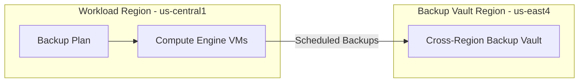

# How to Set Up Cross-Region Backup Replication with Google Cloud Backup

Author: [nawazdhandala](https://www.github.com/nawazdhandala)

Tags: GCP, Google Cloud, Backup and DR, Cross-Region Replication, Disaster Recovery, Backup Vault

Description: Learn how to configure cross-region backup replication using Google Cloud Backup and DR backup vaults to protect against regional outages and disasters.

---

Keeping backups in a single region is fine until that region has a problem. If your backups are in the same region as your production workloads and that region goes down, you have lost both your data and your ability to recover it. Cross-region backups solve this by storing your backups in a vault in a different geographic region, giving you a recovery path even in a worst-case regional failure scenario.

Google Cloud Backup and DR Service supports backup vaults in regions and multi-regions. Cross-region backup vault support is available for Compute Engine instances and disks, so you configure your backup plan to write to a compatible vault location instead of configuring vault-to-vault replication.

## Understanding Cross-Region Backups

The backup architecture is straightforward:


```mermaid
graph LR
    subgraph "Workload Region - us-central1"
        A[Backup Plan] --> B[Compute Engine VMs]
    end
    subgraph "Backup Vault Region - us-east4"
        C[Cross-Region Backup Vault]
    end
    B -->|Scheduled Backups| C
```

When a backup job completes, the backup data is written to the configured backup vault. If that vault is in a different supported region or in a multi-region, the backups are stored away from the workload region. If the workload region goes down, the remote vault still has usable backup copies.

## Step 1: Create the Local Backup Vault

If you do not already have a local vault, create one in your main production region for workloads that do not need cross-region protection:

```bash
# Create a local backup vault in the same region as your workloads

gcloud backup-dr backup-vaults create vault-local \
    --project=my-project \
    --location=us-central1 \
    --backup-min-enforced-retention="p30d" \
    --description="Local backup vault for production workloads" \
    --effective-time="2026-02-17T00:00:00Z"
```

The `backup-min-enforced-retention` is set to 30 days. This creates a minimum enforced retention period, so backups cannot be deleted within this period. If you set an effective time for the lock and that time has passed, even the project owner cannot decrease the enforced retention period. This is important for compliance and ransomware protection.

## Step 2: Create the Cross-Region Backup Vault

Create a vault in a different supported region that will store the cross-region backups. Choose a region that is geographically distant from your workload region for maximum disaster resilience:

```bash
# Create the cross-region backup vault in a different region
# Choose a region geographically distant from the workload region
gcloud backup-dr backup-vaults create vault-cross-region \
    --project=my-project \
    --location=us-east4 \
    --backup-min-enforced-retention="p30d" \
    --description="Cross-region backup vault for DR" \
    --effective-time="2026-02-17T00:00:00Z"
```

For some organizations, compliance requirements dictate specific region pairs. For example, if you need to keep data within the US, us-central1 and us-east4 is a good pair. For EU data residency, europe-west1 and europe-west4 works well.

## Step 3: Verify the Cross-Region Vault

Verify that the cross-region vault is active before creating backup plans that use it:

```bash
# View the cross-region backup vault
gcloud backup-dr backup-vaults describe vault-cross-region \
    --project=my-project \
    --location=us-east4
```

This confirms the vault location, retention settings, lock status, and service agent. There is no vault-to-vault replication target to configure for Google Cloud console-based backup vault plans.

## Step 4: Update Your Backup Plan for Cross-Region Storage

Your backup plans need to use the cross-region vault. If you need to create a new daily plan:

```bash
# Create a backup plan that uses the cross-region vault
gcloud backup-dr backup-plans create cross-region-daily-plan \
    --project=my-project \
    --location=us-central1 \
    --backup-vault=projects/my-project/locations/us-east4/backupVaults/vault-cross-region \
    --resource-type=compute.googleapis.com/Instance \
    --backup-rule=rule-id=daily-30d,retention-days=30,recurrence=DAILY,backup-window-start=1,backup-window-end=7 \
    --description="Daily backup plan with cross-region backup vault storage"
```

Then associate the plan with the Compute Engine VM you want to protect:

```bash
# Get the VM instance ID
gcloud compute instances describe web-server \
    --project=my-project \
    --zone=us-central1-a \
    --format="value(id)"

# Associate the backup plan with the VM
gcloud backup-dr backup-plan-associations create web-server-cross-region \
    --project=my-project \
    --location=us-central1 \
    --resource=projects/my-project/zones/us-central1-a/instances/VM_ID \
    --resource-type=compute.googleapis.com/Instance \
    --backup-plan=projects/my-project/locations/us-central1/backupPlans/cross-region-daily-plan
```

## Step 5: Verify Backups Are Working

After your first backup runs, verify that the data is showing up in the cross-region vault:

```bash
# List data sources in the cross-region vault
gcloud backup-dr data-sources list \
    --project=my-project \
    --location=us-east4 \
    --backup-vault=vault-cross-region

# List backups in the cross-region vault
gcloud backup-dr backups list \
    --project=my-project \
    --location=us-east4 \
    --backup-vault=vault-cross-region
```

The cross-region vault should show the data source and backups for the protected VM after the first scheduled or on-demand backup completes.

## Step 6: Monitor Backup Health

Set up monitoring to catch backup storage growth and job failures. Backup and DR publishes a backup vault storage consumption metric in Cloud Monitoring:

```bash
# Create a monitoring alert for backup vault storage consumption
gcloud monitoring policies create \
    --project=my-project \
    --display-name="Backup Vault Storage Alert" \
    --condition-display-name="Backup vault stored bytes exceed threshold" \
    --condition-filter='resource.type="backupdr.googleapis.com/BackupVault" AND metric.type="backupdr.googleapis.com/storage/stored_bytes"' \
    --condition-threshold-value=10995116277760 \
    --condition-threshold-comparison=COMPARISON_GT \
    --notification-channels=CHANNEL_ID \
    --combiner=OR \
    --duration=300s
```

You should also set up a dashboard to track backup vault metrics:

```bash
# Check backup vault status via the CLI
gcloud backup-dr backup-vaults describe vault-cross-region \
    --project=my-project \
    --location=us-east4 \
    --format="yaml(state,storedBytes,backupMinimumEnforcedRetentionDuration)"
```

## Step 7: Test Recovery from the Secondary Region

The whole point of cross-region backups is to recover from a regional outage. Test this regularly by restoring from the cross-region vault:

```bash
# Restore a VM from a backup in the cross-region vault
# This simulates a recovery scenario where the primary region is unavailable
gcloud backup-dr backups restore compute BACKUP_ID \
    --project=my-project \
    --location=us-east4 \
    --backup-vault=vault-cross-region \
    --data-source=DATA_SOURCE_ID \
    --name=web-server-dr-test \
    --target-zone=us-east4-a \
    --target-project=my-project \
    --network-interface=network=projects/my-project/global/networks/default,subnet=projects/my-project/regions/us-east4/subnetworks/default
```

Document the restore time so you know your actual RTO (Recovery Time Objective). This number is critical for DR planning and often surprises people - it is almost always longer than they expect.

## Setting Up Multi-Region Backups

For critical workloads, you might want to use a multi-region backup vault:

```bash
# Create a multi-region vault in the US
gcloud backup-dr backup-vaults create vault-us-multi-region \
    --project=my-project \
    --location=US \
    --backup-min-enforced-retention="p30d" \
    --description="US multi-region backup vault for DR"
```

Now your backups are stored in a multi-region vault. This is more expensive than local-only backups but provides stronger protection against regional failures.

## Cost Considerations

Cross-region backups come with additional costs that you should plan for:

**Storage costs**: You pay for storage in the vault location that stores the backup data. Cross-region and multi-region designs usually cost more than local-only backups.

**Network transfer**: Depending on the locations of your backup vault and source workload, network transfer fees may apply. For large backup sets, this can add up. The exact cost depends on the regions involved.

**Retention alignment**: Make sure the backup plan retention is equal to or longer than the backup vault minimum enforced retention period. If the plan retention is shorter than the vault minimum, Google Cloud console-based plan changes can be blocked.

To manage costs, consider protecting only your most critical workloads cross-region rather than everything:

```bash
# Create a separate backup plan for critical workloads that uses the cross-region vault
gcloud backup-dr backup-plans create critical-cross-region \
    --project=my-project \
    --location=us-central1 \
    --backup-vault=projects/my-project/locations/us-east4/backupVaults/vault-cross-region \
    --resource-type=compute.googleapis.com/Instance \
    --backup-rule=rule-id=daily-30d,retention-days=30,recurrence=DAILY,backup-window-start=1,backup-window-end=7 \
    --description="Cross-region backups for critical production systems only"

# Create a local-only plan for less critical workloads
gcloud backup-dr backup-plans create standard-local \
    --project=my-project \
    --location=us-central1 \
    --backup-vault=vault-local-only \
    --resource-type=compute.googleapis.com/Instance \
    --backup-rule=rule-id=daily-30d,retention-days=30,recurrence=DAILY,backup-window-start=1,backup-window-end=7 \
    --description="Local-only backups for non-critical systems"
```

## Summary

Cross-region backups with Google Cloud Backup and DR vaults protect you against the scenario that keeps infrastructure engineers up at night - a regional outage that takes down both your production systems and your backups simultaneously. The setup is straightforward: create a compatible vault in a remote region or multi-region, point your backup plan at it, and test restores from that vault regularly. The additional cost is real, but for production workloads where data loss is unacceptable, it is a cost worth paying.
