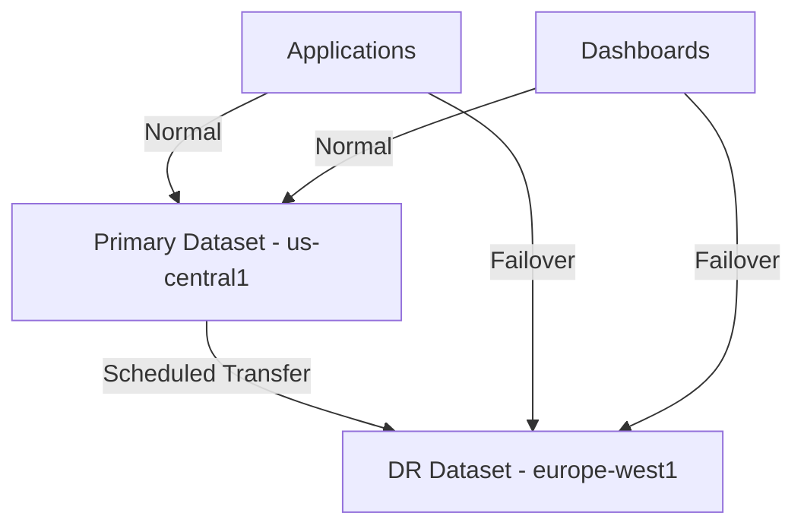

# How to Set Up Cross-Region Disaster Recovery for BigQuery Datasets Using Scheduled Transfers

Author: [nawazdhandala](https://www.github.com/nawazdhandala)

Tags: GCP, BigQuery, Disaster Recovery, Data Transfer, Cross-Region, Data Engineering

Description: Implement cross-region disaster recovery for BigQuery datasets using the BigQuery Data Transfer Service with scheduled transfers and automated failover procedures.

---

BigQuery is inherently durable - Google replicates your data across multiple zones within a region. But regional durability is not the same as cross-region disaster recovery. If the region hosting your BigQuery dataset experiences a sustained outage, your analytics queries stop, your dashboards go dark, and any applications that depend on BigQuery data break. For organizations that need analytics availability even during regional outages, cross-region replication is essential.

In this post, I will show you how to set up cross-region disaster recovery for BigQuery using scheduled dataset transfers, automated monitoring, and failover procedures.

## Understanding BigQuery Data Locations

BigQuery datasets are tied to a specific location (region or multi-region). Once created, a dataset's location cannot be changed. This means DR requires maintaining a copy of your data in a different location.



## Setting Up the DR Dataset

Create a mirror dataset in a different region.

```bash
# Create the primary dataset (if it does not already exist)
bq mk --location=us-central1 --dataset my_project:analytics_primary

# Create the DR dataset in a different region
bq mk --location=europe-west1 --dataset my_project:analytics_dr

# If using multi-region locations
bq mk --location=US --dataset my_project:analytics_primary
bq mk --location=EU --dataset my_project:analytics_dr
```

## Using BigQuery Data Transfer Service

The Data Transfer Service can copy datasets between regions on a schedule.

```python
# setup_transfer.py - Set up scheduled dataset transfers
from google.cloud import bigquery_datatransfer_v1
from google.protobuf.struct_pb2 import Struct

def create_dataset_transfer(
    project_id,
    source_dataset,
    destination_dataset,
    source_project=None,
    schedule='every 1 hours',
):
    """Create a scheduled BigQuery dataset copy transfer."""
    client = bigquery_datatransfer_v1.DataTransferServiceClient()

    source_project = source_project or project_id

    # Build the transfer configuration
    params = Struct()
    params.update({
        'source_project_id': source_project,
        'source_dataset_id': source_dataset,
    })

    transfer_config = bigquery_datatransfer_v1.TransferConfig(
        destination_dataset_id=destination_dataset,
        display_name=f'DR Transfer: {source_dataset} -> {destination_dataset}',
        data_source_id='cross_region_copy',
        params=params,
        schedule=schedule,
        disabled=False,
    )

    # The parent is the destination location
    parent = f'projects/{project_id}/locations/europe-west1'

    response = client.create_transfer_config(
        parent=parent,
        transfer_config=transfer_config,
    )

    print(f'Transfer config created: {response.name}')
    print(f'Schedule: {schedule}')
    return response

# Set up hourly replication for critical datasets
create_dataset_transfer(
    project_id='my-project',
    source_dataset='analytics_primary',
    destination_dataset='analytics_dr',
    schedule='every 1 hours',
)

# Set up daily replication for historical datasets
create_dataset_transfer(
    project_id='my-project',
    source_dataset='historical_data',
    destination_dataset='historical_data_dr',
    schedule='every 24 hours',
)
```

## Table-Level Transfer for Large Datasets

For very large datasets, you might want to replicate specific tables rather than the entire dataset.

```python
# table_level_transfer.py - Granular table replication
from google.cloud import bigquery

bq_client = bigquery.Client()

def copy_table_cross_region(
    source_project,
    source_dataset,
    source_table,
    dest_project,
    dest_dataset,
    dest_table=None,
):
    """Copy a single table from one region to another."""
    dest_table = dest_table or source_table

    source_ref = f'{source_project}.{source_dataset}.{source_table}'
    dest_ref = f'{dest_project}.{dest_dataset}.{dest_table}'

    # Use a cross-region copy job
    job_config = bigquery.CopyJobConfig(
        write_disposition=bigquery.WriteDisposition.WRITE_TRUNCATE,
    )

    job = bq_client.copy_table(
        source_ref,
        dest_ref,
        job_config=job_config,
    )

    # Wait for the job to complete
    job.result()
    print(f'Copied {source_ref} -> {dest_ref} ({job.total_bytes_processed} bytes)')
    return job

def replicate_critical_tables(source_dataset, dest_dataset):
    """Replicate all tables marked as critical."""
    # List all tables in the source dataset
    tables = bq_client.list_tables(f'my-project.{source_dataset}')

    for table in tables:
        # Get table metadata to check labels
        full_table = bq_client.get_table(table.reference)

        # Only replicate tables labeled as critical
        if full_table.labels.get('dr_priority') in ('critical', 'high'):
            print(f'Replicating {table.table_id}...')
            copy_table_cross_region(
                'my-project', source_dataset, table.table_id,
                'my-project', dest_dataset,
            )
```

## Incremental Replication for Append-Only Tables

For tables that only receive new data (like event logs), use incremental replication to copy only new rows.

```python
# incremental_replication.py
from google.cloud import bigquery
from datetime import datetime, timedelta

bq_client = bigquery.Client()

def incremental_replicate(
    source_dataset,
    dest_dataset,
    table_name,
    timestamp_column='created_at',
    lookback_hours=2,
):
    """Replicate only new rows based on a timestamp column."""

    # Calculate the cutoff time (with some overlap for safety)
    cutoff = datetime.utcnow() - timedelta(hours=lookback_hours)
    cutoff_str = cutoff.strftime('%Y-%m-%d %H:%M:%S')

    # Query new rows from the source
    query = f"""
    SELECT *
    FROM `my-project.{source_dataset}.{table_name}`
    WHERE {timestamp_column} >= '{cutoff_str}'
    """

    # Write to the destination table
    job_config = bigquery.QueryJobConfig(
        destination=f'my-project.{dest_dataset}.{table_name}',
        write_disposition=bigquery.WriteDisposition.WRITE_APPEND,
    )

    job = bq_client.query(query, job_config=job_config)
    job.result()

    print(f'Incremental replication: {job.total_rows} new rows -> {dest_dataset}.{table_name}')
    return job
```

## Monitoring Transfer Health

Set up monitoring to ensure transfers are running on schedule and completing successfully.

```python
# monitor_transfers.py
from google.cloud import bigquery_datatransfer_v1
from google.cloud import monitoring_v3
import time

def check_transfer_health(project_id, location='europe-west1'):
    """Check the health of all DR transfers."""
    client = bigquery_datatransfer_v1.DataTransferServiceClient()
    parent = f'projects/{project_id}/locations/{location}'

    # List all transfer configs
    configs = client.list_transfer_configs(parent=parent)

    unhealthy = []
    for config in configs:
        # Get the latest run
        runs = client.list_transfer_runs(
            parent=config.name,
        )

        latest_run = None
        for run in runs:
            if latest_run is None or run.run_time > latest_run.run_time:
                latest_run = run

        if latest_run is None:
            unhealthy.append({
                'config': config.display_name,
                'issue': 'No runs found',
            })
            continue

        # Check if the latest run succeeded
        if latest_run.state != bigquery_datatransfer_v1.TransferState.SUCCEEDED:
            unhealthy.append({
                'config': config.display_name,
                'state': latest_run.state.name,
                'error': latest_run.error_status.message if latest_run.error_status else 'Unknown',
            })

        # Check if the latest run is too old (indicating a stuck schedule)
        run_age_hours = (time.time() - latest_run.run_time.timestamp()) / 3600
        if run_age_hours > 3:  # Alert if more than 3 hours since last run
            unhealthy.append({
                'config': config.display_name,
                'issue': f'Latest run is {run_age_hours:.1f} hours old',
            })

    return unhealthy

# Run as a Cloud Function on a schedule
def health_check_function(request):
    issues = check_transfer_health('my-project')
    if issues:
        # Send alerts for unhealthy transfers
        for issue in issues:
            print(f'ALERT: Transfer issue - {issue}')
    return f'{len(issues)} issues found'
```

## Automated Failover

When the primary region is unavailable, switch your applications to use the DR dataset.

```python
# failover_manager.py
import os
from google.cloud import bigquery

class BigQueryFailoverManager:
    """Manages failover between primary and DR BigQuery datasets."""

    def __init__(self, project_id):
        self.project_id = project_id
        self.primary_dataset = os.environ.get('BQ_PRIMARY_DATASET', 'analytics_primary')
        self.dr_dataset = os.environ.get('BQ_DR_DATASET', 'analytics_dr')
        self.active_dataset = self.primary_dataset
        self.client = bigquery.Client()

    def get_active_dataset(self):
        """Return the currently active dataset name."""
        return self.active_dataset

    def health_check(self):
        """Check if the primary dataset is accessible."""
        try:
            self.client.get_dataset(f'{self.project_id}.{self.primary_dataset}')
            return True
        except Exception:
            return False

    def failover_to_dr(self):
        """Switch to the DR dataset."""
        print(f'Failing over from {self.primary_dataset} to {self.dr_dataset}')
        self.active_dataset = self.dr_dataset
        # Update any views or references
        self._update_view_references(self.dr_dataset)
        return self.active_dataset

    def failback_to_primary(self):
        """Switch back to the primary dataset after recovery."""
        if self.health_check():
            print(f'Failing back from {self.dr_dataset} to {self.primary_dataset}')
            self.active_dataset = self.primary_dataset
            self._update_view_references(self.primary_dataset)
            return self.active_dataset
        else:
            print('Primary still unavailable, staying on DR')
            return self.active_dataset

    def _update_view_references(self, target_dataset):
        """Update authorized views to point to the active dataset."""
        # Update any views that reference the dataset
        views_dataset = f'{self.project_id}.analytics_views'
        tables = self.client.list_tables(views_dataset)

        for table_ref in tables:
            table = self.client.get_table(table_ref)
            if table.table_type == 'VIEW':
                # Rewrite the view SQL to point to the active dataset
                new_sql = table.view_query.replace(
                    self.primary_dataset, target_dataset
                ).replace(
                    self.dr_dataset, target_dataset
                )
                table.view_query = new_sql
                self.client.update_table(table, ['view_query'])
                print(f'Updated view: {table.table_id}')
```

## Validating DR Data Freshness

After a failover, verify that the DR data is recent enough for your needs.

```python
# validate_freshness.py
from google.cloud import bigquery

bq_client = bigquery.Client()

def validate_data_freshness(dataset, table, timestamp_column, max_age_hours=2):
    """Check that the most recent data in a table is fresh enough."""
    query = f"""
    SELECT
      MAX({timestamp_column}) as latest_record,
      TIMESTAMP_DIFF(CURRENT_TIMESTAMP(), MAX({timestamp_column}), HOUR) as age_hours,
      COUNT(*) as total_rows
    FROM `{dataset}.{table}`
    """

    result = bq_client.query(query).result()
    for row in result:
        print(f'Table: {dataset}.{table}')
        print(f'  Latest record: {row.latest_record}')
        print(f'  Age: {row.age_hours} hours')
        print(f'  Total rows: {row.total_rows}')

        if row.age_hours > max_age_hours:
            print(f'  WARNING: Data is older than {max_age_hours} hours')
            return False
        return True
```

## Summary

Cross-region DR for BigQuery requires active management because BigQuery does not have built-in cross-region replication. The Data Transfer Service handles the heavy lifting of copying data between regions on a schedule. The key is matching your transfer frequency to your RPO target, monitoring transfer health continuously, and having a tested failover procedure.

OneUptime can monitor both your primary and DR BigQuery datasets, tracking data freshness, transfer success rates, and query availability. During a failover event, it can also serve as your status page to communicate the impact and recovery progress to stakeholders.
