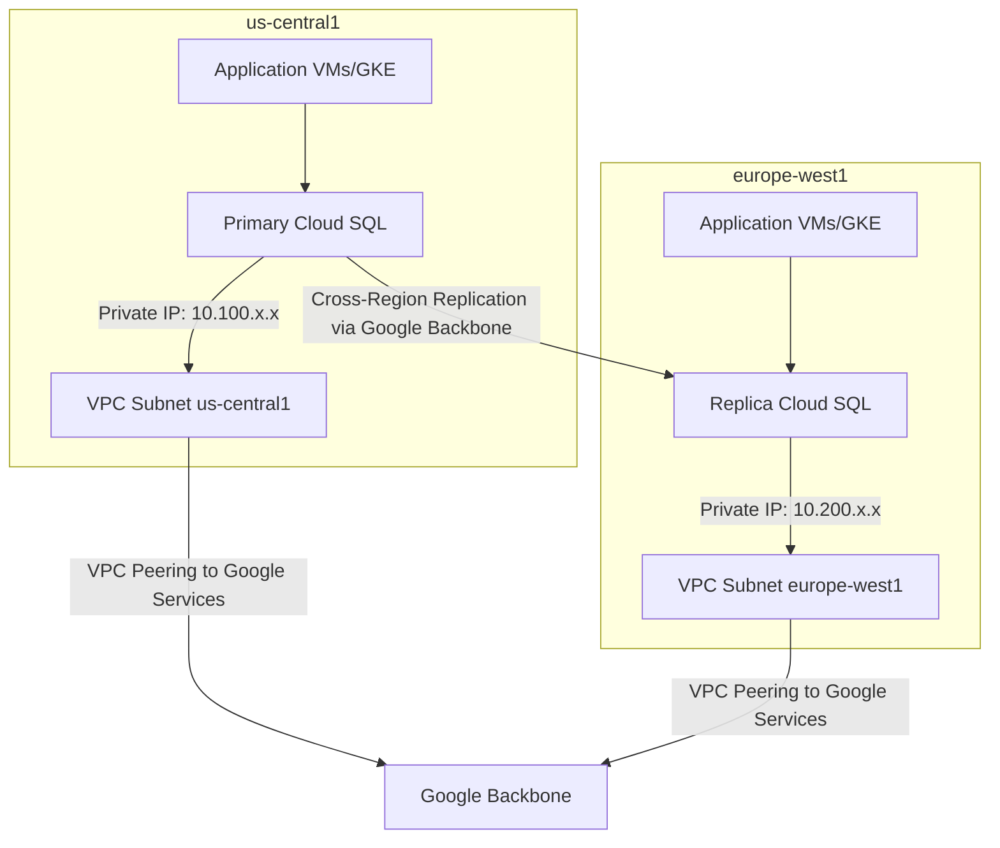

# How to Set Up Cross-Region Read Replicas in Cloud SQL with Private IP

Author: [nawazdhandala](https://www.github.com/nawazdhandala)

Tags: GCP, Cloud SQL, Cross-Region, Read Replicas, Private IP, Disaster Recovery

Description: Learn how to create cross-region read replicas in Cloud SQL with private IP connectivity for disaster recovery and geographically distributed read performance.

---

Cross-region read replicas serve two critical purposes: they bring your data closer to users in other regions for faster reads, and they give you a disaster recovery option if your primary region goes down. Combining this with private IP keeps all your database traffic off the public internet. The setup requires some careful network planning, so let me walk through it step by step.

## Why Cross-Region Replicas with Private IP

The default behavior when you create a cross-region replica is to use public IP. This works, but it means replication traffic flows over the internet (encrypted, but still public). With private IP:

- Replication traffic stays on Google's backbone network
- Lower and more consistent latency
- No exposure to public internet
- Better compliance posture

The trade-off is more network setup work. You need VPC peering or Shared VPC across regions to make private IP work.

## Prerequisites

Before starting, you need:

- A primary Cloud SQL instance with backups and PITR enabled
- Private Service Access configured in both regions
- VPC network spanning both regions (or Shared VPC)
- The Cloud SQL Admin API and Service Networking API enabled

## Step 1: Configure Private Service Access in Both Regions

If you already have Private Service Access for your primary region, you may need to extend the allocated IP range to accommodate cross-region replicas.

Check your existing allocation:

```bash
# List existing private service access allocations
gcloud compute addresses list --global --filter="purpose=VPC_PEERING"
```

If you need to allocate additional ranges:

```bash
# Allocate an IP range in the destination region's VPC
# This range should not overlap with existing subnets or other allocations
gcloud compute addresses create google-services-range-eu \
    --global \
    --purpose=VPC_PEERING \
    --addresses=10.200.0.0 \
    --prefix-length=16 \
    --network=my-vpc

# Update the private service connection to include the new range
gcloud services vpc-peerings update \
    --service=servicenetworking.googleapis.com \
    --ranges=google-services-range-us,google-services-range-eu \
    --network=my-vpc
```

## Step 2: Verify the Primary Instance Configuration

Your primary instance needs to have private IP and backups enabled:

```bash
# Check primary instance configuration
gcloud sql instances describe primary-instance \
    --format="json(ipAddresses, settings.backupConfiguration, settings.ipConfiguration)"
```

If backups are not enabled:

```bash
# Enable backups on the primary (required for replicas)
gcloud sql instances patch primary-instance \
    --backup-start-time=02:00 \
    --enable-point-in-time-recovery
```

## Step 3: Create the Cross-Region Replica

Create the replica in a different region with private IP:

```bash
# Create a cross-region replica with private IP
gcloud sql instances create replica-europe \
    --master-instance-name=primary-instance \
    --region=europe-west1 \
    --tier=db-custom-4-16384 \
    --no-assign-ip \
    --network=projects/my-project/global/networks/my-vpc \
    --allocated-ip-range-name=google-services-range-eu \
    --storage-type=SSD \
    --storage-size=100GB \
    --storage-auto-increase \
    --availability-type=ZONAL
```

Key flags:

- `--region=europe-west1` places the replica in a different region
- `--no-assign-ip` disables public IP
- `--network` specifies the VPC for private IP
- `--allocated-ip-range-name` specifies which IP range to use

The replica creation takes longer for cross-region setups (15-30 minutes) because the initial data must be copied across regions.

## Step 4: Verify the Replica

Check that the replica was created with private IP:

```bash
# Verify the replica's IP configuration
gcloud sql instances describe replica-europe \
    --format="json(ipAddresses, connectionName, replicaConfiguration, state)"
```

You should see only a PRIVATE IP type in the output.

Check replication status:

```bash
# Verify replication is running
gcloud sql instances describe replica-europe \
    --format="json(replicaConfiguration.mysqlReplicaConfiguration, state)"
```

## Network Architecture

Here is how the network topology looks:



The replication traffic between primary and replica goes through Google's internal backbone, not through your VPC directly. The Private Service Access peering in each region allows Cloud SQL to communicate with your VPC for client connections.

## Step 5: Connect Applications to the Replica

Applications in the replica's region connect using the replica's private IP:

```bash
# Get the replica's private IP
gcloud sql instances describe replica-europe \
    --format="value(ipAddresses[0].ipAddress)"
```

Configure your application to use the replica for reads:

```python
# Application configuration for cross-region read routing
import os

# Primary in us-central1 for writes
PRIMARY_DB_HOST = os.environ.get("PRIMARY_DB_HOST", "10.100.0.5")

# Replica in europe-west1 for reads
REPLICA_DB_HOST = os.environ.get("REPLICA_DB_HOST", "10.200.0.5")

# Route based on operation type
def get_connection(read_only=False):
    """Return the appropriate database connection based on operation type."""
    host = REPLICA_DB_HOST if read_only else PRIMARY_DB_HOST
    return create_connection(host=host, port=5432, database="mydb")
```

## Step 6: Monitor Cross-Region Replication

Cross-region replicas have higher replication lag than same-region replicas. Monitor this closely:

```bash
# Check replication lag
gcloud sql instances describe replica-europe \
    --format="value(replicaConfiguration)"
```

From within the database:

```sql
-- For PostgreSQL: Check replication lag
SELECT
    now() - pg_last_xact_replay_timestamp() AS replication_lag;

-- For MySQL: Check seconds behind master
SHOW SLAVE STATUS\G
```

Set up alerts for cross-region replication lag:

```bash
# Alert when cross-region replication lag exceeds 60 seconds
gcloud monitoring policies create \
    --display-name="Cross-Region Replica Lag" \
    --condition-display-name="Lag > 60s" \
    --condition-filter='resource.type="cloudsql_database" AND metric.type="cloudsql.googleapis.com/database/replication/replica_lag" AND resource.labels.database_id="my-project:replica-europe"' \
    --condition-threshold-value=60 \
    --condition-threshold-duration=300s \
    --notification-channels=projects/my-project/notificationChannels/12345
```

Expect typical lag of 100ms to a few seconds under normal conditions. During high write volumes, lag can increase.

## Disaster Recovery with Cross-Region Replicas

If your primary region goes down, you can promote the cross-region replica:

```bash
# Promote the cross-region replica to a standalone primary
# WARNING: This is irreversible - replication cannot be re-established
gcloud sql instances promote-replica replica-europe
```

After promotion, you need to:

1. Update application connection strings to point to the promoted instance
2. Create new replicas from the promoted instance
3. Enable HA on the promoted instance if needed

```bash
# Enable HA on the newly promoted instance
gcloud sql instances patch replica-europe \
    --availability-type=REGIONAL

# Create a new read replica in the same region
gcloud sql instances create replica-europe-2 \
    --master-instance-name=replica-europe \
    --region=europe-west1 \
    --tier=db-custom-2-8192 \
    --no-assign-ip \
    --network=projects/my-project/global/networks/my-vpc
```

## Failover Planning

Document your disaster recovery plan:

```
Disaster Recovery Runbook:
1. Verify primary region is actually down (not just a transient issue)
2. Check replication lag on the cross-region replica
3. If lag is acceptable, promote the replica
4. Update DNS/application configuration to point to the new primary
5. Enable HA on the promoted instance
6. Create new replicas as needed
7. Notify stakeholders of the failover
8. Plan for failback when the original region recovers
```

Test this plan regularly. Schedule quarterly DR drills where you actually promote a replica and verify your application works.

## Cost Considerations

Cross-region replicas with private IP have several cost components:

- **Instance cost**: Same as a regular instance in the destination region
- **Storage cost**: Full copy of the data in the destination region
- **Cross-region replication traffic**: Google does not charge for replication traffic within Google's network, but check current pricing
- **Private Service Access**: No additional cost for the VPC peering itself

For a `db-custom-4-16384` cross-region replica with 100 GB SSD, expect roughly $200-300/month depending on the regions.

## Multiple Cross-Region Replicas

You can create replicas in multiple regions for global coverage:

```bash
# Create replicas in multiple regions for global read distribution
gcloud sql instances create replica-asia \
    --master-instance-name=primary-instance \
    --region=asia-east1 \
    --tier=db-custom-4-16384 \
    --no-assign-ip \
    --network=projects/my-project/global/networks/my-vpc \
    --storage-type=SSD

gcloud sql instances create replica-southamerica \
    --master-instance-name=primary-instance \
    --region=southamerica-east1 \
    --tier=db-custom-2-8192 \
    --no-assign-ip \
    --network=projects/my-project/global/networks/my-vpc \
    --storage-type=SSD
```

Remember that each replica adds load to the primary (replication traffic), so monitor primary instance performance as you add replicas.

## Summary

Cross-region read replicas with private IP give you both geographic read distribution and disaster recovery without exposing database traffic to the public internet. The setup requires Private Service Access in both regions and careful IP range planning. Monitor replication lag closely since cross-region lag is inherently higher than same-region. Test your disaster recovery promotion process regularly - a plan you have never tested is not really a plan.
