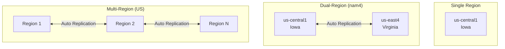
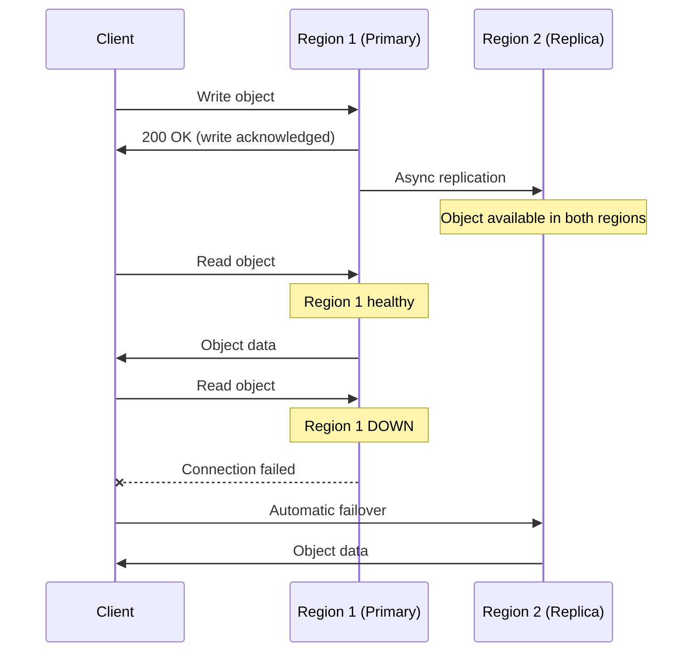
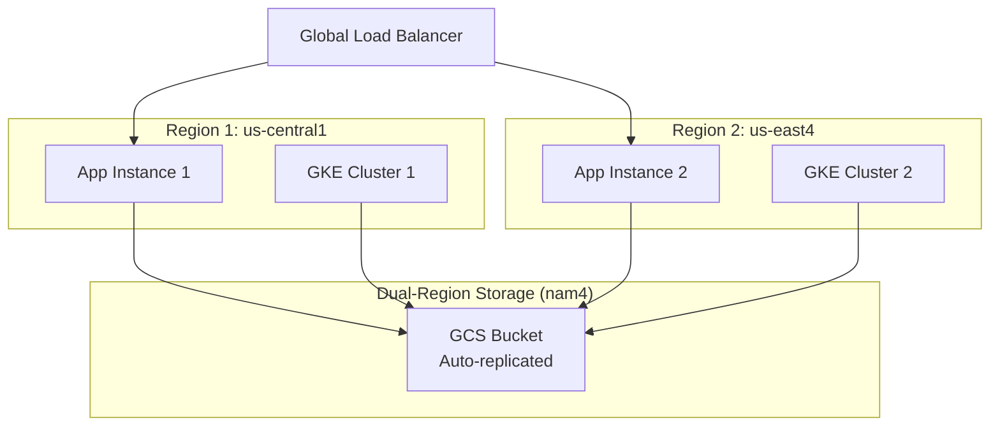

# How to Set Up Cross-Region Replication with Dual-Region Buckets in Google Cloud Storage

Author: [nawazdhandala](https://www.github.com/nawazdhandala)

Tags: GCP, Google Cloud Storage, Dual-Region, Replication, High Availability

Description: Learn how to set up cross-region replication using dual-region and multi-region buckets in Google Cloud Storage for high availability and disaster recovery.

---

When your application cannot tolerate data loss from a regional outage, you need your data replicated across geographically separate locations. Google Cloud Storage offers dual-region and multi-region buckets that automatically replicate your data across regions. Unlike some other cloud providers where you manually configure replication rules, GCS handles this transparently - you just choose the right bucket location at creation time.

This guide covers how to set up dual-region buckets, understand replication behavior, and design for high availability.

## Understanding GCS Location Types

GCS offers three types of locations:

**Single region** (e.g., `us-central1`): Data stored in one region. Lowest cost, but vulnerable to regional outages.

**Dual-region** (e.g., `nam4`): Data automatically replicated across two specific regions. Balanced cost, redundancy, and performance.

**Multi-region** (e.g., `US`): Data replicated across multiple regions within a continent. Highest availability, highest cost.



## Creating a Dual-Region Bucket

### Using Predefined Dual-Regions

GCS offers several predefined dual-region pairs:

```bash
# Create a bucket in the NAM4 dual-region (Iowa + Virginia)
gcloud storage buckets create gs://my-dual-region-bucket \
  --location=nam4
```

Common predefined dual-regions:

| Code | Region 1 | Region 2 |
|---|---|---|
| `nam4` | us-central1 (Iowa) | us-east4 (Virginia) |
| `eur4` | europe-north1 (Finland) | europe-west4 (Netherlands) |
| `asia1` | asia-northeast1 (Tokyo) | asia-northeast2 (Osaka) |

### Using Custom Dual-Regions

You can also create custom dual-region pairs by specifying two individual regions:

```bash
# Create a custom dual-region bucket with specific region pair
gcloud storage buckets create gs://my-custom-dual-bucket \
  --location=us-east1+us-west1 \
  --placement=us-east1,us-west1
```

This gives you more control over which specific regions hold your data, which matters for data residency requirements.

### Creating a Multi-Region Bucket

For the broadest geographic redundancy:

```bash
# Create a multi-region bucket spanning the US
gcloud storage buckets create gs://my-multi-region-bucket \
  --location=US

# Create a multi-region bucket spanning Europe
gcloud storage buckets create gs://my-eu-bucket \
  --location=EU

# Create a multi-region bucket spanning Asia
gcloud storage buckets create gs://my-asia-bucket \
  --location=ASIA
```

## Turbo Replication

By default, dual-region and multi-region buckets replicate data asynchronously. Google targets replication within one hour for most objects, but does not guarantee a specific time. Turbo replication provides a stronger guarantee: 100% of objects replicated within 15 minutes.

```bash
# Create a dual-region bucket with turbo replication
gcloud storage buckets create gs://my-turbo-bucket \
  --location=nam4 \
  --recovery-point-objective=DEFAULT

# Enable turbo replication on an existing bucket
gcloud storage buckets update gs://my-dual-region-bucket \
  --recovery-point-objective=DEFAULT
```

Wait, let me correct that. To enable turbo replication:

```bash
# Enable turbo replication (RPO set to 0)
gcloud storage buckets update gs://my-dual-region-bucket \
  --rpo=ASYNC_TURBO
```

To check the current RPO setting:

```bash
# Check the replication configuration
gcloud storage buckets describe gs://my-dual-region-bucket \
  --format="value(rpo)"
```

Turbo replication costs more because GCS ensures synchronous writes to both regions. The trade-off is a stronger RPO guarantee.

## Replication Behavior

Here is what happens when you write to a dual-region bucket:

1. Your write request goes to the nearest region
2. GCS acknowledges the write after it is stored in the primary region
3. GCS asynchronously replicates the object to the second region
4. With turbo replication, this happens within 15 minutes; without it, typically within an hour

For reads:

1. GCS serves the object from the region closest to the requester
2. If the closest region is unavailable, it serves from the other region
3. This failover is automatic - you do not need to change your request



## Verifying Replication Status

You can check if an object has been replicated to both regions:

```bash
# Check the replication status of a specific object
gcloud storage objects describe gs://my-dual-region-bucket/important-file.dat \
  --format="json(metadata)"
```

For programmatic checks:

```python
from google.cloud import storage

def check_replication(bucket_name, blob_name):
    """Check if an object has been replicated across regions."""
    client = storage.Client()
    bucket = client.bucket(bucket_name)
    blob = bucket.get_blob(blob_name)

    # Check the object's metadata for replication status
    print(f"Object: {blob_name}")
    print(f"Time created: {blob.time_created}")
    print(f"Updated: {blob.updated}")
    print(f"Storage class: {blob.storage_class}")
    # The object exists in both regions once replication completes

check_replication("my-dual-region-bucket", "critical-data.json")
```

## Terraform Configuration

```hcl
# Dual-region bucket with turbo replication
resource "google_storage_bucket" "dual_region" {
  name     = "my-dual-region-bucket"
  location = "NAM4"

  rpo = "ASYNC_TURBO"

  uniform_bucket_level_access = true

  versioning {
    enabled = true
  }
}

# Custom dual-region bucket
resource "google_storage_bucket" "custom_dual" {
  name     = "my-custom-dual-bucket"
  location = "US"

  custom_placement_config {
    data_locations = ["US-EAST1", "US-WEST1"]
  }

  uniform_bucket_level_access = true
}

# Multi-region bucket
resource "google_storage_bucket" "multi_region" {
  name     = "my-multi-region-bucket"
  location = "US"

  uniform_bucket_level_access = true
}
```

## Cost Considerations

Dual-region and multi-region storage costs more than single-region:

| Location Type | Storage Premium | Network Replication Cost |
|---|---|---|
| Single region | Baseline | None |
| Dual-region | ~20% more | Included |
| Multi-region | ~24% more | Included |
| Dual-region + Turbo | ~40% more | Included |

The replication network traffic is included in the storage price - you do not pay separately for data transfer between regions within a dual-region or multi-region bucket.

## Designing for High Availability

### Application Architecture

Place your compute resources in both regions of your dual-region bucket:



### Best Practices

**Choose regions close to your users.** The dual-region pair should cover the geographic areas where your users or applications are concentrated.

**Use turbo replication for critical data.** If your RPO requirement is less than one hour, turbo replication is worth the additional cost.

**Combine with object versioning.** Replication protects against regional failures. Versioning protects against accidental overwrites and deletions. Use both for maximum data protection.

**Do not assume instant replication.** Without turbo replication, there is a window where a newly written object might not be available in the second region. Design your application to handle this if it reads from a specific region.

**Test failover scenarios.** While GCS handles failover automatically, test that your application behaves correctly when a region is slow or unreachable.

**Consider data residency requirements.** Multi-region US buckets might store data in any US region. If you need to control exactly which regions hold your data, use a dual-region bucket with a specific pair.

Dual-region and multi-region buckets give you robust cross-region replication without the complexity of managing replication yourself. Choose the location type that matches your availability requirements and budget, and let GCS handle the rest.
