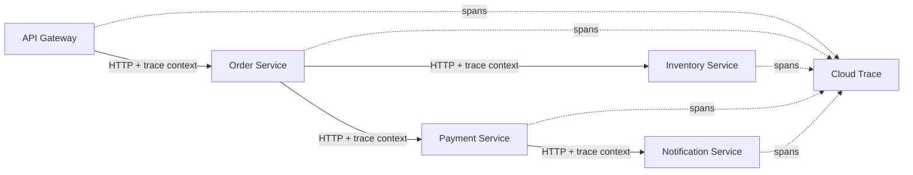

# How to Set Up Cross-Service Distributed Tracing in Cloud Trace for Microservices on GKE

Author: [nawazdhandala](https://www.github.com/nawazdhandala)

Tags: GCP, Cloud Trace, GKE, Microservices, Distributed Tracing

Description: A complete guide to implementing distributed tracing across multiple microservices running on GKE, with trace context propagation and Cloud Trace integration.

---

Microservices on GKE are great for development velocity, but they make debugging harder. A single user request might touch five or six services, and when something goes wrong, you need to trace the request across all of them. Without distributed tracing, you are left correlating timestamps and request IDs across different log streams, which is tedious and error-prone.

Cloud Trace with OpenTelemetry solves this by propagating trace context automatically across service boundaries. Every service adds its spans to the same trace, giving you a single waterfall view of the entire request. Here is how to set this up across multiple services on GKE.

## Architecture Overview

In a typical microservices setup on GKE, you have multiple services communicating over HTTP or gRPC. The tracing setup involves:

1. Each service runs the OpenTelemetry SDK with the Cloud Trace exporter
2. Trace context is propagated through HTTP headers (W3C Trace Context format)
3. All services export their spans to Cloud Trace, which assembles them into complete traces

Here is a visual representation of the trace flow:



## Step 1: Set Up GKE Workload Identity

Before your pods can export traces to Cloud Trace, they need the right permissions. Workload Identity is the recommended way to grant GCP permissions to GKE pods.

```bash
# Enable Workload Identity on the cluster (if not already enabled)
gcloud container clusters update my-cluster \
  --region=us-central1 \
  --workload-pool=YOUR_PROJECT_ID.svc.id.goog

# Create a GCP service account for tracing
gcloud iam service-accounts create trace-agent \
  --display-name="Cloud Trace Agent"

# Grant the Cloud Trace agent role
gcloud projects add-iam-policy-binding YOUR_PROJECT_ID \
  --member="serviceAccount:trace-agent@YOUR_PROJECT_ID.iam.gserviceaccount.com" \
  --role="roles/cloudtrace.agent"

# Create a Kubernetes service account
kubectl create serviceaccount trace-sa -n default

# Bind the K8s service account to the GCP service account
gcloud iam service-accounts add-iam-policy-binding \
  trace-agent@YOUR_PROJECT_ID.iam.gserviceaccount.com \
  --role="roles/iam.workloadIdentityUser" \
  --member="serviceAccount:YOUR_PROJECT_ID.svc.id.goog[default/trace-sa]"

# Annotate the K8s service account
kubectl annotate serviceaccount trace-sa \
  -n default \
  iam.gke.io/gcp-service-account=trace-agent@YOUR_PROJECT_ID.iam.gserviceaccount.com
```

## Step 2: Instrument the API Gateway (Node.js)

Here is the tracing configuration for a Node.js API gateway. The key is the auto-instrumentation, which handles both incoming and outgoing HTTP calls.

```javascript
// gateway/tracing.js - API Gateway tracing setup
const { NodeSDK } = require('@opentelemetry/sdk-node');
const { TraceExporter } = require('@google-cloud/opentelemetry-cloud-trace-exporter');
const { getNodeAutoInstrumentations } = require('@opentelemetry/auto-instrumentations-node');
const { Resource } = require('@opentelemetry/resources');
const { ParentBasedSampler, TraceIdRatioBasedSampler } = require('@opentelemetry/sdk-trace-base');

const sdk = new NodeSDK({
  resource: new Resource({
    'service.name': 'api-gateway',
    'service.version': process.env.VERSION || '1.0.0',
    'deployment.environment': process.env.ENV || 'production',
  }),
  traceExporter: new TraceExporter(),
  sampler: new ParentBasedSampler({
    root: new TraceIdRatioBasedSampler(0.1), // 10% sampling for new traces
  }),
  instrumentations: [
    getNodeAutoInstrumentations({
      '@opentelemetry/instrumentation-http': {
        // Ignore health checks to reduce noise
        ignoreIncomingPaths: ['/health', '/ready'],
      },
    }),
  ],
});

sdk.start();
```

The gateway's Express application just needs to require the tracing module first.

```javascript
// gateway/index.js - API Gateway application
require('./tracing');

const express = require('express');
const axios = require('axios');

const app = express();

// Route to order service - trace context propagates automatically via HTTP headers
app.post('/api/orders', async (req, res) => {
  try {
    const response = await axios.post(
      'http://order-service.default.svc.cluster.local:3001/orders',
      req.body
    );
    res.json(response.data);
  } catch (err) {
    res.status(500).json({ error: 'Order creation failed' });
  }
});

app.listen(3000);
```

## Step 3: Instrument the Order Service (Python)

The order service is written in Python. It needs its own OpenTelemetry setup, but the trace context propagation happens automatically through HTTP headers.

```python
# order-service/tracing.py - Order Service tracing setup
from opentelemetry import trace
from opentelemetry.sdk.trace import TracerProvider
from opentelemetry.sdk.trace.export import BatchSpanProcessor
from opentelemetry.sdk.trace.sampling import ParentBased, TraceIdRatioBased
from opentelemetry.exporter.cloud_trace import CloudTraceSpanExporter
from opentelemetry.sdk.resources import Resource
import os


def init_tracing():
    """Initialize OpenTelemetry for the Order Service."""
    resource = Resource.create({
        "service.name": "order-service",
        "service.version": os.environ.get("VERSION", "1.0.0"),
        "deployment.environment": os.environ.get("ENV", "production"),
    })

    # ParentBased sampler respects the gateway's sampling decision
    sampler = ParentBased(root=TraceIdRatioBased(0.1))

    provider = TracerProvider(resource=resource, sampler=sampler)
    exporter = CloudTraceSpanExporter()
    provider.add_span_processor(BatchSpanProcessor(exporter))
    trace.set_tracer_provider(provider)
```

```python
# order-service/app.py - Order Service application
from tracing import init_tracing
init_tracing()

from flask import Flask, request, jsonify
from opentelemetry.instrumentation.flask import FlaskInstrumentor
from opentelemetry.instrumentation.requests import RequestsInstrumentor
from opentelemetry import trace
import requests

app = Flask(__name__)
FlaskInstrumentor().instrument_app(app)
RequestsInstrumentor().instrument()

tracer = trace.get_tracer(__name__)

@app.route('/orders', methods=['POST'])
def create_order():
    """Create an order - calls inventory and payment services."""
    order_data = request.json

    with tracer.start_as_current_span("create_order") as span:
        span.set_attribute("order.items_count", len(order_data.get("items", [])))

        # Check inventory - trace context propagates automatically
        inventory_response = requests.post(
            "http://inventory-service.default.svc.cluster.local:3002/check",
            json={"items": order_data["items"]}
        )

        if inventory_response.status_code != 200:
            span.set_attribute("order.failed_reason", "inventory_unavailable")
            return jsonify({"error": "Items not available"}), 400

        # Process payment - trace context propagates automatically
        payment_response = requests.post(
            "http://payment-service.default.svc.cluster.local:3003/charge",
            json={"amount": order_data["total"], "currency": "USD"}
        )

        if payment_response.status_code != 200:
            span.set_attribute("order.failed_reason", "payment_failed")
            return jsonify({"error": "Payment failed"}), 400

        return jsonify({"order_id": "ord_123", "status": "created"}), 201
```

## Step 4: Instrument the Inventory Service (Go)

The inventory service is in Go. Same pattern - initialize OpenTelemetry, and the HTTP middleware handles context extraction.

```go
// inventory-service/main.go
package main

import (
	"encoding/json"
	"log"
	"net/http"

	"go.opentelemetry.io/contrib/instrumentation/net/http/otelhttp"
	"go.opentelemetry.io/otel"
	"go.opentelemetry.io/otel/attribute"
)

var tracer = otel.Tracer("inventory-service")

func checkInventory(w http.ResponseWriter, r *http.Request) {
	// The otelhttp middleware already extracted the trace context
	// This span becomes a child of the order-service span
	ctx, span := tracer.Start(r.Context(), "checkInventory")
	defer span.End()

	// Simulate inventory check
	span.SetAttributes(attribute.Int("items.checked", 3))
	span.SetAttributes(attribute.Bool("inventory.available", true))

	_ = ctx // Use ctx for any downstream calls

	w.Header().Set("Content-Type", "application/json")
	json.NewEncoder(w).Encode(map[string]bool{"available": true})
}

func main() {
	// Wrap the handler with OpenTelemetry HTTP middleware
	handler := otelhttp.NewHandler(
		http.HandlerFunc(checkInventory),
		"HTTP POST /check",
	)
	http.Handle("/check", handler)
	log.Fatal(http.ListenAndServe(":3002", nil))
}
```

## Step 5: Kubernetes Deployments

Here is a deployment manifest that uses the Workload Identity service account. Apply the same pattern to all your services.

```yaml
# k8s/order-service.yaml
apiVersion: apps/v1
kind: Deployment
metadata:
  name: order-service
spec:
  replicas: 2
  selector:
    matchLabels:
      app: order-service
  template:
    metadata:
      labels:
        app: order-service
    spec:
      # Use the service account with Cloud Trace permissions
      serviceAccountName: trace-sa
      containers:
        - name: order-service
          image: gcr.io/YOUR_PROJECT/order-service:latest
          ports:
            - containerPort: 3001
          env:
            - name: GOOGLE_CLOUD_PROJECT
              value: "YOUR_PROJECT_ID"
            - name: ENV
              value: "production"
            - name: VERSION
              value: "1.2.0"
---
apiVersion: v1
kind: Service
metadata:
  name: order-service
spec:
  selector:
    app: order-service
  ports:
    - port: 3001
      targetPort: 3001
```

## Step 6: Verify the Cross-Service Traces

After deploying all services, send a request to the API gateway and check Cloud Trace.

```bash
# Send a test request through the API gateway
curl -X POST http://GATEWAY_IP/api/orders \
  -H "Content-Type: application/json" \
  -d '{"items": [{"id": "item1", "qty": 2}], "total": 49.99}'
```

In the Cloud Console, go to **Trace > Trace Explorer**. You should see a trace with spans from all four services: api-gateway, order-service, inventory-service, and payment-service. The waterfall view will show the complete request flow.

## Troubleshooting Cross-Service Traces

If spans from different services show up as separate traces instead of one unified trace:

1. **Check context propagation**: Make sure the `traceparent` header (W3C Trace Context) is being forwarded between services. You can add logging to inspect incoming headers.

2. **Verify the sampling decision**: If Service A samples at 10% and Service B samples at 50%, and B does not use ParentBased sampling, B might create new traces instead of continuing existing ones. Always use ParentBased sampling on downstream services.

3. **Check timestamps**: Spans with timestamps outside the parent span's range may not be associated correctly. Make sure all your services have synchronized clocks (NTP is configured by default on GKE nodes).

## Wrapping Up

Cross-service distributed tracing on GKE requires consistent instrumentation across all your services, regardless of what language they are written in. The key ingredients are: OpenTelemetry SDK with Cloud Trace exporter in each service, ParentBased sampling to respect upstream decisions, and Workload Identity for permissions. Once it is working, you get a single waterfall view for every request that flows through your entire system.
