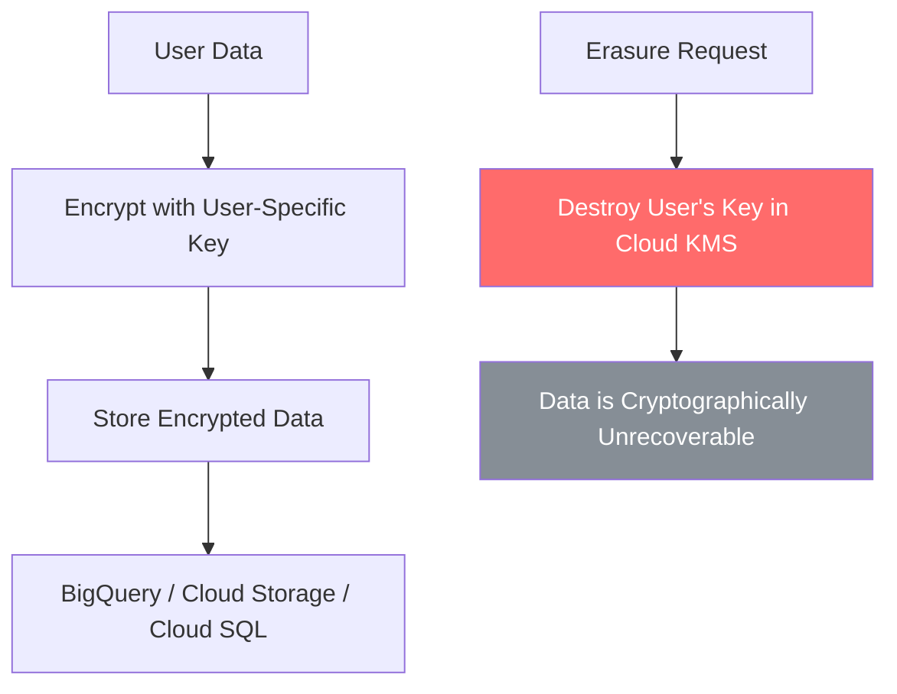

# How to Set Up Crypto-Shredding for GDPR Right-to-Erasure Compliance in Google Cloud

Author: [nawazdhandala](https://www.github.com/nawazdhandala)

Tags: GCP, Crypto-Shredding, GDPR, Cloud KMS, Data Privacy, Compliance

Description: Learn how to implement crypto-shredding on Google Cloud using Cloud KMS to achieve GDPR right-to-erasure compliance without scanning every data store for personal data.

---

When a user exercises their right to erasure under GDPR, you need to delete their personal data. Sounds straightforward until you realize that user data is spread across databases, analytics tables, backup snapshots, log files, caches, and data warehouse exports. Finding and deleting every copy is operationally painful and error-prone.

Crypto-shredding offers an alternative: instead of finding and deleting the actual data, you destroy the encryption key that protects it. The data still exists physically, but it is cryptographically unreadable - effectively deleted. This guide covers how to implement crypto-shredding on Google Cloud using Cloud KMS.

## How Crypto-Shredding Works

The core idea is simple:

1. Encrypt each user's personal data with a unique encryption key (or a key shared by a small group of users)
2. Store the encrypted data wherever you need it
3. When a user requests erasure, destroy their encryption key
4. The encrypted data becomes permanently unrecoverable



The advantage over traditional deletion is that you do not need to track every place the data was copied. As long as all copies were encrypted with the same key, destroying that key makes all copies unreadable.

## Designing the Key Hierarchy

The first decision is the key granularity. You have a few options:

- **Per-user key** - every user gets their own Cloud KMS key. Maximum isolation, highest key management overhead.
- **Per-group key** - users are grouped (e.g., by tenant, region, or cohort), and each group shares a key. When one user requests erasure, you re-encrypt the remaining users' data with a new key and destroy the old one.
- **Per-record key** - each data record has its own data encryption key (DEK), and those DEKs are wrapped with a user-level key encryption key (KEK) in Cloud KMS. This is the most practical approach for most systems.

For this guide, I will focus on the per-user KEK approach with envelope encryption, which balances operational simplicity with granular erasure capability.

## Setting Up the Key Infrastructure

Start by creating a key ring dedicated to user data encryption.

```bash
# Create a key ring for user data encryption keys
gcloud kms keyrings create user-data-keys \
  --location=us-central1 \
  --project=my-kms-project

# Create a user's key encryption key (KEK)
# This key wraps the data encryption keys used for this user
gcloud kms keys create user-12345-kek \
  --keyring=user-data-keys \
  --location=us-central1 \
  --purpose=encryption \
  --project=my-kms-project
```

For systems with many users, you will automate key creation as part of user registration.

## Implementing Envelope Encryption

Envelope encryption is the standard pattern for crypto-shredding. You generate a random data encryption key (DEK) for each piece of data, encrypt the data with the DEK, then encrypt (wrap) the DEK with the user's KEK in Cloud KMS. Store the wrapped DEK alongside the encrypted data.

Here is a Python implementation of the envelope encryption pattern.

```python
# Envelope encryption implementation for crypto-shredding
from google.cloud import kms
import os
from cryptography.fernet import Fernet
import base64

class CryptoShredder:
    """Handles envelope encryption with per-user KEKs for crypto-shredding."""

    def __init__(self, project_id, location, keyring):
        self.client = kms.KeyManagementServiceClient()
        self.project_id = project_id
        self.location = location
        self.keyring = keyring

    def _key_name(self, user_id):
        """Build the full Cloud KMS key resource name for a user."""
        return self.client.crypto_key_path(
            self.project_id, self.location,
            self.keyring, f"user-{user_id}-kek"
        )

    def create_user_key(self, user_id):
        """Create a new KEK for a user during registration."""
        parent = self.client.key_ring_path(
            self.project_id, self.location, self.keyring
        )
        key = self.client.create_crypto_key(
            request={
                "parent": parent,
                "crypto_key_id": f"user-{user_id}-kek",
                "crypto_key": {
                    "purpose": kms.CryptoKey.CryptoKeyPurpose.ENCRYPT_DECRYPT,
                },
            }
        )
        return key.name

    def encrypt_data(self, user_id, plaintext):
        """Encrypt data using envelope encryption with user's KEK."""
        # Generate a random DEK
        dek = Fernet.generate_key()
        fernet = Fernet(dek)

        # Encrypt the data with the DEK
        encrypted_data = fernet.encrypt(plaintext.encode('utf-8'))

        # Wrap the DEK with the user's KEK in Cloud KMS
        key_name = self._key_name(user_id)
        wrap_response = self.client.encrypt(
            request={
                "name": key_name,
                "plaintext": dek,
            }
        )

        # Return both the wrapped DEK and encrypted data
        return {
            "wrapped_dek": base64.b64encode(wrap_response.ciphertext).decode(),
            "encrypted_data": base64.b64encode(encrypted_data).decode(),
        }

    def decrypt_data(self, user_id, wrapped_dek_b64, encrypted_data_b64):
        """Decrypt data by unwrapping the DEK with user's KEK."""
        key_name = self._key_name(user_id)
        wrapped_dek = base64.b64decode(wrapped_dek_b64)

        # Unwrap the DEK using Cloud KMS
        unwrap_response = self.client.decrypt(
            request={
                "name": key_name,
                "ciphertext": wrapped_dek,
            }
        )

        # Decrypt the data with the unwrapped DEK
        dek = unwrap_response.plaintext
        fernet = Fernet(dek)
        encrypted_data = base64.b64decode(encrypted_data_b64)
        return fernet.decrypt(encrypted_data).decode('utf-8')

    def shred_user_data(self, user_id):
        """Destroy all key versions for a user, making their data unrecoverable."""
        key_name = self._key_name(user_id)

        # List all key versions
        versions = self.client.list_crypto_key_versions(
            request={"parent": key_name}
        )

        # Destroy each version
        for version in versions:
            if version.state != kms.CryptoKeyVersion.CryptoKeyVersionState.DESTROYED:
                self.client.destroy_crypto_key_version(
                    request={"name": version.name}
                )
                print(f"Destroyed key version: {version.name}")
```

## Storing Encrypted Data in BigQuery

When using crypto-shredding with BigQuery, store the wrapped DEK alongside the encrypted data in each row.

```sql
-- Table schema for crypto-shredded user data
CREATE TABLE `my-project.users.personal_data` (
  user_id STRING NOT NULL,
  wrapped_dek STRING NOT NULL,      -- Base64 wrapped DEK
  encrypted_name STRING,             -- Encrypted with row's DEK
  encrypted_email STRING,            -- Encrypted with row's DEK
  encrypted_address STRING,          -- Encrypted with row's DEK
  non_sensitive_region STRING,       -- Not encrypted, for querying
  non_sensitive_signup_date DATE,    -- Not encrypted, for querying
  created_at TIMESTAMP
);
```

Note that encrypted columns cannot be used in WHERE clauses or joins. Structure your schema so that query-relevant fields are stored unencrypted (and are non-sensitive), while PII is encrypted.

## Handling Erasure Requests

When a GDPR erasure request comes in, the process is:

1. Verify the request is legitimate
2. Destroy the user's KEK in Cloud KMS
3. Log the erasure action for compliance records
4. Optionally delete the encrypted (now unreadable) data to reclaim storage

```bash
# Destroy all versions of a user's KEK
# First, list all key versions
gcloud kms keys versions list \
  --key=user-12345-kek \
  --keyring=user-data-keys \
  --location=us-central1 \
  --project=my-kms-project

# Destroy each active version
gcloud kms keys versions destroy 1 \
  --key=user-12345-kek \
  --keyring=user-data-keys \
  --location=us-central1 \
  --project=my-kms-project
```

Important: Cloud KMS has a 24-hour delay before key destruction is final. During this window, the destruction can be reversed. After 24 hours, the key material is permanently deleted and the data is unrecoverable.

## Automating the Erasure Pipeline

For production systems, automate the erasure workflow with Cloud Functions and Pub/Sub.

```python
# Cloud Function that processes erasure requests from a Pub/Sub queue
import json
import base64
from google.cloud import kms
from google.cloud import bigquery
import datetime

def process_erasure_request(event, context):
    """Handle a GDPR erasure request by destroying the user's KEK."""
    # Parse the erasure request
    message = base64.b64decode(event['data']).decode('utf-8')
    request = json.loads(message)
    user_id = request['user_id']
    request_id = request['request_id']

    kms_client = kms.KeyManagementServiceClient()
    bq_client = bigquery.Client()

    # Build the key path
    key_path = kms_client.crypto_key_path(
        "my-kms-project", "us-central1",
        "user-data-keys", f"user-{user_id}-kek"
    )

    # Destroy all key versions
    versions = kms_client.list_crypto_key_versions(
        request={"parent": key_path}
    )

    destroyed_count = 0
    for version in versions:
        if version.state not in [
            kms.CryptoKeyVersion.CryptoKeyVersionState.DESTROYED,
            kms.CryptoKeyVersion.CryptoKeyVersionState.DESTROY_SCHEDULED
        ]:
            kms_client.destroy_crypto_key_version(
                request={"name": version.name}
            )
            destroyed_count += 1

    # Log the erasure action for compliance audit trail
    audit_row = {
        "request_id": request_id,
        "user_id": user_id,
        "action": "KEY_DESTROYED",
        "key_versions_destroyed": destroyed_count,
        "timestamp": datetime.datetime.utcnow().isoformat(),
    }

    table_ref = bq_client.dataset("compliance").table("erasure_audit_log")
    bq_client.insert_rows_json(table_ref, [audit_row])

    print(f"Erasure complete for user {user_id}: {destroyed_count} key versions destroyed")
```

## Limitations and Considerations

Crypto-shredding is powerful but not without trade-offs:

1. **Key management scale** - if you have millions of users, you will have millions of keys. Cloud KMS handles this, but costs add up (each key version has a monthly cost).

2. **Query limitations** - encrypted data cannot be searched, filtered, or joined in BigQuery. Design your schema to keep query-relevant non-sensitive fields unencrypted.

3. **Performance overhead** - envelope encryption adds latency for each read and write. For high-throughput systems, consider batching KMS operations.

4. **Backup complexity** - backups contain encrypted data. Restoring a backup after key destruction means the restored data for erased users is still unreadable, which is the desired outcome.

5. **Key destruction delay** - the 24-hour window before destruction is final is a safety feature, but it means erasure is not instantaneous. Document this in your privacy policy.

Crypto-shredding is not a replacement for good data architecture - you should still minimize what personal data you collect and where you store it. But when data does spread across multiple systems, crypto-shredding gives you a reliable way to render it unrecoverable without tracking down every last copy.
