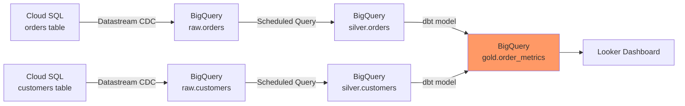

# How to Set Up Data Lineage Tracking Across GCP Data Pipelines Using Dataplex and Data Catalog

Author: [nawazdhandala](https://www.github.com/nawazdhandala)

Tags: GCP, Dataplex, Data Catalog, Data Lineage, Data Governance, BigQuery

Description: Learn how to track data lineage across your GCP data pipelines using Dataplex and Data Catalog to understand where data comes from and how it flows through your systems.

---

When something goes wrong with a report, the first question is always "where did this data come from?" Data lineage gives you the answer by tracking how data flows through your pipeline - from source to final output. On GCP, Data Catalog and Dataplex work together to provide automatic and custom lineage tracking across BigQuery, Cloud Storage, Dataflow, and other services. Here is how to set it up.

## What Data Lineage Tracks

Data lineage captures three key relationships:

- Where data comes from (upstream dependencies)
- What transformations are applied to it
- Where the data goes next (downstream consumers)

This forms a directed graph that you can traverse in either direction. When a table has bad data, trace upstream to find the source. When a source changes format, trace downstream to see what will break.



## Step 1: Enable Data Lineage API

Data lineage is built into the Data Catalog API. Enable it:

```bash
# Enable the Data Lineage API
gcloud services enable datalineage.googleapis.com

# Also make sure Data Catalog is enabled
gcloud services enable datacatalog.googleapis.com
```

## Step 2: Automatic Lineage from BigQuery

The good news is that BigQuery automatically captures lineage for many operations without any extra configuration. When you run a query that reads from one table and writes to another, BigQuery records that relationship.

```sql
-- This query automatically creates a lineage link:
-- raw.orders -> silver.orders
CREATE OR REPLACE TABLE `my-project.silver.orders` AS
SELECT
  order_id,
  customer_id,
  PARSE_DATE('%Y-%m-%d', order_date) AS order_date,
  LOWER(TRIM(status)) AS status,
  CAST(total_amount AS NUMERIC) AS total_amount
FROM `my-project.raw.orders`
WHERE order_id IS NOT NULL;
```

BigQuery also tracks lineage for:
- MERGE statements
- INSERT INTO ... SELECT queries
- CREATE TABLE AS SELECT
- Scheduled queries
- Materialized views

You can view this lineage in the BigQuery console under the "Lineage" tab of any table, or query it programmatically.

## Step 3: View Lineage Programmatically

Use the Data Lineage API to query lineage information:

```python
# view_lineage.py - Query data lineage for a BigQuery table
from google.cloud import datacatalog_lineage_v1

def get_table_lineage(project_id, dataset_id, table_id):
    """Retrieve upstream and downstream lineage for a BigQuery table."""
    client = datacatalog_lineage_v1.LineageClient()

    # Construct the fully qualified table name
    target = (
        f"//bigquery.googleapis.com/projects/{project_id}"
        f"/datasets/{dataset_id}/tables/{table_id}"
    )

    # Search for lineage links where this table is the target (upstream)
    print(f"\nUpstream sources for {table_id}:")
    print("-" * 50)

    request = datacatalog_lineage_v1.SearchLinksRequest(
        parent=f"projects/{project_id}/locations/us-central1",
        target=datacatalog_lineage_v1.EntityReference(
            fully_qualified_name=target
        ),
    )

    for link in client.search_links(request=request):
        source = link.source.fully_qualified_name
        print(f"  Source: {source}")
        print(f"  Process: {link.name}")
        print(f"  Start time: {link.start_time}")
        print()

    # Search for lineage links where this table is the source (downstream)
    print(f"\nDownstream consumers of {table_id}:")
    print("-" * 50)

    request = datacatalog_lineage_v1.SearchLinksRequest(
        parent=f"projects/{project_id}/locations/us-central1",
        source=datacatalog_lineage_v1.EntityReference(
            fully_qualified_name=target
        ),
    )

    for link in client.search_links(request=request):
        target_name = link.target.fully_qualified_name
        print(f"  Target: {target_name}")
        print(f"  Process: {link.name}")
        print()


# Check lineage for the silver orders table
get_table_lineage('my-project', 'silver', 'orders')
```

## Step 4: Add Custom Lineage for External Processes

Some data flows happen outside of BigQuery - for example, a Python script that reads from an API and writes to Cloud Storage, or a Dataflow job. For these, you can create custom lineage events:

```python
# custom_lineage.py - Record custom lineage for processes outside BigQuery
from google.cloud import datacatalog_lineage_v1
from google.protobuf import timestamp_pb2
import time

def create_custom_lineage(
    project_id,
    location,
    process_name,
    source_table,
    target_table
):
    """Create a custom lineage record for a data transformation."""
    client = datacatalog_lineage_v1.LineageClient()
    parent = f"projects/{project_id}/locations/{location}"

    # Step 1: Create a process (represents the transformation)
    process = datacatalog_lineage_v1.Process(
        display_name=process_name,
        attributes={
            "pipeline": datacatalog_lineage_v1.types.struct_pb2.Value(
                string_value="daily_etl"
            ),
            "owner": datacatalog_lineage_v1.types.struct_pb2.Value(
                string_value="data-engineering-team"
            ),
        }
    )

    created_process = client.create_process(
        parent=parent,
        process=process
    )
    print(f"Created process: {created_process.name}")

    # Step 2: Create a run (a specific execution of the process)
    now = timestamp_pb2.Timestamp()
    now.GetCurrentTime()

    run = datacatalog_lineage_v1.Run(
        display_name=f"{process_name}_run_{int(time.time())}",
        start_time=now,
        state=datacatalog_lineage_v1.Run.State.COMPLETED,
    )

    created_run = client.create_run(
        parent=created_process.name,
        run=run
    )
    print(f"Created run: {created_run.name}")

    # Step 3: Create a lineage event linking source to target
    event = datacatalog_lineage_v1.LineageEvent(
        start_time=now,
        links=[
            datacatalog_lineage_v1.EventLink(
                source=datacatalog_lineage_v1.EntityReference(
                    fully_qualified_name=source_table
                ),
                target=datacatalog_lineage_v1.EntityReference(
                    fully_qualified_name=target_table
                ),
            )
        ]
    )

    created_event = client.create_lineage_event(
        parent=created_run.name,
        lineage_event=event
    )
    print(f"Created lineage event: {created_event.name}")


# Example: Record lineage for a Dataflow pipeline that reads from
# Cloud Storage and writes to BigQuery
create_custom_lineage(
    project_id='my-project',
    location='us-central1',
    process_name='orders_ingestion_pipeline',
    source_table='//storage.googleapis.com/projects/my-project/buckets/raw-data/objects/orders/',
    target_table='//bigquery.googleapis.com/projects/my-project/datasets/raw/tables/orders'
)
```

## Step 5: Lineage with Data Catalog Tags

Enrich your lineage information by tagging tables with metadata in Data Catalog:

```python
# tag_lineage_metadata.py - Add pipeline metadata to Data Catalog entries
from google.cloud import datacatalog_v1

def tag_table_with_lineage_info(project_id, dataset_id, table_id, pipeline_info):
    """Tag a BigQuery table with lineage metadata."""
    client = datacatalog_v1.DataCatalogClient()

    # Look up the table entry
    resource = (
        f"//bigquery.googleapis.com/projects/{project_id}"
        f"/datasets/{dataset_id}/tables/{table_id}"
    )
    entry = client.lookup_entry(request={"linked_resource": resource})

    # Create a tag with pipeline lineage information
    tag = datacatalog_v1.Tag()
    tag.template = f"projects/{project_id}/locations/us-central1/tagTemplates/pipeline_lineage"
    tag.fields["source_system"] = datacatalog_v1.TagField(
        string_value=pipeline_info["source_system"]
    )
    tag.fields["pipeline_name"] = datacatalog_v1.TagField(
        string_value=pipeline_info["pipeline_name"]
    )
    tag.fields["refresh_frequency"] = datacatalog_v1.TagField(
        string_value=pipeline_info["refresh_frequency"]
    )
    tag.fields["last_successful_run"] = datacatalog_v1.TagField(
        string_value=pipeline_info["last_successful_run"]
    )

    created_tag = client.create_tag(parent=entry.name, tag=tag)
    return created_tag


# Tag the silver orders table with lineage info
tag_table_with_lineage_info(
    'my-project', 'silver', 'orders',
    {
        "source_system": "cloud-sql-production",
        "pipeline_name": "orders_bronze_to_silver",
        "refresh_frequency": "hourly",
        "last_successful_run": "2026-02-17T10:00:00Z"
    }
)
```

## Step 6: Integrate Lineage into Your CI/CD Pipeline

Add lineage validation to your deployment process:

```python
# validate_lineage.py - Check for broken lineage before deployment
from google.cloud import datacatalog_lineage_v1

def check_downstream_impact(project_id, location, table_fqn):
    """Find all downstream tables that depend on the given table."""
    client = datacatalog_lineage_v1.LineageClient()

    downstream = []
    to_visit = [table_fqn]
    visited = set()

    while to_visit:
        current = to_visit.pop(0)
        if current in visited:
            continue
        visited.add(current)

        # Find downstream consumers
        request = datacatalog_lineage_v1.SearchLinksRequest(
            parent=f"projects/{project_id}/locations/{location}",
            source=datacatalog_lineage_v1.EntityReference(
                fully_qualified_name=current
            ),
        )

        for link in client.search_links(request=request):
            target = link.target.fully_qualified_name
            downstream.append(target)
            to_visit.append(target)

    return downstream


# Before modifying a table, check what depends on it
source_table = "//bigquery.googleapis.com/projects/my-project/datasets/silver/tables/orders"
impacted = check_downstream_impact('my-project', 'us-central1', source_table)

print(f"\nTables impacted by changes to silver.orders:")
for table in impacted:
    print(f"  - {table}")
```

## Step 7: Build a Lineage Dashboard

Create a BigQuery view that summarizes your lineage relationships:

```sql
-- Create a summary of data pipeline dependencies
-- Query the lineage API results stored in a tracking table
CREATE OR REPLACE VIEW `my-project.governance.lineage_summary` AS
SELECT
  source_table,
  target_table,
  process_name,
  last_execution_time,
  execution_status,
  DATE_DIFF(CURRENT_DATE(), DATE(last_execution_time), DAY) AS days_since_last_run
FROM `my-project.governance.lineage_tracking`
ORDER BY last_execution_time DESC;
```

## Practical Tips

1. Enable automatic lineage capture first. BigQuery's built-in lineage tracking covers most use cases without any code changes. Only add custom lineage for processes that happen outside BigQuery.

2. Use meaningful process names in custom lineage events. Names like "daily_orders_etl" are much more useful than "process_001" when you are debugging an issue at 2 AM.

3. Review lineage before making schema changes. A simple column rename in a silver table could break ten downstream gold tables and five dashboards.

4. Integrate lineage into your documentation. The lineage graph is one of the best ways for new team members to understand how data flows through your organization.

5. Set up alerts for stale lineage. If a pipeline has not reported a successful run in longer than its expected schedule, something is probably broken.

Data lineage is one of those things that seems like overhead until you need it. When a quarterly financial report has wrong numbers and the CFO is asking questions, being able to trace the data from the report back through every transformation to the source system is invaluable. Set it up before you need it.
