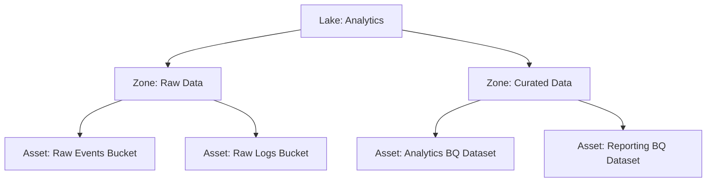

# How to Set Up Dataplex Data Zones and Assets for Centralized Data Lake Governance

Author: [nawazdhandala](https://www.github.com/nawazdhandala)

Tags: GCP, Dataplex, Data Lake, Data Governance, Data Zones

Description: Learn how to set up Dataplex data zones and assets on GCP to organize and govern your data lake with centralized metadata, security, and quality management.

---

As data lakes grow, they tend to become data swamps. Files scattered across Cloud Storage buckets, tables in BigQuery datasets, and nobody is sure which data is production-quality versus experimental. Dataplex solves this by providing a governance layer that organizes your data into logical structures - lakes, zones, and assets - without moving the data from where it already lives.

I set up Dataplex for an organization that had over 500 Cloud Storage buckets and 200 BigQuery datasets. Before Dataplex, finding the right data meant asking around on Slack. After organizing everything into zones and assets, teams could discover, understand, and trust the data they were using.

## Dataplex Concepts

Understanding the hierarchy is important before you start creating resources:

- **Lake**: The top-level container. Usually one per business domain or team. Think "Marketing Data Lake" or "Engineering Analytics Lake."
- **Zone**: A subdivision within a lake that groups data by quality level. Dataplex has two zone types: RAW (unvalidated, as-is data) and CURATED (validated, cleaned, production-ready data).
- **Asset**: A pointer to actual data - a Cloud Storage bucket or a BigQuery dataset. Assets map the physical storage to the logical organization.



## Creating a Dataplex Lake

Start by enabling the API and creating your first lake:

```bash
# Enable the Dataplex API
gcloud services enable dataplex.googleapis.com

# Create a lake for your analytics domain
gcloud dataplex lakes create analytics-lake \
  --location=us-central1 \
  --display-name="Analytics Data Lake" \
  --description="Central lake for all analytics data including raw ingestion and curated datasets" \
  --labels="team=data-engineering,env=production"

# Verify the lake was created
gcloud dataplex lakes describe analytics-lake \
  --location=us-central1
```

## Creating Data Zones

Create zones to separate data by quality level:

```bash
# Create a RAW zone for unprocessed, incoming data
# RAW zones accept data without schema validation
gcloud dataplex zones create raw-ingestion \
  --lake=analytics-lake \
  --location=us-central1 \
  --type=RAW \
  --resource-location-type=SINGLE_REGION \
  --display-name="Raw Ingestion Zone" \
  --description="Landing zone for raw, unvalidated data from source systems" \
  --discovery-enabled \
  --discovery-schedule="0 */6 * * *"

# Create a CURATED zone for validated, production-ready data
# CURATED zones enforce schema and format requirements
gcloud dataplex zones create curated-analytics \
  --lake=analytics-lake \
  --location=us-central1 \
  --type=CURATED \
  --resource-location-type=SINGLE_REGION \
  --display-name="Curated Analytics Zone" \
  --description="Production-ready, validated analytics data for reporting and ML" \
  --discovery-enabled \
  --discovery-schedule="0 */2 * * *"

# Create another curated zone for ML-specific data
gcloud dataplex zones create ml-features \
  --lake=analytics-lake \
  --location=us-central1 \
  --type=CURATED \
  --resource-location-type=SINGLE_REGION \
  --display-name="ML Features Zone" \
  --description="Curated feature tables for machine learning pipelines" \
  --discovery-enabled \
  --discovery-schedule="0 */4 * * *"
```

The `--discovery-enabled` flag tells Dataplex to automatically scan the zone's assets and catalog their schemas, partitions, and file formats.

## Adding Assets to Zones

Map your existing Cloud Storage buckets and BigQuery datasets to zones:

```bash
# Add a Cloud Storage bucket as an asset in the raw zone
gcloud dataplex assets create raw-events-bucket \
  --lake=analytics-lake \
  --zone=raw-ingestion \
  --location=us-central1 \
  --resource-type=STORAGE_BUCKET \
  --resource-name=projects/my-project/buckets/raw-events-data \
  --display-name="Raw Events Data" \
  --description="Incoming event data from application backends" \
  --discovery-enabled

# Add another Cloud Storage bucket
gcloud dataplex assets create raw-logs-bucket \
  --lake=analytics-lake \
  --zone=raw-ingestion \
  --location=us-central1 \
  --resource-type=STORAGE_BUCKET \
  --resource-name=projects/my-project/buckets/application-logs \
  --display-name="Application Logs" \
  --description="Raw application and infrastructure logs"

# Add a BigQuery dataset to the curated zone
gcloud dataplex assets create analytics-dataset \
  --lake=analytics-lake \
  --zone=curated-analytics \
  --location=us-central1 \
  --resource-type=BIGQUERY_DATASET \
  --resource-name=projects/my-project/datasets/analytics \
  --display-name="Analytics Dataset" \
  --description="Production analytics tables used for dashboards and reporting"

# Add a BigQuery dataset for ML features
gcloud dataplex assets create ml-features-dataset \
  --lake=analytics-lake \
  --zone=ml-features \
  --location=us-central1 \
  --resource-type=BIGQUERY_DATASET \
  --resource-name=projects/my-project/datasets/ml_features \
  --display-name="ML Feature Tables" \
  --description="Feature engineering outputs for ML training and serving"
```

## Configuring Automatic Discovery

Discovery automatically scans your assets to catalog table schemas and partition structures:

```bash
# Update discovery settings for a zone
# This controls how often Dataplex scans for new data and schema changes
gcloud dataplex zones update raw-ingestion \
  --lake=analytics-lake \
  --location=us-central1 \
  --discovery-enabled \
  --discovery-schedule="0 */2 * * *" \
  --discovery-include-patterns="**.parquet,**.json,**.csv" \
  --discovery-exclude-patterns="**/_temporary/**,**/staging/**"
```

Check what discovery has found:

```bash
# List discovered entities (tables/files) in a zone
gcloud dataplex content list \
  --lake=analytics-lake \
  --location=us-central1

# Get details about a specific discovered entity
gcloud dataplex entities list \
  --lake=analytics-lake \
  --zone=raw-ingestion \
  --location=us-central1
```

## Setting Up Access Control

Dataplex lets you manage access at the lake, zone, or asset level:

```bash
# Grant a team read access to the entire lake
gcloud dataplex lakes add-iam-policy-binding analytics-lake \
  --location=us-central1 \
  --member="group:analytics-team@example.com" \
  --role="roles/dataplex.dataReader"

# Grant data engineers full access to the raw zone
gcloud dataplex zones add-iam-policy-binding raw-ingestion \
  --lake=analytics-lake \
  --location=us-central1 \
  --member="group:data-engineering@example.com" \
  --role="roles/dataplex.dataEditor"

# Grant analysts read-only access to curated zone only
gcloud dataplex zones add-iam-policy-binding curated-analytics \
  --lake=analytics-lake \
  --location=us-central1 \
  --member="group:analysts@example.com" \
  --role="roles/dataplex.dataReader"
```

## Using the Dataplex API Programmatically

For automation, use the Dataplex Python client:

```python
# manage_dataplex.py
# Programmatically manage Dataplex lakes, zones, and assets
from google.cloud import dataplex_v1

def create_zone_with_assets(project_id, location, lake_id, zone_config):
    """Create a zone and add assets to it programmatically."""
    client = dataplex_v1.DataplexServiceClient()

    # Create the zone
    zone = dataplex_v1.Zone()
    zone.type_ = (
        dataplex_v1.Zone.Type.RAW
        if zone_config["type"] == "raw"
        else dataplex_v1.Zone.Type.CURATED
    )
    zone.display_name = zone_config["display_name"]
    zone.description = zone_config["description"]
    zone.resource_spec = dataplex_v1.Zone.ResourceSpec(
        location_type=dataplex_v1.Zone.ResourceSpec.LocationType.SINGLE_REGION,
    )
    zone.discovery_spec = dataplex_v1.Zone.DiscoverySpec(
        enabled=True,
        schedule="0 */6 * * *",
    )

    parent = f"projects/{project_id}/locations/{location}/lakes/{lake_id}"

    operation = client.create_zone(
        request=dataplex_v1.CreateZoneRequest(
            parent=parent,
            zone_id=zone_config["zone_id"],
            zone=zone,
        )
    )

    created_zone = operation.result()
    print(f"Zone created: {created_zone.name}")

    # Add assets to the zone
    for asset_config in zone_config.get("assets", []):
        asset = dataplex_v1.Asset()
        asset.display_name = asset_config["display_name"]
        asset.description = asset_config.get("description", "")
        asset.resource_spec = dataplex_v1.Asset.ResourceSpec(
            name=asset_config["resource_name"],
            type_=dataplex_v1.Asset.ResourceSpec.Type.STORAGE_BUCKET
            if asset_config["type"] == "gcs"
            else dataplex_v1.Asset.ResourceSpec.Type.BIGQUERY_DATASET,
        )
        asset.discovery_spec = dataplex_v1.Asset.DiscoverySpec(
            enabled=True,
        )

        asset_operation = client.create_asset(
            request=dataplex_v1.CreateAssetRequest(
                parent=created_zone.name,
                asset_id=asset_config["asset_id"],
                asset=asset,
            )
        )

        created_asset = asset_operation.result()
        print(f"Asset created: {created_asset.name}")

# Example usage
create_zone_with_assets(
    project_id="my-project",
    location="us-central1",
    lake_id="analytics-lake",
    zone_config={
        "zone_id": "experimental",
        "type": "raw",
        "display_name": "Experimental Zone",
        "description": "Zone for experimental and sandbox data",
        "assets": [
            {
                "asset_id": "sandbox-bucket",
                "display_name": "Sandbox Data",
                "type": "gcs",
                "resource_name": "projects/my-project/buckets/sandbox-data",
            },
        ],
    },
)
```

## Monitoring Your Data Lake

Check the health and status of your Dataplex organization:

```bash
# List all lakes in a region
gcloud dataplex lakes list --location=us-central1

# List zones in a lake
gcloud dataplex zones list \
  --lake=analytics-lake \
  --location=us-central1

# List assets in a zone with their status
gcloud dataplex assets list \
  --lake=analytics-lake \
  --zone=raw-ingestion \
  --location=us-central1 \
  --format="table(name, displayName, state, resourceSpec.type)"

# Check for any issues with assets
gcloud dataplex assets describe raw-events-bucket \
  --lake=analytics-lake \
  --zone=raw-ingestion \
  --location=us-central1 \
  --format="yaml(state, resourceStatus, discoveryStatus)"
```

## Best Practices

Here are some organizational patterns that work well:

```bash
# Pattern 1: Separate lakes by business domain
gcloud dataplex lakes create marketing-lake --location=us-central1
gcloud dataplex lakes create finance-lake --location=us-central1
gcloud dataplex lakes create product-lake --location=us-central1

# Pattern 2: Common zone structure across lakes
# Each lake gets raw, staging, and curated zones
for lake in marketing-lake finance-lake product-lake; do
  gcloud dataplex zones create raw \
    --lake=$lake --location=us-central1 --type=RAW \
    --resource-location-type=SINGLE_REGION --discovery-enabled

  gcloud dataplex zones create staging \
    --lake=$lake --location=us-central1 --type=RAW \
    --resource-location-type=SINGLE_REGION --discovery-enabled

  gcloud dataplex zones create curated \
    --lake=$lake --location=us-central1 --type=CURATED \
    --resource-location-type=SINGLE_REGION --discovery-enabled
done
```

## Summary

Dataplex data zones and assets bring order to your data lake without requiring you to move data. Create lakes for business domains, zones for data quality levels (RAW vs CURATED), and assets to map your existing Cloud Storage buckets and BigQuery datasets into the logical structure. Enable automatic discovery to catalog schemas and partitions, and use IAM at each level to control access. The result is a governed data lake where teams can discover, understand, and trust the data they are working with, all managed through a single control plane.
