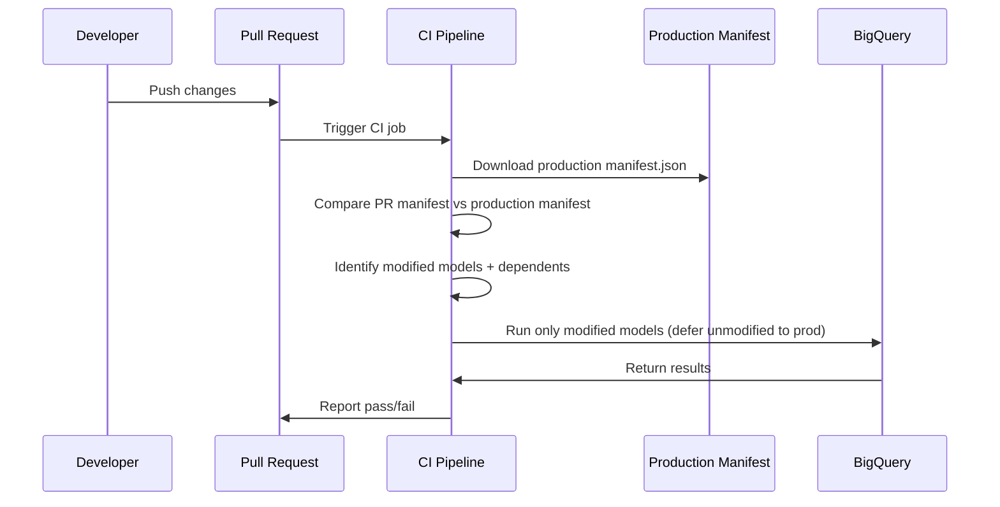

# How to Set Up dbt Slim CI with BigQuery for Cost-Efficient Pull Request Testing

Author: [nawazdhandala](https://www.github.com/nawazdhandala)

Tags: GCP, BigQuery, dbt, Slim CI, CI/CD, Cost Optimization

Description: Learn how to set up dbt Slim CI with BigQuery to test only modified models and their dependents on pull requests, dramatically reducing CI costs and execution time.

---

As dbt projects grow, running the full pipeline on every pull request becomes painfully slow and expensive. A project with 500 models might take 45 minutes and scan terabytes of data in BigQuery, all to validate a change in a single model. Slim CI solves this by comparing the PR branch to the production state and only building what changed plus its downstream dependents.

The concept is simple: why rebuild 500 models when only 3 changed? dbt's state comparison features make this possible, and setting it up with BigQuery requires a few specific configurations to get right.

## How Slim CI Works

Slim CI relies on dbt's state comparison. Every dbt run produces a `manifest.json` file that describes every model, its SQL, its configuration, and its dependencies. By comparing the manifest from your PR branch against the production manifest, dbt can identify exactly which models changed.

The flow looks like this:



## Setting Up the Production Manifest

First, your production dbt run needs to save its manifest somewhere accessible. The easiest approach with GCP is to upload it to a Cloud Storage bucket after each production run:

```bash
# In your production dbt pipeline, after the run completes
# Upload the manifest to GCS for CI to reference

# Run the production pipeline
dbt run --target prod
dbt test --target prod

# Upload the manifest to a known GCS location
gsutil cp target/manifest.json gs://my-dbt-artifacts/prod/manifest.json
```

If you are using Cloud Build for your CI pipeline, the build config looks like this:

```yaml
# cloudbuild-prod.yaml
# Production deployment that saves the manifest for CI to use
steps:
  # Install dbt
  - name: 'python:3.11'
    entrypoint: 'pip'
    args: ['install', 'dbt-bigquery']

  # Run the full production pipeline
  - name: 'python:3.11'
    entrypoint: 'dbt'
    args: ['run', '--target', 'prod', '--profiles-dir', '.']
    env:
      - 'DBT_PROFILES_DIR=.'

  # Run tests
  - name: 'python:3.11'
    entrypoint: 'dbt'
    args: ['test', '--target', 'prod', '--profiles-dir', '.']

  # Save the manifest for Slim CI
  - name: 'gcr.io/cloud-builders/gsutil'
    args: ['cp', 'target/manifest.json', 'gs://my-dbt-artifacts/prod/manifest.json']
```

## Setting Up the CI Pipeline

The CI pipeline downloads the production manifest, compares it against the current branch, and only builds what changed:

```yaml
# cloudbuild-ci.yaml
# Slim CI pipeline that only builds modified models
steps:
  # Install dbt
  - name: 'python:3.11'
    entrypoint: 'pip'
    args: ['install', 'dbt-bigquery']

  # Download the production manifest
  - name: 'gcr.io/cloud-builders/gsutil'
    args: ['cp', 'gs://my-dbt-artifacts/prod/manifest.json', 'target-prod/manifest.json']

  # Compile the current branch to generate its manifest
  - name: 'python:3.11'
    entrypoint: 'dbt'
    args: ['compile', '--target', 'ci', '--profiles-dir', '.']

  # Run only modified models and their dependents
  # Defer unmodified models to the production dataset
  - name: 'python:3.11'
    entrypoint: 'dbt'
    args: [
      'build',
      '--target', 'ci',
      '--profiles-dir', '.',
      '--select', 'state:modified+',
      '--defer',
      '--state', 'target-prod'
    ]
```

The key flags here:

- `--select state:modified+`: Only select models that changed (compared to the production manifest) plus all their downstream dependents
- `--defer`: For any model that is not selected (unchanged upstream models), use the production version instead of rebuilding
- `--state target-prod`: The directory containing the production manifest.json

## Configuring the CI Profile

The CI target needs its own BigQuery dataset to avoid conflicting with production:

```yaml
# profiles.yml
my_analytics:
  target: dev
  outputs:
    dev:
      type: bigquery
      method: oauth
      project: my-gcp-project
      dataset: dbt_dev
      threads: 4
      location: US

    prod:
      type: bigquery
      method: service-account
      project: my-gcp-project
      dataset: analytics
      threads: 8
      keyfile: /secrets/prod-key.json
      location: US

    ci:
      type: bigquery
      method: service-account
      project: my-gcp-project
      # Use a PR-specific dataset to avoid conflicts between concurrent PRs
      dataset: "dbt_ci_pr_{{ env_var('PR_NUMBER', 'default') }}"
      threads: 4
      keyfile: /secrets/ci-key.json
      location: US
```

The PR-specific dataset name prevents conflicts when multiple PRs run CI simultaneously.

## GitHub Actions Setup

If you are using GitHub Actions instead of Cloud Build:

```yaml
# .github/workflows/dbt-ci.yml
name: dbt Slim CI

on:
  pull_request:
    branches: [main]

jobs:
  dbt-ci:
    runs-on: ubuntu-latest
    steps:
      - uses: actions/checkout@v4

      - name: Set up Python
        uses: actions/setup-python@v5
        with:
          python-version: '3.11'

      - name: Install dbt
        run: pip install dbt-bigquery

      # Authenticate with GCP using Workload Identity Federation
      - name: Authenticate to Google Cloud
        uses: google-github-actions/auth@v2
        with:
          workload_identity_provider: 'projects/123/locations/global/workloadIdentityPools/my-pool/providers/github'
          service_account: 'dbt-ci@my-project.iam.gserviceaccount.com'

      # Download the production manifest
      - name: Download production manifest
        run: |
          mkdir -p target-prod
          gsutil cp gs://my-dbt-artifacts/prod/manifest.json target-prod/manifest.json

      # Run Slim CI
      - name: dbt build (modified only)
        run: |
          dbt build \
            --target ci \
            --profiles-dir . \
            --select state:modified+ \
            --defer \
            --state target-prod
        env:
          PR_NUMBER: ${{ github.event.pull_request.number }}

      # Clean up the CI dataset after tests pass
      - name: Cleanup CI dataset
        if: always()
        run: |
          bq rm -r -f my-gcp-project:dbt_ci_pr_${{ github.event.pull_request.number }}
```

## Understanding State Selection

dbt's state comparison detects several types of changes:

```bash
# Models where the SQL has changed
dbt ls --select state:modified

# Modified models plus all downstream dependents
dbt ls --select state:modified+

# Modified models plus one level of downstream dependents
dbt ls --select state:modified+1

# Only new models that do not exist in the production state
dbt ls --select state:new

# Models with changed configuration (e.g., materialization changed)
dbt ls --select config.materialized:table,state:modified
```

For CI, `state:modified+` is usually the right choice. It catches both the changed model and anything downstream that might be affected.

## Handling Deferred References

When dbt defers to production, it replaces `{{ ref('unchanged_model') }}` with a direct reference to the production table. Here is what happens under the hood:

```sql
-- Original model SQL
SELECT * FROM {{ ref('stg_customers') }}
JOIN {{ ref('stg_orders') }} USING (customer_id)

-- If stg_customers was modified but stg_orders was not:
-- Compiled SQL in CI (with --defer):
SELECT * FROM `my-project.dbt_ci_pr_42.stg_customers`  -- CI version (rebuilt)
JOIN `my-project.analytics.stg_orders` USING (customer_id)  -- Production version (deferred)
```

This means your CI build reads unchanged data directly from production, which is both fast (no rebuilding) and accurate (uses real data).

## Cost Comparison

Here is a rough comparison of full CI vs. Slim CI for a typical project:

```
Project: 300 models, 50TB total data

Full CI (every PR):
  - Models built: 300
  - Data scanned: ~50TB per run
  - Time: ~45 minutes
  - Cost: ~$250 per run (at $5/TB)

Slim CI (typical PR touches 5 models):
  - Models built: 5 (modified) + ~15 (dependents) = 20
  - Data scanned: ~3TB per run
  - Time: ~5 minutes
  - Cost: ~$15 per run
```

That is a 94% reduction in cost and a 89% reduction in time. Multiply that by the number of PRs your team opens per day, and the savings are substantial.

## Cleaning Up CI Datasets

CI datasets should not persist indefinitely. Add cleanup as part of your CI pipeline or as a scheduled job:

```bash
# Script to clean up old CI datasets
# Run daily to remove datasets from merged or closed PRs

#!/bin/bash

# List all CI datasets
for dataset in $(bq ls --format=json my-gcp-project | jq -r '.[].datasetReference.datasetId' | grep "^dbt_ci_pr_"); do
  # Extract PR number from dataset name
  pr_number=$(echo $dataset | sed 's/dbt_ci_pr_//')

  # Check if the PR is still open using GitHub API
  state=$(gh pr view $pr_number --json state --jq '.state' 2>/dev/null)

  if [ "$state" != "OPEN" ]; then
    echo "Removing dataset: $dataset (PR $pr_number is $state)"
    bq rm -r -f "my-gcp-project:$dataset"
  fi
done
```

## Troubleshooting Common Issues

If state comparison is not detecting changes, make sure the production manifest is up to date. An outdated manifest means dbt thinks nothing has changed.

If deferred references fail, check that the production tables exist and the CI service account has read access to the production dataset.

If CI builds are slower than expected, check that the CI dataset is in the same BigQuery location as the production dataset. Cross-region reads are much slower.

## Wrapping Up

Slim CI is one of the highest-impact optimizations you can make in a dbt project. By comparing your PR branch against the production state and only building what changed, you cut CI costs by 90% or more while actually getting faster feedback. The setup requires storing the production manifest and configuring the `--defer` and `--state` flags, but once it is in place, every PR automatically benefits. For teams running dbt on BigQuery, this should be a standard part of your CI pipeline.
