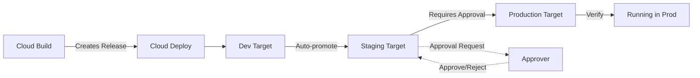

# How to Set Up Deployment Approvals and Promotion Gates Using Cloud Deploy for GKE

Author: [nawazdhandala](https://www.github.com/nawazdhandala)

Tags: GCP, Cloud Deploy, GKE, Deployment Approvals, CI/CD, DevOps

Description: Step-by-step guide to configuring Cloud Deploy delivery pipelines with approval gates, promotion workflows, and automated rollback for GKE deployments.

---

Pushing code straight to production without any human checkpoint works fine for personal projects, but most teams need some form of approval process between environments. Google Cloud Deploy provides a managed continuous delivery service that handles environment promotion with built-in approval gates, and it integrates naturally with GKE. This guide walks through setting up a full delivery pipeline with approvals.

## What Cloud Deploy Brings to the Table

Cloud Deploy sits between your CI system (Cloud Build, typically) and your target environments. It manages releases as first-class objects, tracks what version is running where, and enforces promotion rules between environments. Instead of your CI pipeline directly deploying to each environment, it creates a release that flows through a defined pipeline.

## The Delivery Pipeline Architecture

Here is what the complete flow looks like:



## Step 1: Create Your GKE Targets

First, define the target environments. Each target represents a GKE cluster and namespace:

```yaml
# targets/dev.yaml - Development target definition
apiVersion: deploy.cloud.google.com/v1
kind: Target
metadata:
  name: dev-target
description: Development environment
gke:
  cluster: projects/my-project/locations/us-central1/clusters/dev-cluster
  internalIp: false
executionConfigs:
  - usages:
      - RENDER
      - DEPLOY
    serviceAccount: cloud-deploy-sa@my-project.iam.gserviceaccount.com
```

```yaml
# targets/staging.yaml - Staging target definition
apiVersion: deploy.cloud.google.com/v1
kind: Target
metadata:
  name: staging-target
description: Staging environment
gke:
  cluster: projects/my-project/locations/us-central1/clusters/staging-cluster
  internalIp: false
executionConfigs:
  - usages:
      - RENDER
      - DEPLOY
    serviceAccount: cloud-deploy-sa@my-project.iam.gserviceaccount.com
```

```yaml
# targets/production.yaml - Production target with approval required
apiVersion: deploy.cloud.google.com/v1
kind: Target
metadata:
  name: prod-target
description: Production environment
requireApproval: true  # This is the key setting
gke:
  cluster: projects/my-project/locations/us-central1/clusters/prod-cluster
  internalIp: false
executionConfigs:
  - usages:
      - RENDER
      - DEPLOY
    serviceAccount: cloud-deploy-sa@my-project.iam.gserviceaccount.com
```

Register these targets with Cloud Deploy:

```bash
# Register all three targets
gcloud deploy apply --file=targets/dev.yaml --region=us-central1
gcloud deploy apply --file=targets/staging.yaml --region=us-central1
gcloud deploy apply --file=targets/production.yaml --region=us-central1
```

## Step 2: Define the Delivery Pipeline

The pipeline specifies the order of targets and the promotion rules between them:

```yaml
# pipeline.yaml - Delivery pipeline with three stages
apiVersion: deploy.cloud.google.com/v1
kind: DeliveryPipeline
metadata:
  name: myapp-pipeline
description: Main delivery pipeline for myapp
serialPipeline:
  stages:
    - targetId: dev-target
      profiles:
        - dev
      strategy:
        standard:
          verify: true  # Run verification after deployment
    - targetId: staging-target
      profiles:
        - staging
      strategy:
        standard:
          verify: true
    - targetId: prod-target
      profiles:
        - production
      strategy:
        standard:
          verify: true
          predeploy:
            actions:
              - "pre-deploy-check"
          postdeploy:
            actions:
              - "post-deploy-smoke-test"
```

Apply the pipeline:

```bash
# Create the delivery pipeline
gcloud deploy apply --file=pipeline.yaml --region=us-central1
```

## Step 3: Set Up Skaffold for Rendering

Cloud Deploy uses Skaffold to render and deploy Kubernetes manifests. Create a skaffold.yaml that defines how to build and deploy your application:

```yaml
# skaffold.yaml - Skaffold configuration for Cloud Deploy
apiVersion: skaffold/v4beta7
kind: Config
metadata:
  name: myapp
profiles:
  # Dev profile - fewer replicas, debug logging
  - name: dev
    manifests:
      kustomize:
        paths:
          - k8s/overlays/dev
    deploy:
      kubectl: {}
    verify:
      - name: verify-deployment
        container:
          name: verify
          image: gcr.io/cloud-builders/kubectl
          command: ["/bin/sh"]
          args:
            - "-c"
            - |
              kubectl rollout status deployment/myapp -n dev --timeout=120s

  # Staging profile - production-like but smaller
  - name: staging
    manifests:
      kustomize:
        paths:
          - k8s/overlays/staging
    deploy:
      kubectl: {}
    verify:
      - name: verify-deployment
        container:
          name: verify
          image: gcr.io/cloud-builders/kubectl
          command: ["/bin/sh"]
          args:
            - "-c"
            - |
              kubectl rollout status deployment/myapp -n staging --timeout=120s

  # Production profile - full scale with smoke tests
  - name: production
    manifests:
      kustomize:
        paths:
          - k8s/overlays/production
    deploy:
      kubectl: {}
    verify:
      - name: smoke-test
        container:
          name: smoke-test
          image: curlimages/curl
          command: ["/bin/sh"]
          args:
            - "-c"
            - |
              # Wait for the service to be reachable and verify response
              for i in $(seq 1 30); do
                if curl -sf http://myapp.production.svc.cluster.local/healthz; then
                  echo "Smoke test passed"
                  exit 0
                fi
                sleep 2
              done
              echo "Smoke test failed"
              exit 1
```

## Step 4: Configure IAM for Approvals

Grant specific users or groups the ability to approve deployments:

```bash
# Grant the approval role to a specific user
gcloud projects add-iam-policy-binding my-project \
  --member="user:team-lead@company.com" \
  --role="roles/clouddeploy.approver"

# Or grant it to a Google Group
gcloud projects add-iam-policy-binding my-project \
  --member="group:release-managers@company.com" \
  --role="roles/clouddeploy.approver"
```

The Cloud Deploy service account also needs permissions:

```bash
# Grant Cloud Deploy SA the necessary roles
gcloud projects add-iam-policy-binding my-project \
  --member="serviceAccount:cloud-deploy-sa@my-project.iam.gserviceaccount.com" \
  --role="roles/container.developer"

gcloud iam service-accounts add-iam-policy-binding \
  cloud-deploy-sa@my-project.iam.gserviceaccount.com \
  --member="serviceAccount:$(gcloud projects describe my-project --format='value(projectNumber)')@gcp-sa-clouddeploy.iam.gserviceaccount.com" \
  --role="roles/iam.serviceAccountUser"
```

## Step 5: Create a Release from Cloud Build

Modify your Cloud Build pipeline to create a Cloud Deploy release instead of deploying directly:

```yaml
# cloudbuild.yaml - Creates a release in Cloud Deploy
steps:
  # Build the container image
  - name: 'gcr.io/cloud-builders/docker'
    args:
      - 'build'
      - '-t'
      - 'us-docker.pkg.dev/my-project/repo/myapp:${SHORT_SHA}'
      - '.'
    id: 'build'

  # Push the image
  - name: 'gcr.io/cloud-builders/docker'
    args:
      - 'push'
      - 'us-docker.pkg.dev/my-project/repo/myapp:${SHORT_SHA}'
    waitFor: ['build']
    id: 'push'

  # Create a Cloud Deploy release
  - name: 'gcr.io/google.com/cloudsdktool/cloud-sdk'
    entrypoint: 'gcloud'
    args:
      - 'deploy'
      - 'releases'
      - 'create'
      - 'release-${SHORT_SHA}'
      - '--delivery-pipeline=myapp-pipeline'
      - '--region=us-central1'
      - '--images=myapp=us-docker.pkg.dev/my-project/repo/myapp:${SHORT_SHA}'
      - '--skaffold-file=skaffold.yaml'
    waitFor: ['push']
    id: 'create-release'
```

## Step 6: Promoting and Approving Releases

Once a release is created, it automatically deploys to the first stage (dev). After dev verification passes, promote to staging:

```bash
# Promote the release to the next stage (staging)
gcloud deploy releases promote \
  --release=release-abc123 \
  --delivery-pipeline=myapp-pipeline \
  --region=us-central1
```

When the release reaches the production stage, it will pause and wait for approval:

```bash
# List pending approvals
gcloud deploy rollouts list \
  --delivery-pipeline=myapp-pipeline \
  --release=release-abc123 \
  --region=us-central1 \
  --filter="approvalState=NEEDS_APPROVAL"

# Approve the rollout to production
gcloud deploy rollouts approve prod-target-rollout-001 \
  --delivery-pipeline=myapp-pipeline \
  --release=release-abc123 \
  --region=us-central1
```

## Step 7: Automated Notifications

Set up Pub/Sub notifications so approvers get alerted when a deployment needs their attention:

```bash
# Cloud Deploy automatically publishes to the clouddeploy-approvals topic
# Create a subscription for email notifications
gcloud pubsub subscriptions create approval-notifications \
  --topic=clouddeploy-approvals \
  --push-endpoint=https://your-notification-service.run.app/notify
```

You can also use Cloud Functions to process these events:

```python
# cloud_function.py - Sends Slack notifications for pending approvals
import functions_framework
import json
import requests

@functions_framework.cloud_event
def notify_approval(cloud_event):
    """Triggered by Pub/Sub message from Cloud Deploy."""
    data = json.loads(cloud_event.data["message"]["data"])

    # Check if this is an approval-needed event
    if data.get("approvalState") == "NEEDS_APPROVAL":
        pipeline = data.get("deliveryPipeline", "unknown")
        release = data.get("release", "unknown")

        # Send Slack notification
        slack_message = {
            "text": f"Deployment approval needed for {release} in pipeline {pipeline}. "
                    f"Review and approve at: https://console.cloud.google.com/deploy"
        }
        requests.post(SLACK_WEBHOOK_URL, json=slack_message)
```

## Step 8: Automated Rollback

If a deployment fails verification, you can configure automatic rollback or trigger it manually:

```bash
# Roll back to the previous release
gcloud deploy targets rollback prod-target \
  --delivery-pipeline=myapp-pipeline \
  --region=us-central1

# Or roll back to a specific release
gcloud deploy rollouts create rollback-001 \
  --delivery-pipeline=myapp-pipeline \
  --release=release-previous \
  --region=us-central1 \
  --rollout-id=rollback-001
```

## Putting It All Together

The beauty of Cloud Deploy is that it makes the release process visible and auditable. You can see exactly which version is running in each environment, who approved each production deployment, and when each promotion happened. The approval gate ensures that a human reviews the staging deployment results before production gets updated, while the automated verification steps catch obvious issues without human intervention.

For most teams, this is the right balance between speed and safety - dev deploys automatically, staging promotes with a button click, and production requires explicit approval from a designated team member.
