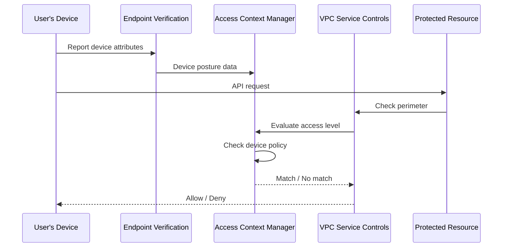

# How to Set Up Device Policy Access Levels with Endpoint Verification in GCP

Author: [nawazdhandala](https://www.github.com/nawazdhandala)

Tags: GCP, Access Context Manager, Endpoint Verification, Device Policy, Zero Trust

Description: Learn how to set up device policy access levels with Endpoint Verification in Google Cloud to enforce context-aware access based on device security posture.

---

IP-based access levels are a solid starting point, but they have limitations. A compromised device on your corporate network would still pass the IP check. Device policy access levels add another layer by checking the security posture of the device making the request - whether it has a screen lock, whether the OS is up to date, whether the disk is encrypted, and more.

This is a core component of Google's BeyondCorp zero-trust model. Instead of trusting a device just because it is on the right network, you verify that the device itself meets your security standards before granting access.

Endpoint Verification is the tool that collects device information. It runs as a Chrome extension and a native helper application on user devices, reporting device attributes to Google Cloud.

## How It Works



## Prerequisites

- Google Workspace or Cloud Identity Premium license (for device management)
- Access Context Manager configured with an access policy
- The `roles/accesscontextmanager.policyAdmin` role
- Chrome browser on user devices

## Step 1: Enable Endpoint Verification

Endpoint Verification needs to be enabled in your Google Workspace admin console.

1. Go to admin.google.com
2. Navigate to Devices > Mobile & endpoints > Settings > Universal
3. Enable Endpoint Verification
4. Under "Endpoint Verification", toggle "Enable Endpoint Verification"

You can also force-install the Endpoint Verification Chrome extension via policy:

```
Extension ID: callobklhcbilhphinckomhgkigmfocg
```

In the Admin console: Devices > Chrome > Apps & Extensions > Users & Browsers, add the extension and set it to "Force install".

## Step 2: Deploy the Endpoint Verification Helper

The Chrome extension alone provides basic device info, but the native helper application provides more detailed attributes like disk encryption status.

Users can install it from the Chrome Web Store, or you can deploy it through your MDM solution:

- **macOS**: Deploy via MDM or `brew install --cask endpoint-verification`
- **Windows**: Deploy via Group Policy or SCCM
- **Linux**: Available as a DEB or RPM package

## Step 3: Verify Device Enrollment

Once Endpoint Verification is deployed, check that devices are reporting in.

In the Admin console:
1. Go to Devices > Endpoints
2. You should see a list of devices with their attributes

You can also check via the API:

```bash
# List enrolled devices (requires Directory API access)
gcloud endpoint-verification list \
  --organization=ORGANIZATION_ID
```

## Step 4: Create a Basic Device Policy Access Level

Start with a simple policy that requires screen lock.

```yaml
# basic-device-spec.yaml
conditions:
  - devicePolicy:
      requireScreenlock: true
```

```bash
# Create the access level
gcloud access-context-manager levels create basic-device-trust \
  --title="Basic Device Trust - Screen Lock Required" \
  --basic-level-spec=basic-device-spec.yaml \
  --policy=$ACCESS_POLICY_ID
```

## Step 5: Create a Strict Device Policy

For more sensitive resources, require additional device attributes.

```yaml
# strict-device-spec.yaml
conditions:
  - devicePolicy:
      requireScreenlock: true
      allowedEncryptionStatuses:
        - ENCRYPTED
      osConstraints:
        - osType: DESKTOP_MAC
          minimumVersion: "13.0.0"
        - osType: DESKTOP_WINDOWS
          minimumVersion: "10.0.19045"
        - osType: DESKTOP_CHROME_OS
          requireVerifiedChromeOs: true
```

This requires:
- Screen lock enabled
- Full disk encryption
- Minimum OS versions (macOS 13+, Windows 10 22H2+, or verified Chrome OS)

```bash
# Create the strict access level
gcloud access-context-manager levels create strict-device-trust \
  --title="Strict Device Trust - Encryption and OS Version" \
  --basic-level-spec=strict-device-spec.yaml \
  --policy=$ACCESS_POLICY_ID
```

## Step 6: Combine Device Policy with IP Range

For the strongest access control, require both a trusted network and a trusted device.

```yaml
# combined-trust-spec.yaml
conditions:
  - ipSubnetworks:
      - 203.0.113.0/24
      - 198.51.100.0/24
    devicePolicy:
      requireScreenlock: true
      allowedEncryptionStatuses:
        - ENCRYPTED
```

When `ipSubnetworks` and `devicePolicy` are in the same condition, both must be true (AND logic).

```bash
# Create the combined access level
gcloud access-context-manager levels create full-trust \
  --title="Full Trust - Network and Device" \
  --basic-level-spec=combined-trust-spec.yaml \
  --policy=$ACCESS_POLICY_ID
```

## Step 7: Apply the Device Policy Access Level

Add the access level to your VPC Service Controls perimeter.

```bash
# Add the device policy access level to the perimeter
gcloud access-context-manager perimeters update my-perimeter \
  --add-access-levels="accessPolicies/$ACCESS_POLICY_ID/accessLevels/strict-device-trust" \
  --policy=$ACCESS_POLICY_ID
```

Or use it in an ingress rule:

```yaml
# device-ingress.yaml
- ingressFrom:
    identityType: ANY_USER_ACCOUNT
    sources:
      - accessLevel: accessPolicies/POLICY_ID/accessLevels/strict-device-trust
  ingressTo:
    operations:
      - serviceName: "*"
        methodSelectors:
          - method: "*"
    resources:
      - "*"
```

## Step 8: Create Tiered Access Policies

Different resources might need different levels of device trust.

```yaml
# Tier 1: Basic trust - screen lock only (for viewing dashboards)
# tier1-spec.yaml
conditions:
  - devicePolicy:
      requireScreenlock: true
```

```yaml
# Tier 2: Standard trust - screen lock + encryption (for development)
# tier2-spec.yaml
conditions:
  - devicePolicy:
      requireScreenlock: true
      allowedEncryptionStatuses:
        - ENCRYPTED
```

```yaml
# Tier 3: High trust - everything + current OS (for production admin)
# tier3-spec.yaml
conditions:
  - devicePolicy:
      requireScreenlock: true
      allowedEncryptionStatuses:
        - ENCRYPTED
      allowedDeviceManagementLevels:
        - ADVANCED
      osConstraints:
        - osType: DESKTOP_MAC
          minimumVersion: "14.0.0"
        - osType: DESKTOP_WINDOWS
          minimumVersion: "10.0.22000"
```

Create all three tiers:

```bash
# Create tiered access levels
gcloud access-context-manager levels create tier1-device-trust \
  --title="Tier 1 - Basic Device Trust" \
  --basic-level-spec=tier1-spec.yaml \
  --policy=$ACCESS_POLICY_ID

gcloud access-context-manager levels create tier2-device-trust \
  --title="Tier 2 - Standard Device Trust" \
  --basic-level-spec=tier2-spec.yaml \
  --policy=$ACCESS_POLICY_ID

gcloud access-context-manager levels create tier3-device-trust \
  --title="Tier 3 - High Device Trust" \
  --basic-level-spec=tier3-spec.yaml \
  --policy=$ACCESS_POLICY_ID
```

## Step 9: Monitor Device Compliance

Track which devices are meeting the policy requirements.

In the Admin console:
1. Go to Devices > Endpoints
2. Filter by compliance status
3. Look for devices that do not have encryption or screen lock enabled

## Available Device Policy Attributes

Here is a reference of all device attributes you can check:

| Attribute | Description | Values |
|---|---|---|
| requireScreenlock | Device must have screen lock enabled | true/false |
| allowedEncryptionStatuses | Disk encryption status | ENCRYPTED, UNENCRYPTED |
| allowedDeviceManagementLevels | MDM enrollment level | NONE, BASIC, ADVANCED |
| osConstraints.osType | Operating system type | DESKTOP_MAC, DESKTOP_WINDOWS, DESKTOP_CHROME_OS, DESKTOP_LINUX |
| osConstraints.minimumVersion | Minimum OS version | Version string like "13.0.0" |
| osConstraints.requireVerifiedChromeOs | Verified Chrome OS boot | true/false |

## Troubleshooting

If device policy access levels are not working:

1. **Check Endpoint Verification status**: Make sure the extension is installed and the helper is running on the user's device.

2. **Check device enrollment**: Verify the device appears in the Admin console under Devices > Endpoints.

3. **Check attribute values**: The device might not report the expected attributes. For example, a Linux device might not report encryption status.

4. **Check license**: Endpoint Verification requires specific Google Workspace or Cloud Identity licenses.

5. **Allow time for sync**: Device attributes can take up to an hour to sync after changes.

```bash
# Check audit logs for access level evaluation
gcloud logging read \
  'protoPayload.metadata.@type="type.googleapis.com/google.cloud.audit.VpcServiceControlAuditMetadata"' \
  --limit=5 \
  --format=json \
  --project=my-project-id
```

## Best Practices

1. **Roll out Endpoint Verification before enforcing device policies.** Give users time to install and configure it before you start blocking access.

2. **Start with basic requirements** (screen lock only) and add stricter requirements gradually.

3. **Test with dry-run mode.** Apply device policy access levels to a dry-run perimeter first to see who would be blocked.

4. **Communicate with users.** Let people know what device requirements they need to meet and give them instructions for compliance.

5. **Have an exception process.** Some devices (like personal phones used for 2FA) may not meet all requirements. Plan for how to handle these cases.

## Conclusion

Device policy access levels with Endpoint Verification bring zero-trust principles to your GCP access controls. Instead of blindly trusting devices on your network, you verify their security posture before granting access. Combined with IP-based access levels and VPC Service Controls, this creates a robust defense that considers both where a request comes from and the security state of the device making it. The setup requires some coordination with device management, but the security improvement is significant.
