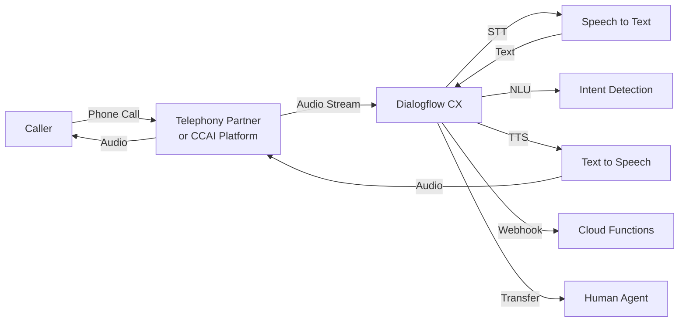

# How to Set Up Dialogflow CX Telephony Integration for IVR Voice Bots

Author: [nawazdhandala](https://www.github.com/nawazdhandala)

Tags: GCP, Dialogflow CX, Telephony, IVR, Voice Bot, Contact Center, Google Cloud

Description: Set up Dialogflow CX telephony integration to build an IVR voice bot that handles phone calls with natural language understanding and dynamic responses.

---

Phone-based customer service is still a huge channel for most businesses. IVR (Interactive Voice Response) systems have traditionally been painful to build and even more painful to use - press 1 for billing, press 2 for support, and so on through a maze of menus. Dialogflow CX changes this by letting callers speak naturally instead of pressing buttons, and the system understands what they want and routes them accordingly.

Setting up telephony integration with Dialogflow CX involves connecting a phone number to your agent, configuring speech recognition and synthesis, handling DTMF input for cases where speech does not work well, and managing call transfers to human agents. In this post, I will walk through the complete setup.

## Architecture

Here is how the telephony integration works:



## Prerequisites

- A Dialogflow CX agent with flows and pages configured
- A telephony partner integration (Avaya, Cisco, Genesys, or Dialogflow CX Phone Gateway)
- Cloud Speech-to-Text and Text-to-Speech APIs enabled

## Step 1: Enable Dialogflow CX Phone Gateway

The simplest way to get started is with the Dialogflow CX Phone Gateway, which provides a phone number directly through Google.

This script creates a phone gateway integration:

```python
from google.cloud import dialogflowcx_v3

def setup_phone_gateway(project_id, location, agent_id):
    """Sets up a Dialogflow CX phone gateway for the agent."""
    client = dialogflowcx_v3.EnvironmentsClient()

    agent_name = f"projects/{project_id}/locations/{location}/agents/{agent_id}"

    # Create an environment for the phone gateway
    environment = dialogflowcx_v3.Environment(
        display_name="Production Phone",
        description="Production environment for phone channel",
        version_configs=[
            dialogflowcx_v3.Environment.VersionConfig(
                version=f"{agent_name}/flows/DEFAULT_FLOW_ID/versions/1"
            )
        ],
    )

    operation = client.create_environment(
        parent=agent_name,
        environment=environment,
    )
    result = operation.result(timeout=60)
    print(f"Environment created: {result.name}")
    return result
```

In the Dialogflow CX console, navigate to Manage > Integrations > Phone Gateway and claim a phone number. The number will be connected to your agent automatically.

## Step 2: Configure Speech Settings

Voice interactions need careful speech configuration. You want to set the right language, voice, and speech detection parameters.

This configuration optimizes speech recognition for phone call audio:

```python
from google.cloud import dialogflowcx_v3

def configure_agent_speech(agent_name):
    """Configures speech settings for telephony use."""
    client = dialogflowcx_v3.AgentsClient()

    agent = client.get_agent(name=agent_name)

    # Configure speech-to-text settings
    agent.speech_to_text_settings = dialogflowcx_v3.SpeechToTextSettings(
        enable_speech_adaptation=True,
    )

    # Configure text-to-speech settings for natural-sounding voice
    agent.text_to_speech_settings = dialogflowcx_v3.TextToSpeechSettings(
        synthesize_speech_configs={
            "en": dialogflowcx_v3.SynthesizeSpeechConfig(
                speaking_rate=1.0,
                pitch=0.0,
                volume_gain_db=0.0,
                voice=dialogflowcx_v3.VoiceSelectionParams(
                    name="en-US-Neural2-F",
                    ssml_gender=dialogflowcx_v3.SsmlVoiceGender.SSML_VOICE_GENDER_FEMALE,
                ),
            ),
        },
    )

    client.update_agent(
        agent=agent,
        update_mask={"paths": [
            "speech_to_text_settings",
            "text_to_speech_settings"
        ]},
    )
    print("Speech settings configured")

configure_agent_speech(
    "projects/my-project/locations/us-central1/agents/AGENT_ID"
)
```

## Step 3: Design Voice-Optimized Conversation Flows

Voice conversations have different requirements than chat. You need shorter messages, confirmation prompts, and DTMF fallbacks.

This script creates a voice-optimized welcome page with DTMF support:

```python
from google.cloud import dialogflowcx_v3

def create_voice_welcome_page(flow_name):
    """Creates a voice-optimized welcome page with DTMF support."""
    client = dialogflowcx_v3.PagesClient()

    page = dialogflowcx_v3.Page(
        display_name="Voice Welcome",
        entry_fulfillment=dialogflowcx_v3.Fulfillment(
            messages=[
                dialogflowcx_v3.ResponseMessage(
                    # Use output audio text for voice-specific messaging
                    output_audio_text=dialogflowcx_v3.ResponseMessage.OutputAudioText(
                        text=(
                            "Welcome to Acme Support. "
                            "You can tell me what you need help with, "
                            "or press 1 for order status, "
                            "2 for returns, "
                            "or 3 to speak with an agent."
                        )
                    )
                )
            ],
            # Enable barge-in so users can interrupt the prompt
            set_parameter_actions=[
                dialogflowcx_v3.Fulfillment.SetParameterAction(
                    parameter="barge_in_enabled",
                    value=True,
                )
            ],
        ),
        # Configure advanced speech settings for this page
        advanced_settings=dialogflowcx_v3.AdvancedSettings(
            speech_settings=dialogflowcx_v3.AdvancedSettings.SpeechSettings(
                no_speech_timeout={"seconds": 5},
                endpointer_sensitivity=50,
            ),
        ),
    )

    response = client.create_page(parent=flow_name, page=page)
    print(f"Voice welcome page created: {response.name}")
    return response
```

## Step 4: Handle DTMF Input

Some callers prefer pressing buttons, and in noisy environments DTMF is more reliable than speech. Configure DTMF handling alongside voice recognition.

This creates intents that respond to DTMF tones:

```python
from google.cloud import dialogflowcx_v3

def create_dtmf_intent(agent_name, display_name, dtmf_digits, training_phrases):
    """Creates an intent that can be triggered by DTMF digits or speech."""
    client = dialogflowcx_v3.IntentsClient()

    # Build training phrases for speech input
    phrases = []
    for phrase_text in training_phrases:
        parts = [dialogflowcx_v3.Intent.TrainingPhrase.Part(text=phrase_text)]
        phrases.append(
            dialogflowcx_v3.Intent.TrainingPhrase(parts=parts, repeat_count=1)
        )

    intent = dialogflowcx_v3.Intent(
        display_name=display_name,
        training_phrases=phrases,
    )

    response = client.create_intent(parent=agent_name, intent=intent)
    print(f"Intent created: {response.display_name}")
    return response

agent_name = "projects/my-project/locations/us-central1/agents/AGENT_ID"

# Create DTMF-enabled intents
create_dtmf_intent(
    agent_name,
    "dtmf.order.status",
    "1",
    ["order status", "check my order", "where is my package", "1"]
)

create_dtmf_intent(
    agent_name,
    "dtmf.returns",
    "2",
    ["return", "I want to return something", "make a return", "2"]
)

create_dtmf_intent(
    agent_name,
    "dtmf.agent",
    "3",
    ["speak to an agent", "talk to someone", "human agent", "representative", "3"]
)
```

## Step 5: Configure Call Transfer to Human Agents

When the bot cannot handle a request or the caller asks for a human, you need to transfer the call. Dialogflow CX supports live agent handoff through the telephony integration.

This function configures a page that transfers to a human agent:

```python
from google.cloud import dialogflowcx_v3

def create_agent_transfer_page(flow_name, webhook_name):
    """Creates a page that handles transfer to a live agent."""
    client = dialogflowcx_v3.PagesClient()

    page = dialogflowcx_v3.Page(
        display_name="Transfer to Agent",
        entry_fulfillment=dialogflowcx_v3.Fulfillment(
            messages=[
                dialogflowcx_v3.ResponseMessage(
                    output_audio_text=dialogflowcx_v3.ResponseMessage.OutputAudioText(
                        text=(
                            "I'll connect you with a support agent now. "
                            "Please hold for a moment."
                        )
                    )
                ),
                # Use the telephony transfer message type
                dialogflowcx_v3.ResponseMessage(
                    telephony_transfer_call=dialogflowcx_v3.ResponseMessage.TelephonyTransferCall(
                        phone_number="+15551234567",  # Support queue number
                    )
                ),
            ],
            # Call webhook to log the transfer and pass context
            webhook=webhook_name,
            tag="agent-transfer",
        ),
    )

    response = client.create_page(parent=flow_name, page=page)
    print(f"Transfer page created: {response.name}")
    return response
```

## Step 6: Add Voice-Specific Error Handling

Voice bots need to handle speech recognition failures gracefully. Set up no-match and no-input event handlers.

```python
from google.cloud import dialogflowcx_v3

def configure_voice_error_handling(page_name):
    """Adds voice-specific error handling to a page."""
    client = dialogflowcx_v3.PagesClient()
    page = client.get_page(name=page_name)

    # Add no-input handler (caller is silent)
    no_input_handler = dialogflowcx_v3.EventHandler(
        event="sys.no-input-default",
        trigger_fulfillment=dialogflowcx_v3.Fulfillment(
            messages=[
                dialogflowcx_v3.ResponseMessage(
                    output_audio_text=dialogflowcx_v3.ResponseMessage.OutputAudioText(
                        text="I didn't catch that. Could you please repeat what you need help with?"
                    )
                )
            ]
        ),
    )

    # Add no-match handler (speech was detected but not understood)
    no_match_handler = dialogflowcx_v3.EventHandler(
        event="sys.no-match-default",
        trigger_fulfillment=dialogflowcx_v3.Fulfillment(
            messages=[
                dialogflowcx_v3.ResponseMessage(
                    output_audio_text=dialogflowcx_v3.ResponseMessage.OutputAudioText(
                        text=(
                            "I'm sorry, I didn't understand that. "
                            "You can say things like check order status, "
                            "make a return, or speak to an agent."
                        )
                    )
                )
            ]
        ),
    )

    page.event_handlers = [no_input_handler, no_match_handler]

    client.update_page(
        page=page,
        update_mask={"paths": ["event_handlers"]},
    )
    print("Voice error handling configured")
```

## Step 7: Test the Voice Bot

Test your voice bot before going live. You can use the Dialogflow CX test console with the audio input option, or call the assigned phone number directly.

```bash
# Test the agent using the API with audio input
curl -X POST \
  -H "Authorization: Bearer $(gcloud auth print-access-token)" \
  -H "Content-Type: application/json" \
  "https://dialogflow.googleapis.com/v3/projects/MY_PROJECT/locations/us-central1/agents/AGENT_ID/sessions/test-session:detectIntent" \
  -d '{
    "queryInput": {
      "audio": {
        "config": {
          "audioEncoding": "AUDIO_ENCODING_LINEAR_16",
          "sampleRateHertz": 8000,
          "singleUtterance": true
        }
      },
      "languageCode": "en"
    }
  }'
```

## Summary

Setting up Dialogflow CX for telephony involves configuring speech recognition and synthesis, designing voice-optimized conversation flows with shorter prompts, handling DTMF input as a fallback, managing call transfers to human agents, and building robust error handling for no-input and no-match scenarios. The key difference from chat-based agents is that you need to account for the real-time nature of voice - callers do not wait patiently, background noise interferes with recognition, and there is no visual UI to fall back on. Start with your highest-volume call reason, get it working well, and expand from there.
