# How to Set Up Distributed Tracing Across GCP Microservices Using Cloud Trace and OpenTelemetry

Author: [nawazdhandala](https://www.github.com/nawazdhandala)

Tags: GCP, Cloud Trace, OpenTelemetry, Distributed Tracing, Microservices, Observability

Description: Set up end-to-end distributed tracing across Google Cloud microservices using OpenTelemetry for instrumentation and Cloud Trace for visualization and analysis.

---

When a single user request passes through five different microservices, figuring out where the latency comes from is nearly impossible without distributed tracing. Logs tell you what happened in each service, but they do not tell you the story of a request as it flows through the system. Distributed tracing connects the dots by propagating a trace ID across service boundaries and recording timing information at each step.

In this guide, I will show you how to set up OpenTelemetry instrumentation across your GCP microservices and export traces to Cloud Trace for visualization and debugging.

## How Distributed Tracing Works

A trace represents the full journey of a request. It is made up of spans, where each span represents a unit of work - an HTTP request, a database query, or a function call. Spans have parent-child relationships that form a tree structure showing exactly how time was spent.

```mermaid
gantt
    title Request Trace: GET /api/orders/123
    dateFormat X
    axisFormat %L ms

    section API Gateway
    Parse request    : 0, 5
    Auth check       : 5, 20

    section Order Service
    Get order        : 20, 50
    DB query         : 25, 45

    section User Service
    Get user details : 50, 80
    Cache lookup     : 55, 60
    DB fallback      : 60, 75

    section Response
    Serialize        : 80, 85
```



## Installing OpenTelemetry

Start by adding OpenTelemetry to your services. I will show examples in Python and Node.js since those are the most common languages for GCP microservices.

For Python services, install the required packages.

```bash
pip install opentelemetry-api \
  opentelemetry-sdk \
  opentelemetry-exporter-gcp-trace \
  opentelemetry-instrumentation-flask \
  opentelemetry-instrumentation-requests \
  opentelemetry-instrumentation-sqlalchemy \
  opentelemetry-propagator-gcp
```

For Node.js services, install these packages.

```bash
npm install @opentelemetry/api \
  @opentelemetry/sdk-node \
  @opentelemetry/auto-instrumentations-node \
  @google-cloud/opentelemetry-cloud-trace-exporter \
  @google-cloud/opentelemetry-cloud-trace-propagator
```

## Instrumenting a Python Service

Set up OpenTelemetry with automatic instrumentation for Flask, requests, and SQLAlchemy. This captures most of the important spans without writing manual tracing code.

```python
# tracing.py - Initialize tracing for your Python service
from opentelemetry import trace
from opentelemetry.sdk.trace import TracerProvider
from opentelemetry.sdk.trace.export import BatchSpanProcessor
from opentelemetry.exporter.cloud_trace import CloudTraceSpanExporter
from opentelemetry.propagators.cloud_trace_propagator import CloudTraceFormatPropagator
from opentelemetry.propagate import set_global_textmap
from opentelemetry.instrumentation.flask import FlaskInstrumentor
from opentelemetry.instrumentation.requests import RequestsInstrumentor
from opentelemetry.instrumentation.sqlalchemy import SQLAlchemyInstrumentor
from opentelemetry.sdk.resources import Resource

def configure_tracing(service_name):
    """Set up OpenTelemetry tracing with Cloud Trace export."""
    # Define the service resource so traces are labeled correctly
    resource = Resource.create({
        'service.name': service_name,
        'service.namespace': 'production',
        'cloud.provider': 'gcp',
    })

    # Create a tracer provider with the Cloud Trace exporter
    provider = TracerProvider(resource=resource)
    exporter = CloudTraceSpanExporter()
    provider.add_span_processor(BatchSpanProcessor(exporter))
    trace.set_tracer_provider(provider)

    # Use the GCP trace propagator for context propagation
    set_global_textmap(CloudTraceFormatPropagator())

    # Auto-instrument common libraries
    FlaskInstrumentor().instrument()
    RequestsInstrumentor().instrument()

    return trace.get_tracer(service_name)
```

Now use it in your Flask application.

```python
# main.py - Order service with tracing
import os
import requests
from flask import Flask, jsonify
from tracing import configure_tracing
from opentelemetry import trace

app = Flask(__name__)
tracer = configure_tracing('order-service')

USER_SERVICE_URL = os.environ.get('USER_SERVICE_URL', 'http://user-service')

@app.route('/api/orders/<order_id>', methods=['GET'])
def get_order(order_id):
    # The Flask instrumentor automatically creates a span for this endpoint.
    # We can add custom spans for specific operations.
    with tracer.start_as_current_span('fetch-order-from-db') as span:
        # Add attributes to the span for debugging
        span.set_attribute('order.id', order_id)

        order = fetch_order_from_db(order_id)
        if not order:
            span.set_attribute('order.found', False)
            return jsonify({'error': 'Order not found'}), 404

        span.set_attribute('order.found', True)
        span.set_attribute('order.total', order['total'])

    # This HTTP call to the user service automatically propagates
    # the trace context through headers, thanks to the requests instrumentation
    with tracer.start_as_current_span('fetch-user-details') as span:
        span.set_attribute('user.id', order['user_id'])
        user_response = requests.get(
            f'{USER_SERVICE_URL}/api/users/{order["user_id"]}'
        )
        user = user_response.json()

    return jsonify({
        'order': order,
        'user': user,
    }), 200

def fetch_order_from_db(order_id):
    # Your database query here
    return {'id': order_id, 'user_id': 'user-123', 'total': 99.99}

if __name__ == '__main__':
    app.run(host='0.0.0.0', port=int(os.environ.get('PORT', 8080)))
```

## Instrumenting a Node.js Service

Here is the equivalent setup for a Node.js service.

```javascript
// tracing.js - Initialize tracing for Node.js services
const { NodeSDK } = require('@opentelemetry/sdk-node');
const { getNodeAutoInstrumentations } = require('@opentelemetry/auto-instrumentations-node');
const { TraceExporter } = require('@google-cloud/opentelemetry-cloud-trace-exporter');
const { CloudPropagator } = require('@google-cloud/opentelemetry-cloud-trace-propagator');
const { Resource } = require('@opentelemetry/resources');

function initTracing(serviceName) {
  const sdk = new NodeSDK({
    resource: new Resource({
      'service.name': serviceName,
    }),
    traceExporter: new TraceExporter(),
    textMapPropagator: new CloudPropagator(),
    instrumentations: [
      getNodeAutoInstrumentations({
        // Configure which auto-instrumentations to enable
        '@opentelemetry/instrumentation-http': { enabled: true },
        '@opentelemetry/instrumentation-express': { enabled: true },
        '@opentelemetry/instrumentation-pg': { enabled: true },
      }),
    ],
  });

  sdk.start();
  console.log(`Tracing initialized for ${serviceName}`);

  // Gracefully shut down the SDK on process exit
  process.on('SIGTERM', () => {
    sdk.shutdown().then(() => process.exit(0));
  });
}

module.exports = { initTracing };
```

```javascript
// server.js - User service with tracing
// Tracing must be initialized before loading other modules
const { initTracing } = require('./tracing');
initTracing('user-service');

const express = require('express');
const { trace } = require('@opentelemetry/api');

const app = express();
const tracer = trace.getTracer('user-service');

app.get('/api/users/:userId', async (req, res) => {
  const { userId } = req.params;

  // Create a custom span for the cache lookup
  const span = tracer.startSpan('cache-lookup');
  span.setAttribute('user.id', userId);

  const cached = await checkCache(userId);
  if (cached) {
    span.setAttribute('cache.hit', true);
    span.end();
    return res.json(cached);
  }

  span.setAttribute('cache.hit', false);
  span.end();

  // Create another span for the database query
  const dbSpan = tracer.startSpan('db-query');
  const user = await fetchUserFromDb(userId);
  dbSpan.setAttribute('db.rows_returned', user ? 1 : 0);
  dbSpan.end();

  res.json(user);
});

app.listen(8080, () => console.log('User service listening on 8080'));
```

## Adding Custom Span Events and Attributes

Beyond automatic instrumentation, add business-relevant context to your traces.

```python
# Add events and attributes that help with debugging
with tracer.start_as_current_span('process-payment') as span:
    span.set_attribute('payment.method', payment_method)
    span.set_attribute('payment.amount', amount)
    span.set_attribute('payment.currency', 'USD')

    # Add events for important milestones within the span
    span.add_event('payment_validated', {
        'validation.checks': 3,
        'validation.passed': True,
    })

    result = process_payment(payment_method, amount)

    span.add_event('payment_processed', {
        'transaction.id': result.transaction_id,
        'payment.status': result.status,
    })

    # Record exceptions as span events
    if result.status == 'failed':
        span.set_status(trace.StatusCode.ERROR, result.error_message)
        span.record_exception(Exception(result.error_message))
```

## Viewing Traces in Cloud Trace

Once your services are instrumented, traces appear in the Cloud Trace console. You can filter by service, latency, and time range.

```bash
# View recent traces using gcloud
gcloud trace traces list --project=my-project --limit=10

# Get details for a specific trace
gcloud trace traces describe TRACE_ID --project=my-project
```

## Setting Up Trace-Based Alerts

Create alerts that trigger when trace latency exceeds your SLO thresholds.

```bash
# Create an alert policy for high latency traces
gcloud alpha monitoring policies create \
  --display-name="Order API latency > 2s" \
  --condition-display-name="P95 latency too high" \
  --condition-filter='metric.type="cloudtrace.googleapis.com/http/server/latency" AND resource.type="cloud_run_revision" AND metric.labels.service="order-service"' \
  --condition-threshold-value=2000 \
  --condition-threshold-comparison=COMPARISON_GT
```

## Wrapping Up

Distributed tracing is not optional for microservice architectures - it is a necessity. Without it, debugging latency issues becomes a guessing game. OpenTelemetry gives you vendor-neutral instrumentation, and Cloud Trace provides the backend for storage and visualization. Start with automatic instrumentation to get quick coverage, then add custom spans for business-critical operations.

For comprehensive observability, combine Cloud Trace with a monitoring platform like OneUptime. While traces show you the path of individual requests, OneUptime gives you the bigger picture of service health, uptime, and performance trends across your entire microservice fleet.
