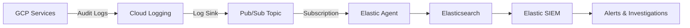

# How to Set Up Elastic SIEM with Google Cloud Audit Logs for Security Monitoring on GCP

Author: [nawazdhandala](https://www.github.com/nawazdhandala)

Tags: GCP, Elastic SIEM, Audit Logs, Security Monitoring, Google Cloud, Elasticsearch

Description: Configure Elastic SIEM to ingest Google Cloud Audit Logs for real-time security monitoring, threat detection, and compliance on GCP.

---

Google Cloud Audit Logs record every administrative action, data access, and system event across your GCP environment. These logs are a goldmine for security monitoring, but they need a SIEM to turn raw log data into actionable security intelligence. Elastic SIEM (part of the Elastic Security solution) gives you detection rules, investigation tools, and compliance dashboards that work natively with GCP audit data.

This guide covers the end-to-end setup of ingesting GCP Audit Logs into Elastic SIEM and configuring security detections.

## Architecture

The data pipeline works like this: GCP services generate audit logs that land in Cloud Logging. A log sink exports these logs to a Pub/Sub topic. Elastic Agent, running with the GCP integration, subscribes to the Pub/Sub topic and ingests the logs into Elasticsearch. Elastic SIEM detection rules then analyze the logs in real time.



## GCP-Side Setup

### Create the Pub/Sub Infrastructure

```bash
# Create a Pub/Sub topic for audit log export
gcloud pubsub topics create gcp-audit-logs-elastic \
  --project=my-project

# Create a pull subscription for Elastic Agent
gcloud pubsub subscriptions create elastic-audit-logs-sub \
  --topic=gcp-audit-logs-elastic \
  --ack-deadline=120 \
  --message-retention-duration=7d \
  --project=my-project
```

### Create Log Sinks for Audit Logs

GCP generates three types of audit logs. You want all of them for comprehensive security monitoring.

```bash
# Export Admin Activity audit logs (who changed what)
gcloud logging sinks create elastic-admin-activity-sink \
  pubsub.googleapis.com/projects/my-project/topics/gcp-audit-logs-elastic \
  --log-filter='logName:"cloudaudit.googleapis.com%2Factivity"' \
  --project=my-project

# Export Data Access audit logs (who accessed what data)
gcloud logging sinks create elastic-data-access-sink \
  pubsub.googleapis.com/projects/my-project/topics/gcp-audit-logs-elastic \
  --log-filter='logName:"cloudaudit.googleapis.com%2Fdata_access"' \
  --project=my-project

# Export System Event audit logs (GCP-initiated changes)
gcloud logging sinks create elastic-system-event-sink \
  pubsub.googleapis.com/projects/my-project/topics/gcp-audit-logs-elastic \
  --log-filter='logName:"cloudaudit.googleapis.com%2Fsystem_event"' \
  --project=my-project

# Grant each sink's writer identity permission to publish to the topic
for SINK in elastic-admin-activity-sink elastic-data-access-sink elastic-system-event-sink; do
  WRITER=$(gcloud logging sinks describe ${SINK} --project=my-project --format='value(writerIdentity)')
  gcloud pubsub topics add-iam-policy-binding gcp-audit-logs-elastic \
    --member="${WRITER}" \
    --role="roles/pubsub.publisher" \
    --project=my-project
done
```

### Create a Service Account for Elastic Agent

```bash
# Create the service account
gcloud iam service-accounts create elastic-agent-siem \
  --display-name="Elastic Agent SIEM Integration" \
  --project=my-project

# Grant Pub/Sub subscriber role
gcloud projects add-iam-policy-binding my-project \
  --member="serviceAccount:elastic-agent-siem@my-project.iam.gserviceaccount.com" \
  --role="roles/pubsub.subscriber"

# Grant Pub/Sub viewer to list subscriptions
gcloud projects add-iam-policy-binding my-project \
  --member="serviceAccount:elastic-agent-siem@my-project.iam.gserviceaccount.com" \
  --role="roles/pubsub.viewer"

# Generate the key
gcloud iam service-accounts keys create elastic-agent-key.json \
  --iam-account=elastic-agent-siem@my-project.iam.gserviceaccount.com
```

## Elastic-Side Setup

### Install the GCP Integration in Kibana

In Kibana, navigate to Management > Integrations and search for "Google Cloud Platform." Install the integration and configure it with your GCP credentials.

The key configuration parameters are:

```yaml
# Elastic Agent GCP integration configuration
- id: gcp-audit-logs
  name: GCP Audit Logs
  type: gcp-pubsub
  streams:
    - input: gcp-pubsub
      vars:
        # GCP project and Pub/Sub configuration
        project_id: my-project
        topic: gcp-audit-logs-elastic
        subscription_name: elastic-audit-logs-sub

        # Authentication using service account key
        credentials_file: /etc/elastic-agent/gcp-credentials.json

        # Processing configuration
        max_outstanding_messages: 1000

      data_stream:
        dataset: gcp.audit
        type: logs
```

### Deploy Elastic Agent

If you run Elastic Agent on a GCE instance, deploy it with the following configuration.

```bash
# Download and install Elastic Agent on a GCE instance
curl -L -O https://artifacts.elastic.co/downloads/beats/elastic-agent/elastic-agent-8.12.0-linux-x86_64.tar.gz
tar xzvf elastic-agent-8.12.0-linux-x86_64.tar.gz
cd elastic-agent-8.12.0-linux-x86_64

# Enroll the agent with your Fleet server
sudo ./elastic-agent install \
  --url=https://fleet.your-elastic-cluster.com:8220 \
  --enrollment-token=YOUR_ENROLLMENT_TOKEN
```

Copy the service account key to the agent host.

```bash
# Copy the credentials file to the agent
sudo cp elastic-agent-key.json /etc/elastic-agent/gcp-credentials.json
sudo chmod 600 /etc/elastic-agent/gcp-credentials.json
sudo chown root:root /etc/elastic-agent/gcp-credentials.json
```

## Verifying Data Ingestion

Check that audit logs are flowing into Elasticsearch.

In Kibana, go to Discover and select the `logs-gcp.audit-*` data stream. You should see audit log entries appearing. Each entry includes:

- `event.action` - The API method that was called
- `source.ip` - The IP address of the caller
- `user.email` - The identity that made the call
- `gcp.audit.resource_name` - The resource that was affected
- `gcp.audit.method_name` - The full API method name

## Configuring SIEM Detection Rules

Elastic SIEM comes with pre-built detection rules for GCP. Enable the ones relevant to your security policies.

### Enable Pre-Built Rules

In Kibana, go to Security > Rules and filter by "GCP." You will find rules like:

- GCP IAM Custom Role Creation
- GCP Firewall Rule Creation or Modification
- GCP Storage Bucket Configuration Modification
- GCP Service Account Key Creation
- GCP Virtual Private Cloud Route Modification
- GCP Logging Sink Deletion

Enable the rules that match your security requirements.

### Create Custom Detection Rules

For organization-specific threats, create custom rules using KQL or EQL queries.

```
# KQL rule: Detect when someone grants Owner role to an external user
event.action:"SetIamPolicy" AND gcp.audit.authorization_info.permission:"resourcemanager.projects.setIamPolicy" AND gcp.audit.request.policy.bindings.role:"roles/owner" AND NOT user.email:*@yourcompany.com
```

Here is an EQL rule for detecting a sequence of suspicious activities.

```
# EQL rule: Detect service account key creation followed by immediate use from external IP
sequence by gcp.audit.authentication_info.principal_email with maxspan=1h
  [any where event.action == "google.iam.admin.v1.CreateServiceAccountKey"]
  [any where source.ip != null and not cidrmatch(source.ip, "10.0.0.0/8", "172.16.0.0/12")]
```

### Alert Actions

Configure the detection rules to create alerts in Elastic SIEM and optionally notify external systems.

```json
{
  "rule_id": "gcp-suspicious-sa-key-usage",
  "name": "GCP Suspicious Service Account Key Usage",
  "description": "Detects when a newly created service account key is used from an external IP",
  "severity": "high",
  "risk_score": 73,
  "type": "eql",
  "query": "sequence by gcp.audit.authentication_info.principal_email with maxspan=1h [any where event.action == 'google.iam.admin.v1.CreateServiceAccountKey'] [any where source.ip != null and not cidrmatch(source.ip, '10.0.0.0/8')]",
  "actions": [
    {
      "action_type_id": ".slack",
      "params": {
        "message": "SIEM Alert: Suspicious service account key usage detected. Principal: {{context.rule.name}}"
      }
    }
  ]
}
```

## Building Security Dashboards

Create dashboards in Kibana for security visibility.

```json
{
  "title": "GCP Security Overview",
  "panels": [
    {
      "type": "lens",
      "title": "Admin Actions by User",
      "query": "event.dataset:gcp.audit AND event.action:*",
      "visualization": "bar",
      "breakdown": "user.email"
    },
    {
      "type": "lens",
      "title": "Failed Authentication Attempts",
      "query": "event.dataset:gcp.audit AND event.outcome:failure",
      "visualization": "timeseries"
    },
    {
      "type": "lens",
      "title": "IAM Policy Changes",
      "query": "event.action:SetIamPolicy",
      "visualization": "table",
      "columns": ["@timestamp", "user.email", "gcp.audit.resource_name"]
    }
  ]
}
```

## Data Retention and Cost

Audit logs can generate significant volume, especially Data Access logs. Configure index lifecycle management (ILM) in Elasticsearch to control storage costs.

```json
{
  "policy": {
    "phases": {
      "hot": {
        "actions": {
          "rollover": {
            "max_size": "50gb",
            "max_age": "7d"
          }
        }
      },
      "warm": {
        "min_age": "7d",
        "actions": {
          "shrink": { "number_of_shards": 1 },
          "forcemerge": { "max_num_segments": 1 }
        }
      },
      "cold": {
        "min_age": "30d",
        "actions": {
          "searchable_snapshot": { "snapshot_repository": "gcs-snapshots" }
        }
      },
      "delete": {
        "min_age": "365d"
      }
    }
  }
}
```

The Elastic SIEM and GCP Audit Logs combination gives you a security monitoring platform that can detect threats, support investigations, and help meet compliance requirements. Start with the pre-built rules, tune them to reduce false positives, and gradually add custom rules as you understand your environment's normal behavior patterns.
