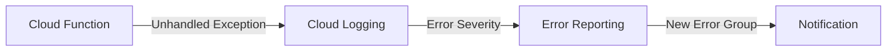

# How to Set Up Error Reporting for Cloud Functions to Track Serverless Application Errors

Author: [nawazdhandala](https://www.github.com/nawazdhandala)

Tags: GCP, Cloud Functions, Cloud Error Reporting, Serverless, Monitoring

Description: Learn how to configure Google Cloud Error Reporting for Cloud Functions to catch, track, and manage errors in your serverless applications effectively.

---

Cloud Functions are great for building event-driven architectures without managing servers. But the flip side of not managing servers is that you have less visibility into what is going wrong. When a function fails, there is no server to SSH into and check logs. You need robust error tracking, and that is where Cloud Error Reporting comes in.

The good news is that Cloud Error Reporting works with Cloud Functions out of the box for unhandled exceptions. The not-so-good news is that the default behavior has gaps that can leave you blind to certain types of failures. Let me walk you through setting things up properly.

## How Error Reporting Works with Cloud Functions

Cloud Functions automatically sends logs to Cloud Logging. When your function throws an unhandled exception, the runtime captures the stack trace and writes it to Cloud Logging. Error Reporting monitors Cloud Logging and picks up those error entries, creating error groups.

This works for both HTTP-triggered and event-triggered functions, and it applies to all supported runtimes - Node.js, Python, Go, Java, Ruby, PHP, and .NET.

Here is the automatic flow:



## The Problem with Relying on Automatic Detection Only

Automatic detection catches unhandled exceptions, but it misses several important categories:

- Errors you catch and handle within your function
- Logic errors where the function completes successfully but produces wrong results
- Timeout errors that kill the function before the error can be logged
- Memory limit errors that crash the function

For a complete error tracking setup, you need to supplement automatic detection with explicit error reporting.

## Setting Up the Error Reporting Client Library

Install the Error Reporting client library alongside your function dependencies.

For Node.js functions:

```bash
# Add the Error Reporting library to your Cloud Function
npm install @google-cloud/error-reporting
```

For Python functions, add it to your requirements.txt:

```
# requirements.txt for Python Cloud Function
google-cloud-error-reporting==1.9.1
functions-framework==3.*
```

## Configuring Error Reporting for HTTP Functions

Here is a complete example of an HTTP Cloud Function with proper error reporting:

```python
# main.py - HTTP Cloud Function with comprehensive error reporting
import functions_framework
from google.cloud import error_reporting

# Initialize the error reporting client outside the function handler
# so it persists across warm invocations
error_client = error_reporting.Client(
    service='my-http-function',
    version='1.0.0'
)

@functions_framework.http
def handle_request(request):
    try:
        # Parse and validate the request
        data = request.get_json(silent=True)
        if not data:
            # Report bad requests as custom errors
            error_client.report("InvalidRequest: missing or malformed JSON body")
            return {"error": "Invalid JSON body"}, 400

        # Validate required fields
        if 'user_id' not in data:
            error_client.report("ValidationError: missing required field user_id")
            return {"error": "user_id is required"}, 400

        # Process the request
        result = process_user_data(data)

        if not result.success:
            # Report business logic failures
            error_client.report(
                f"ProcessingError: failed to process data for user {data['user_id']}: {result.error}"
            )
            return {"error": "Processing failed"}, 500

        return {"status": "ok", "result": result.data}, 200

    except Exception as e:
        # Report unhandled exceptions with full stack trace
        error_client.report_exception()
        return {"error": "Internal server error"}, 500
```

The equivalent in Node.js:

```javascript
// index.js - HTTP Cloud Function with error reporting in Node.js
const { ErrorReporting } = require('@google-cloud/error-reporting');

// Initialize outside the handler for connection reuse
const errors = new ErrorReporting({
  serviceContext: {
    service: 'my-http-function',
    version: '1.0.0'
  }
});

exports.handleRequest = async (req, res) => {
  try {
    const data = req.body;

    if (!data || !data.userId) {
      // Report validation errors
      errors.report('ValidationError: missing userId in request body');
      res.status(400).json({ error: 'userId is required' });
      return;
    }

    const result = await processUserData(data);
    res.json({ status: 'ok', result });

  } catch (err) {
    // Report the exception with full stack trace
    errors.report(err);
    res.status(500).json({ error: 'Internal server error' });
  }
};
```

## Configuring Error Reporting for Event-Triggered Functions

Event-triggered functions like Pub/Sub subscribers and Cloud Storage triggers have no HTTP response to send. Error reporting becomes even more critical because there is no client waiting for a response who might notice the failure.

```python
# main.py - Pub/Sub triggered Cloud Function with error reporting
import base64
import json
import functions_framework
from google.cloud import error_reporting

error_client = error_reporting.Client(
    service='pubsub-processor',
    version='1.0.0'
)

@functions_framework.cloud_event
def process_pubsub(cloud_event):
    try:
        # Decode the Pub/Sub message
        message_data = base64.b64decode(cloud_event.data["message"]["data"])
        payload = json.loads(message_data)

        # Process the message
        result = transform_and_store(payload)

        if result.errors:
            # Report partial failures
            error_client.report(
                f"PartialFailure: {len(result.errors)} records failed "
                f"out of {len(payload['records'])} in message {cloud_event['id']}"
            )

    except json.JSONDecodeError as e:
        # Report malformed messages - do not re-raise to avoid infinite retries
        error_client.report(f"MalformedMessage: could not parse JSON from Pub/Sub message: {e}")

    except Exception as e:
        # Report unexpected errors and re-raise to trigger retry
        error_client.report_exception()
        raise
```

## Handling Timeouts and Memory Limits

Cloud Functions have execution time limits and memory limits. When a function hits these limits, the runtime kills it abruptly without giving your error handling code a chance to run.

You cannot report errors after a timeout, but you can detect when you are getting close and report preemptively:

```python
# Detect approaching timeout and report before the function is killed
import time
import signal
import functions_framework
from google.cloud import error_reporting

error_client = error_reporting.Client(
    service='long-running-function',
    version='1.0.0'
)

# Cloud Functions gen2 default timeout is 60 seconds
FUNCTION_TIMEOUT = 60
# Report an error if we are within 5 seconds of the timeout
TIMEOUT_BUFFER = 5

@functions_framework.http
def handle_request(request):
    start_time = time.time()

    items = request.get_json().get('items', [])
    processed = 0

    for item in items:
        # Check if we are running out of time
        elapsed = time.time() - start_time
        if elapsed > (FUNCTION_TIMEOUT - TIMEOUT_BUFFER):
            error_client.report(
                f"TimeoutWarning: function approaching timeout after processing "
                f"{processed}/{len(items)} items in {elapsed:.1f}s"
            )
            return {"status": "partial", "processed": processed}, 206

        process_item(item)
        processed += 1

    return {"status": "complete", "processed": processed}, 200
```

## Setting Up Alerting for Function Errors

Once Error Reporting is capturing your function errors, set up alerts so you know when things go wrong:

```bash
# Create a notification channel (email in this example)
gcloud beta monitoring channels create \
  --display-name="Function Errors Email" \
  --type=email \
  --channel-labels=email_address=team@yourcompany.com \
  --project=my-gcp-project

# Create an alerting policy for Cloud Function errors
gcloud beta monitoring policies create \
  --display-name="Cloud Function Error Rate" \
  --notification-channels="projects/my-gcp-project/notificationChannels/CHANNEL_ID" \
  --condition-display-name="Function error rate" \
  --condition-filter='resource.type="cloud_function" AND metric.type="cloudfunctions.googleapis.com/function/execution_count" AND metric.labels.status="error"' \
  --condition-threshold-value=5 \
  --condition-threshold-duration=300s \
  --condition-threshold-comparison=COMPARISON_GT \
  --project=my-gcp-project
```

## Correlating Errors with Function Executions

To connect errors with specific function invocations, include the execution ID in your error reports:

```python
# Include execution context in error reports for traceability
import os
import functions_framework
from google.cloud import error_reporting

error_client = error_reporting.Client(
    service='my-function',
    version='1.0.0'
)

@functions_framework.http
def handle_request(request):
    # Get the function execution ID from the environment
    execution_id = request.headers.get('Function-Execution-Id', 'unknown')

    try:
        result = do_work(request)
        return result
    except Exception as e:
        # Include execution ID in the error message for correlation
        error_client.report(
            f"[execution:{execution_id}] {type(e).__name__}: {str(e)}"
        )
        return {"error": "Internal error"}, 500
```

## Testing Error Reporting Locally

You can test your error reporting setup locally using the Functions Framework:

```bash
# Run your function locally for testing
functions-framework --target=handle_request --debug

# In another terminal, trigger an error
curl -X POST http://localhost:8080 \
  -H "Content-Type: application/json" \
  -d '{"invalid": "data"}'
```

Check the Error Reporting console to verify the error appears. Note that when running locally, you need proper GCP credentials configured for the error to be reported to the cloud.

## Best Practices for Serverless Error Reporting

1. **Initialize the client outside the handler.** This avoids creating a new client on every invocation and takes advantage of connection reuse across warm starts.

2. **Use consistent service names.** Name your error reporting service the same as your Cloud Function name. This makes it easy to find errors in the console.

3. **Report before re-raising.** If your event-triggered function needs to retry on failure, report the error first, then re-raise. The retry might succeed, and you still want visibility into the initial failure.

4. **Set up dead-letter topics.** For Pub/Sub-triggered functions, configure a dead-letter topic so messages that fail repeatedly are not lost. Report errors for dead-lettered messages too.

5. **Version your functions.** Always set the version in your error reporting client. This lets you see if errors are coming from a specific deployment.

## Wrapping Up

Cloud Functions error reporting needs more than just the automatic detection that comes built in. By adding the Error Reporting client library and explicitly reporting caught errors, business logic failures, and near-timeout conditions, you get comprehensive visibility into your serverless application health. Combined with alerting, this setup means you will know about problems before your users report them.
