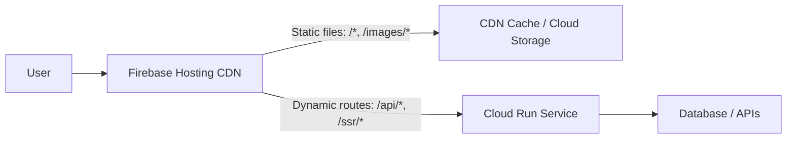

# How to Set Up Firebase Hosting with Cloud Run for Dynamic Server-Side Content

Author: [nawazdhandala](https://www.github.com/nawazdhandala)

Tags: GCP, Firebase Hosting, Cloud Run, Server-Side Rendering, Google Cloud

Description: Learn how to combine Firebase Hosting with Cloud Run to serve both static content and dynamic server-side rendered pages from a single domain.

---

Firebase Hosting is excellent for static content - it sits on Google's CDN, deploys in seconds, and costs almost nothing. But most real-world applications need dynamic content too: server-side rendering, API endpoints, authentication flows, or personalized pages. Instead of running a separate server and dealing with CORS, you can route specific URL patterns from Firebase Hosting to Cloud Run services. This gives you the best of both worlds: CDN-cached static assets and dynamic server-side content, all served from the same domain.

This guide walks through setting up this architecture from scratch with a practical example.

## Architecture Overview



Firebase Hosting acts as the front door. Static files (HTML, CSS, JS, images) are served directly from the CDN. Requests matching specific patterns are proxied to your Cloud Run service for dynamic processing.

## Prerequisites

Make sure you have:

- Firebase CLI installed (`npm install -g firebase-tools`)
- A GCP project with billing enabled
- Docker installed (for building Cloud Run containers)
- A Firebase project linked to your GCP project

```bash
# Install Firebase CLI if you have not already
npm install -g firebase-tools

# Log in to Firebase
firebase login

# Verify your login
firebase projects:list
```

## Step 1: Create the Cloud Run Service

Let us build a simple Node.js server that handles dynamic requests.

Create the application files:

```javascript
// server.js - Express server for dynamic content
const express = require('express');
const app = express();
const port = process.env.PORT || 8080;

// Health check endpoint
app.get('/healthz', (req, res) => {
  res.status(200).send('ok');
});

// API endpoint example
app.get('/api/products', (req, res) => {
  // In a real app, this would query a database
  const products = [
    { id: 1, name: 'Widget A', price: 29.99 },
    { id: 2, name: 'Widget B', price: 49.99 },
    { id: 3, name: 'Widget C', price: 19.99 },
  ];
  res.json(products);
});

// Server-side rendered page
app.get('/ssr/:page', (req, res) => {
  const page = req.params.page;
  const timestamp = new Date().toISOString();

  // Dynamic HTML generated on the server
  const html = `
    <!DOCTYPE html>
    <html>
    <head><title>${page} - Dynamic Page</title></head>
    <body>
      <h1>Server-Side Rendered: ${page}</h1>
      <p>Generated at: ${timestamp}</p>
      <p>This content was rendered by Cloud Run.</p>
      <a href="/">Back to Home</a>
    </body>
    </html>
  `;
  res.send(html);
});

// Catch-all for dynamic routes
app.get('/api/*', (req, res) => {
  res.status(404).json({ error: 'Endpoint not found' });
});

app.listen(port, () => {
  console.log(`Server running on port ${port}`);
});
```

Create the Dockerfile:

```dockerfile
# Dockerfile for the Cloud Run service
FROM node:20-slim

WORKDIR /app

# Copy package files and install dependencies
COPY package.json package-lock.json ./
RUN npm ci --only=production

# Copy application code
COPY server.js .

# Cloud Run expects the service to listen on PORT
ENV PORT=8080
EXPOSE 8080

CMD ["node", "server.js"]
```

Create package.json:

```json
{
  "name": "firebase-cloudrun-backend",
  "version": "1.0.0",
  "main": "server.js",
  "scripts": {
    "start": "node server.js"
  },
  "dependencies": {
    "express": "^4.18.2"
  }
}
```

## Step 2: Build and Deploy to Cloud Run

```bash
# Build the container image using Cloud Build
gcloud builds submit --tag gcr.io/my-project/firebase-backend

# Deploy to Cloud Run
gcloud run deploy firebase-backend \
  --image=gcr.io/my-project/firebase-backend \
  --region=us-central1 \
  --platform=managed \
  --allow-unauthenticated \
  --min-instances=0 \
  --max-instances=10 \
  --memory=256Mi \
  --cpu=1
```

Note the service URL that Cloud Run gives you. You will need it for the Firebase configuration, but Firebase Hosting actually looks up the service by name, not URL.

## Step 3: Initialize Firebase Hosting

```bash
# Initialize Firebase in your project directory
firebase init hosting

# When prompted:
# - Select your Firebase project
# - Set 'public' as the public directory
# - Configure as a single-page app: No (for this example)
# - Set up automatic builds: No
```

Create a simple static file:

```html
<!-- public/index.html - Static homepage served from CDN -->
<!DOCTYPE html>
<html>
<head>
  <title>My App</title>
  <style>
    body { font-family: sans-serif; max-width: 800px; margin: 50px auto; }
    a { color: #1a73e8; }
  </style>
</head>
<body>
  <h1>Welcome to My App</h1>
  <p>This page is served statically from Firebase Hosting CDN.</p>

  <h2>Dynamic Content (Cloud Run)</h2>
  <ul>
    <li><a href="/api/products">Products API</a></li>
    <li><a href="/ssr/about">Server-Rendered About Page</a></li>
    <li><a href="/ssr/contact">Server-Rendered Contact Page</a></li>
  </ul>

  <h2>API Data</h2>
  <div id="products">Loading...</div>

  <script>
    // Fetch dynamic data from the Cloud Run backend
    fetch('/api/products')
      .then(res => res.json())
      .then(data => {
        const el = document.getElementById('products');
        el.innerHTML = data.map(p =>
          `<p>${p.name} - $${p.price}</p>`
        ).join('');
      })
      .catch(err => {
        document.getElementById('products').textContent = 'Failed to load';
      });
  </script>
</body>
</html>
```

## Step 4: Configure Firebase Hosting to Route to Cloud Run

Edit `firebase.json` to set up the routing:

```json
{
  "hosting": {
    "public": "public",
    "ignore": [
      "firebase.json",
      "**/.*",
      "**/node_modules/**"
    ],
    "rewrites": [
      {
        "source": "/api/**",
        "run": {
          "serviceId": "firebase-backend",
          "region": "us-central1"
        }
      },
      {
        "source": "/ssr/**",
        "run": {
          "serviceId": "firebase-backend",
          "region": "us-central1"
        }
      }
    ],
    "headers": [
      {
        "source": "/api/**",
        "headers": [
          {
            "key": "Cache-Control",
            "value": "no-cache, no-store, must-revalidate"
          }
        ]
      },
      {
        "source": "**/*.@(js|css)",
        "headers": [
          {
            "key": "Cache-Control",
            "value": "public, max-age=31536000, immutable"
          }
        ]
      }
    ]
  }
}
```

Key points in this configuration:

- Requests to `/api/**` and `/ssr/**` are routed to the Cloud Run service
- API responses have no-cache headers to ensure fresh data
- Static JS and CSS files are cached aggressively (1 year)
- Everything else falls through to the `public` directory

## Step 5: Deploy

```bash
# Deploy Firebase Hosting
firebase deploy --only hosting
```

After deployment, your app is available at `https://your-project.web.app` (and any custom domain you configure). Static requests go to the CDN, and dynamic requests are proxied to Cloud Run.

## Adding Cache Control for Dynamic Content

You can cache Cloud Run responses at the CDN level using Cache-Control headers from your server:

```javascript
// In server.js - add caching for semi-dynamic content
app.get('/api/products', (req, res) => {
  // Cache this response for 5 minutes at the CDN
  res.set('Cache-Control', 'public, max-age=300, s-maxage=300');

  const products = [
    { id: 1, name: 'Widget A', price: 29.99 },
    { id: 2, name: 'Widget B', price: 49.99 },
  ];
  res.json(products);
});

// No caching for user-specific content
app.get('/api/profile', (req, res) => {
  res.set('Cache-Control', 'private, no-cache');
  // Return user-specific data
  res.json({ name: 'User', email: 'user@example.com' });
});
```

The `s-maxage` directive controls CDN caching specifically, while `max-age` controls browser caching.

## Setting Up a Custom Domain

```bash
# Add a custom domain to Firebase Hosting
firebase hosting:channel:deploy live

# Or configure in firebase.json and deploy
# Then in the Firebase Console, go to Hosting > Add custom domain
```

Follow the prompts in the Firebase Console to:
1. Verify domain ownership
2. Add the required DNS records (A and AAAA records)
3. Wait for SSL certificate provisioning

## Multiple Cloud Run Services

You can route different paths to different Cloud Run services:

```json
{
  "hosting": {
    "public": "public",
    "rewrites": [
      {
        "source": "/api/**",
        "run": {
          "serviceId": "api-service",
          "region": "us-central1"
        }
      },
      {
        "source": "/admin/**",
        "run": {
          "serviceId": "admin-service",
          "region": "us-central1"
        }
      },
      {
        "source": "/webhooks/**",
        "run": {
          "serviceId": "webhook-handler",
          "region": "us-central1"
        }
      }
    ]
  }
}
```

## Preview Channels for Testing

Firebase Hosting supports preview channels for testing before going live:

```bash
# Deploy to a preview channel
firebase hosting:channel:deploy preview-feature-x

# This gives you a unique URL like:
# https://my-project--preview-feature-x-abc123.web.app
```

Preview channels also route to your Cloud Run services, so you can test the full stack before pushing to production.

## Monitoring and Debugging

### Check Firebase Hosting Logs

```bash
# View recent hosting activity
firebase hosting:channel:list
```

### Check Cloud Run Logs

```bash
# View Cloud Run service logs
gcloud run services logs read firebase-backend \
  --region=us-central1 \
  --limit=50
```

### Debug Routing Issues

If requests are not reaching Cloud Run:

1. Check that the Cloud Run service is publicly accessible
2. Verify the serviceId in firebase.json matches the Cloud Run service name
3. Check the region matches between firebase.json and the Cloud Run deployment
4. Verify that the rewrite paths in firebase.json do not conflict with static files

## Best Practices

1. **Keep static and dynamic separate** - Serve as much as possible from the CDN. Only route to Cloud Run what truly needs server-side processing.

2. **Use cache headers wisely** - Cache dynamic responses at the CDN when the data does not change frequently. This reduces Cloud Run invocations and costs.

3. **Set min-instances for latency-sensitive routes** - If cold starts are a problem, set min-instances to 1 on your Cloud Run service.

4. **Use preview channels for staging** - Test your full stack in a preview channel before deploying to the live site.

5. **Monitor Cloud Run costs** - Every request to a dynamic route invokes your Cloud Run service. Monitor usage to avoid unexpected bills.

## Wrapping Up

Firebase Hosting with Cloud Run gives you a powerful architecture that combines the speed and simplicity of a CDN with the flexibility of server-side processing. Static content loads instantly from the edge, dynamic content is handled by your Cloud Run service, and everything lives under one domain with one deployment workflow. It is the right pattern for most web applications that need both static and dynamic content.
