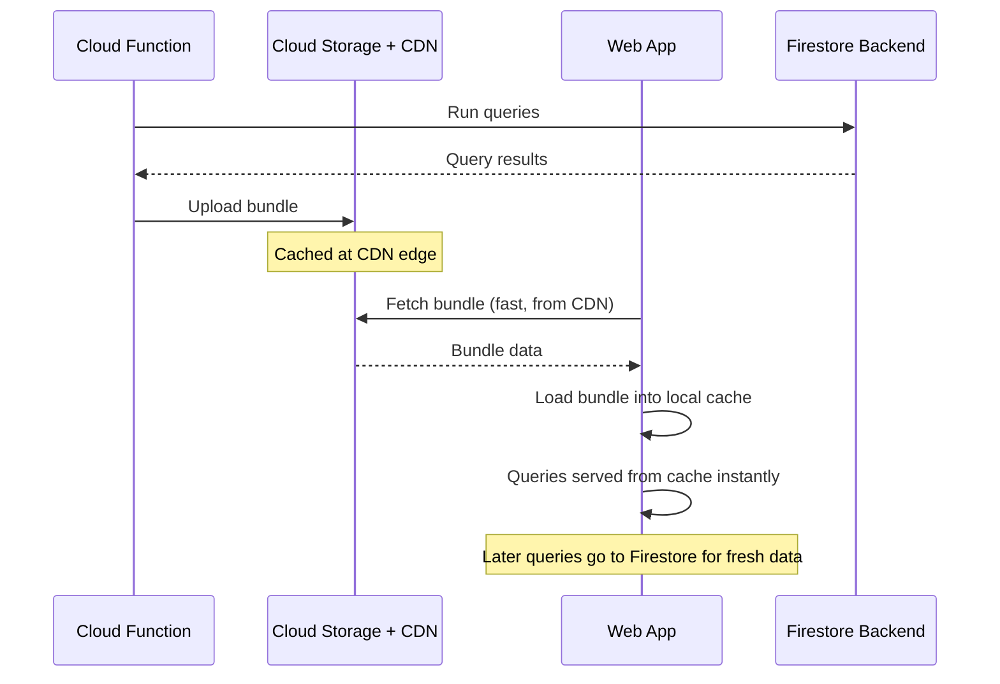

# How to Set Up Firestore Data Bundles for Faster Initial Page Loads

Author: [nawazdhandala](https://www.github.com/nawazdhandala)

Tags: GCP, Firestore, Data Bundles, Performance, Firebase

Description: Learn how to use Firestore data bundles to pre-package query results and serve them from a CDN for faster initial page loads in your web application.

---

When your web app first loads, it usually needs to fetch some data from Firestore before it can render anything useful. That initial fetch involves a round trip to Firestore's servers, which adds latency - especially for users far from the nearest GCP region. Firestore data bundles let you pre-package query results into a binary blob, serve it from a CDN, and load it into the client-side cache instantly. Your app gets its initial data from a nearby CDN edge instead of making a fresh Firestore query.

This can shave hundreds of milliseconds off your initial page load, and for content-heavy apps, it makes a noticeable difference.

## How Data Bundles Work

A data bundle is a serialized snapshot of one or more Firestore queries. You generate it server-side using the Admin SDK, store it somewhere fast (like Cloud Storage behind a CDN), and load it client-side into the Firestore SDK's cache. Once loaded, any queries that match the bundled data will be served from the local cache immediately.



## Generating a Bundle Server-Side

You create bundles using the Firebase Admin SDK. This is typically done in a Cloud Function or a scheduled job.

```javascript
// Generate a Firestore data bundle containing popular posts and categories
// This runs server-side (Cloud Function, scheduled job, etc.)
const admin = require('firebase-admin');
const { Storage } = require('@google-cloud/storage');

admin.initializeApp();
const db = admin.firestore();
const storage = new Storage();

async function generateBundle() {
  // Create a new bundle builder
  const bundle = db.bundle('latest-content');

  // Add named queries to the bundle
  // The name is used client-side to reference the bundled query
  const popularPosts = await db.collection('posts')
    .where('published', '==', true)
    .orderBy('views', 'desc')
    .limit(20)
    .get();

  const categories = await db.collection('categories')
    .orderBy('name')
    .get();

  // Add the query results to the bundle with descriptive names
  bundle.add('popular-posts', popularPosts);
  bundle.add('all-categories', categories);

  // Build the bundle as a Buffer
  const bundleBuffer = bundle.build();

  // Upload to Cloud Storage
  const bucket = storage.bucket('your-project.appspot.com');
  const file = bucket.file('bundles/latest-content.bundle');

  await file.save(bundleBuffer, {
    metadata: {
      contentType: 'application/octet-stream',
      // Set cache headers for CDN
      cacheControl: 'public, max-age=300'  // Cache for 5 minutes
    }
  });

  console.log(`Bundle generated: ${bundleBuffer.length} bytes`);
}
```

## Loading a Bundle Client-Side

On the client, you fetch the bundle from your CDN and load it into the Firestore SDK.

```javascript
// Load a Firestore data bundle from the CDN into the local cache
// This should run early in your app's initialization
import { loadBundle, namedQuery, getDocs } from 'firebase/firestore';

async function loadContentBundle() {
  // Fetch the bundle from your CDN or Cloud Storage
  const response = await fetch('https://storage.googleapis.com/your-project.appspot.com/bundles/latest-content.bundle');

  // Load the bundle into the Firestore SDK's cache
  const bundleTask = loadBundle(db, response.body);

  // Monitor loading progress
  bundleTask.onProgress((progress) => {
    console.log(`Loading bundle: ${progress.documentsLoaded} of ${progress.totalDocuments} documents`);
  });

  // Wait for the bundle to finish loading
  await bundleTask;
  console.log('Bundle loaded into cache');
}
```

## Querying Bundled Data

Once the bundle is loaded, you can use named queries to access the data. These queries are served from the local cache, so they are instant.

```javascript
// Use named queries from the loaded bundle
// These resolve from the local cache without hitting Firestore servers
import { namedQuery, getDocs } from 'firebase/firestore';

async function getPopularPosts() {
  // Get the named query from the bundle
  const query = await namedQuery(db, 'popular-posts');

  if (query) {
    // Execute the query - it resolves from the cache
    const snapshot = await getDocs(query);
    const posts = snapshot.docs.map(doc => ({
      id: doc.id,
      ...doc.data()
    }));
    console.log(`Got ${posts.length} popular posts from bundle`);
    return posts;
  }

  // Fallback: if the bundle was not loaded, query Firestore directly
  console.log('Bundle not available, querying Firestore');
  return fetchPopularPostsFromFirestore();
}
```

## Automating Bundle Generation

You want bundles to be fresh. The best approach is a Cloud Function that regenerates the bundle on a schedule or when the underlying data changes.

```javascript
// Cloud Function that regenerates the bundle every 5 minutes
// This keeps the bundled data reasonably fresh
const functions = require('firebase-functions');
const admin = require('firebase-admin');
admin.initializeApp();

const db = admin.firestore();

exports.generateContentBundle = functions.pubsub
  .schedule('every 5 minutes')
  .onRun(async () => {
    const bundle = db.bundle('latest-content');

    // Query the data to bundle
    const popularPosts = await db.collection('posts')
      .where('published', '==', true)
      .orderBy('views', 'desc')
      .limit(20)
      .get();

    const categories = await db.collection('categories')
      .orderBy('name')
      .get();

    const featuredAuthors = await db.collection('authors')
      .where('featured', '==', true)
      .limit(10)
      .get();

    // Add all queries to the bundle
    bundle.add('popular-posts', popularPosts);
    bundle.add('all-categories', categories);
    bundle.add('featured-authors', featuredAuthors);

    // Save to Cloud Storage
    const bucket = admin.storage().bucket();
    await bucket.file('bundles/latest-content.bundle').save(
      bundle.build(),
      { metadata: { cacheControl: 'public, max-age=300' } }
    );

    console.log('Content bundle regenerated');
  });
```

## Bundle Loading Strategy

The best time to load a bundle is as early as possible in your app's lifecycle. You want the data in the cache before any component tries to use it.

```javascript
// Load the bundle during app initialization
// Run this before rendering any components that need the data
import { initializeApp } from 'firebase/app';
import { getFirestore, loadBundle, namedQuery, getDocs } from 'firebase/firestore';

const app = initializeApp(firebaseConfig);
const db = getFirestore(app);

// Start loading the bundle immediately
const bundlePromise = fetch('/bundles/latest-content.bundle')
  .then(response => loadBundle(db, response.body))
  .catch(error => {
    // Bundle loading is optional - app works without it, just slower
    console.warn('Failed to load bundle:', error);
  });

// In your components, wait for the bundle before querying
async function initApp() {
  // Wait for the bundle to load (with a timeout so we do not block forever)
  await Promise.race([
    bundlePromise,
    new Promise(resolve => setTimeout(resolve, 3000))  // 3-second timeout
  ]);

  // Now queries will use cached bundle data if available
  const postsQuery = await namedQuery(db, 'popular-posts');
  if (postsQuery) {
    const snapshot = await getDocs(postsQuery);
    renderPosts(snapshot);
  }
}
```

## Cache Behavior

Bundled data goes into the same local cache as regular Firestore reads. This means:

If you later set up a real-time listener on the same data, Firestore will first return the bundled (cached) version and then update with the live version from the server. This gives you an instant initial render followed by real-time updates.

If the bundle data is older than the data on the server, the next time you query Firestore (not using a named query), you will get the fresh server data. Bundles do not prevent you from getting fresh data - they just provide a fast starting point.

## Sizing Considerations

Bundles are sent to the client as binary data, so keep them reasonably small. A bundle with 100 small documents might be 50-100 KB, which is fine. A bundle with 10,000 documents or documents with large fields could be several megabytes, which defeats the purpose of fast loading.

Focus on bundling data that is needed for the initial render. Common candidates include navigation menus, featured content, popular items, and configuration data. Do not try to bundle everything - just the data that would otherwise cause a loading spinner on first visit.

## Wrapping Up

Firestore data bundles are a clever optimization for content-heavy apps. By pre-packaging query results and serving them from a CDN, you eliminate the cold-start latency of Firestore queries on initial page load. The implementation involves generating bundles server-side on a schedule, uploading them to Cloud Storage, and loading them client-side during app initialization. It takes a bit of setup, but the improvement in perceived performance is significant, especially for users on slower connections or in regions far from your Firestore instance.
