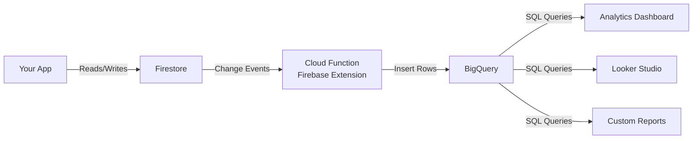

# How to Set Up Firestore Export to BigQuery for Analytics

Author: [nawazdhandala](https://www.github.com/nawazdhandala)

Tags: GCP, Firestore, BigQuery, Analytics, Data Export

Description: Learn how to export Firestore data to BigQuery for running SQL analytics queries, building dashboards, and performing complex aggregations on your data.

---

Firestore is great for serving application data at scale, but it is not designed for analytics. You cannot run aggregation queries across millions of documents, join collections, or build the kind of reports that business teams need. That is where BigQuery comes in. By exporting your Firestore data to BigQuery, you get the full power of SQL for analytics while keeping Firestore as your production database.

Google provides a built-in integration that makes this surprisingly straightforward. Let me walk you through setting it up.

## The Architecture

The Firestore-to-BigQuery pipeline works through the Firebase Extension called "Stream Firestore to BigQuery." It listens to Firestore changes in real time and writes them to a BigQuery table. You get a mirror of your Firestore data in BigQuery that stays up to date automatically.



## Option 1: Firebase Extension (Streaming)

The easiest approach is the official Firebase Extension. It streams changes to BigQuery in near real-time.

Install it using the Firebase CLI:

```bash
# Install the Stream Firestore to BigQuery extension
firebase ext:install firebase/firestore-bigquery-export \
  --project=your-project-id
```

During installation, you will be asked to configure:

- **Collection path**: Which Firestore collection to export (e.g., `orders`)
- **BigQuery dataset**: Where to store the data (e.g., `firestore_export`)
- **Table ID**: The BigQuery table name (e.g., `orders_raw`)
- **Cloud Functions location**: The region for the Cloud Function

You can also install it from the Firebase Console by going to Extensions and searching for "Stream Firestore to BigQuery."

After installation, the extension creates a Cloud Function that triggers on every document create, update, and delete in the specified collection. Each change is written as a row in BigQuery with the full document data as a JSON string.

## Option 2: Scheduled Export (Batch)

If you do not need real-time data in BigQuery, a scheduled export is simpler and cheaper. You export Firestore to Cloud Storage, then load it into BigQuery.

```bash
# Export all Firestore data to a Cloud Storage bucket
gcloud firestore export gs://your-bucket/firestore-exports/$(date +%Y-%m-%d) \
  --project=your-project-id

# Export only specific collections
gcloud firestore export gs://your-bucket/firestore-exports/$(date +%Y-%m-%d) \
  --collection-ids=orders,users,products \
  --project=your-project-id
```

Then load the exported data into BigQuery:

```bash
# Load the Firestore export into BigQuery
bq load \
  --source_format=DATASTORE_BACKUP \
  your-dataset.orders \
  gs://your-bucket/firestore-exports/2026-02-17/all_namespaces/kind_orders/all_namespaces_kind_orders.export_metadata
```

To automate this, set up a Cloud Scheduler job that triggers a Cloud Function:

```javascript
// Cloud Function that exports Firestore to Cloud Storage on a schedule
const functions = require('firebase-functions');
const { Firestore } = require('@google-cloud/firestore');

const firestore = new Firestore();

exports.scheduledFirestoreExport = functions.pubsub
  .schedule('every 24 hours')
  .onRun(async () => {
    const projectId = process.env.GCLOUD_PROJECT;
    const bucket = `gs://${projectId}-firestore-exports`;
    const timestamp = new Date().toISOString().split('T')[0];

    const client = new Firestore.v1.FirestoreAdminClient();
    const databaseName = client.databasePath(projectId, '(default)');

    const [operation] = await client.exportDocuments({
      name: databaseName,
      outputUriPrefix: `${bucket}/${timestamp}`,
      collectionIds: ['orders', 'users', 'products']
    });

    console.log(`Export started: ${operation.name}`);
  });
```

## Understanding the BigQuery Schema

When using the streaming extension, each row in BigQuery represents a change event. The schema looks like this:

| Column | Type | Description |
|--------|------|-------------|
| timestamp | TIMESTAMP | When the change happened |
| event_id | STRING | Unique event identifier |
| document_name | STRING | Full document path |
| document_id | STRING | Document ID |
| operation | STRING | CREATE, UPDATE, or DELETE |
| data | STRING | JSON string of the document data |

The `data` column contains the full document as a JSON string. To query individual fields, you use BigQuery's JSON functions.

## Querying Firestore Data in BigQuery

Here are some practical SQL queries you can run once the data is in BigQuery.

```sql
-- Count orders by status
-- The JSON_VALUE function extracts a field from the JSON document data
SELECT
  JSON_VALUE(data, '$.status') AS order_status,
  COUNT(*) AS order_count
FROM `your-project.firestore_export.orders_raw`
WHERE operation = 'CREATE'
GROUP BY order_status
ORDER BY order_count DESC;
```

```sql
-- Calculate daily revenue from orders
SELECT
  DATE(timestamp) AS order_date,
  SUM(CAST(JSON_VALUE(data, '$.total') AS FLOAT64)) AS daily_revenue,
  COUNT(*) AS num_orders
FROM `your-project.firestore_export.orders_raw`
WHERE operation = 'CREATE'
  AND JSON_VALUE(data, '$.status') = 'completed'
GROUP BY order_date
ORDER BY order_date DESC
LIMIT 30;
```

```sql
-- Find the most active users by number of actions
SELECT
  JSON_VALUE(data, '$.userId') AS user_id,
  COUNT(*) AS action_count,
  MIN(timestamp) AS first_action,
  MAX(timestamp) AS last_action
FROM `your-project.firestore_export.orders_raw`
GROUP BY user_id
ORDER BY action_count DESC
LIMIT 20;
```

## Creating a Materialized View

For frequently-run queries, create a materialized view so BigQuery does not reprocess the raw JSON every time.

```sql
-- Create a materialized view for order analytics
-- This pre-processes the JSON and stays up to date automatically
CREATE MATERIALIZED VIEW `your-project.firestore_export.orders_analytics` AS
SELECT
  document_id AS order_id,
  JSON_VALUE(data, '$.userId') AS user_id,
  JSON_VALUE(data, '$.status') AS status,
  CAST(JSON_VALUE(data, '$.total') AS FLOAT64) AS total,
  JSON_VALUE(data, '$.currency') AS currency,
  TIMESTAMP(JSON_VALUE(data, '$.createdAt._seconds')) AS created_at,
  timestamp AS synced_at
FROM `your-project.firestore_export.orders_raw`
WHERE operation IN ('CREATE', 'UPDATE');
```

Now you can query the materialized view with clean column names:

```sql
-- Query the materialized view - much cleaner and faster
SELECT
  DATE(created_at) AS order_date,
  SUM(total) AS revenue,
  COUNT(DISTINCT user_id) AS unique_customers
FROM `your-project.firestore_export.orders_analytics`
WHERE status = 'completed'
GROUP BY order_date
ORDER BY order_date DESC;
```

## Backfilling Existing Data

The streaming extension only captures new changes. If you have existing data in Firestore, you need to backfill it into BigQuery. The extension includes a script for this.

```bash
# Run the backfill script provided by the extension
# This imports all existing documents into BigQuery
npx @firebaseextensions/fs-bq-import-collection \
  --non-interactive \
  --project your-project-id \
  --source-collection-path orders \
  --dataset firestore_export \
  --table-name-prefix orders
```

This reads every document in the specified collection and writes it to BigQuery as if it were a CREATE event.

## Connecting to Looker Studio

Once your data is in BigQuery, you can connect it to Looker Studio (formerly Data Studio) for visual dashboards.

1. Open Looker Studio and create a new report
2. Choose BigQuery as the data source
3. Select your project, dataset, and table (or materialized view)
4. Build charts, graphs, and filters using the SQL-friendly interface

This gives your business team self-service access to analytics without touching Firestore or writing any code.

## Cost Considerations

The streaming extension runs a Cloud Function for every Firestore write, so costs scale with your write volume. For a high-traffic application, this can add up. BigQuery storage and query costs are separate.

For cost optimization, consider exporting only the collections you actually need for analytics, using the batch export approach for data that does not need real-time freshness, and setting up BigQuery table expiration to automatically drop old data.

## Wrapping Up

Exporting Firestore data to BigQuery gives you the best of both worlds: Firestore handles your application's real-time data needs, and BigQuery handles analytics, reporting, and complex queries. The Firebase Extension makes the streaming setup nearly turnkey, and the batch export approach works well for less time-sensitive analytics. Once the data is in BigQuery, you have access to the full power of SQL, materialized views, and integration with tools like Looker Studio for dashboards.
