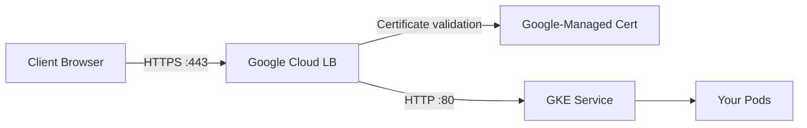

# How to Set Up GKE Ingress with Google-Managed SSL Certificates for HTTPS

Author: [nawazdhandala](https://www.github.com/nawazdhandala)

Tags: GCP, GKE, Kubernetes, Ingress, SSL, HTTPS, Load Balancing

Description: A complete guide to setting up GKE Ingress with Google-managed SSL certificates so your Kubernetes services are automatically served over HTTPS with zero cert management.

---

Getting HTTPS working on a Kubernetes service can be surprisingly tedious. You need certificates, you need to renew them, you need to configure TLS termination. With GKE Ingress and Google-managed SSL certificates, most of that goes away. Google provisions the certificate, renews it automatically, and handles TLS termination at the load balancer level. Your application just serves plain HTTP internally.

I have been using this setup for every GKE project for the past couple of years, and the automation is solid. Let me walk through the full setup.

## How It Works

GKE Ingress creates a Google Cloud HTTP(S) Load Balancer. When you attach a Google-managed certificate, the load balancer handles TLS termination. Traffic flows like this:



The certificate is fully managed - provisioned, validated, and renewed without any action on your part. You just need to own the domain and point it to the load balancer's IP.

## Prerequisites

- A GKE cluster (Standard or Autopilot)
- A domain name you control
- DNS access to create A records
- Your application deployed as a Kubernetes Service

## Step 1: Deploy Your Application

Let us start with a simple application and service.

```yaml
# app-deployment.yaml - A simple web application
apiVersion: apps/v1
kind: Deployment
metadata:
  name: web-app
  namespace: default
spec:
  replicas: 3
  selector:
    matchLabels:
      app: web-app
  template:
    metadata:
      labels:
        app: web-app
    spec:
      containers:
        - name: web-app
          image: nginx:latest
          ports:
            - containerPort: 80
          readinessProbe:
            httpGet:
              path: /
              port: 80
            initialDelaySeconds: 5
            periodSeconds: 10
---
# Service - must be NodePort or ClusterIP for GKE Ingress
apiVersion: v1
kind: Service
metadata:
  name: web-app-service
  namespace: default
spec:
  type: NodePort
  selector:
    app: web-app
  ports:
    - port: 80
      targetPort: 80
      protocol: TCP
```

```bash
kubectl apply -f app-deployment.yaml
```

## Step 2: Reserve a Static IP Address

Reserve a global static IP so your domain can point to a stable address that does not change if you recreate the Ingress.

```bash
# Reserve a global static IP for the load balancer
gcloud compute addresses create web-app-ip \
  --global

# Get the IP address
gcloud compute addresses describe web-app-ip \
  --global \
  --format "value(address)"
```

Note the IP address - you will need it for DNS configuration.

## Step 3: Configure DNS

Point your domain to the reserved IP address. Create an A record in your DNS provider.

```
Type: A
Name: app.yourdomain.com
Value: <THE_STATIC_IP>
TTL: 300
```

The DNS record must be in place before the certificate can be provisioned, because Google validates domain ownership through HTTP validation.

## Step 4: Create the Managed Certificate

Create a ManagedCertificate resource in Kubernetes. This tells GKE to provision a Google-managed SSL certificate for your domain.

```yaml
# managed-cert.yaml - Google-managed SSL certificate
apiVersion: networking.gke.io/v1
kind: ManagedCertificate
metadata:
  name: web-app-cert
  namespace: default
spec:
  domains:
    # List all domains this certificate should cover
    - app.yourdomain.com
    # You can include multiple domains (up to 100)
    # - api.yourdomain.com
    # - www.yourdomain.com
```

```bash
kubectl apply -f managed-cert.yaml
```

The certificate starts provisioning immediately, but it takes 10-30 minutes to be fully active. Google needs to verify domain ownership through an HTTP challenge.

## Step 5: Create the Ingress

Now create the Ingress resource that ties everything together: the static IP, the managed certificate, and the backend service.

```yaml
# ingress.yaml - GKE Ingress with managed SSL certificate
apiVersion: networking.k8s.io/v1
kind: Ingress
metadata:
  name: web-app-ingress
  namespace: default
  annotations:
    # Use the reserved static IP
    kubernetes.io/ingress.global-static-ip-name: web-app-ip
    # Attach the managed certificate
    networking.gke.io/managed-certificates: web-app-cert
    # Redirect HTTP to HTTPS
    kubernetes.io/ingress.class: "gce"
spec:
  defaultBackend:
    service:
      name: web-app-service
      port:
        number: 80
  rules:
    - host: app.yourdomain.com
      http:
        paths:
          - path: /
            pathType: Prefix
            backend:
              service:
                name: web-app-service
                port:
                  number: 80
```

```bash
kubectl apply -f ingress.yaml
```

## Step 6: Check Certificate Status

Monitor the certificate provisioning status.

```bash
# Check the managed certificate status
kubectl describe managedcertificate web-app-cert

# The status will go through these phases:
# Provisioning -> Active

# You can also check from the GCP side
gcloud compute ssl-certificates list
```

If the status stays in "Provisioning" for more than 30 minutes, check that:
- Your DNS A record points to the correct IP
- The domain resolves correctly (`dig app.yourdomain.com`)
- The Ingress is fully provisioned (has an IP address assigned)

## Adding HTTP-to-HTTPS Redirect

By default, the GKE Ingress serves both HTTP and HTTPS. You probably want to redirect HTTP traffic to HTTPS.

```yaml
# Create a FrontendConfig to enable HTTPS redirect
apiVersion: networking.gke.io/v1beta1
kind: FrontendConfig
metadata:
  name: https-redirect
  namespace: default
spec:
  redirectToHttps:
    enabled: true
    responseCodeName: MOVED_PERMANENTLY_DEFAULT
```

Then reference it in your Ingress annotations.

```yaml
# Update the Ingress to use the FrontendConfig
apiVersion: networking.k8s.io/v1
kind: Ingress
metadata:
  name: web-app-ingress
  namespace: default
  annotations:
    kubernetes.io/ingress.global-static-ip-name: web-app-ip
    networking.gke.io/managed-certificates: web-app-cert
    networking.gke.io/v1beta1.FrontendConfig: https-redirect
    kubernetes.io/ingress.class: "gce"
spec:
  defaultBackend:
    service:
      name: web-app-service
      port:
        number: 80
  rules:
    - host: app.yourdomain.com
      http:
        paths:
          - path: /
            pathType: Prefix
            backend:
              service:
                name: web-app-service
                port:
                  number: 80
```

## Multiple Domains and Path-Based Routing

You can serve multiple domains from a single Ingress, each with its own backend.

```yaml
# Multi-domain Ingress with path-based routing
apiVersion: networking.gke.io/v1
kind: ManagedCertificate
metadata:
  name: multi-domain-cert
spec:
  domains:
    - app.yourdomain.com
    - api.yourdomain.com
---
apiVersion: networking.k8s.io/v1
kind: Ingress
metadata:
  name: multi-service-ingress
  annotations:
    kubernetes.io/ingress.global-static-ip-name: web-app-ip
    networking.gke.io/managed-certificates: multi-domain-cert
    kubernetes.io/ingress.class: "gce"
spec:
  rules:
    - host: app.yourdomain.com
      http:
        paths:
          - path: /
            pathType: Prefix
            backend:
              service:
                name: frontend-service
                port:
                  number: 80
    - host: api.yourdomain.com
      http:
        paths:
          - path: /v1
            pathType: Prefix
            backend:
              service:
                name: api-v1-service
                port:
                  number: 8080
          - path: /v2
            pathType: Prefix
            backend:
              service:
                name: api-v2-service
                port:
                  number: 8080
```

## Health Checks

The Google Cloud Load Balancer performs its own health checks against your pods. If the health checks fail, the backend is marked unhealthy and traffic stops flowing.

```yaml
# Configure custom health check parameters via BackendConfig
apiVersion: cloud.google.com/v1
kind: BackendConfig
metadata:
  name: web-app-backend-config
spec:
  healthCheck:
    checkIntervalSec: 15
    timeoutSec: 5
    healthyThreshold: 2
    unhealthyThreshold: 3
    type: HTTP
    requestPath: /healthz
    port: 80
---
# Reference the BackendConfig in your Service
apiVersion: v1
kind: Service
metadata:
  name: web-app-service
  annotations:
    cloud.google.com/backend-config: '{"default": "web-app-backend-config"}'
spec:
  type: NodePort
  selector:
    app: web-app
  ports:
    - port: 80
      targetPort: 80
```

## Troubleshooting

Common issues and how to debug them:

```bash
# Check if the Ingress has an IP assigned
kubectl get ingress web-app-ingress

# View Ingress events for errors
kubectl describe ingress web-app-ingress

# Check the load balancer health status from GCP
gcloud compute backend-services get-health <BACKEND_SERVICE_NAME> --global

# Verify DNS is resolving correctly
dig app.yourdomain.com

# Test the endpoint directly
curl -I https://app.yourdomain.com
```

The most common issue is health check failures. If the load balancer's health check path does not return 200, your backend shows as unhealthy and returns 502 errors. Make sure your application has a health check endpoint that responds to GET requests with a 200 status.

## Wrapping Up

GKE Ingress with Google-managed SSL certificates gives you production-grade HTTPS with minimal operational overhead. The certificate is provisioned automatically, renews before expiration, and TLS termination happens at the load balancer level so your application does not need to handle encryption. Combined with HTTP-to-HTTPS redirects and custom health checks, you get a robust setup that scales with the Google Cloud load balancer infrastructure. The main thing to remember is that DNS must be configured before the certificate can provision, so set up your A record early and give it time to propagate.
