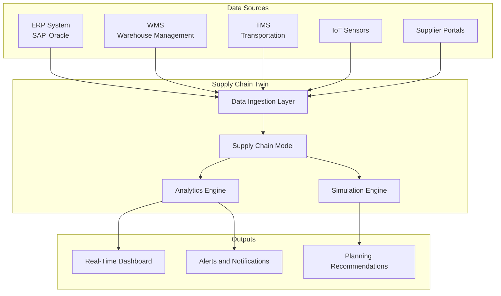

# How to Set Up Google Cloud Supply Chain Twin for End-to-End Supply Chain Visibility

Author: [nawazdhandala](https://www.github.com/nawazdhandala)

Tags: GCP, Supply Chain Twin, Supply Chain, Digital Twin, Cloud Platform

Description: Set up Google Cloud Supply Chain Twin for complete end-to-end visibility across your supply chain operations with real-time tracking and analytics.

---

Supply chain visibility has become a top priority for enterprises. When you cannot see where your inventory is, when shipments will arrive, or which suppliers are at risk, you are flying blind. Google Cloud Supply Chain Twin provides a digital representation of your entire supply chain - from raw materials through manufacturing to final delivery - giving you a single pane of glass for monitoring and decision-making.

This guide walks through setting up Supply Chain Twin, connecting your data sources, and configuring the dashboards and alerts that make the platform useful.

## What Is Supply Chain Twin

Supply Chain Twin is a Google Cloud product that creates a digital model of your physical supply chain. It ingests data from your ERP systems, warehouse management systems, transportation management systems, and IoT sensors, then stitches them together into a unified view.

The platform provides three main capabilities: real-time visibility into inventory and shipment status, predictive analytics for demand and risk, and what-if simulation for planning scenarios.



## Prerequisites

Before setting up Supply Chain Twin, ensure you have the following.

```bash
# Enable the required APIs
gcloud services enable supplychaintwin.googleapis.com
gcloud services enable bigquery.googleapis.com
gcloud services enable pubsub.googleapis.com
gcloud services enable storage.googleapis.com

# Create a service account for data ingestion
gcloud iam service-accounts create sct-ingestion \
  --display-name="Supply Chain Twin Ingestion"

# Grant necessary roles
gcloud projects add-iam-policy-binding YOUR_PROJECT \
  --member="serviceAccount:sct-ingestion@YOUR_PROJECT.iam.gserviceaccount.com" \
  --role="roles/bigquery.dataEditor"

gcloud projects add-iam-policy-binding YOUR_PROJECT \
  --member="serviceAccount:sct-ingestion@YOUR_PROJECT.iam.gserviceaccount.com" \
  --role="roles/pubsub.publisher"
```

## Setting Up Data Ingestion

Supply Chain Twin needs data from multiple systems. The ingestion pipeline typically uses a combination of batch loading for historical data and streaming for real-time updates.

### Batch Ingestion for Master Data

Master data includes your product catalog, supplier directory, warehouse locations, and facility information. Load this from your ERP system.

```python
# ingest_master_data.py - Load master data into Supply Chain Twin
from google.cloud import bigquery
import csv

client = bigquery.Client()

# Define the schema for facility master data
facility_schema = [
    bigquery.SchemaField("facility_id", "STRING", mode="REQUIRED"),
    bigquery.SchemaField("facility_name", "STRING", mode="REQUIRED"),
    bigquery.SchemaField("facility_type", "STRING"),  # warehouse, factory, distribution_center
    bigquery.SchemaField("latitude", "FLOAT64"),
    bigquery.SchemaField("longitude", "FLOAT64"),
    bigquery.SchemaField("address", "STRING"),
    bigquery.SchemaField("country", "STRING"),
    bigquery.SchemaField("capacity_units", "INTEGER"),
    bigquery.SchemaField("operating_hours", "STRING"),
    bigquery.SchemaField("last_updated", "TIMESTAMP"),
]

# Create the table if it does not exist
table_ref = client.dataset("supply_chain").table("facilities")
table = bigquery.Table(table_ref, schema=facility_schema)
table = client.create_table(table, exists_ok=True)

# Load facility data from CSV export
job_config = bigquery.LoadJobConfig(
    schema=facility_schema,
    skip_leading_rows=1,
    source_format=bigquery.SourceFormat.CSV,
    write_disposition=bigquery.WriteDisposition.WRITE_TRUNCATE,
)

with open("facilities_export.csv", "rb") as f:
    job = client.load_table_from_file(f, table_ref, job_config=job_config)

job.result()
print(f"Loaded {job.output_rows} facility records")
```

### Streaming Ingestion for Real-Time Data

Real-time data like shipment tracking updates, inventory changes, and sensor readings flow through Pub/Sub.

```python
# stream_inventory_updates.py - Stream inventory changes to Supply Chain Twin
from google.cloud import pubsub_v1
import json
from datetime import datetime

publisher = pubsub_v1.PublisherClient()
topic_path = publisher.topic_path("YOUR_PROJECT", "inventory-updates")


def publish_inventory_change(warehouse_id, product_id, quantity_change, reason):
    """Publish an inventory change event."""
    event = {
        "event_type": "inventory_change",
        "warehouse_id": warehouse_id,
        "product_id": product_id,
        "quantity_change": quantity_change,
        "reason": reason,  # receipt, shipment, adjustment, return
        "timestamp": datetime.utcnow().isoformat(),
    }

    future = publisher.publish(
        topic_path,
        json.dumps(event).encode("utf-8"),
        event_type="inventory_change",
    )
    return future.result()


def publish_shipment_update(shipment_id, status, location, eta):
    """Publish a shipment tracking update."""
    event = {
        "event_type": "shipment_update",
        "shipment_id": shipment_id,
        "status": status,  # in_transit, delayed, delivered, customs_hold
        "current_location": location,
        "estimated_arrival": eta,
        "timestamp": datetime.utcnow().isoformat(),
    }

    future = publisher.publish(
        topic_path,
        json.dumps(event).encode("utf-8"),
        event_type="shipment_update",
    )
    return future.result()
```

## Configuring the Supply Chain Model

The supply chain model defines the topology of your supply chain - the nodes (facilities) and edges (transportation lanes) that connect them.

```python
# configure_model.py - Define the supply chain network topology
from google.cloud import bigquery

client = bigquery.Client()

# Define transportation lanes between facilities
lanes_data = [
    {
        "lane_id": "LANE-001",
        "origin_facility_id": "FACTORY-SH",
        "destination_facility_id": "DC-LA",
        "transport_mode": "ocean",
        "typical_transit_days": 14,
        "carrier": "Maersk",
        "cost_per_unit": 2.50,
    },
    {
        "lane_id": "LANE-002",
        "origin_facility_id": "DC-LA",
        "destination_facility_id": "WH-CHICAGO",
        "transport_mode": "rail",
        "typical_transit_days": 3,
        "carrier": "BNSF",
        "cost_per_unit": 0.80,
    },
    {
        "lane_id": "LANE-003",
        "origin_facility_id": "WH-CHICAGO",
        "destination_facility_id": "STORE-NYC",
        "transport_mode": "truck",
        "typical_transit_days": 1,
        "carrier": "Regional Freight Co",
        "cost_per_unit": 1.20,
    },
]

# Load lane data into BigQuery
table_ref = client.dataset("supply_chain").table("transportation_lanes")
errors = client.insert_rows_json(table_ref, lanes_data)
if errors:
    print(f"Errors: {errors}")
else:
    print(f"Loaded {len(lanes_data)} transportation lanes")
```

## Setting Up Alerts and Thresholds

Configure alerts for supply chain disruptions and threshold breaches.

```python
# alerts_config.py - Configure supply chain alerts
alerts = [
    {
        "name": "low_inventory_alert",
        "description": "Inventory level dropped below safety stock",
        "condition": "current_stock < safety_stock_level",
        "severity": "high",
        "notification_channels": ["email:supply-chain@company.com", "slack:#supply-alerts"],
    },
    {
        "name": "shipment_delay_alert",
        "description": "Shipment is delayed beyond expected arrival",
        "condition": "current_eta > original_eta + INTERVAL 2 DAY",
        "severity": "medium",
        "notification_channels": ["email:logistics@company.com"],
    },
    {
        "name": "supplier_risk_alert",
        "description": "Supplier delivery performance below threshold",
        "condition": "on_time_delivery_rate < 0.85",
        "severity": "high",
        "notification_channels": ["email:procurement@company.com", "slack:#supply-alerts"],
    },
]
```

Implement the alert monitoring as a scheduled Cloud Function.

```python
# monitor_alerts.py - Check alert conditions periodically
import functions_framework
from google.cloud import bigquery
import json
import logging

logger = logging.getLogger(__name__)
client = bigquery.Client()


@functions_framework.http
def check_alerts(request):
    """Run alert checks against supply chain data."""
    alerts_triggered = []

    # Check low inventory
    low_inventory = check_low_inventory()
    alerts_triggered.extend(low_inventory)

    # Check delayed shipments
    delayed = check_delayed_shipments()
    alerts_triggered.extend(delayed)

    if alerts_triggered:
        send_alerts(alerts_triggered)

    return json.dumps({"alerts_triggered": len(alerts_triggered)}), 200


def check_low_inventory():
    """Find products where current stock is below safety stock."""
    query = """
        SELECT
            i.warehouse_id,
            i.product_id,
            i.current_quantity,
            p.safety_stock_level,
            p.product_name
        FROM `supply_chain.current_inventory` i
        JOIN `supply_chain.products` p ON i.product_id = p.product_id
        WHERE i.current_quantity < p.safety_stock_level
    """
    results = client.query(query).result()

    alerts = []
    for row in results:
        alerts.append({
            "type": "low_inventory",
            "severity": "high",
            "message": f"Low stock: {row.product_name} at {row.warehouse_id} - "
                       f"{row.current_quantity} units (safety stock: {row.safety_stock_level})",
        })

    return alerts


def check_delayed_shipments():
    """Find shipments that are delayed beyond tolerance."""
    query = """
        SELECT
            shipment_id,
            origin_facility,
            destination_facility,
            original_eta,
            current_eta,
            TIMESTAMP_DIFF(current_eta, original_eta, HOUR) AS delay_hours
        FROM `supply_chain.active_shipments`
        WHERE current_eta > TIMESTAMP_ADD(original_eta, INTERVAL 48 HOUR)
    """
    results = client.query(query).result()

    alerts = []
    for row in results:
        alerts.append({
            "type": "shipment_delay",
            "severity": "medium",
            "message": f"Shipment {row.shipment_id} delayed by {row.delay_hours} hours "
                       f"({row.origin_facility} to {row.destination_facility})",
        })

    return alerts
```

## Connecting ERP Systems

Most enterprises use SAP or Oracle for their ERP. Use the appropriate connector to pull data into GCP.

```bash
# For SAP, use the BigQuery Connector for SAP
# This runs on an SAP application server and extracts data to BigQuery
# Configuration is done through SAP transaction /GOOG/SLT

# For generic REST APIs, set up a Cloud Function to poll and ingest
gcloud scheduler jobs create http erp-sync \
  --location=us-central1 \
  --schedule="*/30 * * * *" \
  --uri="https://us-central1-YOUR_PROJECT.cloudfunctions.net/erp-sync" \
  --http-method=POST \
  --oidc-service-account-email=sct-ingestion@YOUR_PROJECT.iam.gserviceaccount.com
```

## Wrapping Up

Google Cloud Supply Chain Twin brings together data from across your supply chain into a unified digital model. The setup involves connecting your various data sources through batch and streaming ingestion, defining your network topology, and configuring alerts for the disruptions that matter most to your operations. Once running, you get real-time visibility into inventory levels, shipment status, and supplier performance - the foundation for making better supply chain decisions faster.
