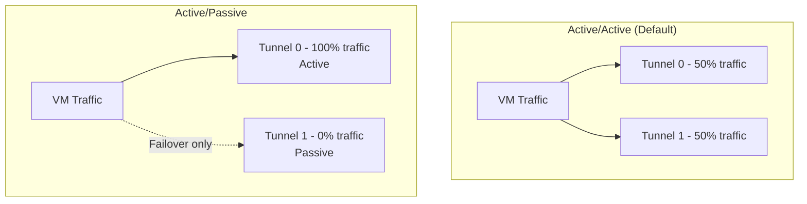

# How to Set Up HA VPN with Active/Passive Tunnel Configuration in GCP

Author: [nawazdhandala](https://www.github.com/nawazdhandala)

Tags: GCP, HA VPN, Active Passive, BGP, Network Redundancy

Description: Configure HA VPN tunnels in an active/passive arrangement using BGP route priorities so traffic flows through the primary tunnel and fails over to the backup automatically.

---

By default, HA VPN in GCP operates in active/active mode - traffic is load-balanced across both tunnels. This is fine for most use cases, but sometimes you want active/passive instead. Maybe your on-premises router handles traffic better through a single tunnel, or you want to keep the second tunnel as a pure standby for failover. BGP route priorities let you control which tunnel is preferred, creating an active/passive arrangement.

This guide shows how to set up HA VPN with one active tunnel and one passive (standby) tunnel using BGP MED (Multi-Exit Discriminator) values.

## Active/Active vs Active/Passive

In **active/active** mode (the default), traffic is distributed across both tunnels using ECMP (Equal-Cost Multi-Path) routing. Both tunnels carry traffic simultaneously.

In **active/passive** mode, all traffic flows through the primary (active) tunnel. The secondary (passive) tunnel carries no traffic under normal conditions but takes over immediately if the primary tunnel fails.



## When to Use Active/Passive

Consider active/passive when:
- Your on-premises router has asymmetric routing issues with ECMP
- You want deterministic traffic flow for troubleshooting
- The peer device does not handle active/active well
- You need to control which tunnel carries production traffic
- Regulatory or compliance requirements mandate a primary/backup topology

## Step 1: Create the Base HA VPN Setup

Start with the standard HA VPN setup:

```bash
# Create Cloud Router
gcloud compute routers create vpn-router \
  --network=your-vpc \
  --region=us-central1 \
  --asn=65001 \
  --project=your-project-id

# Create HA VPN gateway
gcloud compute vpn-gateways create ha-vpn-gw \
  --network=your-vpc \
  --region=us-central1 \
  --project=your-project-id

# Create peer VPN gateway
gcloud compute external-vpn-gateways create peer-gw \
  --interfaces="0=203.0.113.1" \
  --project=your-project-id

# Create tunnel 0 (will be the active tunnel)
gcloud compute vpn-tunnels create active-tunnel \
  --vpn-gateway=ha-vpn-gw \
  --peer-external-gateway=peer-gw \
  --peer-external-gateway-interface=0 \
  --interface=0 \
  --ike-version=2 \
  --shared-secret="your-psk" \
  --router=vpn-router \
  --region=us-central1 \
  --project=your-project-id

# Create tunnel 1 (will be the passive tunnel)
gcloud compute vpn-tunnels create passive-tunnel \
  --vpn-gateway=ha-vpn-gw \
  --peer-external-gateway=peer-gw \
  --peer-external-gateway-interface=0 \
  --interface=1 \
  --ike-version=2 \
  --shared-secret="your-psk" \
  --router=vpn-router \
  --region=us-central1 \
  --project=your-project-id
```

## Step 2: Configure BGP with Route Priorities

The key to active/passive is setting different BGP route priorities (MED values) for each tunnel. Routes with lower priority values are preferred.

### Configure the Active Tunnel BGP

```bash
# Add interface for the active tunnel
gcloud compute routers add-interface vpn-router \
  --interface-name=active-bgp-iface \
  --vpn-tunnel=active-tunnel \
  --ip-address=169.254.0.1 \
  --mask-length=30 \
  --region=us-central1 \
  --project=your-project-id

# Add BGP peer for the active tunnel with low priority (preferred)
gcloud compute routers add-bgp-peer vpn-router \
  --peer-name=active-peer \
  --interface=active-bgp-iface \
  --peer-ip-address=169.254.0.2 \
  --peer-asn=65002 \
  --advertised-route-priority=100 \
  --region=us-central1 \
  --project=your-project-id
```

### Configure the Passive Tunnel BGP

```bash
# Add interface for the passive tunnel
gcloud compute routers add-interface vpn-router \
  --interface-name=passive-bgp-iface \
  --vpn-tunnel=passive-tunnel \
  --ip-address=169.254.1.1 \
  --mask-length=30 \
  --region=us-central1 \
  --project=your-project-id

# Add BGP peer for the passive tunnel with high priority (backup)
gcloud compute routers add-bgp-peer vpn-router \
  --peer-name=passive-peer \
  --interface=passive-bgp-iface \
  --peer-ip-address=169.254.1.2 \
  --peer-asn=65002 \
  --advertised-route-priority=200 \
  --region=us-central1 \
  --project=your-project-id
```

The `--advertised-route-priority` flag sets the MED value that GCP advertises to the peer. The active tunnel advertises routes with priority 100, while the passive tunnel advertises with priority 200. The on-premises router will prefer the lower value.

## Step 3: Configure the On-Premises Router

On your on-premises side, you also need to set route preferences. Configure your router to:

1. Prefer routes learned from the active tunnel (the one connecting to GCP interface 0)
2. Use routes from the passive tunnel only if the active tunnel is down

The exact configuration depends on your router vendor, but the concept is the same - set a higher local preference or lower MED for the primary tunnel's BGP session.

For routes advertised FROM your on-premises router TO GCP, set different MED values:

```
# On-premises router configuration (conceptual)
# Active tunnel BGP session: advertise routes with MED 100
# Passive tunnel BGP session: advertise routes with MED 200
```

Cloud Router will prefer routes with lower MED values, so traffic from GCP to on-premises will also use the active tunnel.

## Step 4: Verify the Active/Passive Setup

Check that both tunnels are established but traffic flows through only one:

```bash
# Verify both tunnels are established
gcloud compute vpn-tunnels list \
  --filter="region:us-central1" \
  --format="table(name, status)" \
  --project=your-project-id

# Check BGP peer status and route priorities
gcloud compute routers get-status vpn-router \
  --region=us-central1 \
  --format=yaml \
  --project=your-project-id
```

Verify route preferences:

```bash
# Check which routes are active and their priorities
gcloud compute routes list \
  --filter="network:your-vpc AND nextHopVpnTunnel:*" \
  --format="table(destRange, nextHopVpnTunnel, priority)" \
  --project=your-project-id
```

Routes through the active tunnel should have lower priority values than routes through the passive tunnel.

## Step 5: Test Failover

To test failover, you can temporarily disable the active tunnel's BGP session on the on-premises side or simulate a tunnel failure. Monitor how quickly traffic switches to the passive tunnel.

```bash
# Monitor tunnel metrics during failover test
gcloud logging read \
  'resource.type="vpn_gateway"' \
  --project=your-project-id \
  --freshness=10m \
  --format="table(timestamp, jsonPayload)"
```

BGP-based failover typically takes 40-60 seconds by default (based on BGP hold timer). You can tune this:

```bash
# Optional: Configure faster BGP failover detection
# Note: The Cloud Router uses a default hold timer of 60 seconds
# You can set custom timers on the on-premises side
```

For faster failover, consider BFD (Bidirectional Forwarding Detection) if both sides support it.

## Monitoring Active/Passive Status

Set up monitoring to track which tunnel is carrying traffic:

```bash
# Create a dashboard query for tunnel traffic
# Monitor sent_bytes_count for each tunnel
# Active tunnel should show traffic; passive should show minimal/no traffic

gcloud logging read \
  'resource.type="vpn_gateway" AND resource.labels.gateway_name="ha-vpn-gw"' \
  --project=your-project-id \
  --freshness=1h \
  --limit=20
```

Set up alerts for:
- Active tunnel going down (triggers failover)
- Passive tunnel going down (loss of redundancy)
- Both tunnels down (total VPN failure)

## Switching Active and Passive Roles

If you need to swap which tunnel is active (for maintenance, for example):

```bash
# Make the current passive tunnel active by lowering its priority
gcloud compute routers update-bgp-peer vpn-router \
  --peer-name=passive-peer \
  --advertised-route-priority=50 \
  --region=us-central1 \
  --project=your-project-id

# Make the current active tunnel passive by raising its priority
gcloud compute routers update-bgp-peer vpn-router \
  --peer-name=active-peer \
  --advertised-route-priority=300 \
  --region=us-central1 \
  --project=your-project-id
```

After maintenance, swap them back:

```bash
# Restore original priorities
gcloud compute routers update-bgp-peer vpn-router \
  --peer-name=active-peer \
  --advertised-route-priority=100 \
  --region=us-central1

gcloud compute routers update-bgp-peer vpn-router \
  --peer-name=passive-peer \
  --advertised-route-priority=200 \
  --region=us-central1
```

## SLA Implications

With active/passive, you still get the 99.99% HA VPN SLA as long as both tunnels are configured and operational. The SLA requires two tunnels, but it does not require them both to actively carry traffic. The passive tunnel satisfies the redundancy requirement.

## Common Mistakes

1. **Forgetting the peer side:** Route priorities need to be set on both the GCP and on-premises sides. If you only set them on one side, traffic in one direction might still use ECMP.

2. **Identical MED values:** If both tunnels have the same MED, the router will use ECMP (active/active). Make sure the values are different.

3. **Not testing failover:** Always test failover before relying on it in production. Simulate an active tunnel failure and verify the passive tunnel takes over.

## Wrapping Up

Active/passive HA VPN gives you the control to determine which tunnel carries traffic while keeping a warm standby ready for instant failover. The configuration uses BGP MED values to influence route selection, and the switchover is handled automatically by BGP when the active tunnel fails. This topology is a good fit when you need deterministic traffic flow or when your on-premises equipment does not handle ECMP well. Both tunnels remain established at all times, so failover is fast and the HA VPN SLA is maintained.
