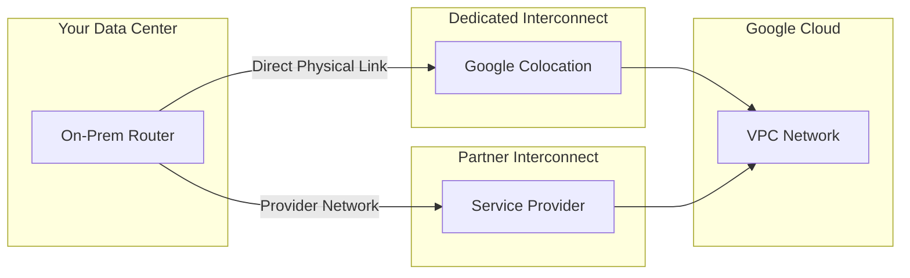
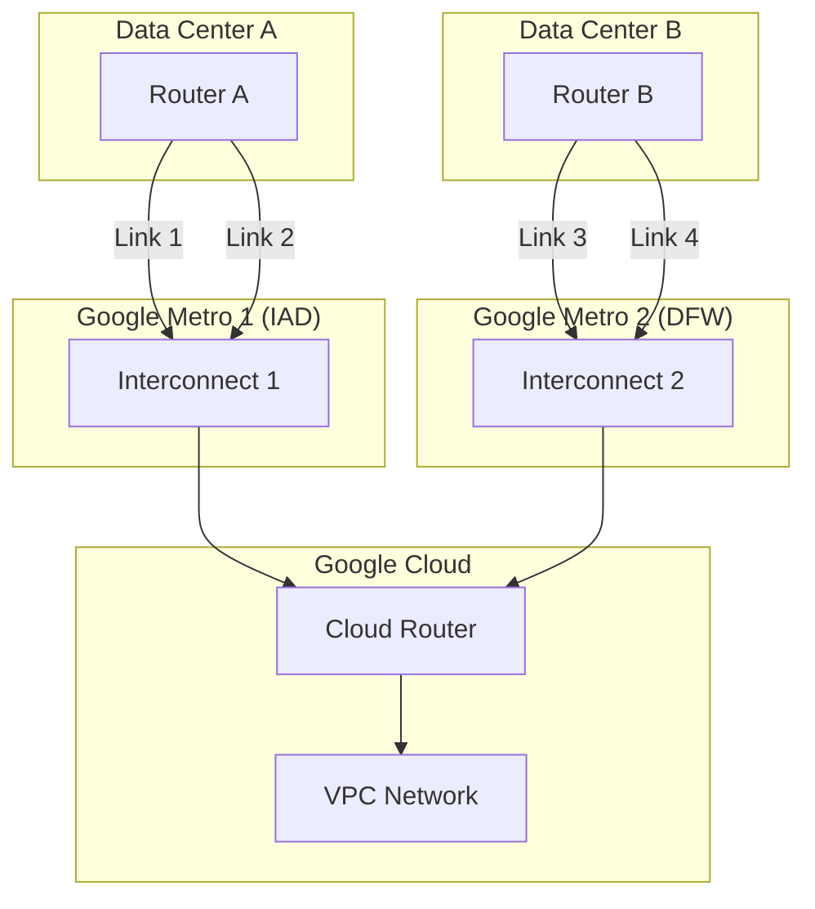

# How to Set Up Hybrid Connectivity Between On-Premises Data Centers and GCP Using Cloud Interconnect

Author: [nawazdhandala](https://www.github.com/nawazdhandala)

Tags: GCP, Cloud Interconnect, Hybrid Cloud, Networking, On-Premises

Description: A practical guide to establishing hybrid connectivity between your on-premises data centers and Google Cloud Platform using Dedicated and Partner Cloud Interconnect.

---

Most enterprises do not move to the cloud all at once. You have existing data centers, legacy systems, and workloads that need to talk to both on-premises infrastructure and cloud resources. Cloud Interconnect gives you a private, high-bandwidth, low-latency connection between your data center and GCP - no public internet involved.

In this post, I will walk through the process of setting up Cloud Interconnect, from choosing between Dedicated and Partner Interconnect to configuring the actual connections and routing.

## Dedicated vs. Partner Interconnect

GCP offers two types of Cloud Interconnect:

**Dedicated Interconnect** provides a direct physical connection between your data center and a Google colocation facility. You get 10 Gbps or 100 Gbps links, and you need your own router in a facility where Google has a presence.

**Partner Interconnect** goes through a supported service provider. This is the option when your data center is not near a Google colocation facility, or when you need less than 10 Gbps of bandwidth.



| Feature | Dedicated | Partner |
|---------|-----------|---------|
| Bandwidth | 10/100 Gbps per link | 50 Mbps to 50 Gbps |
| Connection | Direct to Google | Through a provider |
| SLA (with redundancy) | 99.99% | 99.99% |
| Cost | Higher upfront | Lower entry point |
| Setup time | Weeks | Days to weeks |

## Step 1: Prepare Your VPC Network

Before setting up the interconnect, make sure your VPC is ready with the right subnets and routing configuration:

```bash
# Create a VPC network with custom subnets
gcloud compute networks create hybrid-network \
  --subnet-mode=custom

# Create subnets in the regions where you need connectivity
gcloud compute networks subnets create cloud-subnet-us \
  --network=hybrid-network \
  --region=us-central1 \
  --range=10.1.0.0/16

gcloud compute networks subnets create cloud-subnet-eu \
  --network=hybrid-network \
  --region=europe-west1 \
  --range=10.2.0.0/16

# Create a Cloud Router in each region for BGP
gcloud compute routers create hybrid-router-us \
  --network=hybrid-network \
  --region=us-central1 \
  --asn=16550

gcloud compute routers create hybrid-router-eu \
  --network=hybrid-network \
  --region=europe-west1 \
  --asn=16550
```

The ASN (Autonomous System Number) 16550 is Google's default. You will configure your on-premises router with a different ASN.

## Step 2: Create a Dedicated Interconnect Connection

If you are going with Dedicated Interconnect, start by creating the connection:

```bash
# Create an interconnect connection
gcloud compute interconnects create my-interconnect-1 \
  --interconnect-type=DEDICATED \
  --link-type=LINK_TYPE_ETHERNET_10G_LR \
  --location=iad-zone1-1 \
  --requested-link-count=2 \
  --description="Primary datacenter to GCP"
```

After creating the connection, Google will provision the physical ports. You then need to send a Letter of Authorization (LOA) to your colocation provider to complete the physical cross-connect. This part takes a few days to a couple of weeks.

## Step 3: Create VLAN Attachments

VLAN attachments connect your Cloud Interconnect to your VPC network through the Cloud Router:

```bash
# Create VLAN attachment for the first link
gcloud compute interconnects attachments dedicated create attachment-us-1 \
  --interconnect=my-interconnect-1 \
  --router=hybrid-router-us \
  --region=us-central1 \
  --bandwidth=BPS_5G \
  --vlan=100

# Create VLAN attachment for the second link (redundancy)
gcloud compute interconnects attachments dedicated create attachment-us-2 \
  --interconnect=my-interconnect-1 \
  --router=hybrid-router-us \
  --region=us-central1 \
  --bandwidth=BPS_5G \
  --vlan=200
```

After creating the attachments, get the pairing key and configuration details:

```bash
# Get attachment details for router configuration
gcloud compute interconnects attachments describe attachment-us-1 \
  --region=us-central1 \
  --format="yaml(googleReferenceId, pairingKey, cloudRouterIpAddress, customerRouterIpAddress)"
```

## Step 4: Configure BGP Sessions

Set up BGP sessions between the Cloud Router and your on-premises router:

```bash
# Add a BGP peer on the Cloud Router for the first VLAN
gcloud compute routers add-bgp-peer hybrid-router-us \
  --peer-name=onprem-peer-1 \
  --peer-asn=65001 \
  --interface=attachment-us-1 \
  --peer-ip-address=169.254.0.2 \
  --region=us-central1

# Add a BGP peer for the second VLAN (redundancy)
gcloud compute routers add-bgp-peer hybrid-router-us \
  --peer-name=onprem-peer-2 \
  --peer-asn=65001 \
  --interface=attachment-us-2 \
  --peer-ip-address=169.254.1.2 \
  --region=us-central1
```

On your on-premises router, configure the corresponding BGP sessions. Here is an example for a Cisco IOS router:

```
! On-premises Cisco router configuration
router bgp 65001
  neighbor 169.254.0.1 remote-as 16550
  neighbor 169.254.0.1 description "GCP Cloud Router - Link 1"
  neighbor 169.254.1.1 remote-as 16550
  neighbor 169.254.1.1 description "GCP Cloud Router - Link 2"

  address-family ipv4 unicast
    ! Advertise on-premises subnets to GCP
    network 192.168.0.0 mask 255.255.0.0
    network 172.16.0.0 mask 255.240.0.0
    neighbor 169.254.0.1 activate
    neighbor 169.254.1.1 activate
  exit-address-family
```

## Step 5: Set Up Redundancy for 99.99% SLA

Google requires specific redundancy configurations to provide the 99.99% SLA. You need interconnect connections in at least two different metro areas:

```bash
# Create a second interconnect in a different metro
gcloud compute interconnects create my-interconnect-2 \
  --interconnect-type=DEDICATED \
  --link-type=LINK_TYPE_ETHERNET_10G_LR \
  --location=dfw-zone1-1 \
  --requested-link-count=2 \
  --description="Secondary datacenter to GCP"

# Create VLAN attachments for the second interconnect
gcloud compute interconnects attachments dedicated create attachment-us-3 \
  --interconnect=my-interconnect-2 \
  --router=hybrid-router-us \
  --region=us-central1 \
  --bandwidth=BPS_5G \
  --vlan=300

gcloud compute interconnects attachments dedicated create attachment-us-4 \
  --interconnect=my-interconnect-2 \
  --router=hybrid-router-us \
  --region=us-central1 \
  --bandwidth=BPS_5G \
  --vlan=400
```

The topology for 99.99% SLA looks like this:



## Step 6: Configure Firewall Rules

With the connection established, set up firewall rules to control traffic flow:

```bash
# Allow traffic from on-premises networks
gcloud compute firewall-rules create allow-onprem-to-cloud \
  --network=hybrid-network \
  --allow=tcp,udp,icmp \
  --source-ranges=192.168.0.0/16,172.16.0.0/12 \
  --description="Allow on-premises traffic to cloud resources"

# Allow return traffic from cloud to on-premises
gcloud compute firewall-rules create allow-cloud-to-onprem \
  --network=hybrid-network \
  --allow=tcp,udp,icmp \
  --destination-ranges=192.168.0.0/16,172.16.0.0/12 \
  --direction=EGRESS \
  --description="Allow cloud to on-premises traffic"
```

## Monitoring Your Interconnect

Once everything is running, set up monitoring to catch problems before they cause outages:

```bash
# Monitor interconnect link status
gcloud compute interconnects describe my-interconnect-1 \
  --format="yaml(operationalStatus, state, circuitInfos)"

# Create an alert for interconnect down
gcloud alpha monitoring policies create \
  --display-name="Interconnect Link Down" \
  --condition-display-name="Interconnect operational status" \
  --condition-filter='resource.type="interconnect" AND metric.type="interconnect.googleapis.com/network/interconnect/link/operational_status"' \
  --condition-threshold-value=1 \
  --condition-threshold-comparison=COMPARISON_LT \
  --notification-channels=projects/my-project/notificationChannels/oncall
```

## Wrapping Up

Setting up Cloud Interconnect is a significant infrastructure project, but the result is a reliable, high-bandwidth private connection between your data centers and GCP. The key steps are choosing between Dedicated and Partner Interconnect based on your bandwidth needs and location, setting up redundant connections for SLA requirements, and configuring BGP for dynamic routing.

Plan for redundancy from the start - retrofitting it later means additional downtime and cost. And always test failover by shutting down one link and verifying that traffic continues flowing through the other paths.
