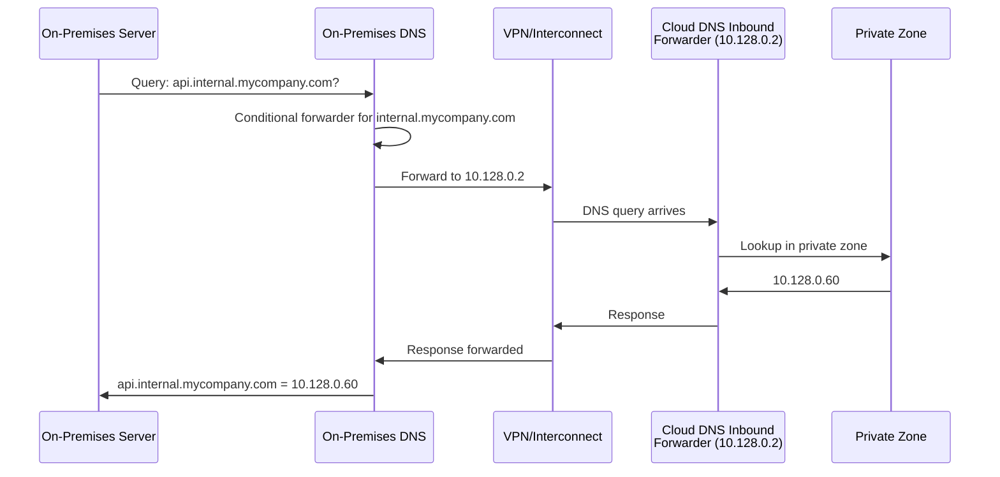
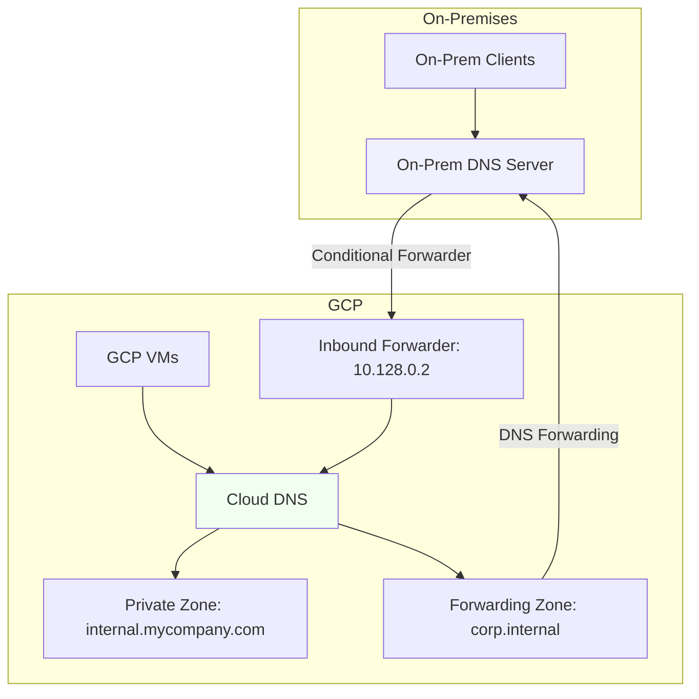

# How to Set Up Inbound DNS Forwarding to Allow On-Premises Queries to Cloud DNS in GCP

Author: [nawazdhandala](https://www.github.com/nawazdhandala)

Tags: GCP, Cloud DNS, Inbound Forwarding, Hybrid DNS, On-Premises

Description: Learn how to configure inbound DNS forwarding in GCP so on-premises systems can resolve Cloud DNS private zone records through VPN or Interconnect connections.

---

DNS forwarding in hybrid environments works in two directions. Outbound forwarding lets GCP resolve on-premises hostnames (covered in the forwarding zones topic). Inbound forwarding does the opposite - it lets on-premises systems query Cloud DNS to resolve records in your private zones. Without inbound forwarding, your on-premises servers cannot resolve names like `db.internal.mycompany.com` that live in Cloud DNS private zones, even if there is VPN or Interconnect connectivity between the environments.

This post explains how inbound DNS forwarding works, how to set it up, and how to configure your on-premises DNS to use it.

## The Problem Inbound Forwarding Solves

Consider this scenario: You have a GCP private DNS zone for `internal.mycompany.com` with records for your cloud-based services. A VM in GCP can resolve `api.internal.mycompany.com` to `10.128.0.60` because it automatically uses Cloud DNS. But an on-premises server that needs to call that API cannot resolve the name - its DNS server does not know about Cloud DNS private zones.

Without inbound forwarding, on-premises systems are blind to your Cloud DNS records. They would need to use IP addresses directly or maintain duplicate DNS entries in the on-premises DNS infrastructure.

## How Inbound Forwarding Works

When you enable inbound DNS forwarding, Cloud DNS creates forwarding entry points in your VPC. These are IP addresses from your VPC subnets that accept DNS queries. You then configure your on-premises DNS servers to forward queries for your cloud domains to these IP addresses.



## Prerequisites

- Cloud VPN or Cloud Interconnect between GCP and on-premises
- A VPC with at least one subnet
- A Cloud DNS private zone with records
- Access to configure your on-premises DNS servers
- Firewall rules allowing DNS traffic

## Step 1: Create a DNS Server Policy with Inbound Forwarding

DNS server policies control DNS behavior at the VPC level. Create one with inbound forwarding enabled:

```bash
# Create a DNS policy with inbound forwarding enabled
gcloud dns policies create inbound-policy \
    --description="Enable inbound DNS forwarding from on-premises" \
    --networks=my-vpc \
    --enable-inbound-forwarding
```

If you already have a DNS policy for logging, update it to also enable inbound forwarding:

```bash
# Update an existing DNS policy to enable inbound forwarding
gcloud dns policies update existing-policy \
    --enable-inbound-forwarding
```

## Step 2: Find the Inbound Forwarder IP Addresses

When you enable inbound forwarding, Cloud DNS allocates IP addresses from your VPC subnets. These are the IPs your on-premises DNS will forward to.

```bash
# List the inbound forwarder IP addresses
gcloud compute addresses list \
    --filter="purpose=DNS_RESOLVER" \
    --format="table(name,address,region,subnetwork)"
```

You will see one IP per subnet in the VPC. For example:

```
NAME                    ADDRESS       REGION        SUBNETWORK
dns-resolver-1          10.128.0.2    us-central1   my-subnet-us
dns-resolver-2          10.200.0.2    europe-west1  my-subnet-eu
```

These IPs are automatically created and managed by Cloud DNS. You do not create them manually.

## Step 3: Configure GCP Firewall Rules

Allow inbound DNS traffic from your on-premises network to the forwarder IPs:

```bash
# Allow DNS queries from on-premises to reach Cloud DNS forwarders
gcloud compute firewall-rules create allow-inbound-dns \
    --network=my-vpc \
    --action=allow \
    --direction=ingress \
    --source-ranges=192.168.0.0/16 \
    --rules=tcp:53,udp:53
```

Replace `192.168.0.0/16` with your actual on-premises IP range.

## Step 4: Configure On-Premises DNS

This is the step that happens outside of GCP. You need to configure your on-premises DNS server to forward queries for your cloud domains to the Cloud DNS forwarder IPs.

### Windows DNS Server (Active Directory)

Create a conditional forwarder:

1. Open DNS Manager
2. Right-click "Conditional Forwarders" and select "New Conditional Forwarder"
3. Enter the domain: `internal.mycompany.com`
4. Add the forwarder IP addresses: `10.128.0.2` and `10.200.0.2`
5. Click OK

Or use PowerShell:

```powershell
# Create a conditional forwarder in Windows DNS
Add-DnsServerConditionalForwarderZone `
    -Name "internal.mycompany.com" `
    -MasterServers 10.128.0.2,10.200.0.2 `
    -ReplicationScope "Forest"
```

### BIND (Linux)

Add a forwarding zone to your BIND configuration:

```
// Forward cloud DNS queries to GCP Cloud DNS inbound forwarders
zone "internal.mycompany.com" {
    type forward;
    forward only;
    forwarders {
        10.128.0.2;
        10.200.0.2;
    };
};
```

Reload BIND after making changes:

```bash
# Reload BIND configuration
sudo rndc reload
```

### Unbound (Linux)

For the Unbound resolver:

```
# Forward cloud domain to GCP Cloud DNS
forward-zone:
    name: "internal.mycompany.com."
    forward-addr: 10.128.0.2
    forward-addr: 10.200.0.2
```

### dnsmasq

For dnsmasq:

```
# Forward cloud DNS to GCP inbound forwarders
server=/internal.mycompany.com/10.128.0.2
server=/internal.mycompany.com/10.200.0.2
```

## Step 5: Test Resolution from On-Premises

From an on-premises server, test that Cloud DNS records are now resolvable:

```bash
# Test resolving a Cloud DNS private zone record from on-premises
dig api.internal.mycompany.com

# Test against the conditional forwarder directly
dig @10.128.0.2 api.internal.mycompany.com

# Test reverse resolution if you have PTR records
dig -x 10.128.0.60
```

## Multi-Region Considerations

Cloud DNS creates a forwarder IP in every subnet of the VPC. For optimal performance, configure your on-premises DNS to forward to the forwarder IP in the closest region:

```bash
# If on-premises is closer to us-central1, prioritize that forwarder
# Windows DNS allows ordering of forwarder IPs by preference
# BIND and Unbound try forwarders in order and fall back on failure
```

For redundancy, include forwarder IPs from multiple regions. If one region's forwarder becomes unreachable (VPN tunnel down in that region), the on-premises DNS falls back to another.

## Configuring for Multiple Cloud DNS Zones

Inbound forwarding gives access to all private zones in the VPC. If you have multiple zones:

```bash
# These are all accessible via inbound forwarding
gcloud dns managed-zones list --filter="visibility=private" \
    --format="table(name,dnsName)"
```

On the on-premises side, create a conditional forwarder for each zone:

```
// BIND config for multiple cloud domains
zone "internal.mycompany.com" {
    type forward;
    forward only;
    forwarders { 10.128.0.2; 10.200.0.2; };
};

zone "gke.mycompany.com" {
    type forward;
    forward only;
    forwarders { 10.128.0.2; 10.200.0.2; };
};

zone "databases.cloud" {
    type forward;
    forward only;
    forwarders { 10.128.0.2; 10.200.0.2; };
};
```

## Complete Bidirectional DNS Architecture

For full hybrid DNS, combine inbound and outbound forwarding:



This setup allows:
- GCP VMs resolve on-premises names through forwarding zones
- On-premises servers resolve cloud names through inbound forwarding
- Both sides handle their own authoritative zones

## Enabling DNS Logging

Monitor DNS queries hitting the inbound forwarder:

```bash
# Enable DNS logging (if not already enabled)
gcloud dns policies update inbound-policy \
    --enable-logging

# View inbound DNS query logs
gcloud logging read 'resource.type="dns_query" AND
    jsonPayload.sourceType="inbound-forwarding"' \
    --limit=20 \
    --format="table(timestamp,jsonPayload.queryName,jsonPayload.sourceIP)"
```

## Troubleshooting

**On-premises queries timing out**: Verify that:
1. VPN/Interconnect is up and routing works
2. GCP firewall allows DNS traffic from on-premises IP ranges
3. On-premises firewall allows DNS traffic to GCP subnet IPs
4. The forwarder IP exists (check with `gcloud compute addresses list --filter="purpose=DNS_RESOLVER"`)

**SERVFAIL responses**: The inbound forwarder is reachable but Cloud DNS cannot answer the query. Check that:
1. The private zone exists and has the requested record
2. The zone is attached to the same VPC that has the inbound forwarder

**Resolution works for some zones but not others**: Each private zone must be explicitly attached to the VPC. Check zone network bindings:

```bash
# Check which networks a zone is attached to
gcloud dns managed-zones describe internal-zone \
    --format="yaml(privateVisibilityConfig)"
```

**Forwarder IP not showing up**: Inbound forwarding creates IPs in subnets, but only in subnets with available IP addresses. If a subnet is fully allocated, the forwarder cannot get an IP. Check subnet utilization.

## Terraform Configuration

```hcl
# DNS policy with inbound forwarding
resource "google_dns_policy" "inbound" {
  name                      = "inbound-policy"
  enable_inbound_forwarding = true
  enable_logging            = true

  networks {
    network_url = google_compute_network.vpc.id
  }
}
```

## Wrapping Up

Inbound DNS forwarding completes the hybrid DNS picture in GCP. Combined with outbound forwarding zones, you get bidirectional name resolution between cloud and on-premises environments. The setup involves creating a DNS policy with inbound forwarding enabled, finding the allocated forwarder IPs, and configuring your on-premises DNS to forward cloud domain queries to those IPs. Once in place, on-premises systems can seamlessly resolve names managed in Cloud DNS private zones, making your hybrid infrastructure feel like a single, unified environment.
