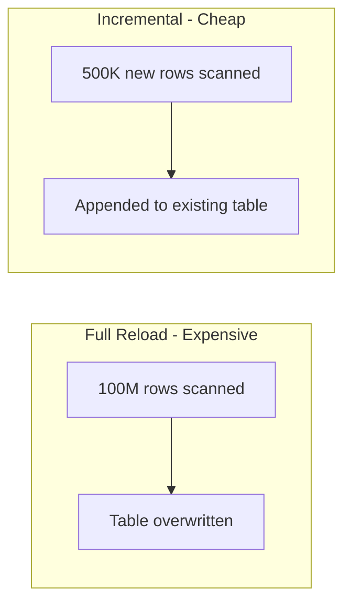

# How to Set Up Incremental Data Loading Patterns for BigQuery Using Scheduled Queries and Partitions

Author: [nawazdhandala](https://www.github.com/nawazdhandala)

Tags: GCP, BigQuery, Incremental Loading, Scheduled Queries, Partitioning, Data Engineering

Description: Learn how to implement incremental data loading patterns in BigQuery using scheduled queries and partition-based strategies to reduce costs and processing time.

---

Loading your entire dataset from scratch every day is simple, but it is wasteful. As your data grows, full reloads take longer and cost more. Incremental loading processes only the new and changed data since the last run, which can be orders of magnitude cheaper and faster. BigQuery scheduled queries combined with partitioning make this pattern surprisingly easy to implement. Here is how.

## Why Incremental Loading Matters

Consider a table with 100 million rows that grows by 500,000 rows per day. A full reload processes all 100 million rows every time. An incremental load processes only the 500,000 new rows - that is 200 times less data scanned, which directly translates to 200 times less cost in BigQuery's on-demand pricing model.



## Pattern 1: Append-Only with Ingestion Time Partitioning

The simplest incremental pattern appends new data without checking for duplicates. This works when your source data is append-only (like events or logs):

```sql
-- Create a partitioned table for event data
CREATE TABLE IF NOT EXISTS `my-project.analytics.events`
(
  event_id STRING,
  user_id STRING,
  event_type STRING,
  event_timestamp TIMESTAMP,
  properties JSON,
  _loaded_at TIMESTAMP DEFAULT CURRENT_TIMESTAMP()
)
PARTITION BY DATE(event_timestamp)
CLUSTER BY event_type, user_id
OPTIONS (
  description = 'User events with incremental loading',
  partition_expiration_days = 365
);
```

The scheduled query inserts only new data:

```sql
-- Scheduled query: Append new events from the staging table
-- Runs every hour
-- Uses @run_time parameter provided by BigQuery scheduler
INSERT INTO `my-project.analytics.events`
(event_id, user_id, event_type, event_timestamp, properties)
SELECT
  event_id,
  user_id,
  event_type,
  event_timestamp,
  properties
FROM `my-project.staging.raw_events`
WHERE event_timestamp >= TIMESTAMP_SUB(@run_time, INTERVAL 2 HOUR)
  AND event_timestamp < @run_time;
```

Set up the schedule:

```bash
# Create a scheduled query that runs every hour
bq query --use_legacy_sql=false \
  --schedule="every 1 hours" \
  --display_name="Hourly Event Load" \
  --destination_table="" \
  "$(cat incremental_events.sql)"
```

The overlap window (looking back 2 hours instead of just 1) is intentional. It handles late-arriving data. The trade-off is potential duplicates, which we address in the next pattern.

## Pattern 2: Incremental with Deduplication

When you need to handle both inserts and updates, use MERGE with a watermark to process only recent changes:

```sql
-- Create a watermark tracking table
CREATE TABLE IF NOT EXISTS `my-project.analytics._load_watermarks`
(
  table_name STRING NOT NULL,
  last_loaded_at TIMESTAMP NOT NULL,
  rows_loaded INT64,
  updated_at TIMESTAMP DEFAULT CURRENT_TIMESTAMP()
);

-- Initialize the watermark
INSERT INTO `my-project.analytics._load_watermarks`
VALUES ('orders', TIMESTAMP('2020-01-01'), 0, CURRENT_TIMESTAMP());
```

The incremental MERGE query:

```sql
-- Scheduled query: Incremental MERGE with watermark tracking
-- Step 1: Get the watermark for this table
DECLARE last_watermark TIMESTAMP;
SET last_watermark = (
  SELECT last_loaded_at
  FROM `my-project.analytics._load_watermarks`
  WHERE table_name = 'orders'
);

-- Step 2: MERGE new and changed records
MERGE INTO `my-project.analytics.orders` AS target
USING (
  -- Only process records updated since the last watermark
  SELECT *
  FROM `my-project.staging.orders_staging`
  WHERE updated_at > last_watermark
    AND updated_at <= CURRENT_TIMESTAMP()
) AS source
ON target.order_id = source.order_id

-- Update existing records if they changed
WHEN MATCHED AND source.updated_at > target.updated_at THEN
  UPDATE SET
    customer_id = source.customer_id,
    order_date = source.order_date,
    total_amount = source.total_amount,
    status = source.status,
    updated_at = source.updated_at

-- Insert new records
WHEN NOT MATCHED THEN
  INSERT (order_id, customer_id, order_date, total_amount, status, created_at, updated_at)
  VALUES (source.order_id, source.customer_id, source.order_date,
          source.total_amount, source.status, source.created_at, source.updated_at);

-- Step 3: Update the watermark
UPDATE `my-project.analytics._load_watermarks`
SET last_loaded_at = CURRENT_TIMESTAMP(),
    rows_loaded = @@row_count,
    updated_at = CURRENT_TIMESTAMP()
WHERE table_name = 'orders';
```

## Pattern 3: Partition-Level Replace

Sometimes the cleanest approach is to replace entire partitions. This avoids the complexity of MERGE while still being incremental:

```sql
-- Replace today's partition with fresh data
-- This is idempotent - running it twice produces the same result
MERGE INTO `my-project.analytics.daily_metrics` AS target
USING (
  SELECT
    DATE(event_timestamp) AS metric_date,
    event_type,
    COUNT(*) AS event_count,
    COUNT(DISTINCT user_id) AS unique_users,
    AVG(CAST(JSON_VALUE(properties, '$.duration') AS FLOAT64)) AS avg_duration
  FROM `my-project.analytics.events`
  WHERE DATE(event_timestamp) = CURRENT_DATE()
  GROUP BY 1, 2
) AS source
ON target.metric_date = source.metric_date AND target.event_type = source.event_type

WHEN MATCHED THEN
  UPDATE SET
    event_count = source.event_count,
    unique_users = source.unique_users,
    avg_duration = source.avg_duration

WHEN NOT MATCHED THEN
  INSERT (metric_date, event_type, event_count, unique_users, avg_duration)
  VALUES (source.metric_date, source.event_type, source.event_count,
          source.unique_users, source.avg_duration);
```

A simpler alternative using partition decorators:

```sql
-- Delete and replace a specific partition
-- This is useful when the entire partition needs recomputing
DELETE FROM `my-project.analytics.daily_metrics`
WHERE metric_date = CURRENT_DATE();

INSERT INTO `my-project.analytics.daily_metrics`
SELECT
  DATE(event_timestamp) AS metric_date,
  event_type,
  COUNT(*) AS event_count,
  COUNT(DISTINCT user_id) AS unique_users,
  AVG(CAST(JSON_VALUE(properties, '$.duration') AS FLOAT64)) AS avg_duration
FROM `my-project.analytics.events`
WHERE DATE(event_timestamp) = CURRENT_DATE()
GROUP BY 1, 2;
```

## Pattern 4: Multi-Day Backfill with Scripting

Sometimes you need to reprocess multiple days of data. BigQuery scripting makes this easy:

```sql
-- Backfill the last 7 days of daily metrics
DECLARE process_date DATE DEFAULT DATE_SUB(CURRENT_DATE(), INTERVAL 7 DAY);

WHILE process_date <= CURRENT_DATE() DO
  -- Delete the partition
  DELETE FROM `my-project.analytics.daily_metrics`
  WHERE metric_date = process_date;

  -- Recompute and insert
  INSERT INTO `my-project.analytics.daily_metrics`
  SELECT
    DATE(event_timestamp) AS metric_date,
    event_type,
    COUNT(*) AS event_count,
    COUNT(DISTINCT user_id) AS unique_users,
    AVG(CAST(JSON_VALUE(properties, '$.duration') AS FLOAT64)) AS avg_duration
  FROM `my-project.analytics.events`
  WHERE DATE(event_timestamp) = process_date
  GROUP BY 1, 2;

  SET process_date = DATE_ADD(process_date, INTERVAL 1 DAY);
END WHILE;
```

## Handling Late-Arriving Data

Late-arriving data is the bane of incremental loading. An event might be generated at 11:59 PM but only arrive in your staging area at 12:05 AM. Here is a pattern that handles this:

```sql
-- Use a look-back window to catch late arrivals
-- Process the last 3 days but only insert/update records not yet loaded
MERGE INTO `my-project.analytics.orders` AS target
USING (
  SELECT *
  FROM `my-project.staging.orders_staging`
  WHERE order_date >= DATE_SUB(CURRENT_DATE(), INTERVAL 3 DAY)
) AS source
ON target.order_id = source.order_id

WHEN MATCHED AND source.updated_at > target.updated_at THEN
  UPDATE SET
    customer_id = source.customer_id,
    total_amount = source.total_amount,
    status = source.status,
    updated_at = source.updated_at

WHEN NOT MATCHED THEN
  INSERT ROW;
```

The 3-day look-back window scans more data than strictly necessary, but it ensures late-arriving records get picked up. The MERGE ensures idempotency - processing the same record twice does not create duplicates.

## Monitoring Incremental Loads

Track the health of your incremental loads:

```sql
-- Monitor incremental load history
CREATE OR REPLACE VIEW `my-project.analytics.load_monitoring` AS
SELECT
  table_name,
  last_loaded_at,
  rows_loaded,
  updated_at,
  TIMESTAMP_DIFF(CURRENT_TIMESTAMP(), last_loaded_at, MINUTE) AS minutes_since_last_load,
  CASE
    WHEN TIMESTAMP_DIFF(CURRENT_TIMESTAMP(), last_loaded_at, HOUR) > 2 THEN 'STALE'
    WHEN rows_loaded = 0 THEN 'EMPTY_LOAD'
    ELSE 'HEALTHY'
  END AS status
FROM `my-project.analytics._load_watermarks`
ORDER BY minutes_since_last_load DESC;
```

Set up an alert for stale loads:

```sql
-- Query to run on a schedule for alerting
SELECT
  table_name,
  last_loaded_at,
  TIMESTAMP_DIFF(CURRENT_TIMESTAMP(), last_loaded_at, HOUR) AS hours_stale
FROM `my-project.analytics._load_watermarks`
WHERE TIMESTAMP_DIFF(CURRENT_TIMESTAMP(), last_loaded_at, HOUR) > 3;
```

## Choosing the Right Pattern

| Scenario | Recommended Pattern |
|----------|-------------------|
| Append-only data (events, logs) | Pattern 1: Simple append |
| Tables with updates and inserts | Pattern 2: MERGE with watermark |
| Aggregation tables refreshed daily | Pattern 3: Partition replace |
| Historical backfills | Pattern 4: Multi-day scripted backfill |

## Cost Optimization Tips

1. Always partition your tables. Without partitioning, even a well-written MERGE scans the entire table.

2. Use clustering on the columns you join on (like `order_id` in the MERGE examples). This reduces the data scanned during the match phase.

3. Schedule incremental loads at off-peak times when possible. BigQuery slot pricing is the same regardless of time, but scheduling during low-usage windows reduces contention with interactive queries.

4. Monitor bytes scanned per load. If your incremental load starts scanning as much data as a full reload, your watermark or partition strategy needs revisiting.

5. Use the `@run_time` and `@run_date` parameters in scheduled queries instead of `CURRENT_TIMESTAMP()`. These are more predictable and make debugging easier when a scheduled run is delayed.

Incremental loading is one of those investments that pays for itself quickly. A well-designed incremental load that processes only changed data will be faster, cheaper, and more reliable than a full reload - and as your data grows, the savings compound.
