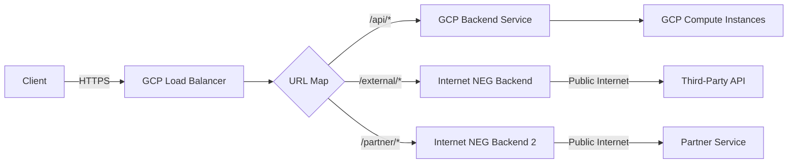

# How to Set Up Internet NEGs to Load Balance External Third-Party API Backends in GCP

Author: [nawazdhandala](https://www.github.com/nawazdhandala)

Tags: GCP, Internet NEG, Load Balancer, API Gateway, Third-Party APIs

Description: Learn how to configure internet network endpoint groups in GCP to route load balancer traffic to external third-party API backends outside of Google Cloud.

---

Sometimes your GCP load balancer needs to route traffic to a backend that is not in GCP at all. Maybe you are integrating with a third-party API, using a SaaS service as a backend, or running backends in another cloud provider. Internet NEGs (Network Endpoint Groups) let you define external FQDN or IP-based endpoints as backends for your GCP load balancer. This means you can use all of GCP's load balancing features - Cloud CDN, Cloud Armor, URL maps - even when the actual backend lives somewhere else entirely.

This post walks through setting up internet NEGs for both FQDN-based and IP-based external backends.

## What Is an Internet NEG?

An internet NEG is a network endpoint group that points to backends accessible over the public internet. Unlike hybrid NEGs (which use private connectivity through VPN/Interconnect), internet NEGs reach their backends through public internet routes.

Internet NEGs support two types of endpoints:
- **FQDN-based**: A domain name like `api.thirdparty.com` that resolves to the backend IP
- **IP-based**: A specific public IP address

Common use cases:
- Routing to a third-party API with CDN caching
- Fronting a SaaS backend with Cloud Armor protection
- Creating a unified API gateway that mixes GCP and non-GCP backends
- Migrating backends between clouds with zero client-side changes

## Step 1: Create an Internet NEG with FQDN

For most external services, you will use an FQDN-based endpoint:

```bash
# Create a global internet NEG
gcloud compute network-endpoint-groups create third-party-neg \
    --network-endpoint-type=INTERNET_FQDN_PORT \
    --global
```

Add the external endpoint:

```bash
# Add an FQDN endpoint pointing to the third-party API
gcloud compute network-endpoint-groups update third-party-neg \
    --global \
    --add-endpoint="fqdn=api.thirdparty.com,port=443"
```

You can add multiple endpoints if the service has multiple entry points:

```bash
# Add additional FQDN endpoints
gcloud compute network-endpoint-groups update third-party-neg \
    --global \
    --add-endpoint="fqdn=api-us.thirdparty.com,port=443" \
    --add-endpoint="fqdn=api-eu.thirdparty.com,port=443"
```

## Step 2: Create an Internet NEG with IP Address

If you know the external backend's IP address:

```bash
# Create an internet NEG with IP-based endpoints
gcloud compute network-endpoint-groups create ip-based-neg \
    --network-endpoint-type=INTERNET_IP_PORT \
    --global

# Add the IP endpoint
gcloud compute network-endpoint-groups update ip-based-neg \
    --global \
    --add-endpoint="ip=203.0.113.50,port=443"
```

## Step 3: Create a Backend Service

Create a backend service and attach the internet NEG:

```bash
# Create a backend service for the internet NEG
gcloud compute backend-services create third-party-backend \
    --protocol=HTTPS \
    --global

# Add the internet NEG
gcloud compute backend-services add-backend third-party-backend \
    --global \
    --network-endpoint-group=third-party-neg \
    --network-endpoint-group-zone=""
```

Note that the protocol should match what the external backend expects. Most third-party APIs use HTTPS.

## Step 4: Configure Custom Request and Response Headers

When proxying to external APIs, you often need to set custom headers:

```bash
# Set custom request headers sent to the third-party backend
gcloud compute backend-services update third-party-backend \
    --global \
    --custom-request-headers="Authorization: Bearer YOUR_API_KEY" \
    --custom-request-headers="X-Forwarded-Host: {client_host}"
```

You can also modify response headers:

```bash
# Set custom response headers returned to the client
gcloud compute backend-services update third-party-backend \
    --global \
    --custom-response-headers="X-Served-By: gcp-proxy" \
    --custom-response-headers="Strict-Transport-Security: max-age=31536000"
```

## Step 5: Set Up the URL Map

Create a URL map that routes specific paths to the external backend while keeping other traffic on your GCP backends:

```bash
# Create a URL map mixing GCP and external backends
gcloud compute url-maps create api-gateway-map \
    --default-service=my-gcp-backend \
    --global

gcloud compute url-maps add-path-matcher api-gateway-map \
    --path-matcher-name=api-routes \
    --default-service=my-gcp-backend \
    --path-rules="/external-api/*=third-party-backend,/partner/*=third-party-backend" \
    --global
```

## Step 6: Complete the Load Balancer

```bash
# Reserve an IP address
gcloud compute addresses create api-gateway-ip \
    --ip-version=IPV4 --global

# Create SSL certificate
gcloud compute ssl-certificates create api-gateway-cert \
    --domains=api.mycompany.com --global

# Create the HTTPS proxy
gcloud compute target-https-proxies create api-gateway-proxy \
    --url-map=api-gateway-map \
    --ssl-certificates=api-gateway-cert

# Create forwarding rule
gcloud compute forwarding-rules create api-gateway-rule \
    --address=api-gateway-ip \
    --global \
    --target-https-proxy=api-gateway-proxy \
    --ports=443
```

## Architecture Diagram



## Enabling Cloud CDN for External APIs

If the external API returns cacheable responses, you can dramatically reduce latency and API costs by enabling CDN:

```bash
# Enable CDN caching for third-party API responses
gcloud compute backend-services update third-party-backend \
    --enable-cdn \
    --cache-mode=USE_ORIGIN_HEADERS \
    --global
```

This is particularly useful for external APIs that have rate limits or per-request pricing. Cached responses do not count against the external API's limits.

## Adding Cloud Armor Protection

Protect the proxy endpoint with Cloud Armor:

```bash
# Create a security policy
gcloud compute security-policies create api-gateway-policy

# Only allow specific IP ranges to access the proxy
gcloud compute security-policies rules create 1000 \
    --security-policy=api-gateway-policy \
    --action=allow \
    --src-ip-ranges="10.0.0.0/8,172.16.0.0/12"

# Default deny all other traffic
gcloud compute security-policies rules update 2147483647 \
    --security-policy=api-gateway-policy \
    --action=deny-403

# Attach to the backend service
gcloud compute backend-services update third-party-backend \
    --security-policy=api-gateway-policy \
    --global
```

## URL Rewriting for External APIs

Often your URL structure does not match the external API's path structure. Use URL rewrites to transform the path:

```bash
# Import a URL map with path rewriting for the external API
gcloud compute url-maps import api-gateway-map \
    --global \
    --source=/dev/stdin <<'EOF'
name: api-gateway-map
defaultService: projects/MY_PROJECT/global/backendServices/my-gcp-backend
hostRules:
- hosts:
  - '*'
  pathMatcher: routes
pathMatchers:
- name: routes
  defaultService: projects/MY_PROJECT/global/backendServices/my-gcp-backend
  routeRules:
  - priority: 1
    matchRules:
    - prefixMatch: /weather/
    routeAction:
      urlRewrite:
        pathPrefixRewrite: /data/2.5/
      weightedBackendServices:
      - backendService: projects/MY_PROJECT/global/backendServices/third-party-backend
        weight: 100
EOF
```

This rewrites `/weather/forecast` to `/data/2.5/forecast` before sending to the external API.

## Health Checking for Internet NEGs

Internet NEGs do not support traditional health checks since the external endpoint is not under your control. Instead, the load balancer assumes the endpoint is healthy. If you need health monitoring, set up external monitoring through a service like OneUptime to alert you when the third-party API is down, and manually remove the backend if needed.

## Timeout Configuration

External APIs may have different latency characteristics than local backends. Configure appropriate timeouts:

```bash
# Set longer timeouts for external API calls
gcloud compute backend-services update third-party-backend \
    --timeout=60s \
    --global
```

The default is 30 seconds, which might not be enough for slow external APIs.

## Failover Between External Providers

If you have redundant external providers, you can set up multiple internet NEGs and use traffic splitting or failover:

```bash
# Create NEGs for primary and backup providers
gcloud compute network-endpoint-groups create primary-api-neg \
    --network-endpoint-type=INTERNET_FQDN_PORT --global

gcloud compute network-endpoint-groups update primary-api-neg \
    --global --add-endpoint="fqdn=api-primary.provider1.com,port=443"

gcloud compute network-endpoint-groups create backup-api-neg \
    --network-endpoint-type=INTERNET_FQDN_PORT --global

gcloud compute network-endpoint-groups update backup-api-neg \
    --global --add-endpoint="fqdn=api.provider2.com,port=443"
```

## Wrapping Up

Internet NEGs unlock a powerful pattern: using GCP's load balancing infrastructure as a gateway to external services. You get CDN caching to reduce API costs and latency, Cloud Armor to protect access, URL maps for intelligent routing, and a single entry point for clients regardless of where backends actually live. This is especially valuable during multi-cloud migrations and when building API gateways that aggregate multiple external services behind a single domain.
