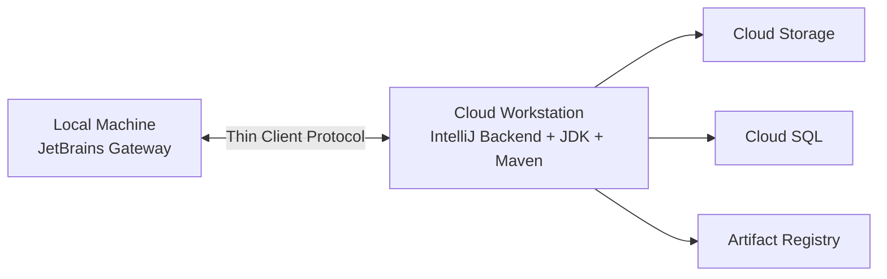

# How to Set Up JetBrains IntelliJ IDEA in Google Cloud Workstations for Java Development

Author: [nawazdhandala](https://www.github.com/nawazdhandala)

Tags: GCP, Cloud Workstations, JetBrains, IntelliJ IDEA, Java, Development Environment

Description: Step-by-step guide to configuring JetBrains IntelliJ IDEA as your remote IDE in Google Cloud Workstations for cloud-based Java development workflows.

---

There is a growing trend toward moving development environments off local laptops and into the cloud. The reasons make sense: consistent environments, better hardware for builds, closer proximity to cloud services, and no more "works on my machine" problems. Google Cloud Workstations gives you a managed remote development environment, and JetBrains IntelliJ IDEA integrates with it natively through their Gateway client.

This guide walks through setting up IntelliJ IDEA in Cloud Workstations so you can write, build, and debug Java applications from a cloud-based workstation.

## How the Architecture Works

Cloud Workstations runs a container-based environment on a GCE VM. You connect to it from your local machine using JetBrains Gateway, which provides a thin client experience while the actual IDE backend runs on the workstation. Your code, builds, and processes all run remotely - only the UI renders locally.



## Prerequisites

You need the following before starting:

- A GCP project with Cloud Workstations API enabled
- A Cloud Workstations cluster (or permissions to create one)
- JetBrains Gateway installed on your local machine
- The Google Cloud CLI installed locally

## Step 1: Enable the Cloud Workstations API

```bash
# Enable Cloud Workstations API
gcloud services enable workstations.googleapis.com
```

## Step 2: Create a Workstation Cluster

A cluster defines the region and network for your workstations.

```bash
# Create a workstation cluster in your preferred region
gcloud workstations clusters create java-dev-cluster \
  --region=us-central1 \
  --network=projects/MY_PROJECT/global/networks/default \
  --subnetwork=projects/MY_PROJECT/regions/us-central1/subnetworks/default
```

Wait for the cluster to finish provisioning - this typically takes about 15 minutes.

## Step 3: Create a Workstation Configuration with JetBrains Support

The workstation configuration defines the machine type, disk size, and base image. For Java development with IntelliJ, you want a machine with enough CPU and RAM for compilation and indexing.

```bash
# Create a workstation configuration optimized for Java development
gcloud workstations configs create java-intellij-config \
  --cluster=java-dev-cluster \
  --region=us-central1 \
  --machine-type=e2-standard-8 \
  --boot-disk-size=100 \
  --pd-disk-size=200 \
  --pd-disk-type=pd-ssd \
  --idle-timeout=3600s \
  --running-timeout=43200s \
  --disable-public-ip-addresses=false
```

I recommend `e2-standard-8` (8 vCPUs, 32 GB RAM) as the minimum for Java work. IntelliJ's indexer and the Java compiler are both memory-hungry. If you are working on a large codebase with many modules, step up to `e2-standard-16`.

## Step 4: Use a Custom Container Image with Java Tooling

The default Cloud Workstation image is minimal. For a proper Java development setup, create a custom image with the JDK, Maven, Gradle, and other tools pre-installed.

Create a Dockerfile for your custom image:

```dockerfile
# Start from the base Cloud Workstations image
FROM us-central1-docker.pkg.dev/cloud-workstations-images/predefined/base:latest

# Install JDK 21 (LTS release)
RUN apt-get update && apt-get install -y \
    openjdk-21-jdk \
    maven \
    && rm -rf /var/lib/apt/lists/*

# Install Gradle
ENV GRADLE_VERSION=8.5
RUN curl -fsSL https://services.gradle.org/distributions/gradle-${GRADLE_VERSION}-bin.zip \
    -o /tmp/gradle.zip \
    && unzip /tmp/gradle.zip -d /opt \
    && rm /tmp/gradle.zip \
    && ln -s /opt/gradle-${GRADLE_VERSION}/bin/gradle /usr/local/bin/gradle

# Set JAVA_HOME
ENV JAVA_HOME=/usr/lib/jvm/java-21-openjdk-amd64
ENV PATH=$JAVA_HOME/bin:$PATH

# Install useful development tools
RUN apt-get update && apt-get install -y \
    git \
    curl \
    jq \
    docker.io \
    && rm -rf /var/lib/apt/lists/*

# Pre-configure Maven settings for Artifact Registry
RUN mkdir -p /home/user/.m2
COPY settings.xml /home/user/.m2/settings.xml
```

Build and push this image to Artifact Registry:

```bash
# Build and push the custom image
gcloud builds submit --tag us-central1-docker.pkg.dev/MY_PROJECT/workstations/java-dev:latest .
```

Then update your workstation configuration to use the custom image:

```bash
# Update the config to use the custom container image
gcloud workstations configs update java-intellij-config \
  --cluster=java-dev-cluster \
  --region=us-central1 \
  --container-custom-image=us-central1-docker.pkg.dev/MY_PROJECT/workstations/java-dev:latest
```

## Step 5: Create and Start a Workstation

```bash
# Create a workstation instance
gcloud workstations create my-java-ws \
  --cluster=java-dev-cluster \
  --config=java-intellij-config \
  --region=us-central1

# Start the workstation
gcloud workstations start my-java-ws \
  --cluster=java-dev-cluster \
  --config=java-intellij-config \
  --region=us-central1
```

## Step 6: Connect with JetBrains Gateway

Now comes the part where you connect IntelliJ to your workstation.

1. Open JetBrains Gateway on your local machine.
2. Click "Connect to Google Cloud Workstations" under the Cloud Workstations plugin. If you do not see this option, install the Google Cloud Workstations plugin from the Gateway marketplace.
3. Sign in with your Google account and select your project.
4. You should see your workstation listed. Click "Connect".
5. Select "IntelliJ IDEA" as the IDE and choose the version.
6. Gateway will install the IntelliJ backend on the workstation and establish the connection.

The first connection takes a few minutes while the IDE backend downloads and initializes. Subsequent connections are much faster because the backend persists on the workstation's disk.

## Step 7: Configure the Project

Once connected, open your project or clone a repository. The terminal in IntelliJ runs on the workstation, so all commands execute remotely.

```bash
# Clone your project on the workstation
git clone https://github.com/your-org/your-java-project.git
cd your-java-project

# Verify Java and Maven are available
java -version
mvn -version
```

IntelliJ will start indexing the project. For a large Java project, this can take several minutes on first open, but results are cached on the persistent disk.

## Tuning IntelliJ Performance on Cloud Workstations

Cloud Workstations run IntelliJ headlessly, so some default settings are not optimal. Here are the adjustments I recommend.

### Increase IDE Memory

Edit the VM options to give IntelliJ more heap space, especially for large projects.

Navigate to Help > Edit Custom VM Options and add:

```
-Xmx4g
-Xms2g
-XX:+UseG1GC
-XX:ReservedCodeCacheSize=512m
```

### Configure Code Style and Inspections

Set your team's code style and inspection profiles so they are consistent across all workstations. Store these in the project's `.idea` directory and commit them to version control.

### Set Up Run Configurations

Create run and debug configurations for your application. Since everything runs on the workstation, port forwarding is handled automatically by Gateway - you can access your running application at `localhost` on your local machine.

## Working with Google Cloud Services

One of the biggest advantages of developing on a Cloud Workstation is the proximity to GCP services. Your workstation runs with a service account that can be configured to access Cloud SQL, Pub/Sub, BigQuery, and other services without managing local credentials.

```bash
# Access Cloud SQL directly from the workstation - no proxy needed
gcloud sql connect my-database --user=root

# Use Application Default Credentials automatically
# Your Java code picks them up through the client libraries
export GOOGLE_APPLICATION_CREDENTIALS=/path/to/service-account-key.json
```

## Persistent Storage

By default, the home directory (`/home/user`) is on a persistent disk that survives workstation restarts. Your code, IDE settings, Maven/Gradle caches, and git configuration all persist. However, anything outside the home directory is ephemeral - it resets when the workstation restarts.

Store your `.m2/repository` cache in the home directory (which is the default) so Maven does not re-download dependencies after every restart.

## Wrapping Up

Cloud Workstations with IntelliJ IDEA gives Java developers a consistent, powerful remote development environment without the overhead of managing VMs or SSH tunnels manually. JetBrains Gateway makes the connection seamless enough that it feels almost identical to running locally. The main benefits - faster builds on cloud hardware, proximity to GCP services, and consistent tooling across the team - make the setup effort worthwhile for any team working on Java projects in GCP.
