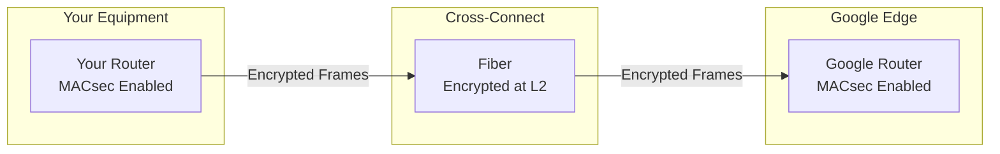

# How to Set Up MACsec Encryption on Dedicated Interconnect in GCP

Author: [nawazdhandala](https://www.github.com/nawazdhandala)

Tags: GCP, MACsec, Dedicated Interconnect, Encryption, Networking, Security

Description: Learn how to enable and configure MACsec encryption on GCP Dedicated Interconnect for layer 2 encryption of traffic between your data center and Google Cloud.

---

Cloud Interconnect traffic in GCP travels over your colocation provider's infrastructure and Google's private network. While this traffic does not traverse the public internet, some organizations require encryption at every layer for compliance or security reasons. MACsec (Media Access Control Security, defined in IEEE 802.1AE) provides line-rate layer 2 encryption for your Dedicated Interconnect links.

In this post, I will explain what MACsec does, when you need it, and how to configure it on your GCP Dedicated Interconnect.

## What is MACsec?

MACsec encrypts Ethernet frames at layer 2, right above the physical layer. Every frame that crosses the wire is encrypted and authenticated. Unlike IPsec (which operates at layer 3), MACsec encrypts everything - including the IP headers - and operates at wire speed with no performance penalty.

Key characteristics:

- **Line-rate encryption**: No throughput reduction. A 10G link with MACsec still delivers 10G.
- **Hop-by-hop**: Encrypts between directly connected devices (your router to Google's edge).
- **Hardware-based**: Uses dedicated crypto hardware in the network interfaces.
- **Standards-based**: IEEE 802.1AE with GCM-AES-256 cipher suite.



## When Do You Need MACsec?

MACsec on Dedicated Interconnect is most relevant when:

- **Regulatory compliance**: Standards like PCI-DSS, HIPAA, or government regulations may require encryption of all data in transit, even on private links.
- **Multi-tenant colocation**: Your fiber passes through shared infrastructure in the colocation facility. MACsec ensures no one can tap and read the data.
- **Defense in depth**: You want encryption at every layer as part of a zero-trust security model.
- **Data sensitivity**: The data crossing the Interconnect is highly sensitive (financial, healthcare, classified).

If your traffic is already encrypted at higher layers (TLS for application traffic, IPsec for VPN), MACsec adds another layer but is not strictly necessary from a data-protection standpoint. It is about reducing the attack surface at the physical layer.

## Prerequisites

Before enabling MACsec:

- You need a Dedicated Interconnect (MACsec is not available for Partner Interconnect)
- Your on-premises router must support MACsec with GCM-AES-256
- The Interconnect link must support MACsec (check with Google if your location supports it)
- You need a 10G or 100G link (MACsec is supported on both)

## Step 1: Create a MACsec-Enabled Interconnect

When creating a new Dedicated Interconnect, specify MACsec support:

```bash
# Create a Dedicated Interconnect with MACsec enabled
gcloud compute interconnects create my-macsec-interconnect \
    --interconnect-type=DEDICATED \
    --link-type=LINK_TYPE_ETHERNET_10G_LR \
    --requested-link-count=1 \
    --location=iad-zone1-1 \
    --admin-enabled \
    --macsec-enabled \
    --description="MACsec-enabled interconnect"
```

If you have an existing Interconnect, you can enable MACsec on it:

```bash
# Enable MACsec on an existing interconnect
gcloud compute interconnects update my-interconnect \
    --macsec-enabled
```

## Step 2: Generate and Configure MACsec Keys

MACsec uses pre-shared keys (CAK - Connectivity Association Key) to establish the encryption session. You need to configure matching keys on both sides.

Generate a MACsec key on the GCP side:

```bash
# Create a MACsec key on the Interconnect
gcloud compute interconnects macsec add-key my-macsec-interconnect \
    --key-name=macsec-key-1 \
    --start-time=2026-02-17T00:00:00Z
```

Retrieve the key details:

```bash
# Get the MACsec key information
gcloud compute interconnects describe my-macsec-interconnect \
    --format="yaml(macsec)"
```

This shows you the CAK (Connectivity Association Key) and CKN (Connectivity Association Key Name) that you need to configure on your on-premises router.

## Step 3: Configure MACsec on Your On-Premises Router

Here is how to configure MACsec on common router platforms.

### Cisco IOS XE

```text
! Define the MACsec key chain
key chain macsec-keychain macsec
  key 01
    cryptographic-algorithm aes-256-cmac
    key-string <CAK-value-from-GCP>
    lifetime 00:00:00 Feb 17 2026 infinite

! Configure the MACsec policy
mka policy gcp-macsec-policy
  macsec-cipher-suite gcm-aes-256
  confidentiality-offset 0
  key-server priority 200

! Apply to the physical interface
interface TenGigabitEthernet0/0
  mka policy gcp-macsec-policy
  mka pre-shared-key key-chain macsec-keychain
  macsec
  no shutdown
```

### Juniper Junos

```text
# Configure MACsec connectivity association
set security macsec connectivity-association gcp-macsec
set security macsec connectivity-association gcp-macsec cipher-suite gcm-aes-256
set security macsec connectivity-association gcp-macsec security-mode static-cak
set security macsec connectivity-association gcp-macsec pre-shared-key ckn <CKN-value>
set security macsec connectivity-association gcp-macsec pre-shared-key cak <CAK-value>

# Apply to the interface
set security macsec interfaces xe-0/0/0 connectivity-association gcp-macsec
```

### Arista EOS

```text
! Configure MACsec profile
mac security
  profile gcp-macsec
    cipher aes256-gcm
    key macsec-keychain
      mka key 01
        secret <CAK-value>
        ckn <CKN-value>

! Apply to the interface
interface Ethernet1
  mac security profile gcp-macsec
```

## Step 4: Verify MACsec Session

Once both sides are configured, the MACsec session should establish automatically through the MKA (MACsec Key Agreement) protocol.

On the GCP side:

```bash
# Check MACsec status on the Interconnect
gcloud compute interconnects get-diagnostics my-macsec-interconnect \
    --format="yaml(result.macsecStatus)"
```

On the on-premises side (Cisco example):

```text
! Check MACsec session status
show macsec summary
show mka sessions
show macsec statistics interface TenGigabitEthernet0/0
```

You should see:

- MKA session established
- Secure Channel (SC) active
- Encrypted packet counters incrementing
- No decryption errors

## Step 5: Configure Fail-Open or Fail-Close Behavior

An important decision: what happens if MACsec fails? You have two options:

**Fail-open** (must-secure off): If MACsec cannot be established, traffic flows unencrypted. This prioritizes availability over security.

**Fail-close** (must-secure on): If MACsec cannot be established, the link drops. This prioritizes security over availability.

On GCP:

```bash
# Set fail-open behavior (allow unencrypted traffic if MACsec fails)
gcloud compute interconnects update my-macsec-interconnect \
    --macsec-fail-open

# Or set fail-close behavior (drop traffic if MACsec fails)
gcloud compute interconnects update my-macsec-interconnect \
    --no-macsec-fail-open
```

For production environments where the Interconnect has redundant links, I recommend fail-close. If one MACsec session fails, traffic shifts to the other link (which still has MACsec active).

## Key Rotation

Security best practices require periodic key rotation. GCP supports multiple MACsec keys with different start times, allowing hitless key rollover:

```bash
# Add a new key with a future start time
gcloud compute interconnects macsec add-key my-macsec-interconnect \
    --key-name=macsec-key-2 \
    --start-time=2026-03-17T00:00:00Z

# Configure the same new key on your on-premises router before the start time
# Both keys remain active during the transition period

# After the new key is active on both sides, remove the old key
gcloud compute interconnects macsec remove-key my-macsec-interconnect \
    --key-name=macsec-key-1
```

Plan key rotation well in advance. Add the new key on both sides before the start time to avoid any disruption.

## Performance Considerations

MACsec encryption is hardware-accelerated and operates at line rate. Unlike IPsec:

- **No throughput impact**: Your 10G link still delivers 10G of encrypted traffic
- **No latency impact**: Hardware encryption adds sub-microsecond delay
- **No CPU overhead**: Encryption is handled by the NIC/transceiver, not the router's CPU
- **Small overhead**: MACsec adds about 32 bytes per frame (16-byte SecTAG + 16-byte ICV)

The only consideration is that the 32-byte per-frame overhead slightly reduces the effective MTU. If you are using 1500-byte frames, the actual payload decreases slightly. Most modern equipment handles this transparently.

## MACsec vs IPsec: Which One?

| Feature | MACsec | IPsec |
|---------|--------|-------|
| Layer | 2 (Ethernet) | 3 (IP) |
| Performance | Line rate, hardware | Software/hardware, may reduce throughput |
| Scope | Point-to-point (single hop) | End-to-end (multi-hop) |
| What is encrypted | Everything including L3 headers | IP payload only |
| Use with Interconnect | Yes (Dedicated only) | Not natively (would use VPN) |

They solve different problems. MACsec protects the physical link. IPsec protects the data end-to-end. You can use both if needed.

## Wrapping Up

MACsec on Dedicated Interconnect adds strong, hardware-accelerated encryption to your physical link with zero performance penalty. The setup involves creating MACsec keys in GCP and configuring matching keys on your on-premises router. Once the MKA session establishes, all traffic is encrypted transparently. For production deployments, use redundant links with fail-close behavior, and plan regular key rotations to maintain security hygiene.
