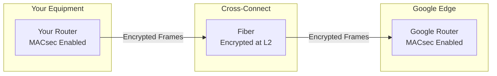

# How to Set Up MACsec Encryption on Dedicated Interconnect in GCP

Author: [nawazdhandala](https://www.github.com/nawazdhandala)

Tags: GCP, MACsec, Dedicated Interconnect, Encryption, Networking, Security

Description: Learn how to enable and configure MACsec encryption on GCP Dedicated Interconnect for layer 2 encryption of traffic between your data center and Google Cloud.

---

Cloud Interconnect traffic in GCP travels over your colocation provider's infrastructure and Google's private network. While this traffic does not traverse the public internet, some organizations require encryption at every layer for compliance or security reasons. MACsec (Media Access Control Security, defined in IEEE 802.1AE) provides line-rate layer 2 encryption for your Dedicated Interconnect links.

In this post, I will explain what MACsec does, when you need it, and how to configure it on your GCP Dedicated Interconnect.

## What is MACsec?

MACsec encrypts Ethernet frames at layer 2, right above the physical layer. Every frame that crosses the wire is encrypted and authenticated. Unlike IPsec (which operates at layer 3), MACsec encrypts the Ethernet payload - including the IP headers - and, on supported hardware, operates at line rate.

Key characteristics:

- **Line-rate encryption**: MACsec is designed to run at the speed of the physical link on supported hardware.
- **Hop-by-hop**: Encrypts between directly connected devices (your router to Google's edge).
- **Hardware-based**: Uses dedicated crypto hardware in the network interfaces.
- **Standards-based**: IEEE 802.1AE with GCM-AES-256-XPN or GCM-AES-256 cipher suites.


```mermaid
graph LR
    subgraph Your Equipment
        A[Your Router<br/>MACsec Enabled]
    end
    subgraph Cross-Connect
        B[Fiber<br/>Encrypted at L2]
    end
    subgraph Google Edge
        C[Google Router<br/>MACsec Enabled]
    end
    A -- "Encrypted Frames" --> B
    B -- "Encrypted Frames" --> C
```

## When Do You Need MACsec?

MACsec on Dedicated Interconnect is most relevant when:

- **Regulatory compliance**: Standards like PCI-DSS, HIPAA, or government regulations may require encryption of all data in transit, even on private links.
- **Multi-tenant colocation**: Your fiber passes through shared infrastructure in the colocation facility. MACsec ensures no one can tap and read the data.
- **Defense in depth**: You want encryption at every layer as part of a zero-trust security model.
- **Data sensitivity**: The data crossing the Interconnect is highly sensitive (financial, healthcare, classified).

If your traffic is already encrypted at higher layers (TLS for application traffic, IPsec for VPN), MACsec adds another layer but is not strictly necessary from a data-protection standpoint. It is about reducing the attack surface at the physical layer.

## Prerequisites

Before enabling MACsec:

- This guide assumes Dedicated Interconnect. MACsec for Partner Interconnect depends on your service provider's support and protects the connection between Google's peering edge router and the service provider's peering edge router.
- Your on-premises router must support MACsec with GCM-AES-256-XPN or GCM-AES-256. Google recommends GCM-AES-256-XPN, especially for high-bandwidth links.
- The Interconnect link must be MACsec capable. 100G and 400G links are MACsec capable by default; 10G MACsec requires support at the colocation facility and must be enabled for your project by your Google Cloud account team.
- You need a 10G, 100G, or 400G link.

## Step 1: Create a MACsec-Enabled Interconnect

When creating a new Dedicated Interconnect, specify MACsec support:

```bash
# Request a MACsec-capable Dedicated Interconnect

gcloud compute interconnects create my-macsec-interconnect \
    --customer-name="Example Company" \
    --interconnect-type=DEDICATED \
    --link-type=LINK_TYPE_ETHERNET_10G_LR \
    --requested-link-count=1 \
    --location=iad-zone1-1 \
    --requested-features=MACSEC \
    --description="MACsec-enabled interconnect"
```

If you have an existing Interconnect, first verify that it is MACsec capable:

```bash
# Check whether an existing interconnect is MACsec capable
gcloud compute interconnects describe my-interconnect
```

For 10G links, look for `availableFeatures: IF_MACSEC`. 100G and 400G links are MACsec capable by default. If an existing 10G connection is not MACsec capable, request a new MACsec-capable connection or work with your Google Cloud account manager to migrate it to MACsec-capable ports.

## Step 2: Generate and Configure MACsec Keys

MACsec uses pre-shared keys (CAK - Connectivity Association Key) to establish the encryption session. You need to configure matching keys on both sides.

Generate a MACsec key on the GCP side:

```bash
# Create a MACsec key on the Interconnect
gcloud compute interconnects macsec add-key my-macsec-interconnect \
    --key-name=macsec-key-1 \
    --start-time=2026-02-17T00:00:00Z
```

Retrieve the key details:

```bash
# Get the MACsec key information
gcloud compute interconnects macsec get-config my-macsec-interconnect
```

This shows you the CAK (Connectivity Association Key) and CKN (Connectivity Association Key Name) that you need to configure on your on-premises router.

## Step 3: Configure MACsec on Your On-Premises Router

Use your router vendor's documentation to configure MACsec on the physical interface connected to Google. For compatibility with Google's routers, use these settings:

```text
MACsec cipher suite: GCM-AES-256-XPN, or GCM-AES-256 if XPN is unavailable
CAK cryptographic algorithm: AES_256_CMAC
Key server priority: 15
SAK rekey interval: 28800 seconds
Confidentiality offset: 0
Replay protection window size: 64
ICV indicator: yes
Secure Channel Identifier (SCI): enabled
CAK: <CAK-value-from-GCP>
CKN: <CKN-value-from-GCP>
```

Do not enable MACsec on your router until the CAK, CKN, and the rest of the MACsec parameters are configured. Enabling MACsec on only one side can interrupt traffic.

## Step 4: Enable MACsec on GCP

After the keys and router parameters are in place, enable MACsec on the Cloud Interconnect connection:

```bash
# Enable MACsec on the interconnect
gcloud compute interconnects macsec update my-macsec-interconnect \
    --enabled
```

When you enable MACsec, the connection can briefly experience packet loss. Drain or stop production traffic on the VLAN attachments before enabling it.

## Step 5: Verify MACsec Session

Once both sides are configured, the MACsec session should establish automatically through the MKA (MACsec Key Agreement) protocol.

On the GCP side:

```bash
# Check MACsec status on the Interconnect
gcloud compute interconnects get-diagnostics my-macsec-interconnect \
    --format="yaml(result.links.macsec,result.links.operationalStatus,result.bundleOperationalStatus)"
```

On the on-premises side (Cisco example):

```text
! Check MACsec session status
show macsec summary
show mka sessions
show macsec statistics interface TenGigabitEthernet0/0
```

You should see:

- MKA session established
- Secure Channel (SC) active
- Encrypted packet counters incrementing
- No decryption errors

## Step 6: Configure Fail-Open or Fail-Close Behavior

An important decision: what happens if MACsec fails? You have two options:

**Fail-open** (must-secure off): If MACsec cannot be established, traffic flows unencrypted. This prioritizes availability over security.

**Fail-close** (must-secure on): If MACsec cannot be established, the link drops. This prioritizes security over availability.

On GCP:

```bash
# Set fail-open behavior (allow unencrypted traffic if MACsec fails)
gcloud compute interconnects macsec update my-macsec-interconnect \
    --no-enabled \
    --fail-open
gcloud compute interconnects macsec update my-macsec-interconnect \
    --enabled

# Or set fail-close behavior (drop traffic if MACsec fails)
gcloud compute interconnects macsec update my-macsec-interconnect \
    --no-enabled \
    --no-fail-open
gcloud compute interconnects macsec update my-macsec-interconnect \
    --enabled
```

For production environments where the Interconnect has redundant links, I recommend fail-close. If one MACsec session fails, traffic shifts to the other link (which still has MACsec active).

## Key Rotation

Security best practices require periodic key rotation. GCP supports up to five MACsec keys with different start times, allowing hitless key rollover:

```bash
# Add a new key with a future start time
gcloud compute interconnects macsec add-key my-macsec-interconnect \
    --key-name=macsec-key-2 \
    --start-time=2026-03-17T00:00:00Z

# Configure the same new key on your on-premises router before the start time
# Verify the new key is active after the start time
gcloud compute interconnects get-diagnostics my-macsec-interconnect

# After the new key is active on both sides, remove the old key
gcloud compute interconnects macsec remove-key my-macsec-interconnect \
    --key-name=macsec-key-1
```

Plan key rotation well in advance. Consecutive key start times must be at least six hours apart. Add the new key on both sides before the start time, verify that the new key is active, and remove the old key from the on-premises router before removing it from Cloud Interconnect.

## Performance Considerations

MACsec encryption is hardware-accelerated and operates at line rate. Unlike IPsec:

- **No throughput impact**: Your 10G link still delivers 10G of encrypted traffic
- **Minimal latency impact**: MACsec is handled in hardware on supported platforms
- **No CPU overhead**: Encryption is handled by the NIC/transceiver, not the router's CPU
- **Small overhead**: MACsec adds SecTAG and ICV bytes to each protected Ethernet frame

The additional per-frame overhead can slightly reduce the effective payload size if the physical interface MTU is not adjusted. Make sure the router interface MTU and VLAN attachment MTU are planned with MACsec overhead in mind.

## MACsec vs IPsec: Which One?

| Feature | MACsec | IPsec |
|---------|--------|-------|
| Layer | 2 (Ethernet) | 3 (IP) |
| Performance | Line rate, hardware | Software/hardware, may reduce throughput |
| Scope | Point-to-point (single hop) | End-to-end (multi-hop) |
| What is encrypted | Ethernet payload, including L3 headers | IP payload; tunnel mode also protects the original IP header |
| Use with Interconnect | Yes | Yes, for example with HA VPN over Cloud Interconnect |

They solve different problems. MACsec protects the physical link. IPsec protects the data end-to-end. You can use both if needed.

## Wrapping Up

MACsec on Dedicated Interconnect adds strong, hardware-accelerated encryption to your physical link with minimal operational overhead. The setup involves creating MACsec keys in GCP and configuring matching keys on your on-premises router. Once the MKA session establishes, all traffic is encrypted transparently. For production deployments, use redundant links with fail-close behavior, and plan regular key rotations to maintain security hygiene.
