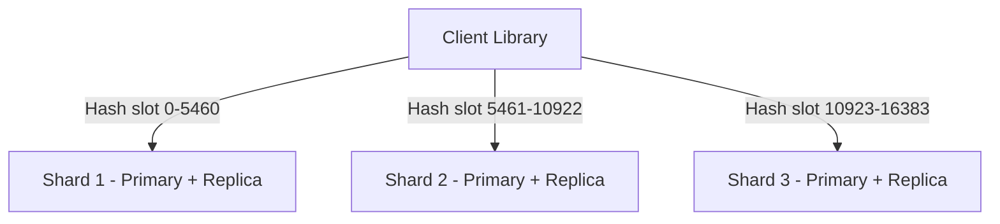

# How to Set Up Memorystore Redis Cluster for High Throughput

Author: [nawazdhandala](https://www.github.com/nawazdhandala)

Tags: GCP, Memorystore, Redis Cluster, High Throughput, Scaling

Description: Deploy and configure a Memorystore Redis Cluster for high-throughput workloads with data sharding, multi-shard operations, and client-side configuration.

---

There comes a point where a single Redis instance, no matter how large, cannot handle your throughput requirements. You hit the limit of what one primary node can process. That is when you need Redis Cluster. Instead of a single node handling all reads and writes, Redis Cluster distributes data across multiple shards, each handling a portion of the keyspace. The result is near-linear throughput scaling as you add more shards.

Google Cloud's Memorystore Redis Cluster is a fully managed implementation of Redis Cluster. You get automatic sharding, built-in replication per shard, and a managed control plane. In this post, I will show you how to set up a Redis Cluster, configure your clients to work with it, and get the most out of the sharded architecture.

## How Redis Cluster Works

Redis Cluster divides the keyspace into 16,384 hash slots. Each shard is responsible for a range of these slots. When you write or read a key, the client hashes the key to determine which slot it belongs to, then routes the request to the correct shard.



Each shard has a primary node that handles writes and one or more replicas for read scaling and failover.

## Creating a Memorystore Redis Cluster

Create a cluster with multiple shards:

```bash
# Create a Memorystore Redis Cluster with 3 shards
gcloud redis clusters create my-redis-cluster \
  --region=us-central1 \
  --network=projects/my-project/global/networks/default \
  --shard-count=3 \
  --replica-count=1 \
  --node-type=redis-standard-small \
  --transit-encryption-mode=TRANSIT_ENCRYPTION_MODE_SERVER_AUTHENTICATION
```

Key parameters:

- `--shard-count` - Number of shards (each shard handles a portion of the keyspace). More shards = more throughput.
- `--replica-count` - Replicas per shard. Set to 1 for HA, 2 for extra read capacity.
- `--node-type` - The machine type for each node. Options include `redis-standard-small`, `redis-highmem-medium`, `redis-highmem-xlarge`.

## Sizing Your Cluster

Throughput scales roughly linearly with shard count:

| Shards | Approximate Write Throughput | Approximate Read Throughput |
|--------|------------------------------|----------------------------|
| 3 | 300K ops/sec | 600K ops/sec (with replicas) |
| 5 | 500K ops/sec | 1M ops/sec |
| 10 | 1M ops/sec | 2M ops/sec |

These are rough estimates. Actual numbers depend on key sizes, value sizes, and command types.

```python
# cluster_sizing.py - Estimate Redis Cluster shard count
def estimate_shard_count(
    target_write_ops,
    target_read_ops,
    total_data_gb,
    ops_per_shard=100000,  # Conservative estimate per shard
    gb_per_shard=13  # Memory per shard based on node type
):
    """Estimate the number of shards needed for a Redis Cluster."""

    # Shards needed for write throughput
    shards_for_writes = target_write_ops / ops_per_shard

    # Shards needed for storage
    shards_for_storage = total_data_gb / gb_per_shard

    # Take the maximum
    min_shards = max(shards_for_writes, shards_for_storage, 3)

    print(f"Shards needed for write throughput: {shards_for_writes:.1f}")
    print(f"Shards needed for storage: {shards_for_storage:.1f}")
    print(f"Recommended shard count: {int(min_shards) + 1}")

    return int(min_shards) + 1

# Example: high-throughput leaderboard
estimate_shard_count(
    target_write_ops=500000,
    target_read_ops=1000000,
    total_data_gb=25
)
```

## Connecting to the Cluster

After creation, get the discovery endpoint:

```bash
# Get the cluster's discovery endpoint
gcloud redis clusters describe my-redis-cluster \
  --region=us-central1 \
  --format="json(discoveryEndpoints)"
```

### Python with redis-py-cluster

The `redis-py` library supports Redis Cluster natively:

```python
# cluster_client.py - Connect to Memorystore Redis Cluster
import os
from redis.cluster import RedisCluster, ClusterNode

def create_cluster_client():
    """Create a Redis Cluster client that discovers all shards."""

    # The discovery endpoint routes to the cluster
    discovery_host = os.environ.get("REDIS_CLUSTER_HOST", "10.0.0.100")
    discovery_port = int(os.environ.get("REDIS_CLUSTER_PORT", "6379"))

    # Create the cluster client with the discovery endpoint
    startup_nodes = [ClusterNode(discovery_host, discovery_port)]

    client = RedisCluster(
        startup_nodes=startup_nodes,
        decode_responses=True,
        password=os.environ.get("REDIS_AUTH"),
        # Cluster-specific settings
        skip_full_coverage_check=True,
        retry_on_timeout=True,
        socket_timeout=5,
        socket_connect_timeout=5,
    )

    print(f"Connected to Redis Cluster")
    print(f"Cluster nodes: {len(client.get_nodes())}")

    return client

# Usage - works just like a regular Redis client for single-key operations
rc = create_cluster_client()

# Single-key operations work normally
rc.set("user:1001", "Alice")
print(rc.get("user:1001"))

# Increment a counter
rc.incr("page_views:home")

# Set with TTL
rc.setex("session:abc123", 3600, "session-data")
```

### Node.js with ioredis

```javascript
// cluster_client.js - Node.js client for Redis Cluster
const Redis = require("ioredis");

const cluster = new Redis.Cluster(
    [
        {
            host: process.env.REDIS_CLUSTER_HOST || "10.0.0.100",
            port: parseInt(process.env.REDIS_CLUSTER_PORT || "6379"),
        },
    ],
    {
        // Cluster-specific options
        redisOptions: {
            password: process.env.REDIS_AUTH,
            connectTimeout: 5000,
        },
        // Scale reads across replicas
        scaleReads: "slave",
        // Retry on MOVED/ASK redirections
        clusterRetryStrategy: (times) => Math.min(times * 100, 5000),
        enableReadyCheck: true,
    }
);

cluster.on("ready", () => console.log("Redis Cluster connected"));
cluster.on("error", (err) => console.error("Cluster error:", err.message));

async function main() {
    await cluster.set("greeting", "Hello from cluster");
    const value = await cluster.get("greeting");
    console.log("Value:", value);
}

main().catch(console.error);
```

## Hash Tags for Multi-Key Operations

Redis Cluster has a critical limitation: multi-key operations (MGET, MSET, pipelines) only work when all involved keys are on the same shard. You can control key placement using hash tags:

```python
# Hash tags force keys to the same shard by putting the routing part in {}
rc = create_cluster_client()

# These three keys will be on the same shard because {user:1001} is the hash tag
rc.set("{user:1001}.name", "Alice")
rc.set("{user:1001}.email", "alice@example.com")
rc.set("{user:1001}.role", "admin")

# Now multi-key operations work because all keys are on the same shard
values = rc.mget("{user:1001}.name", "{user:1001}.email", "{user:1001}.role")
print(f"User data: {values}")

# Pipeline operations also work with same hash tag
pipe = rc.pipeline()
pipe.get("{user:1001}.name")
pipe.get("{user:1001}.email")
pipe.incr("{user:1001}.login_count")
results = pipe.execute()
```

The part inside `{}` determines which hash slot the key belongs to. Any keys with the same `{}` content end up on the same shard.

## Scaling the Cluster

### Adding Shards

When you need more throughput, add shards. The cluster automatically redistributes hash slots:

```bash
# Scale up by adding more shards
gcloud redis clusters update my-redis-cluster \
  --region=us-central1 \
  --shard-count=5
```

During resharding, the cluster remains available. Some requests may be temporarily redirected (MOVED responses), but cluster-aware clients handle this transparently.

### Removing Shards

You can also scale down:

```bash
# Scale down by reducing shard count
gcloud redis clusters update my-redis-cluster \
  --region=us-central1 \
  --shard-count=3
```

Data from the removed shards is migrated to remaining shards before they are deprovisioned.

## Monitoring the Cluster

Key metrics specific to Redis Cluster:

```bash
# Monitor per-shard metrics
# Each shard reports its own memory, CPU, and connection metrics

# Important cluster-specific metrics:
# - Slot coverage: all 16384 slots should be assigned
# - MOVED/ASK redirections: high counts indicate topology changes
# - Per-shard memory balance: all shards should have similar usage
```

```python
# Check cluster health and shard distribution
def check_cluster_health(rc):
    """Verify cluster health and key distribution."""

    # Get cluster info
    info = rc.cluster_info()
    print(f"Cluster state: {info.get('cluster_state', 'unknown')}")
    print(f"Cluster slots assigned: {info.get('cluster_slots_assigned', 0)}")
    print(f"Cluster slots ok: {info.get('cluster_slots_ok', 0)}")

    # Check key distribution across shards
    nodes = rc.get_nodes()
    for node in nodes:
        if node.server_type == "primary":
            try:
                node_client = rc.get_redis_connection(node)
                db_size = node_client.dbsize()
                memory = node_client.info("memory")["used_memory_human"]
                print(f"  Shard {node.host}:{node.port} - Keys: {db_size}, Memory: {memory}")
            except Exception as e:
                print(f"  Shard {node.host}:{node.port} - Error: {e}")

check_cluster_health(rc)
```

## Commands Not Supported in Cluster Mode

Some Redis commands do not work across a cluster:

- `KEYS` - Runs against a single shard, not the full keyspace
- `FLUSHALL` - Only flushes one shard unless you iterate
- `SELECT` - Cluster mode only supports database 0
- Multi-key commands without hash tags cross shard boundaries

For operations that need to touch all shards, iterate over nodes:

```python
# Run a command across all shards in the cluster
def flush_all_shards(rc):
    """Flush all data from all shards in the cluster."""
    for node in rc.get_nodes():
        if node.server_type == "primary":
            node_client = rc.get_redis_connection(node)
            node_client.flushall()
            print(f"Flushed shard: {node.host}:{node.port}")
```

## Best Practices

**Design keys with hash tags from the start.** If you know certain keys will be used together, use hash tags to co-locate them on the same shard.

**Avoid large keys.** A single large key concentrates load on one shard. Distribute data across many smaller keys.

**Monitor shard balance.** If one shard has significantly more keys or memory than others, your key distribution may be skewed.

**Use read replicas for read-heavy workloads.** Configure your client to route reads to replicas, freeing up primaries for writes.

**Plan for resharding.** When you add or remove shards, some requests will be briefly redirected. Make sure your client library handles MOVED and ASK responses.

## Wrapping Up

Memorystore Redis Cluster gives you horizontal scaling for Redis workloads that outgrow a single instance. The key to success is understanding how hash slots work, using hash tags for multi-key operations, and monitoring shard balance. Start with 3 shards, scale up as your throughput demands grow, and let the managed service handle the operational complexity of running a distributed Redis deployment.
