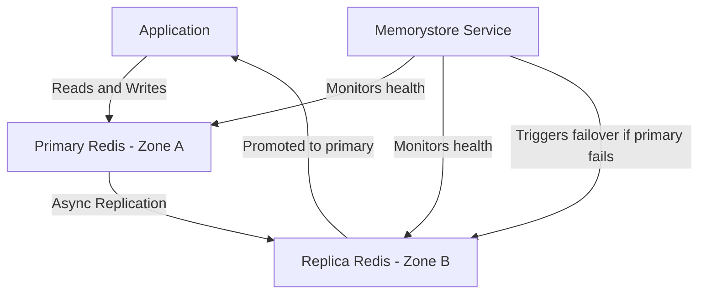
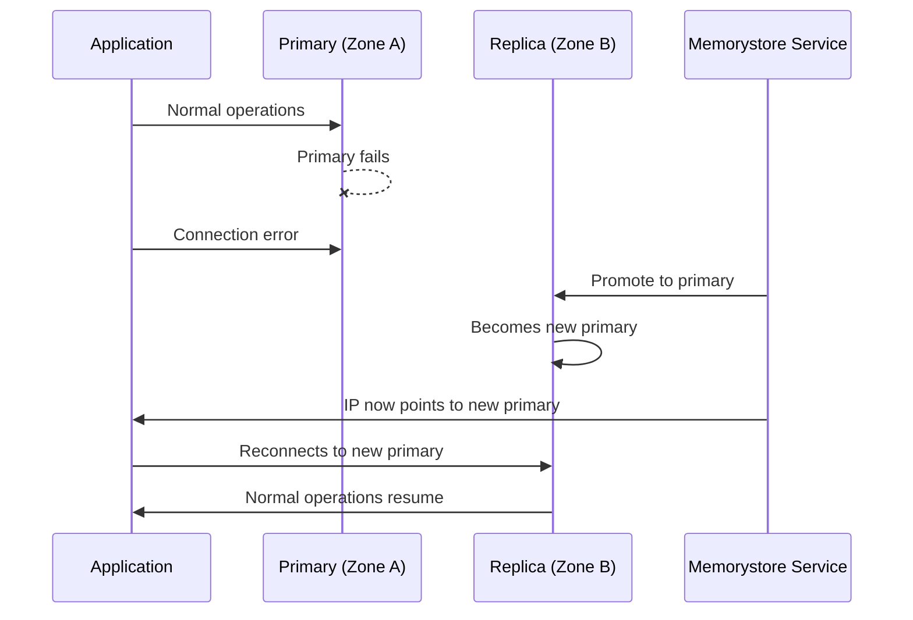

# How to Set Up Memorystore Redis with Standard Tier for High Availability

Author: [nawazdhandala](https://www.github.com/nawazdhandala)

Tags: GCP, Memorystore, Redis, High Availability, Standard Tier

Description: Set up a Memorystore for Redis Standard Tier instance for high availability with automatic failover, cross-zone replication, and monitoring for production workloads.

---

If your application depends on Redis for caching, session management, or real-time features, a Redis outage means your application either slows to a crawl or goes down entirely. The Memorystore Standard Tier addresses this by running a primary Redis instance and an automatic replica in a separate availability zone. When the primary fails, Memorystore automatically promotes the replica and your application reconnects with minimal disruption.

I have run Standard Tier instances for applications where even a few minutes of Redis downtime would impact thousands of users. In this post, I will show you how to set it up, what happens during failover, and how to configure your applications for resilience.

## Standard Tier vs. Basic Tier

The fundamental difference is redundancy:

| Feature | Basic Tier | Standard Tier |
|---------|-----------|---------------|
| Replication | None | Automatic replica |
| Zones | Single zone | Cross-zone |
| Failover | Manual recovery | Automatic |
| Data persistence | Lost on failure | Preserved via replica |
| SLA | None | 99.9% |
| Cost | 1x | ~2x |

For anything beyond development and testing, Standard Tier is the right choice.

## Architecture of Standard Tier



The primary handles all reads and writes. The replica receives asynchronous updates from the primary. If the primary fails, Memorystore promotes the replica to primary and updates the DNS endpoint. Your application sees a brief interruption (typically under 30 seconds) and then reconnects to the new primary.

## Creating a Standard Tier Instance

Here is the command to create a production-ready Standard Tier instance:

```bash
# Create a Standard Tier Memorystore Redis instance with cross-zone replication
gcloud redis instances create production-cache \
  --size=5 \
  --region=us-central1 \
  --tier=standard \
  --redis-version=redis_7_0 \
  --zone=us-central1-a \
  --alternative-zone=us-central1-b \
  --enable-auth \
  --redis-config=maxmemory-policy=allkeys-lru \
  --display-name="Production Cache" \
  --labels=env=production,team=platform
```

Breaking down the important flags:

- `--tier=standard` - Enables replication and automatic failover
- `--zone` - Where the primary runs
- `--alternative-zone` - Where the replica runs (must be different from primary)
- `--size=5` - 5 GB of memory for the primary (replica gets the same)
- `--enable-auth` - Require authentication for security

## Verifying the Setup

After creation, verify the instance configuration:

```bash
# Check the instance details including zone placement
gcloud redis instances describe production-cache \
  --region=us-central1 \
  --format="table(name,tier,memorySizeGb,host,port,currentLocationId,locationId,alternativeLocationId,state)"
```

You should see:
- `tier: STANDARD`
- `currentLocationId` matching your `--zone` setting
- `alternativeLocationId` matching your `--alternative-zone`
- `state: READY`

## Configuring Your Application for Failover

The most important thing you can do on the application side is handle reconnections gracefully. During failover, existing connections will be dropped. Your application needs to detect the dropped connection and establish a new one.

### Python with Retry Logic

```python
# redis_ha_client.py - Resilient Redis client for Standard Tier failover
import os
import time
import redis
from redis.backoff import ExponentialBackoff
from redis.retry import Retry

def create_ha_redis_client():
    """Create a Redis client configured to handle failover gracefully."""

    # Configure retry behavior for automatic reconnection
    retry = Retry(
        backoff=ExponentialBackoff(cap=10, base=0.5),
        retries=5
    )

    client = redis.Redis(
        host=os.environ.get("REDIS_HOST", "10.0.0.3"),
        port=int(os.environ.get("REDIS_PORT", "6379")),
        password=os.environ.get("REDIS_AUTH"),
        decode_responses=True,
        # Retry configuration for failover resilience
        retry=retry,
        retry_on_error=[
            redis.ConnectionError,
            redis.TimeoutError,
            redis.ReadOnlyError,  # Happens briefly during failover
        ],
        # Connection settings
        socket_timeout=5,
        socket_connect_timeout=5,
        socket_keepalive=True,
        health_check_interval=15,
    )

    return client

def safe_redis_operation(client, operation, *args, **kwargs):
    """Execute a Redis operation with graceful error handling."""
    max_attempts = 3

    for attempt in range(max_attempts):
        try:
            return operation(*args, **kwargs)
        except redis.ReadOnlyError:
            # This happens when we connect to the replica during failover
            print(f"ReadOnlyError - failover in progress (attempt {attempt + 1})")
            time.sleep(2)
        except redis.ConnectionError as e:
            print(f"ConnectionError (attempt {attempt + 1}): {e}")
            time.sleep(1)
        except redis.TimeoutError:
            print(f"TimeoutError (attempt {attempt + 1})")
            time.sleep(1)

    raise Exception("Redis operation failed after all retry attempts")

# Usage example
client = create_ha_redis_client()

# This will automatically retry on connection failures
safe_redis_operation(client, client.set, "key", "value")
value = safe_redis_operation(client, client.get, "key")
```

### Node.js with ioredis

ioredis handles reconnection automatically, but you should tune the settings:

```javascript
// redis_ha_client.js - Resilient Redis client for Node.js
const Redis = require("ioredis");

const client = new Redis({
    host: process.env.REDIS_HOST || "10.0.0.3",
    port: parseInt(process.env.REDIS_PORT || "6379"),
    password: process.env.REDIS_AUTH,

    // Reconnection settings for failover
    retryStrategy: (times) => {
        if (times > 10) {
            console.error("Redis: max reconnect attempts reached");
            return null; // Stop retrying
        }
        // Exponential backoff: 100ms, 200ms, 400ms...
        const delay = Math.min(times * 100, 5000);
        console.log(`Redis: reconnecting in ${delay}ms (attempt ${times})`);
        return delay;
    },

    // Keep connections alive
    keepAlive: 10000,

    // Connection timeout
    connectTimeout: 10000,

    // Enable offline queue to buffer commands during reconnection
    enableOfflineQueue: true,
    maxRetriesPerRequest: 3,
});

client.on("error", (err) => console.error("Redis error:", err.message));
client.on("reconnecting", (delay) => console.log(`Redis reconnecting in ${delay}ms`));
client.on("ready", () => console.log("Redis connection ready"));
```

## What Happens During Failover

Understanding the failover timeline helps you set appropriate timeouts:

1. **Primary fails** (0 seconds) - Existing connections to the primary break
2. **Memorystore detects failure** (5-10 seconds) - Health checks determine the primary is down
3. **Replica promoted** (10-20 seconds) - The replica becomes the new primary
4. **DNS updated** (20-30 seconds) - The instance IP points to the new primary
5. **Clients reconnect** (30+ seconds) - Applications establish new connections

The total failover time is typically under 30 seconds but can occasionally take up to 60 seconds.



## Monitoring High Availability

Set up monitoring to track failover events and replication health:

```bash
# Check the replication status
gcloud redis instances describe production-cache \
  --region=us-central1 \
  --format="value(nodes)"
```

Key metrics to monitor in Cloud Monitoring:

- `redis.googleapis.com/stats/connected_clients` - Track connected client count
- `redis.googleapis.com/stats/rejected_connections` - Should be zero
- `redis.googleapis.com/replication/master_repl_offset` - Replication lag indicator

Create an alert for high replication lag:

```bash
# Create an alerting policy for replication lag
gcloud monitoring policies create \
  --display-name="Redis Replication Lag Alert" \
  --condition-display-name="High replication lag" \
  --condition-filter='resource.type="redis_instance" AND metric.type="redis.googleapis.com/replication/offset_diff"' \
  --condition-threshold-value=1000000 \
  --notification-channels=YOUR_CHANNEL_ID
```

## Testing Failover

You can trigger a manual failover to test your application's resilience:

```bash
# Trigger a manual failover to test application resilience
gcloud redis instances failover production-cache \
  --region=us-central1 \
  --data-protection-mode=limited-data-loss
```

The `--data-protection-mode` flag has two options:
- `limited-data-loss` - Waits for replication to catch up before failover (safer, but slightly longer)
- `force-data-loss` - Immediately promotes the replica (faster, but may lose recent writes)

During the failover test, watch your application logs for connection errors and recovery time.

## Sizing for High Availability

When sizing a Standard Tier instance, remember that the replica consumes the same amount of memory as the primary. A 5 GB Standard Tier instance actually provisions 10 GB total (5 GB primary + 5 GB replica), and you pay for both.

Factor this into your cost calculations:

```
Standard Tier cost = 2 x (per-GB price) x (instance size in GB)
```

Do not over-provision. If your dataset is 2 GB, a 3 GB instance with some headroom is better than a 10 GB instance. You can always scale up later.

## Maintenance Window Configuration

Standard Tier instances occasionally need maintenance. Configure a maintenance window during your lowest-traffic period:

```bash
# Set the maintenance window to Sunday at 3 AM
gcloud redis instances update production-cache \
  --region=us-central1 \
  --maintenance-window-day=SUNDAY \
  --maintenance-window-hour=3
```

## Wrapping Up

The Standard Tier is the minimum viable configuration for production Redis on Google Cloud. Automatic failover, cross-zone replication, and the 99.9% SLA give you confidence that your caching layer will stay up even when individual zones have issues. The most important thing you can do on the application side is handle reconnections with retries and exponential backoff. Test failover before it happens in production so there are no surprises.
